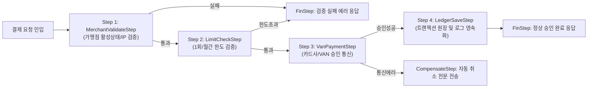

# [Spring] 비즈니스 트랜잭션 파이프라인과 책임 연쇄 패턴

> [!NOTE]
> 복잡한 결제(Payment) 승인, 유효성 검증, VAN 연동, 원장 저장을 거대한 단일 서비스 메서드나 if-else 지옥 없이 독립된 Step 단위로 파이프라인화하는 **책임 연쇄 패턴(Chain of Responsibility Pattern)**의 실무 적용 아키텍처를 학습합니다. (다단계 비즈니스 트랜잭션 파이프라인 설계 패턴)

---

## 1. 결제 비즈니스 로직의 문제점과 해결책

### 전통적인 결제 처리 방식의 한계:
- 결제 요청 하나를 처리하기 위해 `가맹점 검증 -> 한도 체크 -> 결제 데이터 빌드 -> PG/카드사 승인 전문 전송 -> DB 원장 저장 -> 승인 영수증 생성` 등 수많은 단계가 필요합니다.
- 이를 하나의 Service 클래스 안에 모두 작성하면 코드가 1,000줄을 넘어가며, 중간 단계 실패 시 보상 트랜잭션이나 분기 처리가 극도로 복잡해집니다.

### 책임 연쇄 패턴 (StepChain) 솔루션:
- 각 검증 및 비즈니스 단계를 하나의 **`Step` 객체**로 격리합니다.
- 요청을 `StepChain`에 전달하면 각 Step이 순차적으로 실행되며, 조건에 따라 다음 체인으로 넘기거나(`next()`) 즉시 중단(`FinStep`)합니다.



---

## 2. 핵심 아키텍처 인터페이스 및 구현

### 2.1 Step 인터페이스
```java
package com.example.pipeline.chain;

public interface Step<T> {
    /**
     * 비즈니스 스텝을 실행하고 다음 체인을 반환
     * @param context 결제 상태 컨텍스트 DTO
     * @param chain 다음 실행할 체인 제어자
     */
    void execute(T context, StepChain<T> chain);
}
```

### 2.2 StepChain 제어자
```java
package com.example.pipeline.chain;

import java.util.List;

public class ActiveStepChain<T> implements StepChain<T> {

    private final List<Step<T>> steps;
    private int index = 0;

    public ActiveStepChain(List<Step<T>> steps) {
        this.steps = steps;
    }

    @Override
    public void next(T context) {
        if (index < steps.size()) {
            Step<T> currentStep = steps.get(index++);
            currentStep.execute(context, this);
        }
    }
}
```

### 2.3 체인 중단 종료자 (FinStep & NoOpStepChain)
- 결제 검증 실패나 승인 거절이 발생했을 때, 더 이상 뒤따르는 스텝(예: DB 원장 저장 등)을 실행하지 않고 즉시 응답을 반환할 수 있도록 `NoOpStepChain`을 호출합니다.

---

## 3. 실무 도입 시 얻는 이점

1. **단일 책임 원칙 (SRP) 준수**:
   - 각 `Step` 클래스는 오직 한 가지 작업(예: `LimitCheckStep`은 오직 한도 계산만)만 수행하므로 코드가 간결해집니다.
2. **단위 테스트 (Unit Test) 극대화**:
   - 전체 결제 프로세스를 다 띄우지 않고도, 모의 Context를 주입하여 특정 Step 하나만 독립적으로 Mocking 및 단위 테스트할 수 있습니다.
3. **유연한 파이프라인 조합**:
   - 일반 카드결제, 간편결제(카카오/네이버페이), 가상계좌 등 결제 수단별로 필요한 Step 목록을 Spring Configuration에서 자유롭게 조합하여 재사용할 수 있습니다.

## 관련 문서

- [(Design Pattern) 실무 프로젝트 및 오픈소스로 체득하는 GoF 핵심 디자인 패턴 10선](./[Design%20Pattern]%20실무%20프로젝트%20및%20오픈소스로%20체득하는%20GoF%20핵심%20디자인%20패턴%2010선%20(Proxy,%20Decorator,%20Strategy,%20Chain,%20Template,%20SPI,%20Visitor,%20Facade).md) — 3.2절에서 이 StepChain 구조를 책임 연쇄 패턴(Chain of Responsibility)의 실무 적용 사례로 다룸