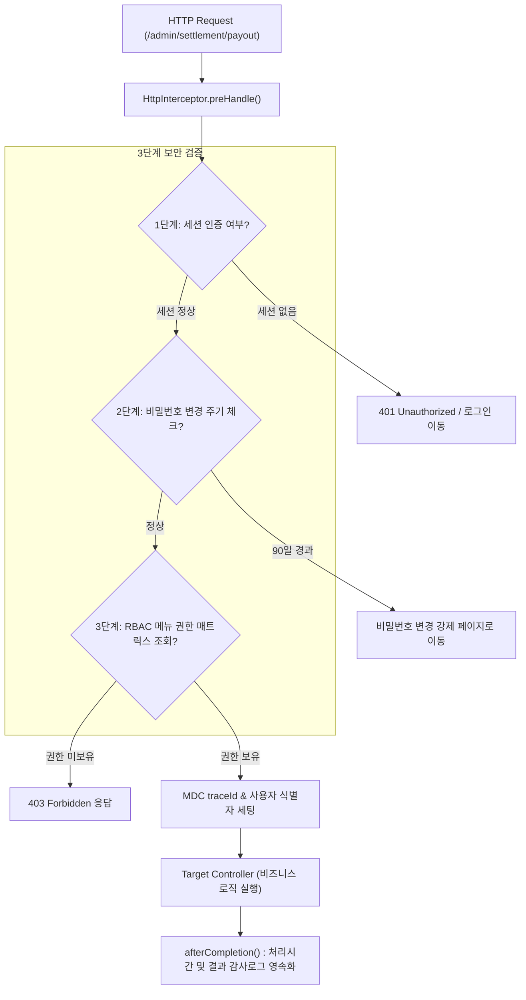

# [Web] 사내 관리자 포털(Admin Portal) RBAC 메뉴 권한 인가와 세션 감사 인터셉터 패턴

> [!NOTE]
> 엔터프라이즈 백오피스 및 대규모 B2B 관리자 포털(IMS/MMS)에서 사용자 역할(슈퍼관리자, 운영사, 가맹점, 정산담당자)에 따른 **동적 메뉴 접근 제어(RBAC, Role-Based Access Control)**와 **보안 세션 감사(Audit Logging)**를 `HandlerInterceptor` 기반으로 설계하는 아키텍처를 학습합니다.

---

## 1. 백오피스 웹 아키텍처의 핵심 보안 요구사항

관리자 포털은 일반 서비스와 달리 결제 취소, 수수료 변경, 계정 권한 부여 등 고권한 비즈니스를 수행하므로 다음과 같은 강력한 보안 통제가 필수적입니다:
1. **인증 검증 (Authentication)**: 유효한 세션이 존재하는가?
2. **인가 검증 (Authorization)**: 현재 로그인한 사용자의 등급/역할이 요청한 URL 및 메뉴에 접근할 권한(읽기/쓰기/다운로드)이 있는가?
3. **감사 추적성 (Audit Trail)**: 누가, 언제, 어떤 IP에서 어떤 파라미터로 작업을 실행했는가?



---

## 2. `HandlerInterceptor` 기반 권한 및 감사 구현

Spring MVC의 `HandlerInterceptor`는 컨트롤러 진입 전/후에 가로채어 공통 보안 로직을 일괄 적용할 수 있는 가장 우아한 방법입니다.

```java
package com.example.admin.interceptor;

import lombok.RequiredArgsConstructor;
import lombok.extern.slf4j.Slf4j;
import org.slf4j.MDC;
import org.springframework.stereotype.Component;
import org.springframework.web.servlet.HandlerInterceptor;

import javax.servlet.http.HttpServletRequest;
import javax.servlet.http.HttpServletResponse;
import javax.servlet.http.HttpSession;
import java.util.Map;
import java.util.UUID;

@Slf4j
@Component
@RequiredArgsConstructor
public class PortalSecurityInterceptor implements HandlerInterceptor {

    private final MenuPermissionService menuPermissionService;

    @Override
    public boolean preHandle(HttpServletRequest request, HttpServletResponse response, Object handler) throws Exception {
        String requestUri = request.getRequestURI();
        String traceId = UUID.randomUUID().toString().substring(0, 8);
        MDC.put("traceId", traceId);

        // 1. 화이트리스트 URL (로그인, 정적 리소스 등) 통과
        if (isWhiteListUri(requestUri)) {
            return true;
        }

        HttpSession session = request.getSession(false);
        if (session == null || session.getAttribute("LOGIN_USER") == null) {
            log.warn("[PortalSecurityInterceptor] Unauthorized access attempt: uri={}", requestUri);
            response.sendRedirect("/login?error=expired");
            return false;
        }

        UserSessionDto user = (UserSessionDto) session.getAttribute("LOGIN_USER");
        MDC.put("userId", user.getUserId());

        // 2. 동적 RBAC 메뉴 인가 검증
        boolean hasPermission = menuPermissionService.hasAccessPermission(user.getRoleId(), requestUri);
        if (!hasPermission) {
            log.warn("[PortalSecurityInterceptor] Forbidden: user={}, role={}, uri={}", 
                    user.getUserId(), user.getRoleId(), requestUri);
            response.sendError(HttpServletResponse.SC_FORBIDDEN, "해당 메뉴에 대한 접근 권한이 없습니다.");
            return false;
        }

        request.setAttribute("START_TIME", System.currentTimeMillis());
        return true;
    }

    @Override
    public void afterCompletion(HttpServletRequest request, HttpServletResponse response, Object handler, Exception ex) throws Exception {
        Long startTime = (Long) request.getAttribute("START_TIME");
        if (startTime != null) {
            long executionTime = System.currentTimeMillis() - startTime;
            log.info("[Audit] uri={}, status={}, time={}ms", request.getRequestURI(), response.getStatus(), executionTime);
        }
        MDC.clear(); // 스레드풀 재사용 시 메모리 누수 방지 필수
    }
}
```

---

## 3. 동적 메뉴 권한 매트릭스 (DB 기반 RBAC)

정적 역할(Role) 하드코딩 대신, **메뉴 트리(`TB_MENU`)**와 **권한 매핑(`TB_ROLE_MENU_AUTH`)** 테이블을 조인하여 런타임에 동적으로 권한을 평가합니다.

```sql
-- 사용자의 역할(Role)에 매핑된 허용 URI 및 버튼 권한(조회/쓰기/엑셀) 조회
SELECT 
    m.menu_id,
    m.menu_name,
    m.url,
    a.read_auth_yn,
    a.write_auth_yn,
    a.excel_auth_yn
FROM TB_ROLE_MENU_AUTH a
INNER JOIN TB_MENU m ON a.menu_id = m.menu_id
WHERE a.role_id = #{roleId}
  AND m.use_yn = 'Y'
```

- 사용자가 로그인할 때 권한 트리 목록을 세션 또는 Redis에 캐싱하여, 인터셉터 호출 시 매번 무거운 DB 조회를 수행하지 않도록 최적화합니다.

---

## 4. 대용량 엑셀 다운로드 보안 및 메모리 최적화

관리자 포털에서 수십만 건의 거래 내역을 엑셀로 다운로드할 때 `HSSFWorkbook`이나 `XSSFWorkbook`을 쓰면 **수백 MB의 힙 메모리가 급증하며 OOM**이 발생합니다.

- **`SXSSFWorkbook` (스트리밍 방식)**: 메모리에 지정된 행 수(예: 1,000행)만 유지하고 나머지는 디스크 임시 파일로 플러싱하여 일정한 힙 메모리를 유지합니다.
- **감사 로깅**: 엑셀 다운로드는 개인정보/금융정보 대량 유출 경로가 될 수 있으므로, 다운로드 사유(Reason)와 다운로드 건수를 반드시 `TB_EXCEL_DOWNLOAD_LOG`에 감사 기록으로 남겨야 합니다.

## 관련 문서

- [(개발실무) RBAC 메뉴 트리 설계 — soft-delete와 upsert-revive](../표준·컨벤션/[개발실무]%20RBAC%20메뉴%20트리%20설계%20-%20핵심%20개념%20및%20특징%20정리.md) — 같은 메뉴/권한 매핑(TB_MENU·매핑 테이블) RBAC 구조를, 여기서는 인가·감사 관점에서 다루고 저 노트는 마스터-매핑 CRUD 정합성 관점에서 다룸
- [(Performance) SXSSFWorkbook 대용량 엑셀 스트리밍과 동적 ZIP 분할 압축 설계 패턴](../백엔드·데이터처리/[Performance]%20SXSSFWorkbook%20대용량%20엑셀%20스트리밍과%20동적%20ZIP%20분할%20압축%20설계%20패턴.md) — 여기서 짧게 언급한 SXSSFWorkbook 스트리밍 기법의 상세 구현 및 원리