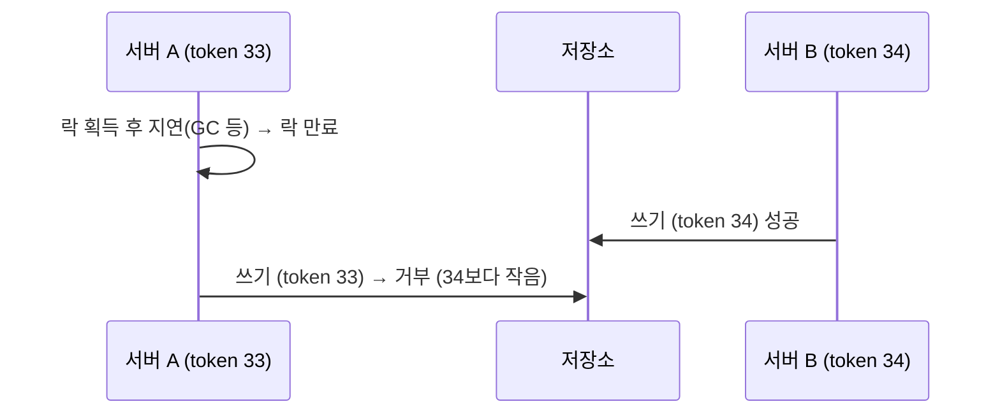
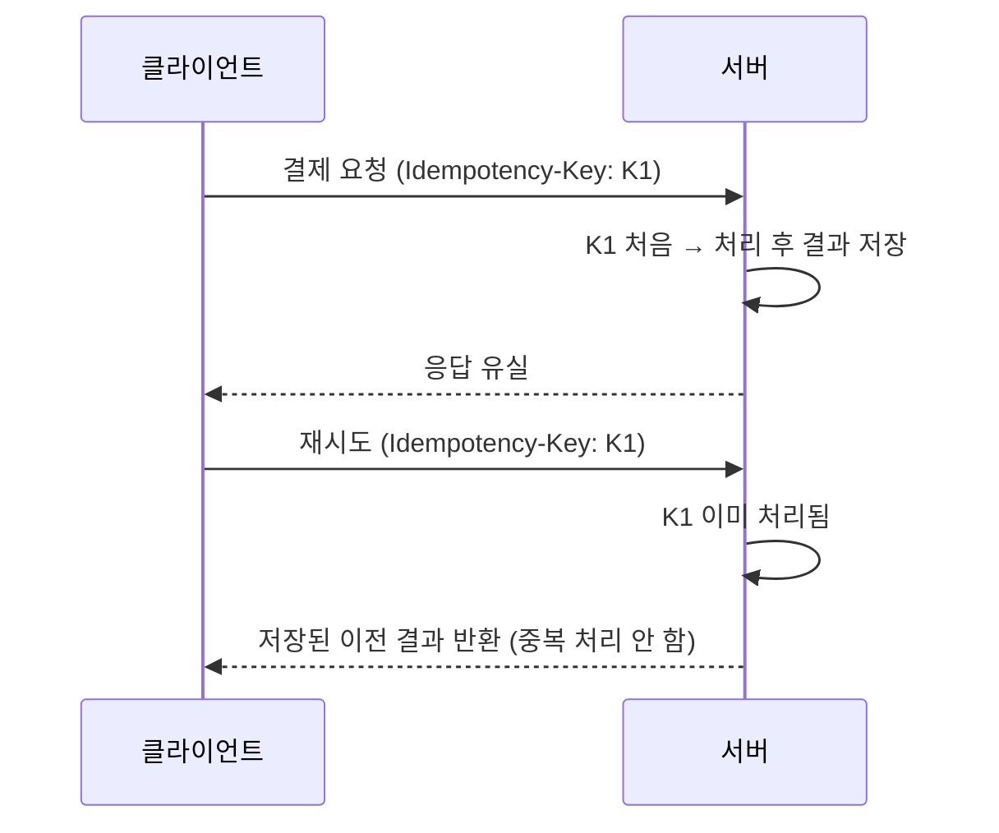
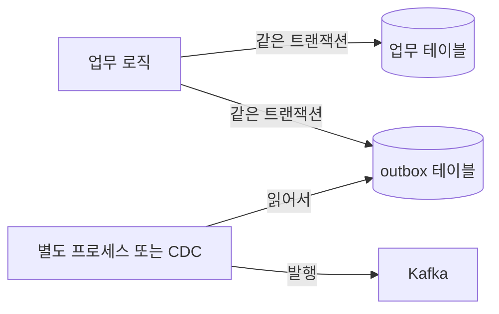

# 분산 락과 멱등성 키 설계

> 서버가 여러 대일 때 "같은 일을 두 번 하지 않게" 만드는 두 가지 장치, 분산 락과 멱등성 키를 정리한다. 용어 정의는 [IT 용어집 - 데이터·캐시·저장소](IT%20용어집/[용어]%20데이터·캐시·저장소.md) 참고.

## 1. 락의 종류를 먼저 나누기

| 축 | 종류 | 설명 |
| --- | --- | --- |
| 구현 위치 | DB lock | `SELECT ... FOR UPDATE` 등. DB가 보장 |
| | memory lock | `synchronized`, `ReentrantLock`. **그 프로세스(JVM) 안에서만** 유효 |
| | 분산 락 | Redis, DB처럼 **모든 서버가 함께 보는 곳**에 둔 락 |
| 대기 방식 | spin | 풀릴 때까지 루프를 돌며 확인(CPU 사용, 짧은 대기에 유리) |
| | waiting | 잠들었다가 풀리면 깨어남 |
| 전략 | 낙관적(optimistic) | 충돌이 드물다고 보고 락 없이 진행, 커밋 때 `version` 컬럼으로 충돌 검사 후 실패하면 재시도 |
| | 비관적(pessimistic) | 충돌이 잦다고 보고 먼저 락을 잡고 진행 |

서버가 3대면 `synchronized` 락도 3개가 따로 생겨서 서로를 막지 못한다. 그래서 서버 간 임계 구역에는 **분산 락**이 필요하다.

낙관적/비관적 락과 TPS 차이는 [비관적 락 vs 낙관적 락 + MyBatis 적용](개발%20%28CS%29/언어/JAVA/동시성·IO·락/[Java]%20Notion%20정리용%20비관적%20락%20vs%20낙관적%20락%20+%20MyBat%20-%20비관적%20락%20vs%20낙관적%20락%20+%20MyBatis%20적용%20가이드.md), [비관적 락 & 낙관적 락 TPS 차이](개발%20%28CS%29/언어/JAVA/동시성·IO·락/[Java]%20비관적%20락%20&%20낙관적%20락%20TPS%20차이%20-%20핵심%20개념%20및%20특징%20정리.md) 참고.

## 2. Redis 단일 노드 분산 락 (SET NX PX)

```
SET lock:order:123 <내 UUID> NX PX 3000
```

- `NX`: 키가 **없을 때만** 설정 → 한 명만 성공
- `PX 3000`: 3초 뒤 **자동 만료** → 락을 잡은 서버가 죽어도 영원히 잠기지 않음
- 값에 **내 UUID**를 넣는 이유: 해제할 때 "내가 잡은 락인지" 확인하려고. TTL이 먼저 지나 남이 잡은 락을 내가 지우면 안 된다.

해제는 "값이 내 UUID면 삭제"이고, 이 **확인과 삭제를 원자적으로** 해야 하므로 Lua를 쓴다.

```lua
if redis.call('GET', KEYS[1]) == ARGV[1] then
  return redis.call('DEL', KEYS[1])
else
  return 0
end
```

## 3. 분산 락이 깨지는 상황

| 상황 | 문제 | 대응 |
| --- | --- | --- |
| 작업이 TTL보다 오래 걸림 | 락이 먼저 풀려 **두 곳이 동시에 작업** | TTL 연장(watchdog), 작업 시간 상한, fencing token |
| 락을 잡은 서버가 죽음 | 락이 풀릴 때까지 대기 | TTL이 있으므로 자동 해제 |
| Redis 단일 노드 장애 | 락 정보가 사라져 다른 서버도 락 획득 | RedLock(다수 노드), 또는 DB 락 사용 |
| 서버 간 시계 차이(NTP) | 시간 기반 만료 판단이 틀어짐 | 시계 동기화, 시간에 의존하지 않는 방식 |
| 락 대기 | 대기 스레드가 쌓임 | 락 획득 timeout을 둠 |

- **RedLock**: 독립된 Redis N대(보통 5대) 중 **과반수**에서 락을 얻어야 성공으로 본다. 과반수 획득에 실패하면 이미 잡은 락도 모두 풀어야 한다. 시계 차이와 처리 지연에 대한 안전성은 논쟁이 있어서, 정확성이 매우 중요한 곳에서는 DB 락이나 fencing token을 함께 고려한다.
- **fencing token**: 락을 얻을 때마다 **증가하는 번호**를 붙이고, 저장소가 "더 작은(오래된) 번호의 요청"을 거부하게 한다. 락이 만료된 뒤 뒤늦게 도착한 옛 락 보유자의 쓰기를 막는다.



## 4. 멱등성 키 (Idempotency Key)

> 같은 요청이 두 번 와도 **결과가 한 번만 반영**되게 하는 요청 고유 키.

네트워크는 실패하고 클라이언트는 재시도한다. 결제 요청의 응답이 유실되어 클라이언트가 다시 보내면 **이중 결제**가 생길 수 있다.



설계 포인트:

- 키는 **클라이언트가 요청마다 고유하게** 만든다(UUID 등). 같은 요청의 재시도에는 같은 키를 쓴다.
- 서버는 `키 → (상태, 결과)`를 저장한다. 처리 중에 같은 키가 또 오면 "처리 중"으로 응답하거나 락으로 대기시킨다.
- 키 저장과 처리 결과 반영은 **같은 트랜잭션**(또는 유니크 제약)으로 묶어서 "키는 저장됐는데 처리는 안 됨"을 막는다.
- 키에는 **보존 기간(TTL)**을 둔다.
- HTTP 메서드의 멱등성(GET, PUT, DELETE는 멱등, POST는 일반적으로 아님)과는 별개 개념이다. POST를 멱등하게 만들기 위해 멱등성 키를 쓴다.

## 5. DB 저장과 메시지 발행의 불일치: transactional outbox

"DB 저장"과 "Kafka 발행"은 **하나의 트랜잭션으로 묶을 수 없다**. DB는 커밋됐는데 발행이 실패하면 불일치가 생긴다.



- 이벤트를 **같은 DB 트랜잭션으로 outbox 테이블에 함께 저장**하고, 별도 프로세스(또는 CDC)가 그 테이블을 읽어 발행한다.
- 발행은 "최소 한 번"이라 소비자가 중복을 받을 수 있으므로, 소비 쪽도 멱등성 키로 중복을 걸러야 한다.

## 6. 체크리스트

- [ ] 락이 필요한 구간이 한 서버 안인가, 여러 서버에 걸치는가?
- [ ] 분산 락에 TTL과 소유자 확인(UUID)이 있는가? 해제가 원자적인가?
- [ ] 작업 시간이 TTL을 넘길 때의 대책(연장, fencing token)이 있는가?
- [ ] 재시도되는 쓰기 요청에 멱등성 키가 있는가?
- [ ] DB 변경과 이벤트 발행이 outbox 같은 방식으로 묶여 있는가?

관련 노트: [캐시 전략과 운영 이슈](개발%20실무/아키텍처·설계/분산%20시스템·장애%20대응/[Architecture]%20캐시%20전략과%20운영%20이슈%20-%20Redis·stampede·무효화·write-behind.md), [전원 장애(정전) 대응 설계 원칙 - Atomic Save-Transaction-Recovery](개발%20실무/아키텍처·설계/분산%20시스템·장애%20대응/[Design]%20전원%20장애%28정전%29%20대응%20설계%20원칙%20-%20Atomic%20Save-Transaction-Recovery%20정리.md), [스레드 동시성 문제 정리](개발%20%28CS%29/CS%20기초/운영체제/[OS]%20스레드%20동시성%20문제%20정리%20-%20race·deadlock·livelock·starvation.md)
