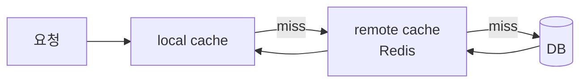

# 캐시 전략과 운영 이슈 (Redis·stampede·무효화·write-behind)

> 캐시를 "붙이는 것"보다 "운영하는 것"이 어렵다. 어디에 둘지, 언제 쓰고 지울지, 터졌을 때 무엇을 볼지를 정리한다. 용어 정의는 [IT 용어집 - 데이터·캐시·저장소](IT%20용어집/[용어]%20데이터·캐시·저장소.md) 참고.

## 1. 캐시를 어디에 둘까

| 구분 | 위치 | 장점 | 단점 |
| --- | --- | --- | --- |
| local cache | 서버(프로세스) 메모리 | 가장 빠름(네트워크 왕복 없음) | 서버마다 따로라 값이 어긋남, 재시작 시 비어 있음 |
| remote cache | 별도 서버(Redis 등) | 여러 서버가 공유, 용량 확장 | 매번 네트워크 왕복, 별도 운영 대상 |
| HTTP 캐시 | 브라우저·CDN·프록시 | 서버까지 요청이 오지 않음 | 제어(무효화)가 어려움 |

HTTP 캐시 헤더는 [HTTP 헤더 #2 (Cache 와 조건부 헤더)](개발%20%28CS%29/언어/JAVA/웹개발/HTTP/HTTP%20헤더%202%20%28%20Cache%20와%20조건부%20헤더%20%20%29.md) 참고.

local cache는 빠르지만 서버가 여러 대면 각 서버가 **서로 다른 시점의 값**을 가진다. 그래서 흔히 두 계층을 같이 쓴다.

## 2. 쓰기 전략: 원본(DB)에 언제 반영하나

| 전략 | 동작 | 특징 |
| --- | --- | --- |
| cache-aside (lazy loading) | 읽을 때 캐시에 없으면 DB에서 읽어 채움. 쓸 때는 DB에 쓰고 캐시를 지움(또는 갱신) | 가장 흔함. 캐시 장애가 곧 서비스 장애는 아님 |
| write-through | 캐시와 DB에 **동시에** 씀(동기) | 일관성 좋음, 쓰기 느림 |
| write-behind (write-back) | 캐시에만 먼저 쓰고 응답, DB에는 **나중에 비동기**로 반영 | 쓰기 빠르고 DB 부하 감소. 반영 전에 캐시가 죽으면 **데이터 유실** |

- write-behind는 순간 요청이 폭발하는 경우(예: 이벤트 응모)에 DB가 피크 부하를 직접 받지 않게 하려고 쓴다. Redis를 1차 기준(SSOT)으로 두고, DB 적재는 큐(Kafka 등)를 거쳐 별도 소비자가 처리한다. 대신 Redis 유실에 대한 대비(복제, AOF, 재처리)가 필요하다.
- "나중에 쓰기"는 DB뿐 아니라 캐시, 디스크 버퍼 등 **빠른 쪽에 먼저 쓰고 느린 쪽에 나중에 반영**하는 모든 경우에 쓰는 말이다.
- 결국 **최종적 일관성(eventual consistency)**을 받아들이는 설계다.

## 3. 캐시 무효화와 stale

> "컴퓨터 과학에서 어려운 것은 두 가지: 캐시 무효화와 이름 짓기."

- **stale**: 원본이 바뀌었는데 갱신되지 않아 현재와 어긋난 낡은 값. 단지 "오래됐다"가 아니라 "더 이상 믿으면 안 되는 값"이다.
- 먼저 **"얼마나 오래된 값까지 허용할지"(stale 허용 범위)**를 정한다. 이 기준 없이 무효화 방식을 고를 수 없다.
- 방법 1: **TTL**로 자연 만료시키기(단순, 허용 범위 안에서 어긋남).
- 방법 2: 원본이 바뀔 때 **이벤트로 무효화**. 서버가 여러 대면 Redis Pub/Sub(저장되지 않음) 또는 Stream, Kafka로 "이 키를 지워라"를 모든 인스턴스에 알린다.
- 방법 3: **버전 키**. 데이터 키를 직접 쓰지 않고 "현재 버전 키를 가리키는 키"를 둬서, 대량 무효화를 포인터 한 번 바꾸는 것으로 처리한다(indirection key).
- 캐시 포맷을 바꿀 때는 **dual write**: v1, v2 키에 동시에 쓰다가 v2가 충분히 채워지면 읽기를 v2로 전환한다. 배포 중 구·신 버전 서버가 섞여도 깨지지 않는다.

## 4. 캐시가 만드는 장애 패턴

| 패턴 | 상황 | 대응 |
| --- | --- | --- |
| cache stampede (thundering herd) | 캐시가 한꺼번에 만료/소실돼 많은 요청이 DB로 몰림 | 만료 시각에 무작위 값(jitter), 한 요청만 원본을 읽어 채우게 락, 미리 채워 두기(warm-up) |
| cache penetration | 존재하지 않는 키를 계속 조회해 매번 DB까지 감 | 없는 값도 짧게 캐시(null 캐시), 존재 여부 필터 |
| hot key | 특정 키에 요청 집중, 그 노드만 과부하 | 키 복제·분할, local cache를 앞에 두기 |
| cold start | 재시작·scale out 직후 캐시가 비어 DB에 부하 | warm-up, 점진적 투입 |

서버를 재시작하거나 늘릴 때 local cache가 함께 비워지면서 stampede가 자주 생긴다.

## 5. Redis 운영 포인트

Redis는 **명령을 기본적으로 싱글 스레드로 하나씩** 처리한다. 그래서 오래 걸리는 명령 하나가 뒤의 모든 요청을 지연시킨다.

| 상황 | 피할 것 | 대신 |
| --- | --- | --- |
| 큰 키 삭제 | `DEL`(동기 삭제, 서버 멈춤) | `UNLINK`(삭제 표시 후 백그라운드 해제) |
| 키 전체 조회 | `KEYS *`(전체 순회, 서버 블로킹) | `SCAN`(커서로 조금씩) |
| 느린 명령 추적 | 감으로 추측 | `SLOWLOG` |
| 값이 큼 | JSON 텍스트 | 바이너리 포맷, 압축, bitmap 같은 작은 자료구조 |
| 여러 키 조회 | 키마다 GET | `MGET`(왕복 1번) |

- **Redis Cluster**는 키를 16384개의 slot으로 나눠 노드에 분배한다. 키에 `{...}` **해시 태그**를 쓰면 같은 slot에 모여서 `MGET`, Lua, 트랜잭션을 한 노드에서 처리할 수 있다. slot이 다른 키를 한 번에 처리하려 하면 오류가 나거나 노드별로 나눠 요청해야 한다.
- **Lua script**는 스크립트 전체가 명령 하나처럼 원자적으로 실행된다. "재고가 0보다 크면 1 차감"을 클라이언트에서 GET 후 DECR로 처리하면 사이에 다른 요청이 끼어 재고가 음수가 될 수 있는데, Lua로 묶으면 막을 수 있다. 단, 길면 Redis 전체가 멈추므로 짧게 쓰고, Cluster에서는 다루는 키가 모두 같은 slot이어야 한다.
- client(Lettuce 등)의 **topology refresh**를 꺼 두면 failover 후에도 죽은 노드로 계속 요청한다.

## 6. 운영 모니터링 지표

| 지표 | 보는 이유 |
| --- | --- |
| hit rate | 갑자기 떨어지면 DB로 트래픽이 쏟아지는 신호 |
| 메모리 사용량·eviction 수 | 메모리 부족으로 키가 밀려나고 있는지 |
| 느린 명령(`SLOWLOG`) | 싱글 스레드라 하나가 느리면 전체가 밀림 |
| 연결 수·지연 | client pool 고갈, 네트워크 문제 |

## 7. 체크리스트

- [ ] 이 데이터는 얼마나 오래된 값까지 허용되는가(stale 허용 범위)?
- [ ] 캐시가 통째로 사라져도 DB가 버티는가(stampede, cold start)?
- [ ] 무효화는 TTL, 이벤트, 버전 키 중 무엇으로 하는가?
- [ ] write-behind라면 유실 시 복구 수단이 있는가?
- [ ] 큰 키 삭제, `KEYS *` 같은 서버를 멈추는 명령을 쓰고 있지 않은가?

관련 노트: [Redis로 더미 데이터 관리하기(결제요청 전)](프로젝트/토이프로젝트/영화예매%20프로젝트/[리팩터링]%20결제요청%20전%20-더미%20데이터-%20Redis로%20관리하기.md), [분산 락과 멱등성 키 설계](개발%20실무/아키텍처·설계/분산%20시스템·장애%20대응/[Architecture]%20분산%20락과%20멱등성%20키%20설계.md)
