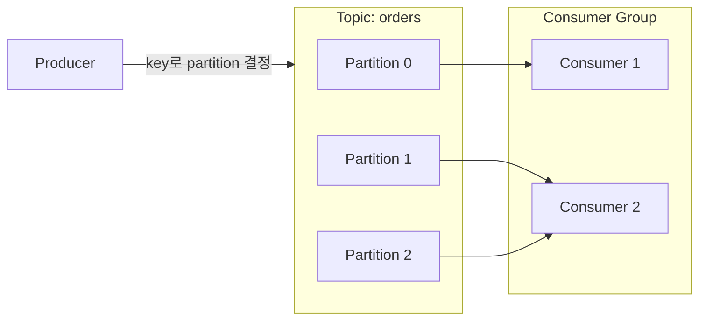

# Kafka 핵심 개념 (Topic·Partition·Offset·DLQ)

> 대량의 메시지를 저장하며 주고받는 분산 메시지 브로커 Kafka의 기본 구조와, 실무에서 자주 부딪히는 지점(순서, 실패 처리, 부하 분산)을 정리한다. 용어 정의는 [IT 용어집 - MSA·분산 시스템](IT%20용어집/[용어]%20MSA·분산%20시스템.md) 참고.

## 1. 왜 메시지 브로커인가

HTTP 호출은 호출한 쪽이 상대가 응답할 때까지 기다린다(동기, push). 브로커를 두면 **보내는 쪽과 받는 쪽이 시간적으로 분리**된다.

- 받는 쪽이 느리거나 잠깐 죽어도 메시지는 브로커에 쌓여 있다가 처리된다.
- 한 번 보낸 메시지를 여러 소비자가 각자 처리할 수 있다.
- 순간 트래픽을 브로커가 **완충**한다.

큐를 어디에 도입할지는 [메시지 큐 도입 위치 결정](개발%20%28CS%29/인프라/모니터링·네트워크/[HTTP]%20메시지%20큐%20도입%20위치%20결정%20-%20핵심%20개념%20및%20특징%20정리.md), 비동기 작업 큐 설계는 [대용량 처리 비동기 Job 큐 설계 패턴](개발%20실무/아키텍처·설계/대용량%20비동기·배치/[HTTP]%20대용량%20처리%20비동기%20Job%20큐%20설계%20패턴%20-%20핵심%20개념%20및%20특징%20정리.md) 참고.

## 2. 구조



| 용어 | 뜻 |
| --- | --- |
| broker | Kafka 서버. 여러 대가 클러스터를 이룬다 |
| topic | 메시지를 분류하는 이름의 묶음 |
| partition | topic을 나눈 단위. **병렬 처리와 순서 보장의 단위** |
| producer / consumer | 메시지를 쓰는 쪽 / 읽는 쪽 |
| offset | partition 안에서 메시지의 순번. consumer가 "어디까지 읽었는지"를 offset으로 기록한다 |
| consumer group | 같은 topic을 나눠서 소비하는 consumer들의 묶음. **한 partition은 그룹 안의 한 consumer만** 읽는다 |

- 메시지는 읽어도 지워지지 않는다. 보존 기간 동안 남아 있어서 offset을 되돌려 **다시 읽을 수 있다**.
- consumer 수를 partition 수보다 늘려도 병렬성은 더 늘지 않는다(남는 consumer는 논다). 병렬성의 상한이 partition 수다.

## 3. 순서 보장과 key

```
partition = hash(key) % partition 수
```

- **같은 key의 메시지는 항상 같은 partition**으로 간다 → 그 key 안에서는 순서가 보장된다.
- 서로 다른 partition 사이에는 순서가 보장되지 않는다. 그래서 "한 사용자의 이벤트 순서"가 중요하면 `user_id`를 key로 쓴다.
- partition 수를 늘리면 `hash(key) % 수`의 결과가 바뀌어 **같은 key가 다른 partition으로 갈 수 있다**. 순서가 중요한 topic은 partition 수 변경에 주의한다.

## 4. 부하 분산: hot partition과 key rolling

producer는 같은 partition으로 가는 메시지끼리 **batch로 묶어** 한 번에 보낸다. batch가 클수록 효율적이다. key 전략에 따라 문제가 달라진다.

| key 전략 | 결과 |
| --- | --- |
| 고정 key(서버 이름, 서비스 이름) | 특정 서비스가 많이 쏟으면 **한 partition에 몰림(hot partition)** → 그 partition의 broker·consumer만 과부하 |
| 메시지마다 랜덤 key | partition에는 고르게 퍼지지만 연속된 메시지가 매번 다른 partition으로 가서 **batch가 잘게 쪼개짐** → 요청 수 폭증, 처리량 저하 |

**key rolling**은 key를 **일정 시간(또는 건수)마다 바꿔 가며** 쓴다.

```
0~100ms   key=A → 메시지들이 partition 3에 모여 큰 batch 하나
100~200ms key=B → partition 7에 모여 큰 batch 하나
200~300ms key=C → partition 1에 ...
```

- 짧은 구간 안에서는 같은 key → 같은 partition이라 batch가 잘 모인다(효율).
- 길게 보면 key가 계속 바뀌어 모든 partition에 고르게 퍼진다(hot partition 해소).
- 로그처럼 **메시지 간 순서가 중요하지 않을 때** 쓸 수 있다.
- Kafka 2.4부터 key가 없을 때의 기본 동작인 sticky partitioner(한 partition에 batch를 채운 뒤 다음 partition으로 이동)와 같은 발상이다.

## 5. consumer의 실패 처리

HTTP 호출과 Kafka 소비는 **실패의 의미가 다르다.**

| | HTTP 호출 | Kafka 소비 |
| --- | --- | --- |
| 방향 | 내가 상대를 호출(push) | 내가 브로커에서 가져옴(pull) |
| 실패의 의미 | 상대가 에러 응답 | **내 비즈니스 로직**이 메시지 처리에 실패 |
| retry | 같은 요청을 다시 보냄 | 재처리용 topic(retry topic)으로 보내거나 offset을 커밋하지 않고 다시 읽음 |
| circuit breaker | 상대 호출을 차단 | 하위 의존성(DB 등)이 죽었으면 **consumer를 pause**했다가 resume |
| rate limit | 초당 요청 수 제한 | `max.poll.records`, consumer 수 조절 |
| 최종 실패 | 에러 반환 | **DLQ(Dead Letter Queue)**로 보내 따로 보관 |

- **DLQ**: 끝내 처리하지 못한 메시지를 따로 보관하는 topic이다. 나중에 원인을 분석하거나 수동으로 재처리한다.
- 이런 동작은 메시지 내용과 비즈니스 맥락을 아는 **애플리케이션만** 결정할 수 있다. 그래서 service mesh가 아니라 application에서 처리하는 경우가 많다. 관련: [장애 전파 방지 패턴](개발%20실무/아키텍처·설계/분산%20시스템·장애%20대응/[Architecture]%20장애%20전파%20방지%20패턴%20-%20Circuit%20Breaker·Bulkhead·Retry·Rate%20Limit.md)

## 6. 전달 보장과 중복

| 방식 | 의미 | 위험 |
| --- | --- | --- |
| at-most-once | 최대 한 번 | 유실 가능 |
| at-least-once | 최소 한 번 | **중복 가능** (가장 흔한 기본) |
| exactly-once | 정확히 한 번 | 설정·제약이 있고 비용이 큼 |

- 실무에서는 at-least-once + **소비 쪽 멱등 처리**(멱등성 키, upsert)로 해결하는 경우가 많다.
- 처리 후 offset을 커밋해야 하는데, **처리는 됐고 커밋 전에 죽으면** 재시작 시 같은 메시지를 다시 받는다 → 중복이 생기는 이유다.
- DB 저장과 발행을 함께 보장하려면 transactional outbox를 쓴다. 관련: [분산 락과 멱등성 키 설계](개발%20실무/아키텍처·설계/분산%20시스템·장애%20대응/[Architecture]%20분산%20락과%20멱등성%20키%20설계.md)

## 7. 운영 지표

| 지표 | 의미 |
| --- | --- |
| consumer lag | 최신 offset과 consumer가 읽은 offset의 차이. 쌓이고 있는지 |
| partition별 편차 | hot partition 여부 |
| 처리 시간, 실패율 | consumer 로직 건강도 |
| DLQ 적재량 | 처리 못 하는 메시지가 늘고 있는지 |

## 8. 체크리스트

- [ ] 순서가 필요한 단위(key)가 정해져 있고, 그 key로 partition이 정해지는가?
- [ ] consumer 수와 partition 수가 맞는가?
- [ ] 소비 로직이 멱등한가(중복 수신 대비)?
- [ ] 실패 시 retry topic과 DLQ 경로가 있는가?
- [ ] consumer lag을 감시하는가?
