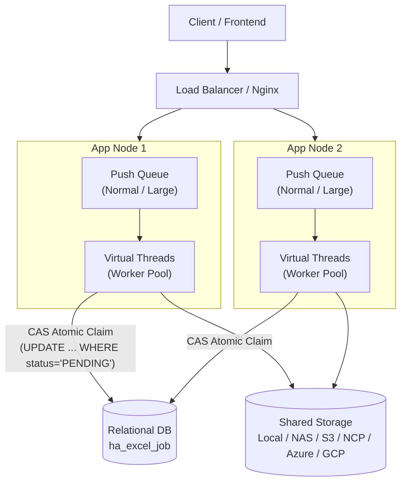
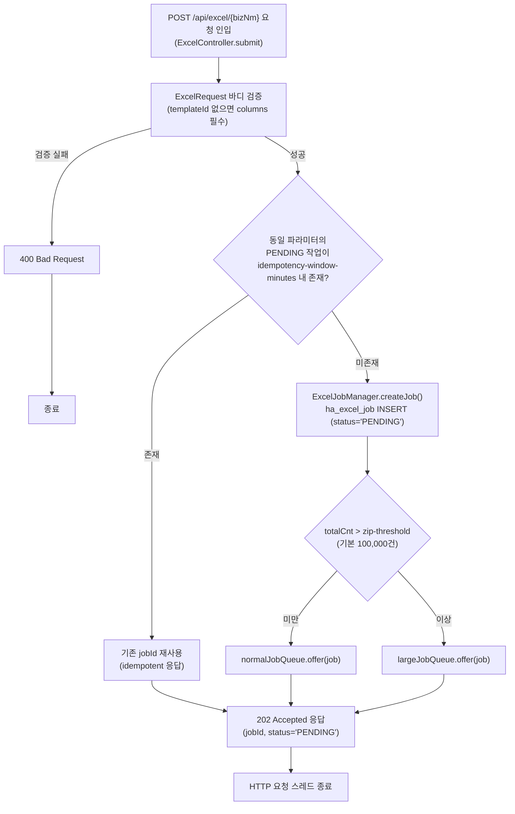
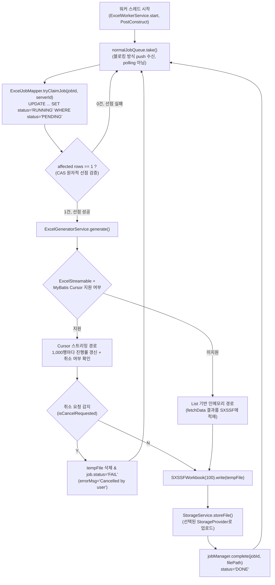
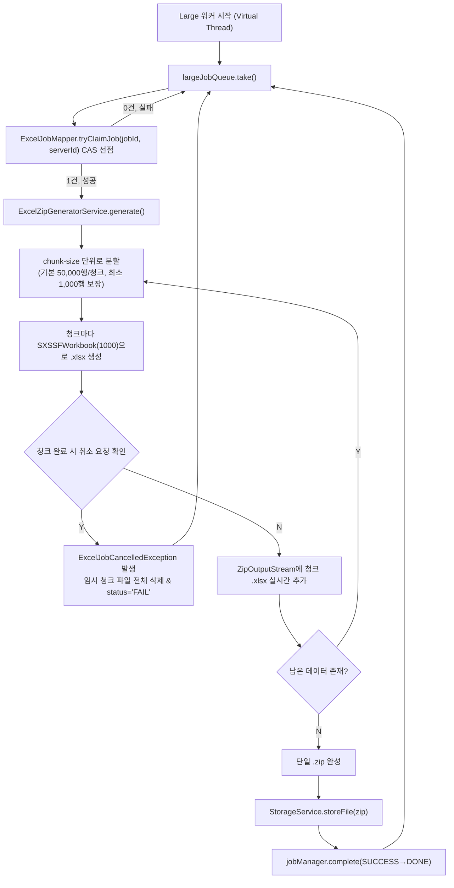
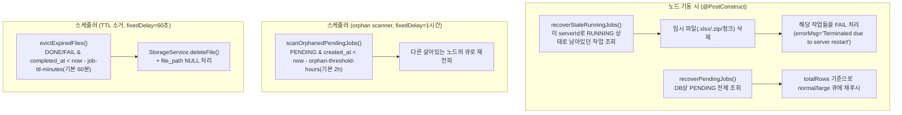
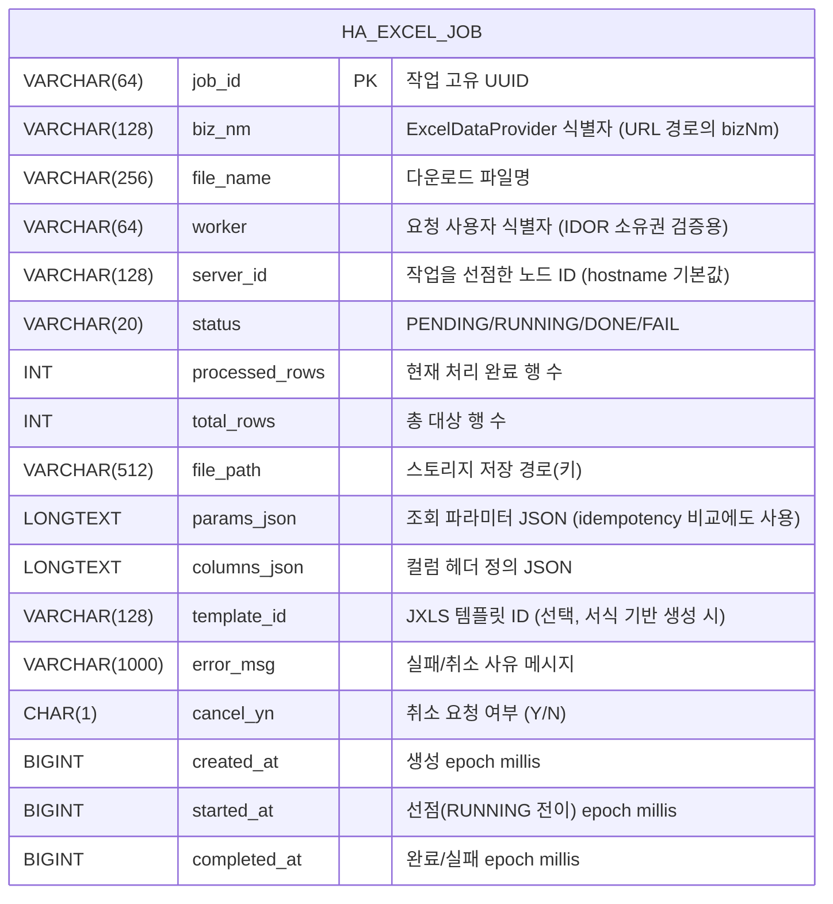
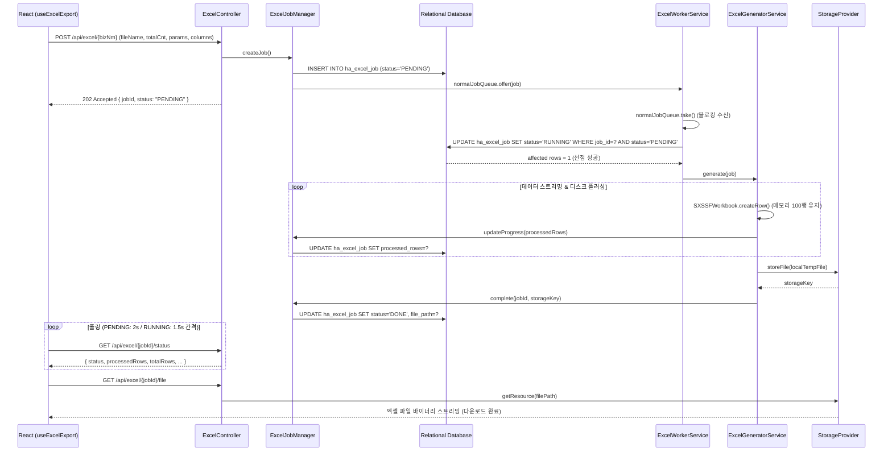
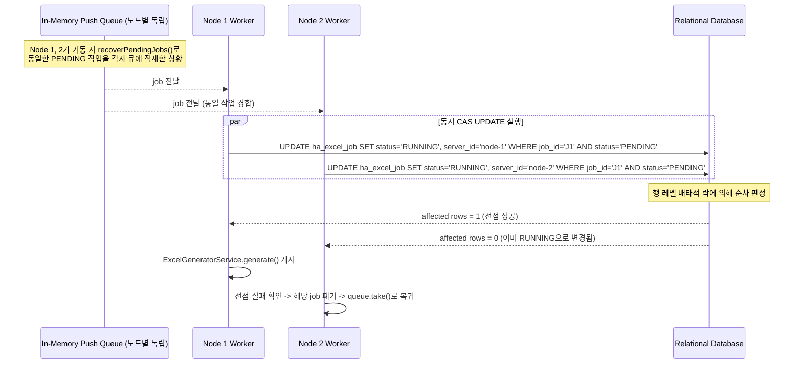
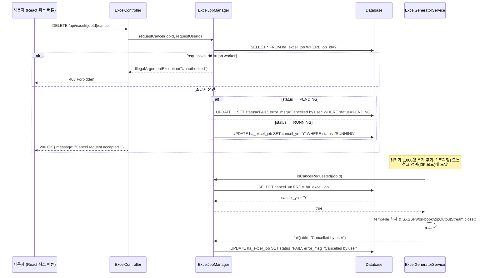

# [오픈소스] ha-excel-job-engine - 상세 분석 및 기술 가이드

> **Redis-Free High-Availability Distributed Job Queue & Out-Of-Memory Proof Excel Export Engine for Spring Boot**
> 실제 GitHub에 공개되어 있는 오픈소스 프로젝트 [`sweetpark/ha-excel-job-engine`](https://github.com/sweetpark/ha-excel-job-engine)의 아키텍처와 핵심 구현을 코드 근거(클래스/메서드/DDL) 기반으로 정리한 기술 가이드.
> **Flowchart(스레드 분리) → ERD → Call Flow → REST API / 설정 → 사용 라이브러리** 순서로, 실제 소스 코드와 공식 문서(`docs/*.md`)를 대조하여 기술한다.

---

## 작성 원칙

- **추측 금지, 근거 우선**: `schema-mysql.sql` DDL, `ExcelWorkerService.java`, `ExcelJobManager.java`, `ExcelJobMapper.xml` 등 실제 코드를 기준으로 기술했다.
- **프로세스가 아니라 스레드 단위로 분리**: Web Request 스레드, 가상 스레드(Normal Worker), 가상 스레드(Large Worker), 기동 시 복구 루틴, 스케줄러 스레드(고아 스캐너 / 파일 TTL 소거)로 나누어 도식화했다.
- **실패/예외 경로 빠짐없이 작성**: CAS 선점 실패 경합, 협력적 취소, 노드 재기동 시 크래시 복구 루틴을 포함한다.
- **하단 근거 링크 명시**: 실제 GitHub 리포지토리 및 공식 문서 링크를 하단에 첨부한다.

---

## 0. 프로젝트 개요

`ha-excel-job-engine`은 대규모 데이터셋(수십만~수백만 행)을 엑셀로 내보낼 때 흔히 발생하는 문제를 해결하기 위한 Spring Boot 스타터 라이브러리다.

- **JVM 힙 고갈(OOM)**: 워크북 전체를 메모리에 올려 생성하다가 발생하는 크래시
- **무거운 인프라 의존성**: 다중 노드 워커를 조율하기 위해 Redis 분산 락(`Redisson`), Celery, RabbitMQ 클러스터까지 구축해야 하는 부담
- **다중 노드 비동기화**: A 노드에서 생성한 파일을 B 노드로 라우팅된 사용자가 다운로드하지 못하는 문제(스티키 세션 없이는)
- **안전하지 않은 스레드 중단**: `Thread.interrupt()`로 장시간 실행 중인 POI 스트림을 강제 종료하면 ZIP 패키징이 손상되는 문제

이 프로젝트는 **Redis/ZooKeeper 없이 관계형 DB의 CAS(Compare-And-Swap) 원자적 UPDATE만으로 분산 워커를 조율**하고, Apache POI `SXSSFWorkbook` 스트리밍으로 힙 사용량을 상수로 유지하며, 6종의 스토리지 프로바이더(Local/NAS/S3/NCP/Azure/GCP)로 다중 노드 간 파일 공유 문제를 해결한다.

| 항목 | 내용 |
| :--- | :--- |
| GitHub | [sweetpark/ha-excel-job-engine](https://github.com/sweetpark/ha-excel-job-engine) |
| 라이선스 | Apache License 2.0 |
| 배포 | JitPack (`com.github.sweetpark:ha-excel-job-engine`) |
| 언어/런타임 | Java 17 (툴체인) / Java 17·21+ 모두 CI 검증 |
| 프레임워크 | Spring Boot 3.x (Spring Boot Starter 형태) |
| GitHub Topics | `apache-poi`, `aws-s3`, `distributed-job`, `excel-export`, `high-availability`, `java`, `spring-boot`, `storage-provider`, `sxssf`, `zero-oom` |
| 최신 릴리즈 | `v1.1.3` |

---

## 1. 아키텍처 개요



핵심은 **DB 한 테이블(`ha_excel_job`)이 곧 분산 락 겸 작업 큐 역할**을 한다는 점이다. 별도의 코디네이터 없이도 `UPDATE ... WHERE status='PENDING'`이라는 단일 원자적 SQL로 "정확히 한 워커만 선점 성공"을 보장한다.

---

## 2. 프로세스별 Flowchart (스레드 분리)

### 2.1 Web Request Thread (Tomcat / HTTP Worker)



`ExcelController.submit()`은 DB에 레코드를 생성(또는 idempotency 캐시를 재사용)하고, 인메모리 큐(`ExcelJobQueue`)에 작업 객체를 넣은 뒤 `202 Accepted`로 즉시 반환한다. 클라이언트 연결은 워커의 실제 처리 시간과 무관하게 블로킹되지 않는다.

> **idempotency 처리**: 동일한 `worker`(사용자 식별자) + `bizNm` + `params` + `columns` + `templateId` 조합의 `PENDING` 작업이 `idempotency-window-minutes`(기본 30분) 이내에 이미 존재하면, 새 레코드를 만들지 않고 기존 `jobId`를 그대로 반환한다(`ExcelJobMapper.selectActiveJobId`). 더블 클릭 등으로 인한 중복 작업 생성을 방지하기 위한 설계다.

### 2.2 Normal Worker Thread (`ha-excel-normal-worker-N`, Virtual Thread)



`ExcelGeneratorService`는 데이터 프로바이더가 `ExcelStreamable`을 구현하고 MyBatis `SqlSessionFactory`가 존재하면 **Cursor 스트리밍 경로**를, 아니면 **`List<Map<String,Object>>` 기반 인메모리 경로**를 탄다. 두 경로 모두 `SXSSFWorkbook`을 사용해 힙에는 일부 행(스트리밍 경로는 100행, 인메모리 경로는 1,000행)만 유지하고 나머지는 디스크로 플러싱하므로 힙 메모리 고갈(OOM)이 구조적으로 방지된다. 실제로 `ExcelGeneratorService.generate()`는 `OutOfMemoryError`까지 캐치해서 작업을 `FAIL` 처리하고 워커 스레드 자체는 살려둔다.

> **취소 체크포인트의 실제 위치**: 협력적 취소(`isCancelRequested`) 확인은 **Cursor 스트리밍 경로에서 1,000행 단위로만** 수행된다. 데이터 건수가 적어 스트리밍 대상이 아닌 인메모리 경로는 처리 자체가 짧게 끝나기 때문에 별도 취소 체크포인트가 없다. 반면 대용량 ZIP 경로(2.3절)는 스트리밍/인메모리 여부와 무관하게 **청크 경계마다** 취소 여부를 확인한다.

### 2.3 Large Worker Thread (`ha-excel-large-worker-N`, Virtual Thread)



엑셀 표준 1시트 한계(1,048,576행)를 넘어가는 초대형 데이터는 `chunk-size`(기본 50,000행) 단위로 여러 개의 `.xlsx`로 분할한 뒤, 그 조각들을 하나의 `.zip`으로 실시간 패키징한다. `ExcelZipGeneratorService`도 Cursor 스트리밍/인메모리 두 경로를 모두 지원하며, `finally` 블록에서 청크 임시 파일을 반드시 정리한다.

### 2.4 기동 시 크래시 복구 & 백그라운드 스케줄러

노드 재기동/장애 상황에 대한 자가 치유(Self-healing)는 **기동 시 1회 복구 루틴**과 **주기적 스케줄러 2종**으로 나뉜다.



- **`recoverStaleRunningJobs()`**: 자기 자신의 `serverId`로 `RUNNING` 상태로 멈춰있던 작업만 골라 `FAIL` 처리한다 — 즉 "이 노드가 비정상 종료 직전까지 처리 중이었던 작업"을 정리하는 로직이다.
- **`recoverPendingJobs()`**: DB에 있는 모든 `PENDING` 작업을 조회해 인메모리 큐로 재적재한다. 노드가 완전히 새로 뜨는 경우(인메모리 큐가 비어있는 상태) 이미 INSERT는 됐지만 큐잉되지 못했던 작업들을 되살린다.
- **`scanOrphanedPendingJobs()`** (`fixedDelay = 3_600_000`, 1시간 주기): 다른 노드가 DB INSERT 직후 크래시하여 자신의 큐에도, 다른 노드의 큐에도 들어가지 못한 "완전한 고아" 작업을 `orphan-threshold-hours`(기본 2시간) 기준으로 탐지해 살아있는 노드들에게 재전파한다.
- **`evictExpiredFiles()`** (`fixedDelay = 60_000`, 60초 주기): `job-ttl-minutes`(기본 60분)가 지난 완료/실패 작업의 결과 파일을 스토리지에서 삭제하고 `file_path`를 비운다. 디스크/버킷 용량이 무한정 늘어나는 것을 방지한다.

---

## 3. ERD

### 3.1 실제 DDL 기반 `ha_excel_job` 테이블 구조

라이브러리는 MySQL/MariaDB, PostgreSQL, H2 세 종류의 DDL(`schema-mysql.sql`, `schema-postgresql.sql`, `schema-h2.sql`)을 함께 제공한다. 아래는 MySQL 기준이다.



| 컬럼 | 타입 | 제약 | 비고 |
| :--- | :--- | :--- | :--- |
| `job_id` | `VARCHAR(64)` | `PRIMARY KEY` | `UUID.randomUUID()` |
| `biz_nm` | `VARCHAR(128)` | `NOT NULL` | `ExcelDataProvider.getName()`과 매칭되는 업무 식별자 |
| `file_name` | `VARCHAR(256)` | `NOT NULL` | 다운로드 시 파일명으로 사용 |
| `worker` | `VARCHAR(64)` | `NOT NULL` | **작업을 "요청한" 사용자 ID.** `ExcelSecurityProvider.extractUserId()`로 추출되며, 조회/취소/다운로드 시 소유권(IDOR) 검증에 쓰인다 — 처리 워커 스레드명이 아니다 |
| `server_id` | `VARCHAR(128)` | `NULL` | CAS 선점에 성공한 노드의 hostname |
| `status` | `VARCHAR(20)` | `NOT NULL` | `PENDING → RUNNING → DONE` 또는 `FAIL` (enum: `ExcelJobStatus`) |
| `processed_rows` / `total_rows` | `INT` | `DEFAULT 0` | 실시간 진행률 계산에 사용 |
| `file_path` | `VARCHAR(512)` | `NULL` | 완료 후 TTL 경과 시 `NULL`로 초기화됨 |
| `cancel_yn` | `CHAR(1)` | `DEFAULT 'N'` | `RUNNING` 작업에 대한 취소 플래그 |
| `created_at` | `BIGINT` | `NOT NULL` | 밀리초 epoch (인덱스 기준 컬럼) |

> **인덱스 설계** (`schema-mysql.sql`):
> - `idx_ha_excel_status_created (status, created_at)`: `PENDING` 고아 작업 탐색 및 큐 순서 조회 최적화
> - `idx_ha_excel_active_check (worker, biz_nm, status, created_at)`: idempotency 체크(`selectActiveJobId`) 최적화
> - `idx_ha_excel_server_status (server_id, status)`: 노드 재기동 시 자기 자신의 `RUNNING` 잔재 조회(`selectStaleRunningJobIds`) 최적화

---

## 4. 프로세스별 Call Flow

### 4.1 정상 대용량 엑셀 생성 및 다운로드 시나리오



### 4.2 다중 노드 워커 간 CAS 경합 및 선점 실패 시나리오



### 4.3 사용자 취소 요청 시 협력적 취소 시나리오



> **보안 세부사항**: 상태 조회(`/status`)와 다운로드(`/file`) 엔드포인트도 동일하게 `ExcelSecurityProvider.isOwner(job, requestUserId)`로 IDOR(불완전한 인가) 방어를 거친다. 기본 구현(`DefaultExcelSecurityProvider`)은 `requestUserId`가 비어있으면 통과시키지만, Spring Security와 연동한 커스텀 구현(예시는 7절 참고)으로 완전히 대체할 수 있다.

---

## 5. REST API 요약

| Method | Endpoint | 설명 | 응답 코드 |
| :--- | :--- | :--- | :---: |
| `GET` | `/api/excel/config` | 클라이언트 직접 처리 임계값(`clientThreshold`) 조회 | `200 OK` |
| `POST` | `/api/excel/{bizNm}` | 비동기 엑셀 생성 작업 제출 | `202 Accepted` |
| `GET` | `/api/excel/{jobId}/status` | 작업 상태, 진행률, 대기열 순번/예상 시간 조회 | `200 OK` / `404` |
| `GET` | `/api/excel/{jobId}/file` | 완료된 `.xlsx` 또는 `.zip` 파일 다운로드 | `200 OK` / `404` |
| `DELETE` | `/api/excel/{jobId}/cancel` | 대기/실행 중인 작업 취소 요청 | `200 OK` / `403` |
| `GET` | `/api/excel/template/{templateId}` | 원본 엑셀 템플릿 파일 다운로드 | `200 OK` / `404` |

`status`는 `PENDING → RUNNING → DONE` 또는 `FAIL` 네 가지 값을 가지며(과거 초안 문서에서 쓰였던 `SUCCESS`가 아니라 `DONE`이 실제 값이다), `PENDING` 응답에는 `queuePosition`/`estimatedSeconds`가, `FAIL` 응답에는 `errorMsg`가 추가로 포함된다.

`excelFormat`으로 지원하는 셀 포맷터는 `krw`(통화), `ymd`(날짜), `tm`(시간), `datetime`(일시), `bizno`(사업자번호), `phone`/`tel`(전화번호), `pct`(퍼센트)까지 8종이며, `children`으로 다단(멀티레벨) 헤더 그룹핑도 지원한다. 전체 요청/응답 예시는 [`docs/REST_API.md`](https://github.com/sweetpark/ha-excel-job-engine/blob/main/docs/REST_API.md) 참고.

---

## 6. 확장 포인트 (SPI)

`ha-excel-job-engine`은 5개의 인터페이스를 통해 데이터 조회, 스트리밍, 스토리지, 보안, 템플릿 엔진을 전부 교체 가능하도록 설계되어 있다.

| 인터페이스 | 패키지 | 목적 | 기본 구현 |
| :--- | :--- | :--- | :--- |
| `ExcelDataProvider` | `io.github.sweetpark.haexcel.core` | `bizNm`별 데이터 조회 | `ExcelDataRegistry`가 Spring Bean 자동 탐색 |
| `ExcelStreamable` | `io.github.sweetpark.haexcel.core` | MyBatis `Cursor` 기반 행 단위 스트리밍 | `ExcelDataProvider`의 선택적 부가 인터페이스 |
| `StorageProvider` | `io.github.sweetpark.haexcel.storage` | 생성 파일 저장/조회 전략 | `LocalDiskStorageProvider` 등 6종 |
| `ExcelSecurityProvider` | `io.github.sweetpark.haexcel.controller` | 사용자 식별 및 IDOR 소유권 검증 | `DefaultExcelSecurityProvider` |
| `TemplateExcelEngine` | `io.github.sweetpark.haexcel.template` | 템플릿(.xlsx) 기반 서식 채우기 | `JxlsTemplateEngine` (Jxls 3.x) |

```java
public interface ExcelDataProvider {
    String getName(); // POST /api/excel/{bizNm}의 {bizNm}과 매칭
    List<Map<String, Object>> fetchData(Map<String, Object> params);
    default boolean isStreamable() {
        return this instanceof ExcelStreamable;
    }
}

public interface ExcelStreamable {
    Cursor<Map<String, Object>> streamRows(Map<String, Object> params, SqlSession sqlSession);
}

public interface StorageProvider {
    StorageType getType();
    String storeFile(Path source, String key, String contentType) throws IOException;
    StorageResource getResource(String key) throws IOException;
    void delete(String key) throws IOException;
}

public interface ExcelSecurityProvider {
    String extractUserId(HttpServletRequest request);
    default boolean isOwner(ExcelJob job, String requestUserId) {
        if (requestUserId == null || requestUserId.isBlank()) return true;
        return requestUserId.equals(job.getWorker());
    }
}
```

`ExcelAutoConfiguration`은 `@ConditionalOnMissingBean(StorageProvider.class)` 방식으로 기본 구현을 등록하기 때문에, 사용자가 `@Component`로 자체 `StorageProvider`(예: MinIO, WebDAV, SFTP)를 등록하면 자동으로 우선 적용된다.

---

## 7. 설정 프로퍼티 (`application.yml`)

`ExcelProperties` (`prefix = "ha-excel"`) 기준 전체 프로퍼티다.

```yaml
ha-excel:
  client-threshold: 10000              # 이 건수 미만은 브라우저에서 직접 export 권장
  worker-count: 4                      # Normal 큐(단일 xlsx) 워커 스레드 수
  large-worker-count: 2                # Large 큐(청크 zip) 워커 스레드 수
  server-id: ""                        # 비워두면 InetAddress 기반 hostname 사용
  idempotency-window-minutes: 30       # 중복 제출 방지 윈도우
  orphan-threshold-hours: 2            # 이 시간 넘게 PENDING이면 고아로 간주하고 재전파
  job-ttl-minutes: 60                  # 완료 파일 보관 시간 (초과 시 자동 삭제)
  zip-threshold: 100000                # 이 건수 이상이면 청크 ZIP 방식으로 전환
  chunk-size: 50000                    # ZIP 모드에서 워크북 1개당 최대 행 수
  storage-type: LOCAL                  # LOCAL | NAS | S3 | NCP | AZURE | GCP
  local-storage-path: "/tmp/ha-excel-storage"
  nas-storage-path: "/mnt/shared-excel"
  s3-bucket: "my-excel-bucket"
  s3-region: "ap-northeast-2"
  s3-endpoint: ""                      # MinIO 등 S3 호환 스토리지 사용 시 설정
  s3-access-key: ${AWS_ACCESS_KEY_ID:}      # 비워두면 AWS 기본 자격증명 체인 사용
  s3-secret-key: ${AWS_SECRET_ACCESS_KEY:}
  ncp-bucket: "ncp-excel-bucket"
  ncp-endpoint: "https://kr.object.ncloudstorage.com"
  azure-container: "excel-container"
  azure-connection-string: ""
  gcp-bucket: "gcp-excel-bucket"
  gcp-project-id: "my-gcp-project"
```

MyBatis 매퍼 XML은 라이브러리 jar 내부의 `mapper/haexcel/`에 포함되어 있는데, 매퍼 인터페이스 패키지 옆이 아니라서 MyBatis 기본 스캔 경로에 잡히지 않는다. 따라서 소비 프로젝트에서 아래 설정을 함께 넣어줘야 한다.

```yaml
mybatis:
  mapper-locations: classpath:mapper/haexcel/*.xml
  configuration:
    map-underscore-to-camel-case: true
```

---

## 8. 멀티 스토리지 전략 패턴

`StorageProvider` 인터페이스를 중심으로 6종의 구현체가 존재하며, `LOCAL`/`NAS`는 추가 의존성 없이 바로 동작하고 나머지 4종의 클라우드 프로바이더는 `compileOnly`로 옵트인 방식이다.

| Provider | 클래스 | 설명 | 다중 노드 지원 |
| :--- | :--- | :--- | :---: |
| `LOCAL` | `LocalDiskStorageProvider` | 로컬 파일 시스템 디렉토리 | 단일 노드 / 테스트용 |
| `NAS` | `NasStorageProvider` | NFS/CIFS 공유 네트워크 드라이브(원자적 move) | ✅ 온프레미스 |
| `S3` | `AwsS3StorageProvider` | AWS S3 및 MinIO 등 S3 호환 오브젝트 스토리지 | ✅ 클라우드/온프레미스 |
| `NCP` | `NcpObjectStorageProvider` | 네이버클라우드플랫폼 Object Storage | ✅ NCP |
| `AZURE` | `AzureBlobStorageProvider` | Microsoft Azure Blob Storage | ✅ Azure |
| `GCP` | `GcpCloudStorageProvider` | Google Cloud Storage(GCS) | ✅ GCP |

클라우드 `storage-type`을 선택했는데 해당 SDK가 클래스패스에 없으면, 모호한 `NoClassDefFoundError` 대신 **어떤 의존성을 추가해야 하는지 알려주는 메시지와 함께 기동 실패**하도록 설계되어 있다.

| `storage-type` | 필요 의존성 |
| :--- | :--- |
| `S3` 또는 `NCP`(S3 호환) | `software.amazon.awssdk:s3:2.25.60` |
| `AZURE` | `com.azure:azure-storage-blob:12.25.3` |
| `GCP` | `com.google.cloud:google-cloud-storage:2.36.1` |

---

## 9. 사용한 라이브러리 및 프레임워크

| 모듈 | 버전 | 의존성 스코프 | 역할 |
| :--- | :--- | :--- | :--- |
| `org.apache.poi:poi` / `poi-ooxml` | 5.2.5 | `api` | 저메모리 SXSSF 엑셀 스트리밍 생성 (`ExcelWriterUtils`가 POI 타입을 공개 시그니처에 직접 노출하므로 `api`) |
| `org.jxls:jxls` / `jxls-poi` | 3.1.0 | `implementation` | 템플릿 기반 서식 매핑 (`JxlsTemplateEngine` 내부 전용, 공개 SPI는 `InputStream`/`OutputStream`만 사용) |
| `org.mybatis.spring.boot:mybatis-spring-boot-starter` | 3.0.3 | `api` | CAS 원자적 상태 변경 SQL 실행, `ExcelStreamable` SPI가 `Cursor`/`SqlSession` 타입을 노출 |
| `spring-boot-starter-web` / `spring-boot-starter-jdbc` | 3.2.1 | `implementation` | 공개 API가 Spring MVC/DataSource 타입을 노출하지 않으므로 비공개 스코프 |
| `software.amazon.awssdk:s3` | 2.25.60 | `compileOnly` | AWS S3 / MinIO 클라우드 스토리지 전송 |
| `com.azure:azure-storage-blob` | 12.25.3 | `compileOnly` | Azure Blob 클라우드 스토리지 전송 |
| `com.google.cloud:google-cloud-storage` | 2.36.1 | `compileOnly` | Google Cloud Storage 전송 |
| `org.testcontainers` | 1.19.7 | `testImplementation` | MySQL/PostgreSQL 대상 통합 테스트 |
| React 18 + Vite + TypeScript | - | `examples/sample-client` | 대용량 엑셀 다운로드 & 진행률 UI 데모 |
| `ag-grid-react` | - | `examples/sample-client/utils/agGridAdapter.ts` | AG Grid 컬럼 정의를 `ExcelColumnDef[]`로 변환 |

`api`/`implementation`/`compileOnly` 스코프 구분 원칙은 "공개 메서드 시그니처에 해당 타입이 직접 노출되는가"이며, 이 라이브러리는 Spring Boot 스타터이기 때문에 `api` 의존성 하나하나가 모든 소비 프로젝트에 강제 전이된다는 점을 명시적으로 관리하고 있다(`docs/CONVENTIONS.md`).

---

## 10. 품질 게이트 및 검증

매 커밋/PR마다 4가지 품질 게이트를 강제한다.

1. **자동화 테스트**: CAS 동시성 선점, 크래시 복구 시나리오를 포함해 **29개**의 단위/통합 테스트
2. **JaCoCo 커버리지**: 100% 검증 임계값 (`./gradlew check`에 포함)
3. **Spotless**: Google Java Format(`1.18.1`) 코드 스타일 강제
4. **SpotBugs**: 정적 분석, high/medium 등급 버그 0건 허용

```bash
./gradlew check          # 테스트 + JaCoCo + SpotBugs + Spotless 검증
./gradlew spotlessApply  # Google Java Format으로 코드 자동 정렬
./gradlew javadoc        # Javadoc HTML 생성
```

CI(`ci.yml`)는 GitHub Actions에서 **Java 17 / 21 매트릭스**로 `./gradlew check`를 실행하고, Java 17 빌드 기준 JaCoCo 리포트를 아티팩트로 업로드한다. `main` 브랜치는 `docs/BRANCH_PROTECTION.md`에 정의된 규칙에 따라 PR 리뷰 + CI 통과가 강제되며, 릴리즈는 `docs/RELEASE_WORKFLOW.md`에 따라 시맨틱 버저닝 + GitHub Release 자동화 + JitPack 빌드 워밍업까지 자동화되어 있다.

---

## 11. 프론트엔드 연동 (React `useExcelExport`)

`examples/sample-client`는 실제로 동작하는 React + TypeScript 데모이며, 핵심은 아래 흐름을 캡슐화한 커스텀 훅이다.

```
[ 사용자가 "엑셀 다운로드" 클릭 ]
               │
               ▼
     전체 행 수(N) 조회
               │
      N < clientThreshold ?
     ┌────────┴────────┐
    YES               NO
     ▼                 ▼
브라우저 직접 다운로드   POST /api/excel/{bizNm}
(예: SheetJS)         (비동기 작업 제출)
                          │
                          ▼
                 GET /api/excel/{jobId}/status 폴링
                 (진행률 %, 예상 남은 시간 표시)
                          │
                          ▼
                    status == DONE ?
                          │
                          ▼
                 GET /api/excel/{jobId}/file
                 (브라우저 다운로드 트리거)
```

`useExcelExport` 훅은 `PENDING` 상태일 때 2초 간격, `RUNNING` 상태일 때 1.5초 간격으로 폴링 주기를 다르게 가져가며, `DONE` 응답을 받으면 `<a>` 태그를 동적으로 생성해 자동 다운로드를 트리거하고, `FAIL` 응답이나 네트워크 에러 시 상태를 정리한다. 취소 버튼은 `DELETE /api/excel/{jobId}/cancel`을 호출한 뒤 즉시 로컬 상태를 종료 처리한다. AG Grid를 쓰는 경우 `adaptAgGridColumns()` 유틸로 `ColDef[]`를 `ExcelColumnDef[]`로 변환해 그대로 재사용할 수 있다.

`examples/sample-server`는 H2 인메모리 DB와 더미 `ExcelDataProvider`로 구성된 즉시 실행 가능한 Spring Boot 앱이며, `docker-compose.yml`을 이용하면 Nginx + Node 1(8081) + Node 2(8082) + MariaDB + MinIO로 구성된 **2노드 클러스터 데모**까지 그대로 재현해볼 수 있다. 동일한 MinIO 버킷을 공유하기 때문에 Node 1에서 생성된 파일이 Node 2로 라우팅된 요청에서도 정상적으로 다운로드되는 것을 직접 확인할 수 있다.

---

## 12. 마무리

`ha-excel-job-engine`은 Redis 같은 별도 미들웨어 없이도 DB 트랜잭션만으로 다중 노드 워커 조율, 크래시 복구, 협력적 취소, 6종 스토리지 추상화까지 갖춘 대용량 엑셀 export 엔진이다. Apache 2.0 라이선스로 공개되어 있고, GitHub Actions CI(Java 17/21 매트릭스), JaCoCo 100% 커버리지, SpotBugs, Spotless 등 품질 게이트를 갖추고 있어 실제로 가져다 검증해볼 수 있다.

전체 소스코드와 문서는 아래에서 직접 확인할 수 있다.

- GitHub: [https://github.com/sweetpark/ha-excel-job-engine](https://github.com/sweetpark/ha-excel-job-engine)
- JitPack: [https://jitpack.io/#sweetpark/ha-excel-job-engine](https://jitpack.io/#sweetpark/ha-excel-job-engine)
- 아키텍처 문서: [`docs/ARCHITECTURE.md`](https://github.com/sweetpark/ha-excel-job-engine/blob/main/docs/ARCHITECTURE.md)
- 인터페이스/SPI 가이드: [`docs/INTERFACES.md`](https://github.com/sweetpark/ha-excel-job-engine/blob/main/docs/INTERFACES.md)
- REST API 레퍼런스: [`docs/REST_API.md`](https://github.com/sweetpark/ha-excel-job-engine/blob/main/docs/REST_API.md)
- 클라이언트 연동 가이드: [`docs/CLIENT_INTEGRATION_GUIDE.md`](https://github.com/sweetpark/ha-excel-job-engine/blob/main/docs/CLIENT_INTEGRATION_GUIDE.md)
