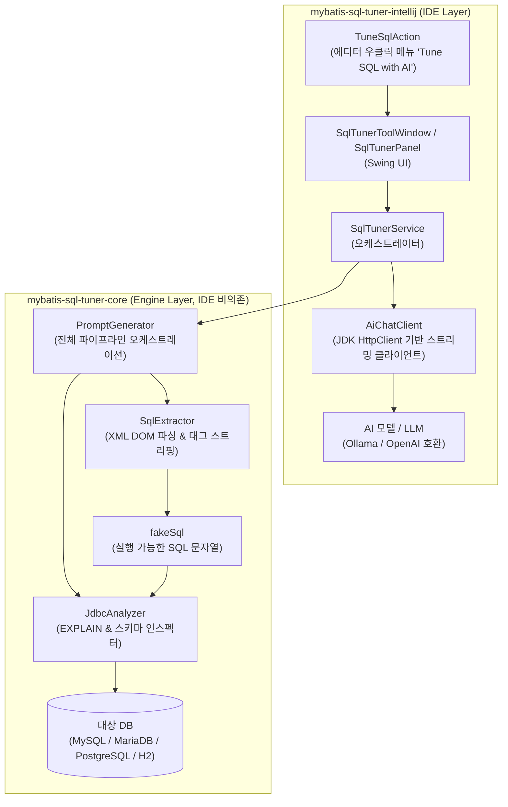
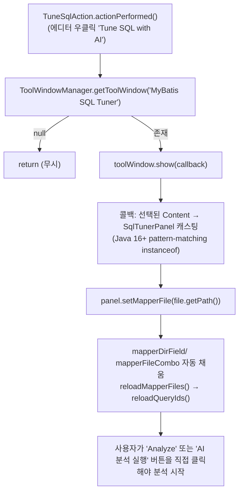
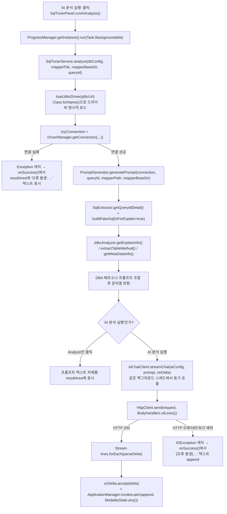
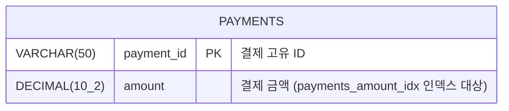
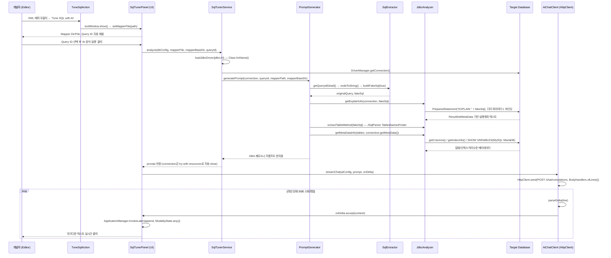
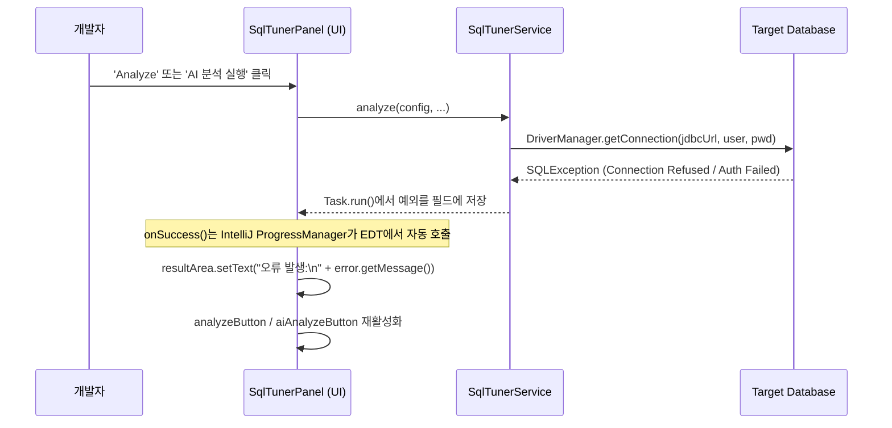
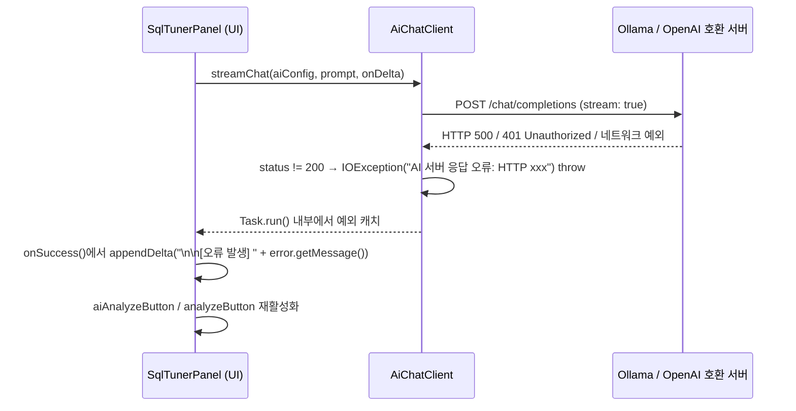

# [오픈소스] mybatis-sql-tuner-ai - 상세 분석 및 기술 가이드

> **AI-Assisted MyBatis SQL Tuning & Static Analysis Tool for IntelliJ IDEA**
> MyBatis 매퍼 XML의 동적 태그를 실행 가능한 SQL(`fakeSql`)로 변환하고, 실제 DB의 `EXPLAIN`과 스키마 메타데이터를 수집해 "10년 차 시니어 DBA" 페르소나 AI가 실시간 스트리밍으로 튜닝 리포트를 작성해주는 IntelliJ IDEA 플러그인.
>
> 이 글은 [GitHub 저장소](https://github.com/sweetpark/mybatis-sql-tuner-ai)의 실제 소스 코드(`main` 브랜치 기준)를 직접 근거로 삼아 아키텍처, 실행 흐름, 예외 처리, 품질 파이프라인을 정리한 기술 분석 문서다. **Flowchart(스레드 분리) → ERD → Call Flow → 사용 라이브러리** 순서로 소스 코드 근거(`파일:클래스#메서드`)를 기반으로 기술한다.

---

## 0. 프로젝트 개요

| 항목 | 내용 |
| :--- | :--- |
| GitHub | [sweetpark/mybatis-sql-tuner-ai](https://github.com/sweetpark/mybatis-sql-tuner-ai) |
| 라이선스 | Apache License 2.0 |
| 배포 | [JetBrains Marketplace #34051](https://plugins.jetbrains.com/plugin/34051-mybatis-sql-tuner-ai) |
| 루트 패키지 | `io.github.sweetpark.sqltuner.*` |
| 모듈 구성 | `mybatis-sql-tuner-core` (순수 Java 엔진, IDE 비의존) + `mybatis-sql-tuner-intellij` (IntelliJ Platform UI/플러그인) |
| Java / IDE 타깃 | Java 17+, IntelliJ Platform 2024.1+ |
| 지원 DB | MySQL 5.7/8.0+, MariaDB 10.x/11.x+, PostgreSQL 12+, H2 |
| 지원 AI | Ollama(로컬 LLM), OpenAI 및 `POST /v1/chat/completions` 스펙과 호환되는 모든 서버(OpenRouter, vLLM 등) |
| 품질 게이트 | Spotless(Eclipse formatter), SpotBugs, JaCoCo(core 모듈 라인 커버리지 100%), CodeRabbit AI 리뷰, GitHub Actions CI |

이 문서에서 다루는 클래스/메서드 시그니처와 빌드 설정은 모두 저장소의 실제 소스(`mybatis-sql-tuner-core`, `mybatis-sql-tuner-intellij` 모듈)와 `docs/ARCHITECTURE.md`, `build.gradle`, GitHub Issue/PR 이력을 직접 확인하여 작성했다.

---

## 1. 전체 시스템 아키텍처



`mybatis-sql-tuner-core`는 IntelliJ API에 전혀 의존하지 않는 순수 Java 17 라이브러리로 설계되어 있어, 이론적으로는 CLI나 CI 파이프라인에서도 재사용 가능하다. 실제로 이 분리 덕분에 core 모듈은 순수 JUnit5 + H2 기반 단위 테스트만으로 100% 라인 커버리지를 달성한다.

핵심 클래스 3개의 역할:

- **`SqlExtractor`** (`mybatis-sql-tuner-core/.../core/SqlExtractor.java`): DOM 파서로 매퍼 XML을 읽어 `queryId`에 해당하는 Node를 찾고, `<where>`, `<if>`, `<choose>/<when>/<otherwise>`, `<set>`, `<trim>`, `<bind>`, `<foreach>`, `<include>` 태그를 재귀적으로 스트리핑해 `fakeSql`을 조립한다.
- **`JdbcAnalyzer`** (`mybatis-sql-tuner-core/.../core/JdbcAnalyzer.java`): `fakeSql`의 바인드 파라미터에 더미 값을 채워 `EXPLAIN`을 실행하고, JSqlParser로 추출한 테이블 목록을 `DatabaseMetaData`로 조회해 컬럼/인덱스/트랜잭션 격리수준 정보를 수집한다.
- **`PromptGenerator`** (`mybatis-sql-tuner-core/.../core/PromptGenerator.java`): 위 두 클래스를 순서대로 호출해 원본 쿼리, `fakeSql`, `EXPLAIN` 결과, 메타데이터를 "실무 10년 차 DBA" 페르소나 프롬프트로 조합하는 **파이프라인의 실제 진입점**이다.

---

## 2. 스레드 분리 관점의 실행 흐름 (Flowchart)

실제 구현은 처음 설계 문서에서 상정했던 "EDT / 백그라운드 워커 / 별도 SSE 콜백 스레드"의 3단 분리가 아니라, **EDT 1개 + IntelliJ `ProgressManager.Task.Backgroundable` 1개**로 구성된 더 단순한 2-스레드 모델이다. DB 분석과 AI 스트리밍 HTTP 호출이 같은 백그라운드 태스크 안에서 순차적(블로킹) 으로 실행되고, UI 갱신 시점에만 EDT로 마샬링된다.

### 2.1 EDT (Event Dispatch Thread) — 액션 트리거 & 폼 프리필



`TuneSqlAction`(`intellij/action/TuneSqlAction.java`)은 분석을 자동으로 실행하지 않는다. 툴 윈도우를 열고 우클릭한 XML 파일 경로를 폼에 채워주는 역할만 한다. 실제 분석 트리거는 `SqlTunerPanel`의 "Analyze"(DB 분석만) 또는 "AI 분석 실행"(DB 분석 + AI 스트리밍) 버튼 클릭이다.

메뉴 활성화 여부를 판단하는 `update()`는 `getActionUpdateThread()`가 `ActionUpdateThread.BGT`를 반환하기 때문에 **백그라운드 스레드**에서 실행되며, 파일 확장자가 `.xml`이고 파일 내용에 `<mapper` 문자열이 포함되어 있는지를 `BufferedReader.lines().anyMatch(...)`로 스트리밍 검사한다(EDT 블로킹 방지).

### 2.2 백그라운드 태스크 (`ProgressManager.Task.Backgroundable`) — DB 분석 + AI 스트리밍



`SqlTunerService.analyze()`(`intellij/service/SqlTunerService.java`)는 커넥션을 `try-with-resources`로 감싸 메타데이터 조회 직후 안전하게 닫는다. 주목할 점은 `loadJdbcDriver()`인데, **IntelliJ 플러그인은 자체 클래스로더를 사용하기 때문에 `DriverManager`의 `ServiceLoader` 기반 자동 드라이버 탐지가 동작하지 않는다.** 그래서 JDBC URL 접두사(`jdbc:mariadb:`, `jdbc:mysql:`, `jdbc:postgresql:`, `jdbc:h2:`)를 보고 `Class.forName()`으로 드라이버 클래스를 플러그인 클래스로더에 명시적으로 등록한다 — 실제 IntelliJ 플러그인 개발에서만 부딪히는 실전형 이슈다.

AI 스트리밍도 별도 SSE 콜백 스레드가 아니라 **같은 백그라운드 태스크 안에서 블로킹 호출**로 처리된다는 점이 처음 설계와 가장 크게 다른 부분이다. 상세 내용은 3장 참고.

### 2.3 AI 스트리밍 클라이언트 — OkHttp가 아닌 JDK 표준 `HttpClient`

```mermaid
flowchart TD
    A["AiChatClient.streamChat(config, prompt, onDelta)"] --> B["HttpRequest 빌드<br/>POST {baseUrl}/chat/completions, stream=true"]
    B --> C["client.send(request, HttpResponse.BodyHandlers.ofLines())"]
    C -->|status != 200| ERR["IOException('AI 서버 응답 오류: HTTP xxx') throw"]
    C -->|status == 200| D["Stream<String> lines 획득 (try-with-resources)"]
    D --> E["각 라인에 대해 parseDelta(line) 호출"]
    E --> F{"'data:' 접두사?"}
    F -->|아니오| G["null 반환 → skip"]
    F -->|'[DONE]' 또는 빈 payload| G
    F -->|정상 JSON| H["Gson으로 choices[0].delta.content 파싱"]
    H --> I["onDelta.accept(content)"]
    I --> J["SqlTunerPanel.appendDelta()<br/>ApplicationManager.invokeLater(..., ModalityState.any())"]
```

원래 설계 문서는 `com.squareup.okhttp3:okhttp` + `okhttp-sse`의 `EventSourceListener`(`onEvent`/`onFailure`/`onClosed`) 패턴을 전제했지만, **실제 구현은 OkHttp를 전혀 사용하지 않는다.** `AiChatClient`(`intellij/service/AiChatClient.java`)는 JDK 11+ 표준 `java.net.http.HttpClient`를 재사용 가능한 단일 인스턴스로 유지하고(`HttpClient`는 `AutoCloseable`이 아니라서 매 호출마다 새로 만들면 selector 스레드 풀이 누수된다는 주석이 코드에 명시되어 있다), `BodyHandlers.ofLines()`로 SSE 청크를 한 줄씩 `Stream<String>`으로 받아 동기적으로 처리한다.

SSE 한 줄을 델타 텍스트로 변환하는 `parseDelta(String line)`은 순수 `static` 메서드로 분리되어 있어, 실제 네트워크 호출 없이 문자열 파싱 로직만 단위 테스트할 수 있다(`AiChatClientTest.java`) — "네트워크는 테스트 대상이 아니고, 파싱 로직만 순수 함수로 뽑아 검증한다"는 설계 의도가 코드 주석에 그대로 남아있다.

---

## 3. ERD — 인스펙션 대상 스키마 예시

`mybatis-sql-tuner-ai`는 자체 스키마를 갖지 않는다. 대상 애플리케이션의 DB를 그때그때 `DatabaseMetaData`로 인스펙션할 뿐이다. 아래는 실제 Testcontainers 통합 테스트(`MySqlJdbcAnalyzerIntegrationTest.java` 등)에서 사용하는 검증용 스키마다.



| 테이블 | 컬럼 | 타입 | 제약 조건 |
| :--- | :--- | :--- | :--- |
| `payments` | `payment_id` | `VARCHAR(50)` | `PRIMARY KEY` |
| `payments` | `amount` | `DECIMAL(10,2)` | `NOT NULL`, `payments_amount_idx` 인덱스 |

### 3.1 DB 엔진별 대소문자 정규화 — 실제 GitHub Issue #17 / PR #18

> **현상 (Issue #17: "Docker 기반 H2/MySQL/MariaDB/PostgreSQL 실동작 검증")**: H2는 식별자를 대문자로, PostgreSQL은 소문자로, MySQL/MariaDB는 원래 대소문자 그대로 저장한다. 초기 구현이 특정 대소문자 규칙(예: 무조건 대문자)으로 고정 조회하면 나머지 DB에서 컬럼/인덱스 메타데이터가 빈 결과로 돌아오는 결함이 있었다.
>
> **해결 (PR #18: "fix(core): resolve real DB table-name case before metadata lookup")**: `JdbcAnalyzer`의 private 메서드 `normalizeIdentifierCase(String identifier, DatabaseMetaData metaData)`가 `metaData.storesUpperCaseIdentifiers()` / `storesLowerCaseIdentifiers()`를 확인해 조회 직전에 테이블명 대소문자를 정규화한다.
>
> 함께 고쳐진 문제: `getColumns()`/`getIndexInfo()` 호출 시 `catalog`에 `null`을 넘기면 서버의 모든 데이터베이스를 대상으로 검색되어 동일 테이블명이 여러 DB에 있을 경우 메타데이터가 중복 출력된다. `metaData.getConnection().getCatalog()`로 현재 접속 DB를 명시해 조회 범위를 한정했다.

---

## 4. 프로세스별 Call Flow

### 4.1 정상 시나리오 — DB 분석 후 AI 스트리밍 ("AI 분석 실행")



### 4.2 DB 연결 실패 시나리오



### 4.3 AI 스트리밍 실패 시나리오



---

## 5. fakeSql 변환 — 동적 태그 스트리핑 상세

`SqlExtractor.buildFakeSql(Node, boolean isForExplain, String namespace, Map<String,String> sqlSnippetRegistry)`는 DOM 트리를 재귀 순회하며 태그별로 다음과 같이 처리한다(실제 소스 기준):

- `<where>` → `WHERE 1=1 AND ( ... )`로 감싸고 선행 `AND`/`OR`를 정규식으로 제거 (JSqlParser 파싱 에러 방지)
- `<set>` → `SET ...`로 감싸고 트레일링 콤마 제거
- `<foreach>` → `( ? )` 로 단순 치환 (컬렉션 크기와 무관하게 단일 바인드 파라미터로 축약)
- `<trim prefix="..." prefixOverrides="...">` → 내부 내용을 재귀 처리 후 `prefixOverrides`에 명시된 접두 토큰을 정규식으로 제거
- `<bind>` → 결과 SQL에서 완전히 제거
- `<include refid="...">` → `sqlSnippetRegistry`에서 FQN(`namespace.id`)으로 조회한 `<sql>` 조각 XML 문자열을 파싱해 재귀적으로 인라인 (조각을 못 찾으면 `/* MISSING_INCLUDE: fqn */` 주석을 남기고 계속 진행 — 예외로 전체 분석을 중단시키지 않는다)
- `<choose>/<when>/<otherwise>` (`isForExplain=true`일 때): **자식을 순회하며 첫 번째 `<when>`을 기본값으로 잡되, `<otherwise>`를 만나는 즉시 그것으로 확정하고 순회를 멈춘다.** 즉 `<otherwise>`가 있으면 항상 `<otherwise>`가, 없으면 첫 번째 `<when>`이 채택된다 — 상호 배타적 분기를 모두 합치지 않고 단일 경로만 남겨 `EXPLAIN` 실행계획 왜곡을 방지한다.
- `#{...}` / `${...}` 바인딩은 텍스트 노드 단계에서 정규식(`[#$]\{[^}]+\}`)으로 `?`로 치환

`<include>` 태그 처리를 지원하는 `SqlSnippetRegistry`는 "매퍼 XML 전체를 DOM으로 캐싱"하는 대신, `getSqlSnippetRegistry(Path mapperBaseDir)`가 사전에 전체 매퍼 디렉토리를 훑어 `<sql>` 조각만 **원본 XML 문자열**로 추출해 `Map<FQN, String>`에 저장하는 2-Phase 전략을 쓴다. `buildFakeSql()`이 `<include>`를 만나면 이 Map에서 문자열을 꺼내 그때그때 `DocumentBuilder`로 재파싱한다. 대규모 매퍼 세트에서도 전체 DOM을 메모리에 상주시키지 않는 메모리 효율적인 설계다.

또한 `SqlExtractor`는 `DocumentBuilderFactory` 생성 시 `createSecureFactory()`를 통해 외부 엔티티 로딩과 DTD 검증을 모두 비활성화해 **XXE(XML External Entity) 공격을 차단**한다 — 사용자 프로젝트의 임의 XML 파일을 파싱하는 플러그인 특성상 실제로 신경 써야 하는 보안 포인트다.

> `<include>` 태그의 2-Phase 캐싱 전략, `<choose>` 분기 처리로 인한 `EXPLAIN` 실행계획 왜곡 문제의 배경과 대안 비교(쿼리 파편화 vs 대표 쿼리 추출) 등 MyBatis 동적 SQL 정적분석의 일반론은 [[MyBatis] MyBatis 동적 SQL 정적분석 - 핵심 개념 및 특징 정리](../개발%20(CS)/데이터베이스/[MyBatis]%20MyBatis%20동적%20SQL%20정적분석%20-%20핵심%20개념%20및%20특징%20정리.md) 노트에 정리되어 있다.

---

## 6. JdbcAnalyzer — EXPLAIN & 메타데이터 수집

- **`getExplainInfo(Connection, String fakeSql)`**: `"EXPLAIN " + fakeSql`을 `PreparedStatement`로 실행한다. 문자열 치환(`replaceAll`) 대신 `PreparedStatement`를 쓴 이유는 SQL 리터럴 내부의 `?`까지 잘못 치환할 위험을 없애기 위해서다. 모든 바인드 파라미터에는 더미 정수 `1`을 바인딩하는데, 이는 MariaDB에서 `LIMIT ?`에 `setNull(Types.NULL)`을 바인딩하면 `syntax error near 'null, null'`이 발생하는 실전 이슈를 우회하기 위한 결정이다. 결과는 `ResultSetMetaData`로 컬럼 수를 파악해 헤더/구분선/데이터 행을 `|` 구분자로 조립한다(코드 주석에 따르면, 과거 구현은 `for (int i=1; rs.next(); i++)`처럼 "행 번호"를 "컬럼 인덱스"로 착각해 첫 행 첫 컬럼만 출력하고 나머지 데이터가 누락되는 버그가 있었다고 명시되어 있다).
- **`extractTableMethod(String fakeSql)`**: JSqlParser(`CCJSqlParserUtil.parse` + `TablesNamesFinder`)로 `FROM`/`JOIN`/서브쿼리에서 참조되는 모든 테이블명을 `Set<String>`으로 추출한다.
- **`getMetaDataInfo(Set<String> tables, DatabaseMetaData metaData)`**: 데이터베이스 제품명/버전/드라이버 정보, (MySQL·MariaDB인 경우) `SHOW VARIABLES`로 트랜잭션 격리수준(`tx_isolation`/`transaction_isolation`)과 `sql_mode`, 그리고 테이블별 컬럼(`getColumns`)·인덱스(`getIndexInfo`) 정보를 텍스트로 조립한다. 앞서 3.1절에서 설명한 대소문자 정규화와 catalog 스코핑이 여기서 적용된다.

---

## 7. 사용 라이브러리 및 프레임워크

| 모듈 | 라이브러리 | 역할 | 비고 |
| :--- | :--- | :--- | :---: |
| core | `com.github.jsqlparser:jsqlparser:4.8` | SQL AST 파싱, 테이블명 추출(`TablesNamesFinder`) | |
| core | `org.mybatis:mybatis:3.5.15` | MyBatis 런타임 의존(매퍼 관련 유틸) | |
| core | `org.springframework:spring-jdbc:6.1.2` | JDBC 보조 유틸 | |
| core | `org.slf4j:slf4j-api` | 로깅 파사드 | |
| core (compileOnly/test) | `mysql-connector-j`, `mariadb-java-client`, `postgresql` | DB 드라이버 (런타임 제공 전제, 테스트에는 직접 포함) | |
| core (test) | `com.h2database:h2` | 단위 테스트용 인메모리 DB | |
| core (test) | `org.testcontainers:testcontainers-bom` + `mysql`/`mariadb`/`postgresql` 모듈 | Docker 기반 실 DB 통합 테스트 | `@Tag("integration")`, 별도 `integrationTest` Gradle 태스크 |
| core (test) | JUnit 5, Mockito | 단위 테스트 프레임워크 | |
| intellij | `com.intellij.modules.platform` | IntelliJ Platform SDK (툴윈도우, 액션, PropertiesComponent) | |
| intellij | `com.intellij.ide.passwordSafe` (`PasswordSafeSecretStore`) | OS 자격 증명 저장소 기반 DB 비밀번호/AI API 키 암호화 저장 (프로젝트별 `locationHash`로 키 분리) | |
| intellij | `java.net.http.HttpClient` (JDK 표준) | AI 서버 SSE 스트리밍 통신 (`BodyHandlers.ofLines()`) | **OkHttp/okhttp-sse 미사용** |
| intellij | `com.google.gson` | AI 요청 바디 생성 및 SSE 청크 JSON 파싱 | |
| 루트 | `com.diffplug.spotless` (Eclipse formatter) | 빌드 시점 자동 포맷팅 (`spotlessCheck`/`spotlessApply`) | |
| 루트 | `com.github.spotbugs` | 바이트코드 정적 분석, `ignoreFailures=false`로 빌드 게이트화 | |
| core | `jacoco` (toolVersion 0.8.12) | `jacocoTestCoverageVerification` — 클래스 단위 라인 커버리지 최소 100% 강제, 미달 시 `check` 실패 | 통합 테스트는 계측 대상에서 제외(최신 JDK 클래스 파일 버전을 0.8.12가 계측하지 못할 수 있어 비활성화) |

---

## 8. CI/CD 및 품질 파이프라인

`.github/workflows/ci.yml`은 두 개의 병렬 잡으로 구성된다.

1. **`build-and-test`**: `./gradlew check`로 단위 테스트 + Spotless + SpotBugs + JaCoCo 100% 커버리지 게이트를 한 번에 검증하고, `:mybatis-sql-tuner-intellij:buildPlugin`으로 배포 아티팩트를 빌드한 뒤, JaCoCo CSV 리포트를 파싱해 클래스별 커버리지 표를 GitHub Step Summary에 자동 게시한다.
2. **`integration-test`**: `:mybatis-sql-tuner-core:integrationTest` 태스크로 Testcontainers 기반 MySQL/MariaDB/PostgreSQL 컨테이너를 실제로 띄워 `JdbcAnalyzer`의 `EXPLAIN`/메타데이터 수집 로직을 실 DB 환경에서 검증한다(H2는 단위 테스트에서 이미 커버).

여기에 더해 PR마다 **CodeRabbit AI**가 자동으로 diff를 리뷰하고, Dependabot이 Gradle 의존성·GitHub Actions 버전을 정기적으로 갱신한다. 릴리스는 `release-please`로 자동화되어 있으며, 현재 v0.1.4까지 태깅되어 있다(`v0.1.0` → `v0.1.4`, 통합 테스트/대소문자 버그 수정 등은 v0.1.4에서 반영).

---

## 9. 설치 및 실행

```bash
# 개발 중 IntelliJ 샌드박스 인스턴스에서 즉시 실행
./gradlew :mybatis-sql-tuner-intellij:runIde

# 전체 검증: 단위 테스트 + Spotless + SpotBugs + 100% 커버리지
./gradlew check

# 코드 자동 포맷팅
./gradlew spotlessApply

# 배포용 플러그인 zip 빌드
./gradlew :mybatis-sql-tuner-intellij:buildPlugin
```

일반 사용자는 IntelliJ IDEA의 `Settings → Plugins → Marketplace`에서 `MyBatis SQL Tuner AI`를 검색해 설치하거나, [JetBrains Marketplace 페이지](https://plugins.jetbrains.com/plugin/34051-mybatis-sql-tuner-ai)에서 직접 설치할 수 있다. 저장소의 `docs/assets/demo.gif`에서 실제 동작 데모를 확인할 수 있다.

---

## 관련 링크

- GitHub 저장소: [sweetpark/mybatis-sql-tuner-ai](https://github.com/sweetpark/mybatis-sql-tuner-ai)
- JetBrains Marketplace: [MyBatis SQL Tuner AI (plugin id 34051)](https://plugins.jetbrains.com/plugin/34051-mybatis-sql-tuner-ai)
- 아키텍처 문서: [`docs/ARCHITECTURE.md`](https://github.com/sweetpark/mybatis-sql-tuner-ai/blob/main/docs/ARCHITECTURE.md)
- 핵심 소스: [`SqlExtractor.java`](https://github.com/sweetpark/mybatis-sql-tuner-ai/blob/main/mybatis-sql-tuner-core/src/main/java/io/github/sweetpark/sqltuner/core/SqlExtractor.java) · [`JdbcAnalyzer.java`](https://github.com/sweetpark/mybatis-sql-tuner-ai/blob/main/mybatis-sql-tuner-core/src/main/java/io/github/sweetpark/sqltuner/core/JdbcAnalyzer.java) · [`PromptGenerator.java`](https://github.com/sweetpark/mybatis-sql-tuner-ai/blob/main/mybatis-sql-tuner-core/src/main/java/io/github/sweetpark/sqltuner/core/PromptGenerator.java) · [`AiChatClient.java`](https://github.com/sweetpark/mybatis-sql-tuner-ai/blob/main/mybatis-sql-tuner-intellij/src/main/java/io/github/sweetpark/sqltuner/intellij/service/AiChatClient.java)
- 라이선스: Apache License 2.0
- 관련 노트: [[MyBatis] MyBatis 동적 SQL 정적분석 - 핵심 개념 및 특징 정리](../개발%20(CS)/데이터베이스/[MyBatis]%20MyBatis%20동적%20SQL%20정적분석%20-%20핵심%20개념%20및%20특징%20정리.md)
