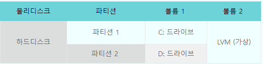
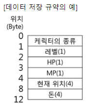

# NCA

> [!NOTE]
> 네이버 클라우드 플랫폼(NCP) NCA 자격증 강의노트 — 클라우드 개념, 서버/스토리지/네트워크/DB, 모니터링·분석·보안 상품과 실습·트러블슈팅 정리(장별 구성).

## 📌 개념

1장

Cloud 컴퓨팅

- 플랫폼 형태 제공
- 장점
    - legacy 인프라 : 정액제
    - 종량제 요금(네이버클라우드 - 쓴만큼 비용 증가)
    - CAPEX → OPEX 대체
    - 지속적인 기술 혁신 및 적용
    - 소규모일 경우 투자비용 감소
    - 빠른 프로비저닝 및 유연한 확장 (몇분만에 서버 확보 → 손쉽게 확장가능)
    - 클라우드 업체가 다양한 지원(보안, 유지보수 등)
- 클라우드 컴퓨팅 유형
    - Iaas : 서버 - 네트워크 - 스토리지
    - 컨테이너 플랫폼
    - SAS : 완제품 형태로 제공 → 어플리케이션, 솔루션을 서비스 형태로 사용
    
- 네이버 클라우드 플랫폼
    - 첨단 테크놀로지와 비즈니스 노하우 결합
    - 네트워크 망이 구축되어있음
    - 첨단 인공지능 기술 클라우드 상품 출시 → 클로바, 파파고, 네이버 지도 등등 기능 이용 가능
    - 네이버 클라우드 보안 인증으로 증명된 안정성
    - 웹 기반 관리 도구 → 네이버 클라우드 홈페이지 (친화적인 인터페이스)
    - 글로벌 메이저급 인프라 품질
    - 24시간 365일 사용자 지원 (기술지원)
    - BtoB : 기업과 기업 → 개인도 이용가능하도록 넓힘

- 클라우드 관리 콘솔
    - 대시보드 → 인프라 구성 가능
    - 직관적인 인터페이스
    - 사용자 친화적인 → UI / UX
    - 컴퓨트(서버) , 스토리지 , 네트워크 /  글로벌, 하이브리드
        - 서버 : VM , SSD, VDS, GPU서버, Bare Metal Server 등등 → OS제공 (CentOS, window, Ubuntu 등등)
    - 데이터베이스 , Analytics(분석도구 - 로그), Media(VOD,이미지 서버, 라이브 방송 플랫폼 생성 가능 등등), Game(게임팟-게임에 이용가능한 로그온 서비스, 게임 모듈들 제공)
        - 데이터베이스 : 스토리지 관리(성능포함)→ 네이버클라우드 쪽에서 관리, 데이터 사이즈 상관없이 부족할경우 자동으로 늘어남
        - 서비스, 어플리케이션 상품군 : API 제공(클로바, 파파고 등), 개발툴(dev Tools), Biz Application(기업에서 사용하는 SAAS : 회계, 결제시스템, 인사회계시스템 등등)
            - AI service : OCR, 파파고, 클로바 등 기능 이용 가능(기능을 이용하여 새로운 것을 만들 수 있음)
        - 관리, 보안 상품군 : 관리 상품 (모니터링, 로그 기록, 그룹으로 관리, 하위 계정 관리)
            - 보안 상품군 : 보안관제, 보안시스템 구축 완성 (방화벽(ACG), Safer 시리즈, Check )
        - 글로벌 리전 : 독일, 싱가포르,홍콩, 한국, 일본, 미국서부 → 전용회선 제공
        - 하이브리드 클라우드 호스팅 : legacy 인프라(기존 서버들)과 결합 가능
        - 멀티존 구성 : 데이터 센터간의 이중화 구성이 가능 (한국만 가능) → 백업 가능
        - 보안존 : CPU존(특정 규약 및 특정 규제 등을 위한 특징적인 것을 보안할 수 있도록 물리적으로 보안 가능) → 외부망과 차단 (기존 방화벽과 동일한 기능 제공)
    
    > [!NOTE]
> 퀴즈 → ZONE에 종속적이지 않은 것 : loadeBalance
    

2장

- 전가상화 : 전체를 가상화하는 방법 (하드웨어 : CPU MEM DISK 모두 가상화) → OS 동작 바로 가능 (오버헤드 주의)
- 반가상화 : VM이 직접 DEVIcE에 명령어를 날림
    - HYPER Visor (GEN, KVM, HYPER -V, VMWARE)
        - Type 1 : 하드웨어 → 하이퍼 바이저 → OS
        - Type 2 : 하드웨어 → OS → 하이퍼바이저 → OS (기존 컴퓨터에서 vm을 올리는 방법)
- 서버특징
    - CPU : vCPU 단위로 할당, 멀티코어, 스펙변경 가능(scale in or out), over commit 허용(vCPU할당 허용)
    - MEM : GB단로 할당, Over Commit 허용 안함( 온전히 다 사용 가능), 스펙변경 가능
    - HDD : OS영역이 기본 할당(50 ~100 GB 할당) , OS영역은 용량 확장이나 축소 불가, SSD타입과 HDD타입으로 구분
    - GPU : GPU단위로 할당, Pass Through 방식 제공, 최대 2장까지 제공
    - Network : 10Gbps(physical) , 1Gbps(logical), 500Mbps ~ 1Gbps제공 (Rx + Tx ⇒ 들어오고 나가는 네트워크 → 들어오는거 500Mbps 나가는거 500Mbps 합쳐서 1Gbps)
- 서버타입
    - Micro ⇒ CentOs, Ubuntu → 서버 내의 특성에 맞게만 스펙변경 가능 (windows → 일정 스펙이상만 윈도우 제공)
    - GPU는 하드웨어 스펙 변경 불가능 (자동으로 할당 됨)
    - VDS → 하이퍼바이저 위에 하나의 VM만 존재(I/O병합을 회피하기 위해서 -여러 VM을 쓰면 충돌이 일어날 수 있어서)
    - CPU intensive : 대용량 서버, 빠른 작업을 위해 제공 (고속 기능)
    - Local Disk : DISK 제공 (CentOs, Ubuntu)
    
- 마이크로 서버
    - 해외리전 제공 x (한국에서만 제공)
    - 추가 디스크 사용 불가
    - 테스트 용도로 적당
        - compact type
        - standard type
        - high memory type : 대용량 메모리가 필요한 경우
- VDS Server
    - 하이퍼 바이저 위에 VM하나만 올림 (I/O 병합을 피하기 위해서)
- Bare Metal Server
    - 하드웨어 자원 그대로 사용 (하이퍼바이저 사용x)
    - RAID5, RAID10 지원
    - core 수( ⇒8) : OracleDB가 지원하는 최대 코어수
    - core수(⇒4 ) : MSSQL 이 사용 하는 코어 수
    
- GPU Server
    - vCPU와 메모리는 고정된 개수 (추가할수는 있음)
    
- 실습 (35분)
- 리눅스 기반
    - 계정 생성 : useradd 유저이름
    - root 접근권한 설정 (/etc/ssh)
        - vi sshd_config → permitRootLogin (no)
        - ssh 데몬 재기동 : systemctl restart sshd

3장

서버 스펙 변경

- 동일한 서버 타입에 한하여 CPU, Memory 스펙 변경 가능
- 내서버이미지를 통해 다른 타입의 서버 생성 가능 (standard → micro)
    - 내서버 이미지 : 서버의 현재상태를 이미지로 생성
- 유사 서버 생성 : 선택한 서버와 동일한 스펙의 서버 생성시 사용 (서버이름만 변경가능)
    - 유사서버는 서버가 온라인 상태여도 만들 수 있음
- 스토리지 생성 : 10GB ~ 2TB , 15개까지 추가 가능 (1개는 OS용 디스크) , 용량 증설 가능(단, 용량을 줄일수는 없다)
- 반납보호 설정(네이버에서는 서버 복원을 지원하지 않음), 상세모니터링, 네트워크 모니터링 설정, 서버이름변경(실제 서버명이 변경되지는 않음)
    - win → 내컴퓨터 / linux → /etc/hostname 에서 서버이름 변경 가능 (실제 서버 이름)
- 인증키 변경 : 서버 생성시 주는 인증키(.pem) → 초기 비밀번호를 몰랐을 때 사용하는 인증방법

MAX IOPS (스토리지 추가)

- 스토리지 추가당 MAX IOPS 수가 달라짐 (1GB 당 40iops 증가)
- 최대 20000

---

(25분 -3장) =⇒ 실습해보기

스토리지 적용 (su - ) (1. 공간확보(파티션-fDISK), 2. 포맷(mkfs or ntfs), 3. 마운트(mount))

1. mkdir /disk1
2. mkdir /lvm
3. fdisk /dev/xvdb(디바이스 이름) : 파티션 작업
4. mkfs.ext4 /dev/xvdb1
5. mount /dev/xvdb /disk1 : disk1에 /dev/xvdb1 을 추가

피지컬 볼륨 : pvcreate

논리 볼륨 : vgcreate

---

4장 - 20분 실습!!

- 모니터링
    - 서버
    - 네트워크
- 내서버 이미지
    - 서버의 모든 스토리지를 이미지로 생성
    - 서버타입 변경 가능 (본래 서버타입은 가능한 것만 가능했음)
    - packer ⇒ 템플릿을 이용한 서버 이미지 생성
        - 1단계 : script 생성
        - 2단계 : 이미지 서버 생성
    - 스토리지
        - OS영역 설치
        - 10GB ~ 2TB
        - 스토리지 단위로 스냅샷 생성 (온라인 상태에서 스냅샷 생성가능)
        - 스토리지 이동
            - 스토리지 연결해제
            - 스토리지 서버 연결(서버 이동)
            - 마운트만 해주면 됨 (포맷과 파티션은 나뉘어져 있음)
            - 일반사용자의 패스워드는 변경되지 않음
    - public IP : 공인 IP 할당
        - 외부에서 서버 접속방법
            - 공인IP
            - 포트 포워딩
            - VPN
    - init script : 서버 생성시 1회에 한하여 실행 (linux → shell)
        - #!/bin/bash ⇒ script
    - ACG : 플랫폼 방화벽
        - 하나의 서버 최대 5개 ACG 가능
        - 최대 100개 룰(규칙)을 설정 가능
        - inbound 트래픽에 대해 룰 설정
        - 서버간 맵핑 정보 변경 불가능
    - 서버 이미지 빌더 (실습내용 다시 보기)
        - script 필요
        

5장

- private subnet ( 나만의 서브넷 네트워크를 할당해줌 - eth1)
    - 서버 네트워크 특징
        - 서버에 NIC는 1개만 생성 (eth0)
        - IP Alias 허용하지 않음
        - 추가 NIC 허용하지 않음
    - private subnet : 192.168. 대역사용 , 서브넷마스크 : 255.255.255.0
        - ACG가 적용안됨 (IP Alias 해당안됨 → 여러개 네트워크 생성 가능)
        - 여러개의 네트워크 설정 가능
- secure zone
    - 격리시켜야하는 것과 모니터링이 필요한 것
    - 외부 인터넷 통신 불가
    - 플랫폼 내부의 허용된 서버와의 통신만 가능 (일반 zone과의 연결은 가능 - 설정해줘야함)
    - 기존 방화벽가 동일하게 방화벽 적용 (inbound + outbound)
    - 로그 저장 기능 존재
- 실습 - 12분 (private subnet)
    - 네트워크 인터페이스 설정 (내부 서버와의 연결)
    - 관리콘솔과 서버 내부에서 동일하게 설정해줘야함 (관리 콘솔에서 한다해서 서버에 적용되는 것이 아님)
    - 명령어 - ifup (인터페이스 On)
- secure zone (실습)
    - secure zone에 서버 생성 (서버 생성시 선택)
    - rule 설정 (허용 / 차단)
    - inbound / outbound (방화벽 설정)
    - source IP / Destination IP 설정 가능

6장

- 스토리지
    - RAID 0 : 데이터 분산배치 (I/O속도 증가)
    - RAID 1 : Mirror 방식
    - RAID 5 : 데이터 분산 (패리티 이용)
    - RAID 10 : RAID 1+ RAID 0 장점 이용
    - Block Storage
        - BLock 단위로 데이터를 쪼갬
        - OS 필요
        - 용량 제한 존재
        - SSD/HDD 제공
        - 10GB ~ 2TB
        - 16개의 볼륨 가능 (디스크 추가)
        - 용량 증가 가능
    - object Stroge
        - 분산시스템
        - object 파일 단위로 저장
        - 데이터 용량 증가 가능 (대용량에 적합)
        - 파일 스토리지 (무제한 파일 저장 스토리지, 비정형데이터 안전하게 저장 가능)
        - 아마존과 호환됨
        - 권한 관리 가능
    - NAS
        - 다수의 VM 공유 가능한 네트워크 볼륨 디바이스
        - 500GB~ 1TB 생성 가능 (100GB 단위로 용량 증감 가능)
        - NFS(linux)/CIFS(window) 프로토콜 제공
        - 스냅샷 기능 제공 (데이터 복구 가능)
        - VM 사설 IP등록을 통해 타 계정 VM간 공유 사용 가능
    - Archive stroage (사용자 백업)
        - 백업 아카이빙 데이터 저장 주 목적 (읽고 쓰는데 속도가 느리다)
        - 콘솔, API(swift,s3),CLI,SDK 를 이용하여 데이터 관리 가능
        - 데이터 최소 보관기간없이 사용 가능
        - SUb Account 연동을 통한 권한 관리 기능 제공
    - Backup
        - 백업지원
        - 네이버가 백업 지원 ( → 네이버가 보장함)
        - DBMS를 골라서 네이버에 요청
        - 백업 수행 주기로 8가지 옵션 제공
        - 최대 24주까지 백업 파일 보관 가능
        - 백업결과를 일 단위 결과 리포트로 전달
    - DATA telepoter (하드웨어 장비)
        - 하드디스크  약 100TB
        - legacy 데이터를 클라우드로 데이터 이전시 사용
        - 대용량 데이터를 보안적(스토리지 암호화, DATA Erasing 등)으로 이동할 수 있도록 지원해주는 서비스
    - Block , Nas, Backup, object, Archive,DATA teleporter → 네이버 제공 스토리지
    - snapshot : 스토리지 이미지 생성 가능 (볼륨사이즈 변경 불가능)
    
    - 실습(30분) -스토리지
        - S3 Browser 이용

7장

- 네트워크 상품

- TCP /IP
    1. 데이터 layer
    2. network layer : IP 정보(ipv4, ipv6 , ARP, RARP)
    3. 전송 계층 : TCP/ UDP
    4. application 계층
- IP헤더
    - Source Address / Destination Address
- Tcp 헤더
    - Source Address / Destination Address
    - urgent pointer : 연결 상태
- CIDR (클래스 inter -Domain Routing) : 32bit, 255.255.255.255 최대값
    - 클래스 A,B,C,D,E (네트워크 클래스 구분)
- classless routing : 클래스 구분없이 비트 단위롤 주소를 부여하는 체계
- ARP : IP주소에 해당하는 MAC주소 얻음
- Well known port : 1024이하 포트 (이미 설정되어 있는 포트)
    - 해당 포트가 열려있는지 확인하는 방법 : 포트 스캐닝
- LoadBalance (여러개의 서버가 효율적으로 일할 수 있도록 밸런싱 조절해주는 역할)
    - NAT
    - DR
    - PROXY : client <> proxy <> server 전달 (client와 서비스 사이에서 연결해주는 중계기 역할)
    - 네이버클라우드 플랫폼 로드밸런스 헬스 분석(가용서버 분산 가동 해주는 역할)
    - 접속정보로 도메인 정보를 제공
    - 포트별 멀티 바인딩은 지원하지 않음
    - 18080 ~ 18095, 65131, 64000, 3389, 22 포트 사용 불가능
- DNS
    - 도메인에 대해 IP로 변환하는 서비스
    - DNS에 등록하는데 최대 15분 소요
    - 다양한 레코드 지원
    - 입력가능항목 : 레코드명, 레코드 타입, TTL, 레코드 값
- NAT Gateway
    - 외부로 나갈때 공인IP로 이용
    - 내부망은 서로 다르게 설정 되어있지만 나갈때는 동일한 공인IP이용
- GRM
    - DNS 기반으로 로드밸런싱
    - 지역별 트래픽 분산 (글로벌환경)
- CDN
    - 컨텐츠를 빠르고 안정적으로 전송
- IPsec VPN
    - 사설 네트웍 연결을 위한 망연계 VPN
    - 고객VPN 과 NCP VPN 장비간 터널링 제공
    - 최대 30Mbps 제공

---

- MEDIA
    - LIVE Station : 트랜스코딩을 통해 여러 화질로 송출
        - 스트림 상태를 볼 수 있는 모니터링 기능 제공
        - 타임머신 기능으로 놓치지 않는 라이브 방송 서비스 구현 가능
        - CDN 연동을 통해 안정적인 송출 가능
    - VOD 스트리밍 플랫폼
        - object stroage에 영상 저장 후 스트리밍 서버시스 제공
        - CDN 연동
    - VOD Transcoder
        - 대규모 동영상 파일 변환 서비스
        - 원본파일을 다양한 디바이스에 맞게 인코딩
        - LT의 저장된 영상 이용 가능
    - Image Optimizer
        - 이미지를 다양한 사이즈로 변환
        - input (image) → outpu(URL) 송출
        - 얼굴인식 기능, 워터마크 삽입 기능제공
        
- 실습 (7장 2부)
    - 로드밸런스 (1분)
    - VPN(22분)
    

8장

- 완전관리형 데이터 베이스
    - 이중화기능 (관리를 해줌)
    - 자동화된 하루 한번 백업기능 (최대 30일 보관) ⇒ 복원 기능 제공
    - Read 확장 -5대까지 확장 가능(읽기 부하 분산 가능)
    - 데이터 10GB ~ 6TB (10gb 단위)까지 자동 확장 기능 ⇒ Mysql(포트 3306)
    - 데이터 100GB ~ 2TB (10gB 단위)  ⇒MSSQL (포트 1433)
    - cluster 대신 백업 기능 제공 ⇒ redis 방식⇒ (포트 6379 )
    
    > [!NOTE]
> 클러스터 : 여러대의 컴퓨터가 연결되어 하나의 시스템을 동작하는 컴퓨터들의 집합
    
    (업사이즈만 가능(증설)) - 7개항목
    
    - secure zone 내에 생성 가능
- 설치형 데이터베이스

- master DB / Active Master DB

데이터 베이스 실습(15분)

9장

- management (관리 툴) -지표확인 툴
    - 자체 모니터링 기술 서비스 제공 → 안전성 확대
        - 무료 (모니터링) → 기본모니터링, 상세모니터가능, 이벤트 경보 설정 가능
        - 대시보드로 표현
        - 장애관리 프로세스 운용
    - Sub Account : 서버 관련 모든 할일 설정 가능
        - master account : 모든 권한이 있기에 위험함
        - sub account : 권한을 조금 낮추어 필요한 권한만 제공
            - 대시보드 제공 (그룹수 ,정책수 등등)
            - 권한 설정 가능 (policy(정책) 이용)
            - 그룹을 통해 권한 제공 및 맵핑
    - wms
        - 웹사이트 모니터링 서비스
        - virtual 테스트(기본테스트) , senario테스트 (특정페이지 로그인 및 다양한 활동으로 테스트)
        - load time , service Health , Today Event, Senario, File Requests, error log, waterfall(→ 실제 기능 수행 시간 측정) 기능 제공
        - 모니터링 주기 설정 가능
        - 알림 대상자 설정 가능
        - 필터링 기능 제공 → wms에서만 드러날 수 있는 문제를 걸러줌
        
    - network Traiffc Monitoring
        - 최근 발생한 네트워크 트래픽을 확인 가능
        - 트래픽 정보 차트 확인
        - private subnet에서 발생한 네트워크 트래픽은 측정되지 않음
        - 7개 default chart 제공(기본)
        - export 기능 제공
    - cloud activity tracer
        - 서버 이용한 사람의 history를 기록함
        - 100GB(최대) 데이터 30일간 보관 (⇒ CLA정책을 따라감)
    - resource manager
        - 리소스 관리 및 검색
        - 리소스 조회 기능 제공
    - cloud insight (통합 지표)
        - 통합적인 지표 표현
        - 유지보수 일정 관리
        - event 관리

10장

- Analytics (데이터 분석 도구)
    - CLA : 다양한 로그들을 한곳에 모아 저장 및 분석
    - RUA : 웹사이트에 접속하는 사용자의 성능정보를 수집 및 분석
    - ELSA : 애플리케이션 로그를 빠르게 저장 및 분석
    - Cloud Hadoop : 오픈소스 기반 완전 관리형 클라우드 분석 서비스 (빅데이터 분석 서비스)
    - Cloud Search : 클라우드 기반으로 검색 서비스 구현 (네이버 검색엔진 못지 않은 기능 제공)
    - Elasticsearch Service
    - Data Analytics Service : 웹사이트 방문하는 고객의 행동을 분석 (어떤것을 주로 눌르는지, 이동하는지 등등)
- CLA (cloud Log Analytics)
    - 최대 100GB , 최대 보관 30일 (꽉차면 30GB 삭제)
    - 로그 다운로드 기능 제공
    - 로그 수집 서버 설정 가능 (특정 ap(어플리케이션)의 로그를 따로 보관하고 싶을때)
    - 로그 검색기능 제공 (검색 기간은 30일이 최대)
    - 실습(11분)
- RUA (Real User Analytics)
    - 브라우저 로드 타임 (웹사이트 켜지는 시간)
    - PV , 브라우저 로드 타임순으로 랭킹되는 페이지 보여줌
    - 특정 웹사이트의 로드 시간을 보는 분석툴 (일본,미국,한국 등 에서의 차이)
- ELSA (애플리케이션 로그 분석 서비스)
    - 애플리케이션 로그정보 취합
- cloud Hadoop
    - 빅데이터를 빠르게 처리하는 분석서비스
    - 비정형 데이터를 이용 (ex_ 크롤링 정보 , 사용자에 따른 정보 등)
    - object storage 이용 가능
    - 작업자노드 → 실제 분석하는 중추 역할(cpu,mem)
- cloud search
    - 실제로 사용자가 쓴 문서를 분석해서, 연관검색어 및 관련 옵션등을 제공한다.
    - 문서를 먼저 업로드 해야함
- Elasticsearch
    - 1대의 매니저노드 + 3개이상의 데이터 노드 구성 (최소 4대 ~ 최대 10대까지 추가가능- 데이터노드)
    - Elasticsearch kibana 연계 → 데이터 시각화 가능

11장

trouble shooting

- 컴퓨팅 파워
    - IO Wait 이 발생하는 시점 → 서비스 품질 떨어지기 시작
    - SWAP을 사용하는 경우 메모리 증설해야함
    - 관련 명령어 : sar, ps, top
- 네트워크
    - 서버의 경우 전송 속도 500MB 기준으로 서버 대수 산정 (최대 500MB이기 때문에 더 많은 양이 필요할 경우 서버를 추가해야함)
    - ping → icmp 연결 되어있어야함
        - 내부망 ping은 ACG(방화벽)가 관여안하므로 연결이 됨
        - 포트 80 = http
        - ipsec VPN ⇒ private 서버 내에 들어가 있으므로 ACG 영향을 안받음
- 성능측정
    - 웹서비스
        - wms : 에러페이지가 있는지, 홈페이지 로드가 잘 되는지 확인
        - ngrinder : 웹사이트가 동접 몇명까지 버틸 수 있을까 확인 가능
        - pinpoint  : 병목확인 가능
        - AB(아파치베스) : 오픈소스
            - YUM install httpd-tools : AB 설치
    - Mysql (하드웨어 성능 측정)
        - percona TPCC
        - sysbench
        - Apache Jmeter
        
        ---
        
        (DB)
        
        - DB Dashboard
        - OS Dashboard
        - DB Logs
        - Query TimeLine : 어느 시간때에 어느 쿼리가 나왔는지 확인 가능
    - Mssql(DB)
        - DB Dashboard
        - Performance
        - DB Logs
    
    명령어 (20분~)
    
    - linux → sar (cpu사용률, 메모리, 네트워크 등 조회 가능)
    - ping : ICMP를 이용 (방화벽에 의해 막혀있는지 확인 가능)
    - nmap : 포트 스캔용 툴 (포트가 잘 살아있는지 확인)
    
    추가로 찾아본 내용
    
    - SSH
        - last -f /var/log/btmp : (ssh) 로그인 시도 횟수 확인 가능
    
    ---
    
    - netstat -an |more
        - 연결되어있는 포트 확인 가능
            - LISTENING : 포트 열려있는 상태
            - ESTABLISHED : 연결되어 있는 상태
            - TIME_WAIT : 연결은 끊어졌으나, 소켓은 열려있는 상태
            - CLOSED : 연결 종료
    
    ---
    
    - BLOCK Stroage VS Object Storage
        - Block Storage : 기존에 저장하던 방식 (HDD,SSD)과 동일
        - Object Storage : 데이터 그대로 저장하는 방식 (key값을 이용하여 색인(고유식별)작업 가능)
    
    ---
    
    - session VS cookie
        - 차이점 : 저장위치의 차이 (session : 서버에 저장, cookie : 로컬 PC에 저장)
        - 쿠키와 세션 사용 이유 : 정보 저장 (Ex_ 페이지를 넘길때마다 로그인해야함)
            - HTTP프로토콜은 이전 통신의 기록을 저장하지 않음 (=Stateless protocol)
            
            → 쿠키와 세션이 필요
            
    
    ---
    
    - Slave DB
        - MYSQL 에서 사용하는 “Master DB”, “Slave DB”
            - Master DB : 데이터 생성,삭제,수정 하는 부분 담당
            - Slave DB : 생성,삭제,수정이 이루어진 데이터를 저장함 (Data Select에서 사용- 읽기 전용)
            
            → Slave DB가 여러개가 존재하면 읽기부하가 감소됨 (빠르게 읽어올수 있기 때문에)
            
    
    ---
    
    - LVM (물리적인 디스크를 논리적으로 나누거나 통합해서 사용하기위한 것)
        - 디스크 (실제 물리적 장치) > 파티션(디스크를 논리적으로 나누거나 통합) > 볼륨
            - 디스크 : 실제 물리적 장치
            - 파티션 : 디스크를 논리적으로 나누거나 통합
            - 볼륨 : 파티션마다 한개를 가지거나, 여러 파티션을 하나로 묶거나
            
            ex)
            
            - 디스크 : HDD, SDD
            - 파티션 : 파티션1, 파티션2
            - 볼륨 : C드라이브, D드라이브, LVM(⇒ 파티션1 + 파티션2)
            
            
            
        - 파일시스템 : 파일이 저장되어야하는 규약
        
        
        
        - 클러스터 : 입출력 I/O의 효율성을 위해 데이터를 가공하는 단위
        
        
        
    
    ---
    
    - CNAME
    
    DNS : 도메인 네임 서비스, 문자의 주소 → ip주소 변환
    
    | naver.com | 192.168.0.1 |
    | --- | --- |
    | dev.plusblog.co.kr | 172.17.0.1 |
    | devlop.plusblog.co.kr | dev.plusblog.co.kr |
    
    A레코드 : 문자 주소 → ip주소 변환 
    
    CNAME : [devlop.plusblog.co.kr](http://devlop.plusblog.co.kr/) →  [dev.plusblog.co.kr](http://dev.plusblog.co.kr) / ip주소가 아닌 문자로의 주소로 변환 (별명?)
    
     
    
    - CNAME 장점
        - IP는 자주 변하기 때문에 A레코드 방식은 일일이 다 수정해줘야한다.
        - 하지만, CNAME 구조는 마지막 IP주소 변환 하는 행의 IP만 수정하면 되기 때문에 효율적임
        
    
    ---
    
    - Proxy
        - 대신해주는 역할 (중계기)
        - Client IP를 알 수있음 (→ 로그를 제대로 받을 수 있음 ( 블랙리스트 방지))
    
    ---
    
    - Cluster
        - 여러대의 컴퓨터들이 연결되어 하나의 시스템처럼 동작하는 컴퓨터들의 집합을 의미
        - 클러스터 = 노드들의 집합
        - elastic search : 분산 시스템
            - 노드 : 분산시스템에서 작동하는 하나의 엘라스틱 서치 엔진을 의미
    
    ---
    
    - 로드밸런서 좋은 참고자료
        
        [로드 밸런서(Load Balancer)란?](https://nesoy.github.io/articles/2018-06/Load-Balancer)
