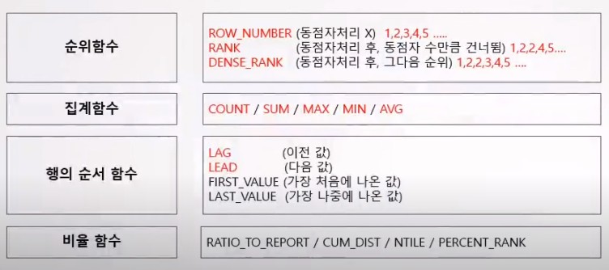
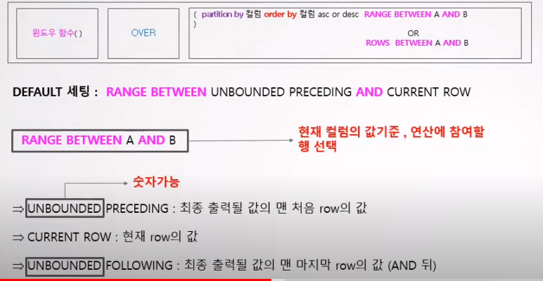
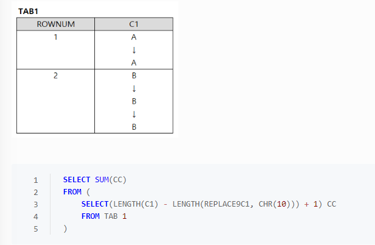
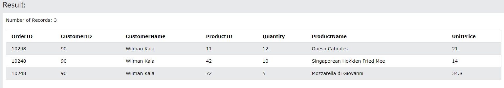
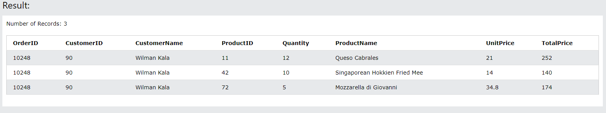

# SQLD

> [!NOTE]
> SQLD(SQL 개발자) 시험 대비 요약 — 윈도우 함수, 트랜잭션(ACID), DDL/DML/TCL, 조인, 계층형 질의 등 SQL 핵심 개념 정리.

## 📌 개념

## 윈도우 함수

---

ㅣ

- trigger → DML 정도 사용 가능

---

> [!NOTE]
> 참고)
> AS ⇒ select max(컬럼1) as 컬럼명 ⇒max(컬럼1) 필드명이 컬럼명으로 바뀜
> group by 절
> having 절 ⇒ group by의 조건절

## 테이블 생성시 주의사항

- 테이블 이름 중복 x
- 칼럼명 중복 x
- 칼럼 ⇒  (칼럼1, 칼럼2, 칼럼,3; )
- 다른테이블까지 고려하여 일관성 권고
- 데이터 유형 필수 지정
- 테이블명과 칼럼명은 문자로 시작 (예약어 사용 불가)
- 특수문자 → $,#,_ 사용 가능

### 외래키

- 테이블 생성시 설정 가능
- 한 테이블에 여러개일 수 있다
- NULL 값을 가질 수 있다
- 참조 무결성 제약 받을 수 있음

### 제약조건

- check 제약조건 : 무결성 유지
- 고유키 : null 값 가질 수 있음

## 트랜잭션의 특성 (ACID)

> [!NOTE]
> 트랜잭션
> -. 데이터베이스의 논리적 연산단위로서 밀접히 관련되어 분리될 수 없는 한 개 이상의 데이터베이스 조작
> -. 트랜잭션 변경사항 DB영구 반영 ⇒ COMMIT
> -. 변경 전으로 되돌아가기 ⇒ ROLLBACK

- 원자성 : 하나의 업무단위 모두 실행 or 모두 실행 x
- 일관성 : 데이터베이스 내용이 트랜잭션 전/후로 바뀌면 안됨
- 고립성 : 트랜잭션 수행 도중 방해 x
- 지속성 : 트랜잭션 종료 후 db에 영구적으로 반영

격리성이 낮을경우 발생할 수 있는 문제

- non-repeatable read
- phantom read
- dirty read

### 내장함수 (입력 행수에 따라 분류 가능)

- 단일행 함수
    - SELECT, WHERE, ORDER BY, UPDATE의 SET절에 사용이 가능
    - 1:M 관계에서 M 쪽에 다중행이 출력되어도 단일행 함수 사용 가능
    - 단일행함수 및 다중행 함수는 다중값을 반환할 수 있다
- 다중행 함수

## SQL 구문

> [!NOTE]
> ORACLE)
> -. NVL() ⇒ NULL일경우
> -. 공백일경우 NULL로 인식 x ⇒ “IS NULL” 로 작성해야 조회됨
> SQL-Server)
> -. ISNULL() ⇒ NULL일경우
> -. 공백일경우 NULL로 인식

- ALTER TABLE [테이블이름] ADD CONSTRAINT [제약조건이름] PRIMARY KEY [필드이름];
- CREATE INDEX [인덱스명] ON [테이블명] [해당 열이름];

### DML

- SELECT
    - select count(*) : NULL 포함 행 수
    - select count(특정컬럼명) : NULL제외 후 행 수
    - select 순서
        - FROM - WHERE - Group by - having - select - order by
- INSERT
    - INSERT INTO [테이블명][(생략가능) 컬럼1, 컬럼2, …] VALUES [값1,값2,…]
        - NOT NULL은 무조건 포함해야함
        - 데이터 크기 초과하는 값 못 넣음
- UPDATE
    - UPDATE 테이블명 SET [수정되어야 할 칼럼명] = [수정되기를 원하는 새로운 값];
- DELETE
    - DELETE FROM [테이블명] WHERE [컬럼명] = [값];
    - delete는 LOG를 남김 (TRUNCATE ⇒ LOG x , DROP ⇒ LOG x / 따라서 Auto Commit)
    
    > [!NOTE]
> DELETE : 데이터만 삭제 ( 용량 복구 x)
>     DROP : 물리적 구조 삭제
>     TRUNCATE  : 디스크 사용량 초기화
    

### DDL

> [!NOTE]
> ORACLE) 자동으로 COMMIT 됨
> SQL-SERVER ) 자동으로 COMMIT 안됨 ( ROLLBACK 가능 )

- CREATE
- ALTER
- DROP
- RENAME : 테이블 이름 변경
    - rename [테이블명] TO [새로운 테이블명];

### Option

- CASCADE : 같이 사라짐
- RESTRICT : delete → child 값에 pk 값이 없는경우에만 master 삭제 허용
- AUTOMATIC : parent에 없는 값이 child pk값에 생성시 parent에도 자동으로 생성
- DEPENDENT : 데이터생성시 parent table pk 가 없는 경우 child 데이터 입력도 허용 x
- DISTINCT : 중복 제거 (select DISTINCT [컬럼명] FROM [테이블명]
- group by : NULL 도 하나의 그룹으로 인지

### TCL

- ROLLBACK
    - SAVEPOINT 가 있을시 그 부분까지 ROLLBACK
    - 지정한 곳이 없다면 Begin Transaction 까지 ROLLBACK
    - SQL-Server) ROLLBACK TRANSACTION [지점]
    - ORACLE) ROLLBACK TO [지점]
- SAVEPOINT
    - SQL-Server) SAVE TRANSACTION [지점]’
    - ORACLE) SAVEPOINT [지점];
- COMMIT

### where 조건절

- IN ⇒ 포함 (or 로 해석하면됨)
- 연산자 우선 순위
    - 괄호
    - 부정 연산자 (NOT)
    - 비교 연산자 (=, >, <, IN(list), LIKE, ISNULL)
    - 논리 연산자 (AND, OR)
- NULL 표현
    - ⇒ IS NULL or IS NOT NULL
- 자료형이 다를 경우 오류 발생 (varchar 형을 int 형으로 출력 불가)
    - ex) select * from [테이블] where [컬럼] =1; // 컬럼값이 varchar형일 경우 select 오류

### Null 연산

- DBMS 마다 NULL 값에 대한 정렬 순서가 다를 수 있음 (oracle, SQL-server)
- NULL은 어떤 연산을 해도 NULL 리턴
- 특정 값보다 작거나 크다 표현 불가
- NULL 값과 비교연산은 FALSE를 리턴
- NULL 과 공백은 다른것 (공백은 개수가 세짐)
- 함수
    - NULLIF() : NULLIF (컬럼명, 조건)  //컬럼 내용이 조건과 같을경우 NULL로 교환 + NULL일 경우도 NULL로 교환
    - ISNULL() : ISNULL (컬럼명, 조건) ⇒ 조건에 해당하는 컬럼값 NULL로 바꾸기
- COALESCE : 최초로 NULL이 아닌값

> [!NOTE]
> 1. ISNULL
> -. (표현식1, 표현식2) : 표현식1의 결과값이 null이면 표현식2값을 출력
> 2. NULLIF
> -. (표현식1, 표현식2) : 표현식 1과 표현식2가 같으면 NULL, 같지 않으면 표현식1 리턴
> 3. COALESCE 
> -. (표현식1, 표현식2) : 임의의 개수 표현식에서 NULL이 아닌 최초의 표현식

---

### 길이구하기

- LENGTH(컬럼)
    - 해당 컬럼 길이 구하기
        - 줄바꿈도 “1”로 생각
        
        
        
        ⇒ ROWNUM(1) = 3 / ROWNUM(2) = 5
        
        ⇒ 3-2+1 , 5-3+1 ⇒ 5
        
        ⇒ CC : Alias
        
        ⇒ LENGTH(REPLACE(C1,CHR(10)) : 줄바꿈 제거 후 개수
        
        - chr(10) = \n
        - replace(문자열,바꿀 문자,변환할 문자)
            - replace(c1,chr(10), 공백)
- 날짜
    - 1/24/(60/10) ⇒ 하루 /24  ⇒ 1시간/6 ⇒ 10분
- CASE
    - 동일 기능 (다른표현)
        - CASE WHEN LOC = ‘NEW YORK’ THEN ‘EAST’
        - CASE LOC WHEN ‘NEW YORK’ THEN “EAST”
        
        > [!NOTE]
> order by (정렬)
>         -. ORDER BY (CASE WHEN ID = 999 THEN 0 ELSE ID END) // id가 999면 0으로 치환하고 아니면 원래 id 대로 정렬
>         -. order by 절에서 컬럼은 윗문장에서 나와있는게 있으면 됨
>         ⇒ select 지역 from 지역별매출 group by 연도 order by 연도 desc;
>         
>         -. 기본적인 정렬순서는 오름차순(ASC)
>         -. 날짜 값이 가장 빠른게 먼저 출력
>         -. oracle의 경우 NULL 값이 가장 큰값으로 간주됨 (SQL-Server는 반대)
        
- GROUP BY
    - 해당하는 부분 묶어주는 역할
- avg / sum
    - NULL의 값 경우 없는걸로 생각

---

### JOIN 조건

- 필요한 테이블 개수 ⇒ n-1개
- 기본키와 외래키를 통해 연결함
- 옵티마이저 → 2개씩 join
    - equi join : 같은 값을 기준으로 join

### JOIN 종류

- inner join의 on 절은 where 절과 동일한 의미

> [!NOTE]
> SELECT [A.NAME](http://A.NAME) A.TEAMNAEM B.STADIUBNAME
> FROM TEAM A, STADIUM B
> WHERE A.STADIUM_ID = B.STADIUM_ID
> 
> SELECT A.NAME A.TEAMNAME B.STADIUM
> FROM TEAM A
> INNER JOIN STADIUM ON (TEMA.STADIUM_ID = STADIUM.STADIUM_ID

- outer join
    - select * from A left outer join B
        - A는 다 표현되고 B에 해당하는 부분이 없으면 NULL로 표현
- inner join
    - SELECT * FROM 고객 A (alias)
    - INNER JOIN 추천컨텐츠 B ON (A.고객ID = B.고객ID)
    - INNER JOIN 컨텐츠 C ON (B.컨텐츠ID = C.컨텐츠ID)
    - WHERE A.고객ID = ‘000001’
    - AND B.추천대상일자 = CONVERT(VARCHAR(10), GETDATE(), 102) // 날짜만 출력
    
    #오라클 ⇒ TO_CHAR(SYSDATE, ‘YYYY.MM.DD’)
    
    > [!NOTE]
> 기본적인 튜플 구성 ⇒ 고객 테이블
>     -. 추천컨텐츠와 ,컨텐츠에서 공통적인것만 가져옴
    

---

## SQL 활용

> [!NOTE]
> join관계
> → 어디가 어디로 포함되는 관계인지 파악 필요

- SELECT, PROJECT, DIVISION
- exists : 존재하면 다 출력
- not exist : 존재하지 않으면 출력 x
- sub query
    - exists
    - select ~ where 절
    - group by 에는 사용 불가
- left join on <조건> : 왼쪽 기준 (왼쪽이 다 출력 - 안맞는 부분 NULL)
- right join on : 오른쪽 기준 (오른쪽이 다 출력 - 안맞는 부분 NULL)
- full join on : 중복제거

---

### 계층형

- level : 계층
- NODE : 데이터
- ROOT : 첫번째 NODE
- Parent Node
- Child Node
- leaf Node

- Start With 구문
    - 계층의 루트로 사용될 행을 지정
- Connect BY
    - 연결고리를 만듬
    - 서브쿼리 사용 불가
    - PRIOR 연산자로 계층구조를 표현
        - PRIOR 자식 = 부모 (순방향) ⇒ 자식을 만드는 과정
        - PRIOR 부모 = 자식 (역방향)
        
        > [!NOTE]
> 계층 예제)
>         
>         select 부서번호, 상위부서번호, 부서이름, level , LPAD(’’, 5*(LEVEL-1)) || 부서이름 AS 계층
>         
>         from dept
>         
>         start with 부서번호 = ‘A0001’
>         
>         connect by prior 상위부서번호 = 부서번호
        

- union
    - 중복제거
        - union all : 중복을 제거하지 않음
    - 두개의 select 결과값을 합쳐줌
    - 첫번째 select Alias만 적용됨
    - 위에서부터 순차적 진행
- except
    - 겹치는 것 제외
- order sibling by 컬럼명 desc
    - 동일 형제 노드끼리 내림차순 정렬
- 앵커멤버
- 재귀호출

---

## SQL 입문

### Select

- SELECT T1.OrderID, T1.CustomerID, T2.CustomerName FROM Orders T1, Customers T2 where T1.CustomerID = T2.CustomerID;
    - T1, T2 ⇒ Alias(별병)

- SELECT T1.OrderID, T1.CustomerID, T2.CustomerName, T3.ProductID, T3.Quantity, T4.ProductName, T4.Price as UnitPrice FROM Orders T1, Customers T2, OrderDetails T3, Products T4 where T1.CustomerID = T2.CustomerID And T1.OrderID = T3.OrderID AND T1.OrderID = 10248 AND T3.ProductID = T4.ProductID;

- SELECT T1.OrderID, T1.CustomerID, T2.CustomerName, T3.ProductID, T3.Quantity, T4.ProductName, T4.Price as UnitPrice, (T4.Price*T3.Quantity) as TotalPrice FROM Orders T1, Customers T2, OrderDetails T3, Products T4 where T1.CustomerID = T2.CustomerID And T1.OrderID = T3.OrderID AND T1.OrderID = 10248 AND T3.ProductID = T4.ProductID;

> [!NOTE]
> as : 필드명 (별명) ⇒ 결과에 표시
> Where AND : 조건 추가
> From + 필드명 + 별명, 필드명 + 별명, ...~ : 필드명 별명 설정 ⇒ 문법 작성시 사용

### select 절 쓰는 기술

Distinct (중복제외 리스트)

SELECT DIstinct Country FROM Customers;

Where 절 (조건절)

Select *From Customers

Where Country = ‘Mexico’;

> [!NOTE]
> AND : 둘다 만족
> OR : 하나만 만족

Order by

Select * From Customers Order by Country ; (오름차순)

Select * From Customers Order by Country DESC ; (내림차순)

MAX, MIN, AVG, SUM,COUNT

SELECT MAX(열) FROM 테이블

SELECT MIN(열) FROM 테이블

SELECT AVG(열) FROM 테이블

SELECT SUM(열) FROM 테이블

SELECT COUNT(*) FROM 테이블

Group by : 그룹 지정해서 결과 표시

---

### Insert

Insert Into Customers (CustomerID, CustomerName, ContactName, Address, City, PostalCode, Country) Values (92, "Seungwon Go", "ABC", "34-231", "Jeju-si", "60123, "South Korea");

### Update

UPDATE Customers
SET Address = "강서구", City = "서울특별시"
WHERE CustomerID =92;

### Delete

Delete From Customers WHere CustomerID=92;
