# [필기] 데이터베이스 구축

> [!NOTE]
> 정보처리기사 필기 — 데이터베이스 설계, 정규화, SQL, 트랜잭션 등 데이터베이스 구축 과목 핵심 정리.

## 📌 개념

Chapter 3. 데이터베이스 구축

---

- 데이터베이스 설계
    1. 데이터베이스 설계 시 고려사항
        - 무결성, 일관성, 회복, 보안, 효율성, 데이터베이스 확장
    2. 데이터베이스 설계 순서
        1. 요구 조건 분석 : 요구 조건 명세서 작성
        2. 개념적 설계 : 독립적인 개념 스키마 모델링, 트랜잭션 모델링
        3. 논리적 설계 : 목표 DBMS에 맞는 논리스키마 설계
        4. 물리적 설계 ; 목표 DBMS에 맞는 물리적 구조의 데이터로 변환
        5. 구현 : 목표 DBMS의 DDL로 데이터베이스 생성, 트랜잭션 작성
        
        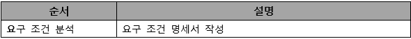
        
        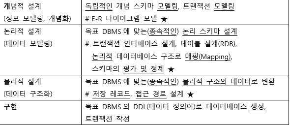
        

---

- 데이터 모델
    1. 데이터 모델의 구성 요소
        - 개체: 데이터베이스에 표현하려는 것으로 사람이 생각하는 개념이나 정보 단위 같은 현실 세계의 대상체
        - 속성 : 데이터의 가장 작은 논리적 단위로서 파일 구조상의 데이터 항목 또는 데이터 필드에 해당
        - 관계 : 개체 간의 관계 또는 속성 간의 논리적인 연결을 의미
    2. 개념적 데이터 모델
        - 현실 세계에 대한 인간의 이해를 돕기 위해 현실 세계에 대한 인식을 추상적 개념으로 표현하는 과정
    3. 논리적 데이터 모델
        - 개념적 모델링 과정에서 얻은 개념적 구조를 컴퓨터가 이해하고 처리할 수 있는 컴퓨터 세계의 환경에 맞도록 변환하는 과정
        - 단순히 데이터 모델이라고 하면 논리적 데이터 모델을 의미
    4. 데이터 모델에 표시할 요소
        - 구조 : 논리적인 개체 타입들 간의 관계, 데이터 구조 및 정적 성질을 표현
        - 연산 : 실제 데이터를 처리하는 작업에 대한 명세로, 조작하는 기본 도구
        - 제약 조건 : DB에 저장될 수 있는 실제 데이터의 논리적인 제약 조건

---

- 개체
    1. 개체의 정의 및 특징
        - 실세계에 독립적으로 존재하는 유형, 무형의 정보로 서로 연관된 몇 개의 속성으로 구성됨
        - 데이터베이스에 표현하려는 것으로 사람이 생각하는 개념이나 정보 단위 같은 현실 세계에 대상체
        - 독립적으로 존재하거나 그 자체로서도 구별 가능
        - 유일한 식별자에 의해 식별 가능
        - 다른 개체와 하나 이상의 관계가 있음
    2. 개체 선정 방법
        - 실제 업무를 담당하고 있는 담당자와 인터뷰를 함
        - 실제 업무에 사용되고 있는 장부와 전표를 이용
        - 자료 흐름도를 통해 업무 분석을 수행했을 경우 자료 흐름도의 자료 저장소를 이용함
        - BPR(Business Process Reengineering , 업무 프로세스 재설계)에 의해 업무를 재정의한 경우 관련 개체를 찾음
    3. 개체명 지정 방법
        - 일반적으로 해당 업무에서 사용하는 용어
        - 약어 사용은 되도록 제한
        - 가능한 단수 명사 사용
        - 모든 개체명은 유일해야함

---

- 속성
    1. 속성의 정의 및 특징
        - 데이터베이스를 구성하는 가장 작은 논리적 단위
        - 파일 구조상의 데이터 항목 또는 데이터 필드
        - 개체를 구성하는 항목 및 개체의 특성을 기술
        - 속성의 수를 디그리(degree) 또는 차수라고 함
        
        cf) 튜플의 수 : 카디널리티
        
    2. 속성의 특성에 따른 분류
        - 기본 속성 : 업무 분석을 통해 정의한 속성
        - 설계 속성 ; 원래 업무상 존재하지 않고 설계 과정에서 도출해낸 속성
        - 파생 속성 : 다른 속성으로부터 영향을 받아 발생하는 속성
    3. 개체 구성 방식에 따른 분류
        - 기본 키 속성 : 개체를 식별할 수 있는 속성
        - 외래 키  속성 : 다른 개체와의 관계에서 포함된 속성
        - 일반 속성 : 개체에 포함되어 있고 기본 키, 외래 키에 포함되지 않은 속성
    4. 속성명 지정 원칙
        - 해당 업무에서 사용하는 용어 지정
        - 서술형으로 지정하지 않음
        - 가급적 약어의 사용은 제한
        - 개체명은 속성명으로 사용할 수 없음
        - 개체에서 유일하게 식별 가능하도록 지정

---

- 관계
    1. 관계의 형태
        
        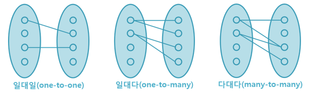
        
    2. 관계의 종류
        - 종속 관계
        - 중복 관계
        - 재귀 관계
        - 배타 관계

---

- 식별자
    - 하나의 개체 내에서 각각의 인스턴스를 유일하게 구분할 수 있는 구분자
    - 모든 개체는 한 개 이상의 식별자를 반드시 가져야 함
    
    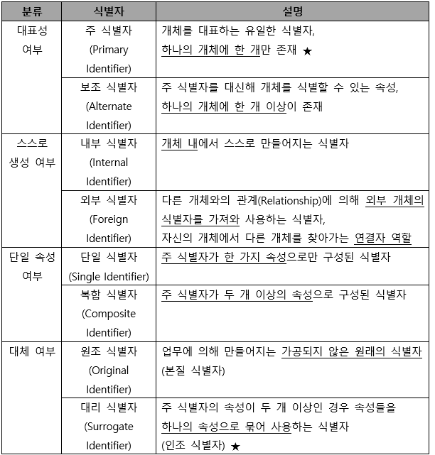
    

---

- E-R(개체 - 관계) 모델
    1. 개요
        - 개념적 데이터 모델의 가장 대표적인 것
        - 데이터를 개체, 속성, 관계로 묘사
        - 특정 DBMS를 고려한 것은 아님
        - E-R 다이어그램으로 1:1, 1:N, M:N 등의 관계 유형을 제한 없이 나타냄
    2. 피터 첸 표기법
        
        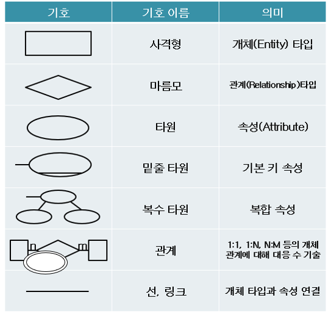
        
    3. 정보 공학 표기법
        
        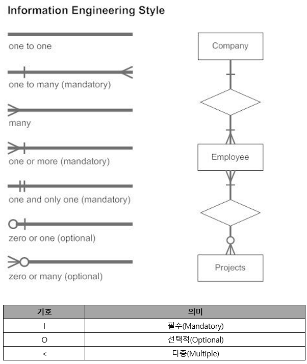
        
        - 실선은 1개를 의미, 까마귀 발은 N개를 의미
        - 원형 표시는 선택적의미로서, 관계가 있을 수도, 없을 수도 있다는 것
    4. 버커 표기법
        
        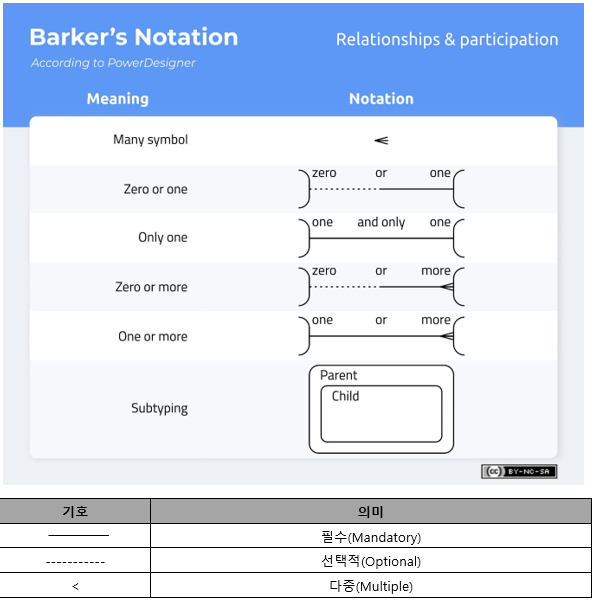
        

---

- 관계형 데이터 모델
    1. 개요
        - 2차원적인 표를 이용해 데이터 상호 관계를 정의하는 DB구조
        - 기본 키와 이를 참조하는 외래 키로 데이터 간의 관계를 표현
        - 계층 모델과 망 모델의 복잡한 구조를 단순화시킨 모델
        - 관계형 모델의 대표적인 언어는 SQL이고 1:1, 1:N, N:M 관계를 자유롭게 표현
    2. 관계형 데이터 모델의 구성
        
        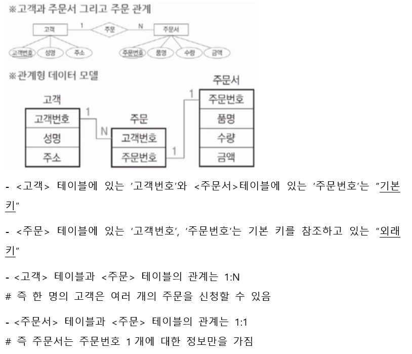
        

---

- 관계형 데이터베이스의 구조
    1. 관계형 데이터베이스의 관계 구조
        
        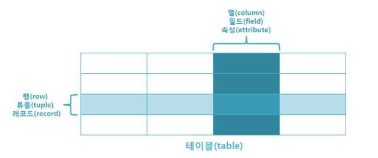
        
        - 튜플, 행 , 레코드
            - 속성의 모임으로 구성됨
            - 파일 구조상 레코드(실제 데이터)와 같은의미
            - 튜플의 수 = 카디널리티 또는 기수, 대응수
        - 속성, 열, 필드
            - 데이터베이스를 구성하는 가장 작은 논리적 단위
            - 파일 구조상의 데이터 항목 또는 데이터 필드에 해당
            - 개체의 특성을 기술
            - 속성의 수 = degree(차수)
        - 도메인
            - 하나의 속성이 가질 수 있는 같은 타입 원자값들의 집합
            
            ex) 성별 속성의 도메인은 ‘남’,’여’로 그 외의 값은 입력될 수 없음(일반적)
            
    2. 릴레이션의 특징
        - 한 릴레이션에 포함된 튜플(행) 사이에는 순서가 없음
        - 한 릴레이션에 포함된 튜플(행)들은 모두 상이함
        - 릴레이션 스키마를 구성하는 애트리뷰트(열) 사이에는 순서가 없음
        - 각 애트리뷰트는 식별을 위해 릴레이션 내에서 유일한 이름을 가짐
        - 애트리뷰트는 논리적으로 더이상 쪼갤 수 없는 원자값으로 저장함
        
        - 정리
            1. 튜플은 서로 상이한 값을 갖고, 순서가 없다
            2. 애트리뷰트는 원자 값을 가지고, 순서가 중요하지 않으며, 유일한 이름을 가짐
        

---

- 키
    - 데이터베이스에서 튜플들을 서로 구분할 수 있는 기준이 되는 속성

1. 후보키
    - 튜플을 유일하게 식별하기 위해 사용하는 속성들의 부분집합, 즉 기본키로 사용할 수 있는 속성들, 모든 릴레이션에는 반드시 하나 이상의 후보키가 존재
    - 릴레이션에 있는 모든 튜플에 대해 유일성과 최소성을 만족시켜야함
    
    - 유일성 : 하나의 키 값으로 하나의 튜플만을 유일하게 식별 가능
    - 최소성 : 모든 레코드들을 유일하게 식별하는데 꼭 필요한 속성으로만 구성

1. 기본키
    - 후보키 중에서  특별히 선정된 주키로, 중복된 값과 NULL값을 가질 수 없음
    - 후보키의 성질인 유일성과 최소성을 가지며 튜플을 식별하기 위해 반드시 필요한 키

1. 대체키
    - 후보키가 둘 이상일 때 기본키를 제외한 나머지 후보키를 의미

1. 슈퍼키
    - 한 릴레이션 내에 있는 속성들의 집합으로 구성된 키
    - 모든 튜플에 대해 유일성은 만족시키지만, 최소성은 만족시키지 못함

1. 외래키
    - 다른 릴레이션의 기본키를 참조하는 속성 또는 속성들의 집합
    - 다른 릴레이션의 기본키와 대응되 릴레이션 간의 참조 관계를 표현

---

- 무결성
    - 데이터베이스에 저장된 데이터 값과 그것이 표현하는 현실 세계의 실제 값이 일치하는 정확성을 의미
    1. 개체 무결성
        - 테이블의 기본키를 구성하는 어떤 속성(Attribute)도 널(NULL)값이나 중복값을 가질 수 없음
        - 기본키의 속성 값이 널(NULL)값이 아닌 원자 값을 갖는 성질
    
    1. 도메인 무결성
        - 릴레이션 내의 튜플들이 각 속성(Attribute)의 도메인에 지정된 값 만을 가져야함
    
    1. 참조 무결성
        - 외래키 값은 NULL이거나 참조 릴레이션의 기본키 값과 동일해야함
        - 릴레이션은 참조할 수 없는 외래키 값을 가질 수 없다는 규정
    
    1. 사용자 정의 무결성
        - 속성 값들이 사용자가 정의한 제약 조건에 만족해야함
    
    1. 데이터 무결성 강화
        - 애플리케이션 : 데이터 생성, 수정, 삭제 시 무결성 조건을 검증하는 코드를 데이터 조작하는 프로그램 내에 추가
        - 데이터베이스 트리거 : 트리거 이벤트에 무결성 조건을 실행하는 절차형SQL을 추가
        - 제약조건 : 데이터베이스에 제약 조건을 설정해 무결성을 유지

---

- 관계대수 및 관계 해석
    1. 관계대수
        - 관계형 데이터베이스에서 원하는 정보와 그 정보를 검색하기 위해서 어떻게 유도하는가를 기술하는 절차적인 언어
        - 순수관계 연산자
            
            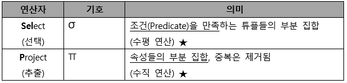
            
            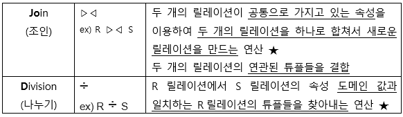
            
        - 일반집합 연산자
            
            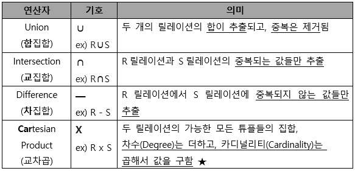
            
    2. 관계해석
        - 수학에 기반을 두고 관계 데이터베이스를 위해 제안
        - 원하는 정보가 무엇이라는 것만 정의하는 비절자적특성
        - 튜플 관계해석, 도메인 관계해석
        - 관계대수로 표현한 식은 관계해석으로 표현 가능
        
        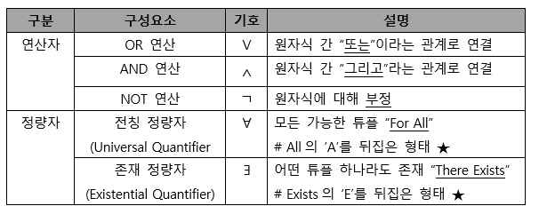
        
    3. 관계대수와 관계해석 비교

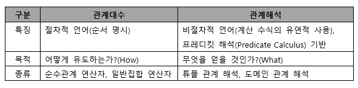

---

- 정규화 , 반정규화
    - 하나의 종속성이 하나의 릴레이션에 표현될 수 있도록 분해해가는 과정
    - 데이터베이스의 논리적 설계 단계에서 수행
    1. 정규화의 목적
        - 데이터 구조의 안정성 및 무결성 유지
        - 어떠한 릴레이션이라도 데이터베이스 내에서 표현 가능하게 만듦
        - 효과적인 검색 알고리즘 생성 가능
        - 데이터 중복을 배제해 이상의 발생 방지
        - 데이터 삽입시 릴레이션을 재구성할 필요성을 줄임
    2. 이상의 개념 및 종류
        - 정규화를 거치지 않아 데이터베이스 내에 데이터들이 불필요하게 중복
        
        - 삽입 이상 : 의도와 상관없이 원하지 않은 값들도 함께 사입
        - 삭제 이상 : 의도와는 상관없는 값들도 함께 삭제
        - 갱신 이상 : 일부 튜플의 정보만 갱신됨
    3. 정규화의 원칙
        - 정보의 무손실, 분리의 원칙, 데이터의 중복성 감소
    4. 정규화 과정
        
        
        | 정규형 | 설명 |
        | --- | --- |
        | 1NF(제1정규형) | 릴레이션에 속한 모든 도메인이 원자값만으로 되어 있는 정규형 |
        | 2NF(제2정규형) | 릴레시션 R이 1NF고, 기본키가 아닌 모든 속성이 기본키에 대해 완전 함수적 종속을 만족하는, 부분적 함수 종속을 제거한 정규형 |
        | 3NF(제3정규형) | 릴레이션 R이 2NF고, 기본키가아닌 모든 속성이 기본키에 대해 이행적 함수 종속관계를 만족하지 않는 정규형 : A→ B이고 B→C 일때 A→C를 만족하는 관계 (이행규칙) |
        | BCNF(Boyce-Codd 정규형) | 릴레이션 R에서 모든 결정자가 후보키인 정규형, 모든 BCNF가 종속성을 보존하는 것은 아님 (강한 제3정규형, 보이스/코드 정규형) |
        | 4NF(제4정규형) | 릴레이션 R에 다치 종속이 성립하는 경우 R의 모든 속성이 A에 함수적 종속 관계를 만족하는 정규형 |
        | 5NF(제5정규형) | 릴레이션 R의 모든 조인 종속이 R의 후보키를 통해서만 성립되는 정규형 |
        
        #원부이결다조
        
    
    1. 반정규화 개념
        - 시스템 성능향상, 정규화된 데이터 모델을 통합, 중복, 분리하는 과정으로 의도적으로 정규화 원칙을 위배하는 행위
        - 데이터의 일관성 및 정합성이 저하될 우려가 존재
    
    1. 반정규화 방법
        - 테이블 통합 : 1:1 관계 | 1:N 관계 | 슈퍼타입/서브타입 {테이블 통합}
        - 테이블 분할 : 수평 분할, 수직 분할 → 기본키의 유일성관리가 어려워짐
        - 중복 테이블 추가 : 집계 테이블 | 진행 테이블 | 특정 부분만을 포함하는 테이블
        - 중복 속성 추가 : 자주 사용하는 속성을 하나 더 추가하는 것

---

- 시스템 카탈로그
    1. 시스템 카탈로그의 의미
        - 모든 데이터객체에 대한 정의나 명세에 관한 정보를 유지 관리하는 시스템 테이블
        - 좁은 의미로는 카탈로그를 데이터 사전이라고 함
        - 시스템 카탈로그에 저장된 정보를 메타 데이터라고 함
    2. 카탈로그의 특징
        - SQL을 이용해 내용을 검색할 수 있음
        - Insert, Delete, Update문으로 카탈로그를 갱신할 수 없음
        - DBMS에 따라 상이한 구조를 갖음
        - 카탈로그는 DBMS가 스스로 생성하고 유지함
        - 사용자가 SQL문을 실행시켜 변화를 주면 시스템이 자동으로 갱신함
    3. 데이터 디렉터리
        - 데이터 사전에 수록된 데이터를 실제로 접근하는 데 필요한 정보를 관리 유지하는 시스템
        - 시스템만 접근할 수 있음

---

- 데이터베이스 저장공간 설계
    1. 테이블
        - 행, 열로 구성
        - 논리적 설계 단계의 개체에 대응하는 객체
    2. 클러스터 인덱스 테이블
        - 기본키나 인덱스키의 순서에 따라 데이터가 저장됨
        - 일반적인 인덱스를 사용하는 테이블에 비해 접근경로가 단축됨
    3. 파티셩닝 테이블
        - 대용량의 테이블을 작은 논리적 단위인 파티션으로 나눈 테이블
        - 파티션 키를 잘못 구성하면 성능 저하 등의 역효과
            - 레인지 파티셔닝 : 지정한 열의 값을 기준으로 분할
            - 해시 파티셔닝 : 해시함수에 따라 데이터 분할
            - 리스트 파티셔닝 : 미리 정해진 그룹핑 기준에 따라 분할
            - 컴포지트 파티셔닝 : 레인지 파티셔닝 이후 해시함수를 적용
            
            - 파티션의 장점
                - 성능 향상, 가용성 향상, 백업 가능, 경합 감소
    4. 외부 테이블
        - 데이터베이스에서 일반 테이블처럼 이용할 수 있는 외부 파일
        
        #데이터 웨어하우스, ETL
        
    5. 임시 테이블
        - 트랜잭션이나 세션별로 데이터를 저장하고 처리할 수 있는 테이블
        - 임시테이블에 저장된 데이터는 트랜잭션이 종료되면 삭제됨
        - 절차적인 처리를 위해 임시로 사용하는 테이블
    6. 칼럼
        - 가변 길이 데이터 타입 : 예상되는 최대 길이로 정의
        - 고정 길이 데이터 타입 : 최소 길이로 지정
        - 소수점 이하 자릿수 : 소수점 이하 자릿수는 반올림되어 저장
        - 고정 길이 칼럼이고 NOT NULL인 칼럼: 앞 쪽
        - 가변 길이 컬럼, NULL 값이 많을 것으로 예상되는 컬럼 : 뒤 쪽
    7. 테이블스페이스
        - 테이블이 저장되는 논리적인 영역
        - 테이블을 저장하면 논리적으로는 테이블스페이스에 저장되고, 물리적으로는 해당 테이블스페이스와 연관된 데이터 파일에 저장됨
        
        - 테이블스페이스 설계 시 고려사항
            - 업무별로 구분해 지정하고, 테이블과 인덱스는 분리해 저장함
            - 대용량 테이블은 하나의 테이블스페이스에 독립적으로 저장함
            - LOB 타입의 데이터는 독립적인 공간으로 지정함

---

- 트랜잭션
    1. 트랜잭션의 정의
        - 데이터베이스의 상태를 변환시키는 하나의 논리적 기능을 수행하기 위한 작업의 단위
        - 한꺼번에 모두 수행되어야 할 일련의 연산들
            - COMMIT : 트랜잭션 처리가 정상적으로 종료되어 수행한 변경 내용을 DB에 반영하는 명령어
            - ROLLBACK : 트랜잭션 처리가 비정상으로 종료되어 DB의 일관성이 깨졌을 때 트랜잭션이 행한 모든 변경 작업을 취소하고 이전 상태로 되돌리는 연산
            - SAVEPOINT(=CHECKPOINT): 트랜잭션 내에서 ROLLBACK 할 위치인 저장점을 지정하는 명령어, 여러개의 SAVEPOINT 지정 가능
            
            *COMMIT 과  ROLLBACK 명령어에 의해 보장 받는 트랜잭션 특징 = 원자성
            
    2. 트랜잭션의 특성
        
        
        | 원리 | 특징 |
        | --- | --- |
        | 원자성 | 트랜잭션 연산을 데이터베이스 모두에 반영되든지 아니면 전혀 반영되지 않아야함 |
        | 일관성 | 트랜잭션이 실행을 성공적으로 완료할 시 일관성 있는 데이터베이스 상태를 유지 |
        | 독립성 | 둘 이상 트랜잭션 동시 실행 시 한 개의 트랜잭션만 접근이 가능하여 간섭 불가 |
        | 영속성 | 성공적으로 완료된 트랜잭션 결과는 영구적으로 반영됨 |
    3. CRUD 매트릭스
        - Create, Read, Update, Delete, ‘C > D > U > R 의 우선순위 적용
        - 테이블, 프로세스에 C,R,U,D가 모두 없는 경우
        - 테이블에 C 또는 R이 없는 경우 (프로세스는 하나만 있어도 돌아감)

---

- 인덱스
    1. 인덱스 개념 및 선정기준, 고려사항
        - 데이터 레코드를 빠르게 접근하기 위해 <키 값, 포인터> 쌍으로 구성된 데이터 구조
        
        - 인덱스 칼럼 선정
            - 인덱스 컬럼의 분포도가 10~15% 이내인 “컬럼”
            - 가능한 한 수정이 빈번하지 않는 “컬럼”
            - ORDER BY, GROUP BY, UNION이 빈번한 “컬럼”
            - 분포도가 좋은 컬럼은 단독 인덱스로 생성
            - 인덱스들이 자주 조합되어 사용되는 컬럼은 결합 인덱스로 생성
        - 설계 시 고려사항
            - 새로 추가되는 인덱스는 기존 엑세스 경로에 영향을 미칠 수 있음
            - 지나치게 많은 인덱스는 오버헤드 발생
            - 넓은 범위 인덱스 처리 시 오히려 전체 처리보다 많은 오버헤드를 발생시킴
            - 인덱스만의 추가적인 저장 공간이 필요
            - 인덱스와 테이블 데이터의 저장 공간이 분리되도록 설계
    2. 인덱스 종류
        - 클러스터 인덱스 / 넌 클러스터 인덱스
        - 트리 기반 인덱스
        - 비트맵 인덱스
        - 함수 기반 인덱스
        - 비트맵 조인 인덱스
        - 도메인 인덱스 : 개발자가 필요한 인덱스를 직접 만들어 사용

---

- 뷰
    
     1. 뷰의 개요 및 특징
    
    - 기본 테이블로부터 유도된, 이름을 가지는 가상 테이블로 기본 테이블과 같은 형태의 구조를 사용하며, 조작도 기본 테이블과 거의 같음
    - 가상 테이블이기 때문에 물리적 구현 x → 저장장치 내에 논리적으로 존재
    - 정의된 뷰로 다른 뷰를 정의할 수 있음
    - 뷰가 정의된 기본 테이블이나 뷰를 삭제하면 그 테이블이나 뷰를 기초로 정의된 다른 뷰도 자동으로 삭제됨
    
    | 속성 | 설명 |
    | --- | --- |
    | REPLACE | 뷰가 이미 존재하는 경우 재생성 |
    | FORCE | 본 테이블의 존재 여부 관계 없이 뷰 생성 |
    | NOFORCE | 기본 테이블이 존재할 때만 뷰 생성 |
    | WITH CHECK OPTION | 서브 쿼리 내의 조건을 만족하는 행만 변경 |
    | WITH READ ONLY | 데이터 조작어(DML) 작업 불가 |
    1. 뷰의 장, 단점
        - 장점
            - 논리적 데이터 독립성 제공
            - 접근 제어를 통한 자동 보안 제공
            - 사용자 데이터 관리 용이
        - 단점
            - 독립적인 인덱스를 가질 수 없음
            - 뷰의 정의를 ALTER로 변경할 수 없음 → DROP하고 새로 CREATE해야 함
            - 뷰로 구성된 내용에 대한 삽입, 삭제, 갱신, 연산에 제약이 따름

---

- 클러스터
    1. 클러스터의 개요 및 특징
        - 데이터 저장 시 데이터 액세스 효율을 향상시키기 위해 동일한 성격의 데이터를 동일한 데이터 블록에 저장하는 물리적 저장 방법
        - 인덱스의 단점을 해결한 기법 → 분포도가 넓을수록 오히려 유리함
        - 분포도가 넓은 “테이블”의 클러스터링은 저장 공간의 절약이 가능
        - 대량의 범위를 자주 액세스 하는 경우 적용
        - 인덱스를 사용한 처리 부담이 되는 넓은 분포도에 활용
    2. 클러스터의 선정기준 및 고려사항
        - 클러스터 테이블 선정
            - 수정이 빈번하지 않는 “테이블”
            - ORDER BY, GROUP BY, UNION이 빈번한 “테이블”
            - 처리 범위가 넓어 문제가 발생하는 경우 단일 테이블 클러스터링 사용
            - 조인이 많아 문제가 발생되는 경우는 다중 테이블 클러스터링 사용
        - 설계 시 고려사항
            - 클러스터링 된 테이블은 조회 속도를 향상시켜주지만 입력, 수정, 삭제 시 성능이 저하됨
            - 대용량을 처리하는 트랜잭션은 전체 테이블을 스캔하는 일이 자주 발생하므로 클러스터링을 하지 않는 것이 좋음
            - 클러스터링 된 테이블에 클러스터 인덱스를 생성하면 접근 성능이 향상됨

---

- 분산 데이터베이스 설계
    1. 분산 데이터베이스 정의
        - 논리적으로는 하나의 시스템에 속하지만 물리적으로는 네트워크를 통해 연결된 여러 개의 컴퓨터 사이트에 분산돼 있는 데이터베이스
    2. 분산 데이터베이스의 구성 요소
        
        
        | 구성요소 | 설명 |
        | --- | --- |
        | 분산처리기 | 자체적으로 처리 능력을 가지며, 지리적으로 분산되어 있는 컴퓨터 시스템 |
        | 분산 데이터베이스 | 지리적으로 분산되어 있는 데이터 베이스. 해당 지역의 특성에 맞게 구성된 데이터 베이스 |
        | 통신 네트워크 | 분산 처리기들을 통신망으로 연결해 논리적으로 하나의 시스템처럼 작동할 수 있도록 하는 통신 네트워크 |
    3. 분산 데이터베이스의 목표
        
        
        | 목표 | 설명 |
        | --- | --- |
        | 위치 투명성 | 데이터베이스의 실제 위치를 알 필요 없이 단지 데이터베이스의 논리적인 명칭만으로 액세스 할 수 있음 |
        | 중복 투명성 | 동일 데이터가 여러 곳에 중복되어 있더라도 사용자는 마치 하나의 데이터만 존재하는 것처럼 사용하고, 시스템은 자동으로 여러 자료에 대한 작업을 수행 |
        | 병행 투명성 | 다수의 트랜잭션들이 동시에 실현 되더라도 그 트랜잭션의 결과는 영향을 받지 않음 |
        | 분할 투명성 | 하나의 논리적 릴레이션이 여러 단편으로 분할되어 각 단편의 사본이 여러 시스템에 저장되어 있음을 인식할 필요가 없음 |
        | 장애 투명성 | 트랜잭션 ,DBMS, 네트워크, 컴퓨터 장애가 발생해도 트랜잭션을 정확하게 처리하고 데이터 무결성을 보장함 |
    4. 분산 데이터베이스의 장, 단점
        
        
        | 장점 | 단점 |
        | --- | --- |
        | 지역 자치성이 높음 | DBMS가 수행할 기능이 복잡 |
        | 자료의 공유성 향상 | 데이터베이스 설계가 어려움 |
        | 분산 제어 가능 | 소프트웨어 개발 비용 증가 |
        | 시스템 성능 향상 | 처리 비용 증가 |
        | 중앙컴퓨터의 장애가 전체 시스템에 영향 X | 잠재적 오류 증가( 사이트 간의 오류 발생률 높음) → 보안의 어려움 |
        | 효용성과 융통성이 높음 |  |
        | 신뢰성 및 가용성이 높음 |  |
        | 점진적 시스템 용량 확장 용이 |  |
    5. 분산 데이터베이스 설계
        - 애플리케이션이나 사용자가 분산되어 저장된 데이터에 접근하게 하는 것을 목적
        
        - 분산 설계 방법
            - 테이블 위치 분산 : 테이블을 각기 다른 서버에 분산시켜 배치하는 방법
            - 분할 : 테이블의 데이터를 분할하여 분산시키는 것
            - 할당 : 동일한 분할을 여러 개의 서버에 생성하는 방법 (중복이 없는 할당, 있는 할당)

---

- 데이터베이스 이중화 / 서버 클러스터링
    1. 데이터베이스 이중화
        - 시스템 오류로 인한 데이터베이스 서비스 중단이나 물리적 손상 발생 시 이를 복구하기 위해 동일한 데이터베이스를 복제해 관리하는 것
    2. 데이터베이스 이중화 분류
        
        
        | 기법 | 설명 |
        | --- | --- |
        | Eager기법 | 트랜잭션 수행 중 데이터변경이 발생하면 이중화된 모든 데이터베이스에 즉시 전달해 변경내용이 즉시 적용 되도록 하는 기법 |
        | LAZY 기법 | 트랜잭션 수행이 종료되면 변경 사실을 새로운 트랜잭션에 작성해 각 데이터베이스에 전달되는 기법 |
    3. 데이터베이스 이중화 구성 방법
        - 활동-대기 : 한 DB가 활동 상태로 서비스하고 있으면, 다른 DB는 대기하고 장애 발생시 대신 서비스 실행
        - 활동 - 활동 : 두개의 DB가 서로 다른 서비스를 제공하다가 둘 중 한쪽에 DB문제가 발생하면 나머지 다른 DB가 서비스를 제공
    4. 서버 클러스터링
        - 두 대 이상의 서버를 하나의 서버처럼 운영하는 기술
        - 고가용성 클러스터링 : 하나의 서버에 장애 발생 (다른 서버가 대신 처리)
        - 병렬 처리 클러스터링 : 하나의 작업을 여러 개의 서버에 분산해 처리

---

- 데이터베이스 보안 / 스토리지
    1. 데이터베이스 보안의 개요
        - 데이터베이스 일부분 또는 전체에 대해서 권한이 없는 사용자가 액세스 하는 것을 금지하기 위해 사용되는 기술
        - 데이터베이스 사용자들은 일반적으로 서로 다른 객체에 대해 다른 접근 권리 또는 권한을 가짐
    2. 암호화
        - 암호화 과정
            - 암호화 되지 않은 평문을 정보 보호를 위해 암호문으로 바꾸는 과정
        - 복호화 과정
            - 암호문을 원래의 평문으로 바꾸는 과정
    3. 암호화 방식
        - 개인키 암호 방식 ( 비밀키 암호 방식, 대칭키) : 동일한 키로 데이터 암호화 복호화
            - 종류 : DES, AES, SEED, ARIA
        - 공개키 암호방식 (비대칭키) : 데이터 암호화(공개키 사용) , 데이터 복호화 (비밀키)
            - 종류 : RSA, DIFFIE HELLMAN 알고리즘
    4. 접근 통제
        - 데이터가 저장된 객체와 이를 사요하려는 주체 사이의 정보 흐름을 제한 하는 것
        - 접근 통제 3요소 : 접근통제 정책, 접근통제 보안 모델, 접근통제 매커니즘
            - 임의 접근 통제
                - 데이터에 접근하는 사용자의 신원에 따라 접근 권한 부여
            - 강제 접근 통제
                - 주체와 객체의 등급을 비교해 접근 권한 부여
    5. 접근 통제 정책
        
        
        | 정책 | 설명 |
        | --- | --- |
        | 신분 기반 정책(DAC) | 주체나 그룹의 신분에 근거해 객체의 접근을 제한하는 방법 |
        | 규칙 기반 정책 (MAC) | 주체가 갖는 권한에 근거해 객체의 접근을 제한하는 방법 |
        | 역할 기반 정책(RBAC) | 주체가 맡은 역할에 근거해 객체의 접근을 제한하는 방법 |
    6. 접근 통제 매커니즘
        - 접근 통제 목록(ACL) : 객체를 기준으로 특정 객체에 대해 어떤 주체가 어떤 행위를 할 수 있는지를 기록한 목록
        - 능력 리스트(CL) : 주체를 기준으로 주체에게 허가된 자원 및 권한을 기록한 목록
        - 보안 등급(Security Label), 패스워드, 암호화
    7. 접근통제 보안 모델
        - 기밀성 모델 : 군사적인 목적으로 개발된 최초의 수학적 모델, 기밀성 보장 최우선
            - 벨라파듈라 모델 : No Read Up(기밀성) , No Write Down
        - 무결성 모델 : 불법적인 정보 변경을 방지하기 위해 무결성을 기반으로 개발된 모델
            - 비바 모델 : No Read Down, No Write Up(무결성)
        - 접근 통제 모델 : 접근통제 매커니즘을 보안 모델로 발전시킨 것
            - 접근 통제 행렬 : 행=주체, 열=객체
    8. 데이터베이스 백업 종류
        - 로그파일 : 데이터베이스의 상태변화를 시간의 흐름에 따라 모두 기록한 파일
        
        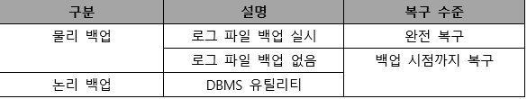
        
    9. 스토리지
        
        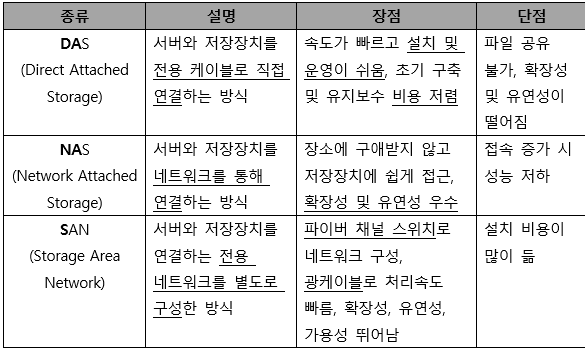
        

---

- 논리 데이터 모델의 물리 데이터 모델 변환 및 품질 검토
    1. 일반적인 변환 절차
        - 단위 개체를 테이블로 변환 → 속성을 칼럼으로 변환 → UID를 기본 키로 변환 → 관계를 외래키로 변환 → 컬럼 유형과 길이 정의 → 반정규화 수행
    2. 슈퍼타입/서브타입을 테이블로 변환
        - 슈퍼타입 기준 테이블 변환 : 서브타입을 슈퍼타입에 통합해 하나의 테이블로 만드는 것
        - 서브타입 기준 테이블 변환 : 슈퍼타입 속성들을 각각의 서브타입에 추가해 서브타입들을 개별적인 테이블로 만드는 것
        - 개별타입 기준 테이블 변환 : 슈퍼타입과 서브타입들을 각각의 개별적인 테이블로 변환하는 것
    3. 물리 데이터 모델 품질 기준
        
        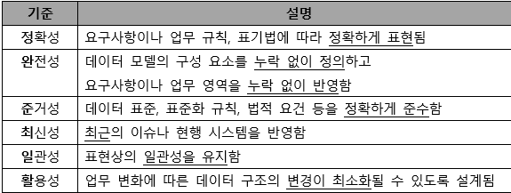
        

---

- SQL 활용 (매우 중요)
    1. SQL의 분류
        - DDL(데이터 정의어)
            - DOMAIN(도메인), SCHEMA(스키마), TABLE(테이블), VIEW(뷰), INDEX(인덱스)를 정의하거나 변경 또는 삭제할 떄 사용하는 언어
                
                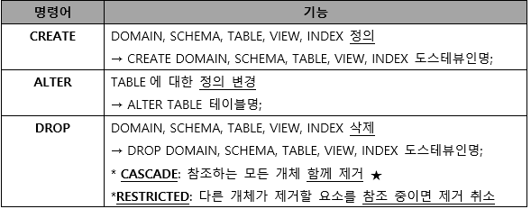
                
        - DML(데이터 조작어)
            
            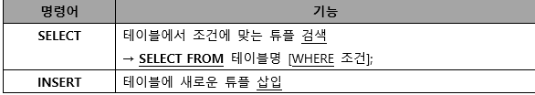
            
            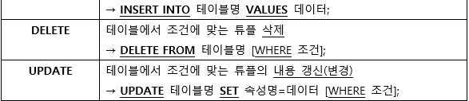
            
        - DCL(데이터 제어어)
            - 데이터의 무결성, 보안, 회복, 병행수행 제어 등을 정의하는데 사용
            - 데이터베이스 관리자(DBA)가 데이터 관리를 목적으로 사용
            
            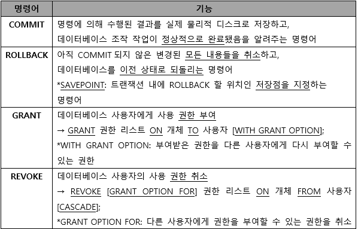
            
    2. SELECT
        - where 절 : 검색할 조건
        - order by 절 : 정렬 (ASC :오름차순, DESC : 내림차순)
        - group by 절 : 그룹화
        - having 절 : group by와 함께 사용되며, 그룹에 대한 조건 지정 (DISTINCT : 중복 튜플 제거)
        - 집계/ 그룹함수 : group by 절에 지정된 그룹별로 속성의 값을 집계할 함수를 기술함
        
        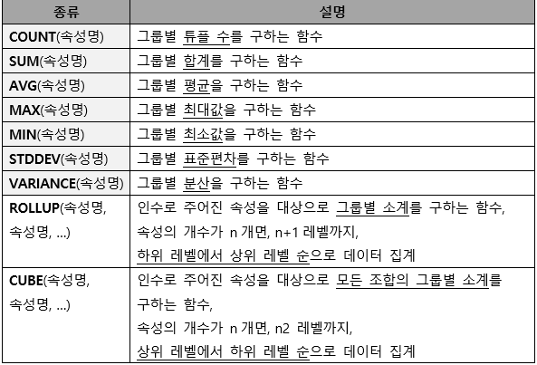
        
        - 윈도우 함수 : group by 절을 이용하지 않고 속성의 값을 집계할 함수를 기술함
            - 함수의 인수로 지정한 속성이 대상 레코드의 범위가 되는데, 이를 WINDOW라 함
            
            #Partition by : 윈도우 함수가 적용될 범위로 사용할 속성 지정
            
            - WINDOW 함수 OVER (PARTITION BY 속성 ORDER BY 속성) [AS 바꾸고 싶은 이름]
            
            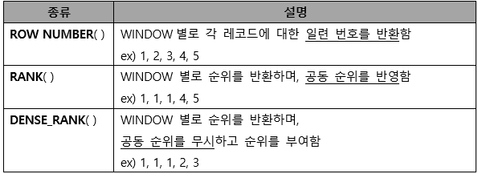
            
    3. 조인
        - 결합을 의미
        - 교집합 결과 (관계형 DB)
        - 두 릴레이션으로부터 연관된 튜플을 결합해, 하나의 새로운 릴레이션을 반환
        - 논리적 조인
        
        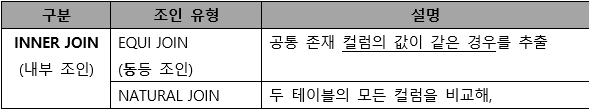
        
        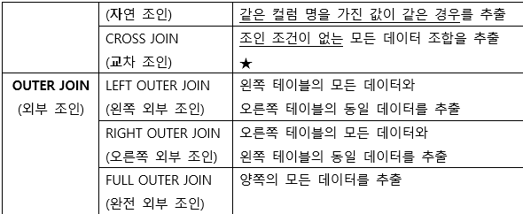
        
        - 물리적 조인
        
        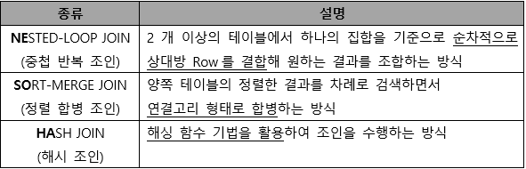
        

---

- SQL 활용
    1. 절차형 SQL
        - 연속적인 실행이나 분기, 반복 등의 제어가 가능한 SQL (ex_ C언어, JAVA 등)
        - 연속적인 작업처리 적합
        - BEGIN ~ END 형식으로 작성되는 블록 구조로 기능별 모듈화 가능
    2. 프로시저
        - 미리 저장해 놓은 SQL 작업 수행 , 처리 결과는 한 개 이상의 값 또는 반환을 안함
        - 시스템의 일일 마감 작업, 일괄 작업등에 주로 사용
        - DECLEAR(필수) : 프로시저 명칭, 선언부(변수, 인수, 데이터 타입)
        - BEGIN(필수) : 프로시저의 시작
            - CONTROL : 조건문, 반복문 사용
            - SQL : DML, DCL이 삽입 ( 데이터 관리를 위한 작업 수행 )
            - EXCEPTION : BEGIN ~ END 구문 실행시 예외처리
            - TRANSACTION : 수행된 데이터 작업들을 DB에 적용할지 말지 결정
        - END(필수) : 프로시저의 종료를 의미
        
        → CREATE [OR REPLACE] PROCEDURE 프로시저명(파라미터) [지역변수 선언]
        
        BEGIN
        
        BODY
        
        END
        
        *OR REPLACE : 기존에 프로시저 이름이 이미 존재하는 경우 기존의 프로시저를 대체할 수있음
        
        → EXECUTE,EXEC, CALL 프로시저명 / DROP PROCEDURE 프로시저명
        
    3. 트리거
        - 삽입, 갱신, 삭제 등의 이벤트가 발생할 떄마다 관련 작업을 자동 수행
        - 데이터 변경 및 무결성 유지, 로그 메시지 출력
        - DCL(데이터제어어)를 사용할 수 없음
        - 트리거 오류 있을시, 트리거가 처리하는 데이터에도 영향을 미침
        - DECLEAR(필수) : 트리거 명칭, 변수 및 상수, 데이터 타입을 정의하는 선언부
        - EVENT(필수) : 트리거가 실행되는 조건을 명시
        - BEGIN(필수) : 트리거 시작
            - CONTROL : 조건문, 반복문 사용
            - SQL : DML문이 삽입되어 데이터 관리를 위한 작업 수행
            - EXCEPTION BEGIN : BEGIN ~ END 구문 실행시 예외처리
            - END(필수) : 트리거 종료를 의미
        
        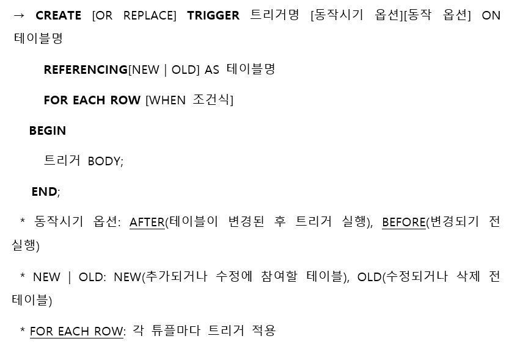
        
        - DROP TRIGGER 트리거명; : 트리거 삭제
    
    3. 사용자 정의 함수
    
    - 프로시저와 유사하게 SQL을 사용해 일련의 작업을 연속적으로 처리
    - 종료 시 예약어 RETURN을 사용해 처리결과를 단일값으로 반환
    - DML문(SELECT, INSERT, DELETE, UPDATE)의 호출에 의해 실행됨
    - RETURN을 통해 값을 반환해, 출력(OUT) 파라미터가 없음
    - INSERT, DELETE, UPDATE로 테이블 조작은 할 수 없고, SELECT로 조회만 가능
    - 프로시저를 호출해 사용 불가능
    
    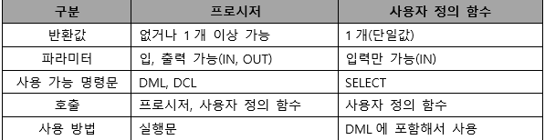
    
    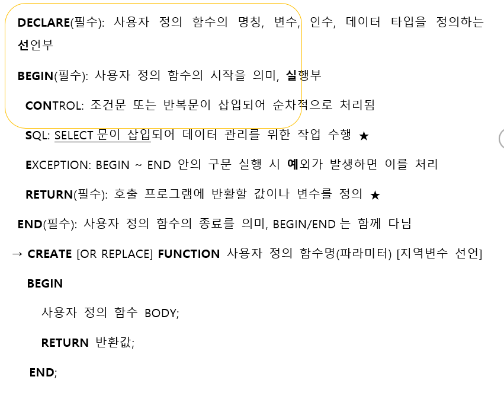
    

---

- DBMS 접속 기술
    1. 웹 응용 시스템의 구조
        - 사용자 <> 웹서버 <> WAS <> DBMS
            - 사용자가 웹서버에 접속
            - 웹서버는 WAS에게 요청
            - WAS는 트랜잭션 언어로 변환후 DBMS에 전달
            - 데이터를 다시 웹서버로 전달 후 사용자에게 도달
    2. DBMS 접속 기술
        - JDBC : JAVA언어로 다양한 종류의 데이터베이스에 접속, 접속하려는 DBMS에 대한 드라이버가 필요
        - ODBC : 데이터베이스에 접근하기 위한 표준 개방형 API로 개발 언어에 관계없이 사용 가능
    3. 정적 SQL vs 동적 SQL
        
        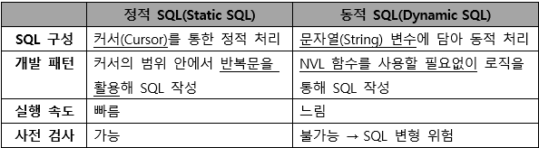
        

---

- ORM(Object-Relational Mapping)
    1. ORM의 개요
        - 객체와 관계형데이터베이스의 데이터를 연결하는 기술
        - ORM으로 생성된 가상의 객체지향 데이터베이스는 프로그래밍 코드 또는 데이터베이스와 독립적이므로 재사용 및 유지보수 용이
        - 직관적이고 간단하게 데이터 조작 가능
    2. ORM 프레임워크
        
        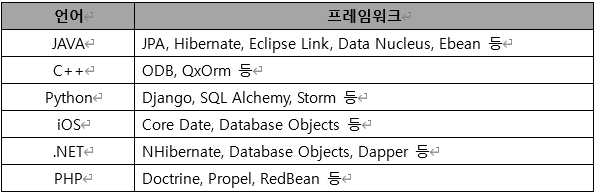
        
    3. ORM의 한계
        - 프레임워크가 자동으로 SQL을 작성
        - 객체지향적인 사용 고려와 프로젝트가 크고 복잡해질수록 적용하기 어려워짐
        - 기존의 회사는 ORM을 고려하지 않고 데이터베이스를 사용하고 있어서, ORM에 적합하게 변환하려면 많은 시간과 노력 필요
    

---

- 쿼리 성능 최적화
    - 쿼리 성능 최적화하기 전, 성능 측정 도구인 APM을 사용
    - 최적화 할 쿼리에 대해 옵티마이저가 수립한 실행 계획을 EXPLAIN 명령어를 통해 검토하고, SQL 코드와 인덱스 재구성
    - 옵티마이저 : 작성된 SQL이 가장 효율적으로 수행되도록 최적의 경로를 찾아 주는 모듈.
    
    1. RBO(Rule Based Optimizer) vs CBO(Cost Based Optimizer)
    
    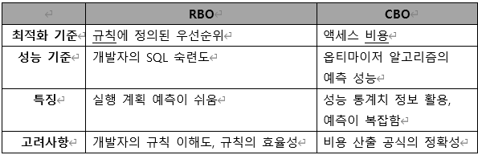
    
    1. SQL 코드 및 인덱스 재구성
        - SQL 코드 재구성
            - 서브 쿼리에 특정 데이터가 존재하는지 확인 할 때는 EXISTS 활용
            - 실행 계획이 잘못되었다고 판단되는 경우 힌트를 활용
        - 인덱스 재구성
            - 인덱스 추가 및 변경은 해당 테이블을 참조하는 다른 SQL문에도 영향을 줄 수 있으므로 신중히 결정
            - 단일 인덱스로 쓰기나 수정 없이 일기로만 사용되는 테이블의 경우 IOT 구성 고려

---

- 데이터 전환
    1. 데이터 전환의 정의
        - 데이터를 추출하여 새로 개발할 곳에 운영이 가능하도록 변환 후 적재하는 과정
        - ETL(Extraction, Transformation, Loading) : 추출, 변환, 적재 과정
        - 데이터이행, 데이터 이관이라고도 함
    2. 데이터 전환 계획서
        
        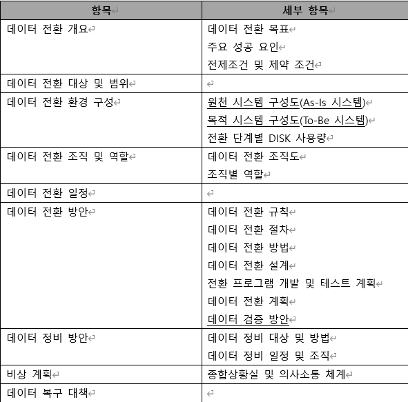
        

---

- 추가 정리, 수제비 및 기출문제
    1. Where 조건
    
    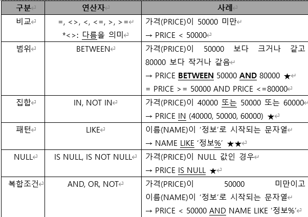
    
    1. LIKE와 같이 사용하는 와일드 문자
    
    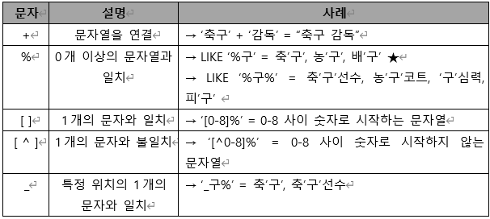
    
    1. 주석처리
    
    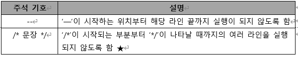
    
    1. 힌트의 사용
        - SQL 문에 사전 정보를 줘서, SQL문 실행에 빠른 결과를 가져오는 효과를 만드는 문법
        
        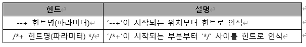
        
    2. 집합 연산자
        - 테이블을 집합 개념으로 보고, 두 테이블 연산에 집합 연산자를 사용하는 방식
        - 여러 질의 결과를 연결해 하나로 결합하는 방식을 사용
        
        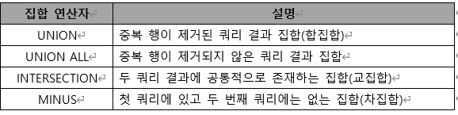
        
    3. 서브쿼리
        - SQL문 안에 포함된 또 다른 SQL문
        
        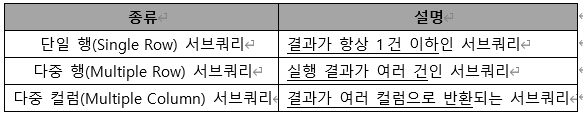
        
    4. 데이터 지역화
        - 데이터베이스의 저장 데이터를 효율적으로 이용할 수 있도록 저장하는 방법
        - 구역성라고도 함
        
        - 데이터 지역화의 종류
        
        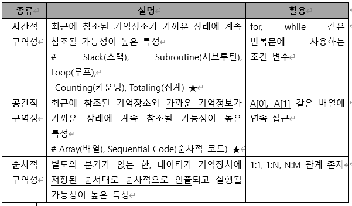
        
        - 데이터 지역화를 활용한 관리 기법
        
        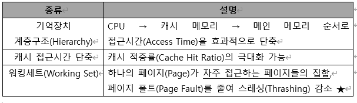
        
    5. 병행제어의 로킹 단위
        - 한번에 한 명만 사용할 수 있게 잠그는(locking) 단위
        - 로킹의 대상이 되는 객체의 크기를 로킹 단위라고함
        - 데이터베이스, 파일, 레코드 등은 로킹 단위가 될 수 있음
        - 한꺼번에 로킹할 수 있는 객체의 크기를 로킹단위라고함
        
        - 로킹 단위가 작으면
            - 로킹 오버헤드가 증가
            - 데이터베이스 공유도가 증가함 (= 병행성 수준이 높아짐)
        - 로킹 단위가 크면
            - 로킹 오버헤드가 감소
            - 데이터베이스 공유도가 감소함 (= 병행성 수준이 낮아짐)
    6. 데이터베이스 로그를 필요로하는 회복기법
        - 지역 갱신 기법
            - 트랜잭션이 부분 완료 상태에 이르기까지 발생한 모든 변경 내용을 로그 파일에만 저장, 데이터베이스에는 COMMIT이 발생할 때까지 저장 지연
            - 트랜잭션이 실패할 경우 UNDO없이 로그 단순 폐기
        - 즉시 갱신 기법
            - 트랜잭션 수행 도중 데이터를 변경하면 변경 정보를 로그파일에 저장, 모든 변경 내용 즉시 데이터베이스 반영
            - 로그 파일을 참조해 미완료된 변경에 대해 UNDO를 우선 실행, 완료된 변경에 대해 REDO 실행
            
            (UNDO는 COMMIT된 지점이 없음)
            
        - 기출문제
        
        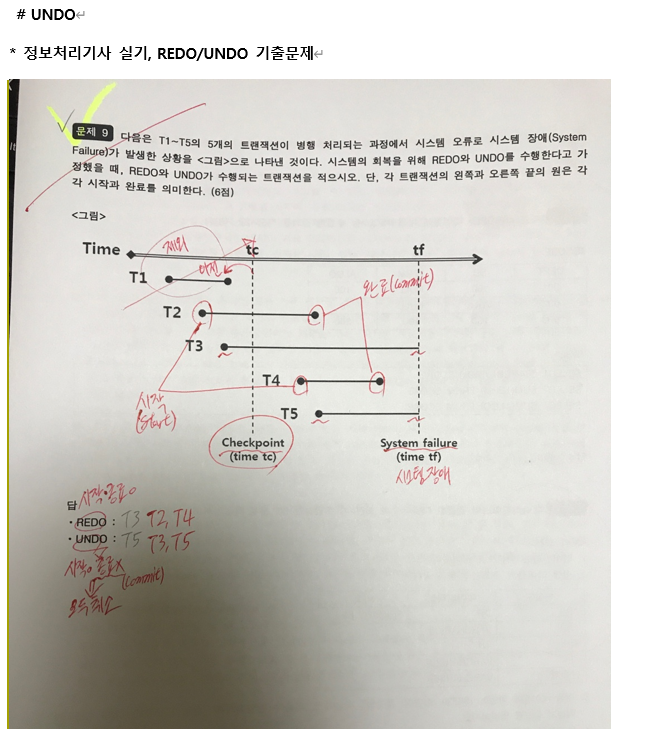
        
    
    > [!NOTE]
> 위의 문제) 시스템 장애 → undo는 있음 (CheckPoint~ 시스템장애 사이 복구 필요)
>     - 시스템 장애시까지 작업 중이던거는 UNDO로 해결
>     - CheckPoint에서 부터 시스템 장애 사이에 작업이 끝난경우 REDO로 복구
    
    > [!NOTE]
> REDO : 전 Check Point로 되돌림
>     UNDO : 작업했던 것들을 반대로 실행함으로써 복구
>     * 시스템 장애시 UNDO도 날아가기에 REDO 사용
>     
>     시스템장애시)
>     REDO → UNDO → 전 상태로 복구
    
    > [!NOTE]
> 트랜잭션 : 데이터베이스에 적용 전, 연산 작업 집합의 단위 (가장 작은)
>     → 일련의 연산 과정들을 지나고 데이터베이스에 COMMIT
