# [필기] 소프트웨어 개발

> [!NOTE]
> 정보처리기사 필기 — 자료구조, 알고리즘, 애플리케이션 테스트 등 소프트웨어 개발 과목 핵심 정리.

## 📌 개념

Chapter 2. 소프트웨어 개발

---

- 자료 구조
    1. 자료구조의 분류
        - 선형 구조
            - 배열, 스택, 큐, 데크, 선형 리스트 (연속/연결리스트
        - 비선형 구조
            - 트리, 그래프
        - 배열
            - 정적인 자료 구조로 기억장소의 추가가 어렵고, 메모리의 낭비 발생
            - 반복적인 데이터 처리 작업에 적합
            - 데이터마다 동일한 이름의 변수를 사용해 처리가 간편함
        - 스택
            - 리스트의 한쪽 끝으로만 데이터 입출입 발생
            - 후입선출(LIFO)
        - 큐
            - 리스트의 한쪽에서는 삽입 반대쪽은 삭제
            - 선입선출(FIFO)
            - 시작과 끝을 표시하는 두개의 포인터 존재
            - 운영체제의 작업 스케줄링에 사용함
        - 데크
            - 리스트의 양쪽 끝에서 삽입과 삭제작업을 할 수 있는 자료구조
        - 선형리스트
            - 연속리스트
                - 배열과 같이 연속되는 기억장소에 저장
                - 기억장소 이용효율은 밀도가 1로서 가장 좋음
                - 중간에 데이터를 삽입하기위해 연속된 빈 공간이 있어야함
                - 삽입, 삭제 시 자료의 이동이 필요함
            - 연결리스트
                - 노드의 포인터부분을 이용해 서로 연결
                - 노드의 삽입, 삭제 작업 용이
                - 연결을 위한 포인터가 필요하기 떄문에, 기억 공간의 효율은 떨어짐
                - 접근 속도가 느림
                - 중간노드연결이 끊어지면 그 다음 노드를 찾기 힘듦
            - 트리
                - 정점(노드)과 선분(가지)을 이용해 사이클을 이루지 않도록 구성한 그래프의 특수한 형태
                    - 노드 : 트리의 기본 요소, 자료 항목과 다른 항목에 대한 가지를 합친 것
                    - root 노드 : 트리의 맨위 노드
                    - degree (차수) : 각 노드에서 뻗어 나온 가지의 수
                    - 단말노드 : 자식이 없는 노드
                    - 자식 노드
                    - 부모 노드
                    - 형제 노드 : 동일한 부모를 갖는 노드
                    - 트리의 디그리 : 노드들의 디그리 중에서 가장 많은 수
        - 그래프
            - 방향 그래프
                - 정점을 연결하는 선에 방향이 있는 그래프
                - n개의 정점으로 구성된 방향 그래프의 최대 간선 수
            - 무방향 그래프
                - 방향이 없는 그래프
                - n개의 정점으로 구성된 무방향 그래프의 최대 간선 수 = n(n-1)/2
    
    ---
    
- 데이터베이스
    - 공용 데이터 : 여러 응용 시스템들이 공동으로 소유하고 유지하는 자료
    - 통합된 데이터 : 자료의 중복을 최대로 배제한 데이터의 모임
    - 운영 데이터 : 고유한 업무를 수행하는 데 없어서는 안 될 자료
    - 저장된 데이터 : 컴퓨터가 접근할 수 있는 저장 매체에 저장된 자료
- DBMS
    - 사용자와 데이터베이스 사이에서 사용자의 요구에 따라 정보를 생성해주고, 데이터베이스를 관리해주는 소프트웨어
        - 정의기능 (DDL) : 데이터베이스 이용방식, 제약 조건 등을 명시하는 기능
        - 조작기능(DML) : 사용자와 데이터베이스 사이의 인터페이스 수단 제공
        - 제어 기능(DCL) : 무결성, 보안, 권한, 병행제어

---

- 데이터 입출력
    1. SQL : 관계대수와 관계해석을 기초로 한 혼합 데이터 언어
        1. 데이터 정의어(DDL) : Domain, Schema, Table,View,Index를 정의하거나 변경 또는 삭제할 때 사용하는 언어
        2. 데이터 조작어(DML) : Select(검색), Insert(삽입), Update(갱신), Delete(삭제)로 저장된 데이터를 실질적으로 처리하는데 사용하는 언어
        3. 데이터 제어어(DCL) : 데이터의 무결성, 보안, 회복, 병행 제어 등을 정의하는데 사용되는 언어
    
    1. 데이터 접속
        - 소프트웨어의 기능 구현을 위해 프로그래밍 코드와 데이터베이스의 데이터를 연결하는 것을 말함
        - SQL Mapping : 프로그래밍 코드 내 SQL을 직접 입력해 DBMS의 데이터에 접속하는 기술
            - #JDBC, ODBC, MyBatis
        - ORM : 객체와 관계형데이터베이스(RDB)의 데이터를 연결하는 기술
            - #JPA, Hibernate, Django
    2. 트랜잭션
        - 데이터베이스의 상태를 변환시키는 하나의 논리적 기능을 수행하기 위한 작업의 단위
        - 한꺼번에 모두 수행되어야 할 일련의 연산들
            - COMMIT : 트랜잭션 처리가 정상적으로 종료되어 수행한 변경 내용을 DB에 반영하는 명령어
            - ROLLBACK : 트랜잭션 처리가 비정상적으로 종료되어 DB의 일관성이 깨졌을 때 트랜잭션이 행한 모든 변경 작업을 취소하고 이전상태로 되돌리는 연산
            - SAVEPOINT(=CHECKPOINT) : 트랜잭션 내에서 ROLLBACK할 위치인 저장점을 지정하는 명령어
            
            | 원리 | 특징 |
            | --- | --- |
            | 원자성 | 트랜잭션 연산을 데이터베이스 모두에 반영 또는 반영하지 말아야함 |
            | 일관성 | 트랜잭션이 실행을 성공적으로 완료할 시 일관성 있는 데이터베이스 상태를 유지 |
            | 독립성 | 둘 이상 트랜잭션 동시 실행 시 한 개의 트랜잭션만 접근이 가능하여 간섭 불가 |
            | 영속성 | 성공적으로 완료된 트랜잭션 결과는 영구적으로 반영함 |

---

- 절차형 SQL
    1. 개요
        - C, JAVA등 연속적인 실행이나 분기, 반복 등의 제어가 가능한 SQL
        - 일반적인 프로그래밍 언어에 비해 효율이 떨어짐
        - 연속적인 작업들으 처리하는데 적합
        - Begin ~ End 형식으로 작성되는 블록구조로 기능별 모듈화 가능
        
        ---
        
        - 프로시저  : 호출을 통해 미리 저장해 놓은 SQL 작업 수행, 처리 결과는 한 개 이상의 값 혹은 반환을 아예 하지 않음
        - 트리거 : 입력, 갱신, 삭제 등의 이벤트가 발생할 때마다 관련 작업을 자동 수행
        - 사용자 정의 함수 : 프로시저와 유사하게 SQL을 사용해 일련의 작업을 연속적으로 처리함 (종료시 예약어 RETURN을 사용해 처리결과를 단일값으로 변환)
    2. 테스트와 디버깅
        - 테스트 전 구문오류나 참조 오류의 존재 여부 확인
        - 오류 및 경고 메시지가 상세히 출력되지 않으므로 SHOW 명령어를 통해 내용 확인
        - 실제로 데이터베이스에 변화를 줄 수 있는 삽입 및 변경 관련 SQL문을 주석으로 처리하고 디버깅 수행
    3. 쿼리 성능 최적화
        - 데이터 입,출력 애플리케이션의 성능 향상을 위해 SQL코드를 최적화 하는 것
        - 성능 측정 도구 APM을 사용해 최적화할 쿼리를 선정
        - 최적화할 쿼리에 대해 옵티마이저(Optimizer)가 수립한 실행 계획을 검토하고 SQL코드와 인덱스 재구성
    
    ---
    
- 개발 지원 도구
    1. 통합 개발환경 (IDE)
        - 개발에 필요한 환경, 즉 편집기(Editor), 컴파일러(Compiler), 디버거(Debugger) 등의 다양한 툴을 하나의 인터페이스로 통합해 제공하는 것을 의미함
        
        ex) 이클립스, 비주얼스튜디오, 액스코드, 안드로이드 스튜디오
        
    2. 빌드 자동화 도구
        - 소스 코드를 소프트웨어로 변환하는 과정에 필요한 전처리, 컴파일 등의 작업들을 수행하는 소프트웨어
        - Ant
            - 아파치 소프트웨어 재단에서 개발한 소프트웨어
            - 자바 프로젝트의 공식적인 빌드 자동화 도구
            - XML기반의 빌드 스크립트를 사용
            - 정해진 규칙이나 표준이 없어 개발자가 모든 것을 정의
            - 스크립트의 재사용이 어려움
        - Maven
            - 아파치 소프트웨어 재단에서 Ant의 대안으로 개발
            - 규칙이나 표준이 존재해 예외 사항만 기록됨
            - 컴파일과 빌드를 동시에 수행할 수 있음
            - 의존성을 설정하여 라이브러리를 관리
        - Gradle
            - 기존의 Ant와 Maven을 보완해 개발된 빌드 자동화 도구
            - 안드로이드 스튜디오(안드로이드 앱 개발)의 공식 빌드 도구
            - Maven과 동일하게 의존성(Dependency) 활용
            - 그루비(Groovy) 기반의 빌드 스크립트 사용
            - 플러그인을 설정하면, JAVA, C/C++, Python 등의 언어도 빌드 가능
            - 실행할 처리 명령들을 모아 TASK로 만든 후Task 단위로 실행
            - 이전에 사용했던 Task를 재사용하거나 다른 시스템의  Task를 공유할 수 있는 빌드 캐시 기능 지원 (빌드의 속도향상)
        - Jenkins
            - JAVA 기반의 오픈 소스 형태로 가장 많이 사용되는 빌드 자동화 도구
            - 서블릿 컨테이너에서 실행되는 서버 기반 도구
            - SVN, Git 등 대부분의 형상 관리 도구와 연동 가능
            - 친숙한 Web GUI 제공
        
    3. 기타 협업 도구 (Groupware, 그룹웨어)
        - 일정 관리 도구 : 구글 캘린더
        - 프로젝트 관리 도구 : 트렐로, 지라
        - 정보 공유 및 커뮤니케이션 도구 : 슬랙, 잔디, 태스크월드
        - 디자인 도구 : 스케치, 제플린
        - 아이디어 공유 도구 : 에버노트
        - 형상 관리 도구 : 깃허브

---

- 소프트웨어 패키징
    1. 개요
        - 모듈별로 생성한 실행 파일들을 묶어 배포 설치 파일을 만드는 것
        - 개발자가 아닌 사용자를 중심으로 진행
    2. 고려사항
        - 운영체제(OS), CPU, 메모리 등에 필요한 최소 환경을 정의
        - 하드웨어와 함께 관리될 수 있도록 Managed Service형태로 제공
        - 다양한 사용자의 요구사항 반영
    3. 패키징 작업 순서
        - 기능 식별 → 모듈화 → 빌드 진행 → 사용자 환경 분석 → 패키징 및 적용 시험 → 패키징 변경 개선 → 배포
    4. 제품 소프트웨어 패키징 도구 활용 시 고려사항
        - 패키징 시 사용자에게 배포되는 SW이므로 보안 고려
        - 사용자 편의성을 위한 복잡성 및 비효율성 문제 고려
        - 제품 SW종류에 적합한 암호화 알고리즘 적용
        - 다양한 이기종 연동 고려

---

- 릴리즈 노트
    1. 릴리즈 노트의 개요
        - 개발 과정에서 정리된 릴리즈 정보를 소프트웨어의 고객과 공유하기 위한 문서
        - 개선된 작업이 있을 때마다 관련 내용을 릴리즈 노트에 담아 제공
        - 개발팀에서 제공하는 소프트웨어 사양에 대한 최종 승인을 얻은 후 문서화 되어 제공
    2. 초기 버전 작성시 고려사항
    
    | 항목 | 내용 |
    | --- | --- |
    | Header(머리말) | 릴리즈 노트 이름, 소프트웨어 이름, 릴리즈 버전, 릴리즈 날짜 등 |
    | 개요 | 소프트웨어 및 변경사항 전체에 대한 간략한 내용 |
    | 목적  | 해당 릴리즈 버전에서의 새로운 기능이나 수정된 기능의 목록과 릴리즈 노트의 목적에 대한 간략한 개요 |
    | 문제 요약 | 수정된 버그에 대한 간략한 설명 또는 릴리즈 추가 항목에 대한 요약 |
    | 재현 항목 | 버그 발견에 대한 과정 설명 |
    | 수정/개선 내용 | 버그를 수정/개선한 내용을 간단히 설명 |
    | 사용자 영향도  | 사용자가 다른 기능들을 사용하는데 있어 해당 릴리즈버전에서의 기능 변화가 미칠 수 있는 영향에 대한 설명 |
    | SW 지원 영향도  | 해당 릴리즈 버전에서의 기능 변화가 다른 응용 프로그램들을 지원하는 프로세스에 미칠 수 있는 영향에 대한 설명 |
    | 노트 | SW/HW 설치 항목, 업그레이드, 소프트웨어 문서화에 대한 참고 항목 |
    | 면책 조항 | 회사 및 소프트웨어와 관련하여 참조할 사항 (프리웨어, 불법복제금지 등) |
    | 연락처 | 사용자 지원 및 문의 응대를 위한 연락처 정보 |
    1. 추가 버전 작성 시 고려사항
        - 베타 버전이 출시되거나 긴급한 버그 수정, 업그레이드와 같은 자체 기능향상, 사용자 요청등의 특수한 상황일 경우 추가 작성
        - 버그 번호를 포함한 모든 수정된 내용을 담아 릴리즈노트작성
        - 추가나 수정된 경우 자체기능향상과는 다른 별도의 릴리즈 버전 출시하고 릴리즈노트 작성
    2. 릴리즈 노트작성 순서
        - 모듈 식별 → 릴리즈 정보확인 → 릴리즈 노트 개요 작성 → 영향도 체크 → 정식 릴리즈 노트 작성 → 추가 개선 항목 식별

---

- 디지털 저작권 관리
    - 디지털 콘텐츠 관리 및 보호 기술
    1. 디지털 저작권 관리(DRM)의 흐름
        - 콘텐츠 제공자
        - 콘텐츠 분배자 : 암호화된 콘텐츠 유통
        - 콘텐츠 소비자 : 콘텐츠를 구매해서 사용
        - 패키저 : 콘텐츠를 메타데이터와 함께 배포 가능한 형태로 묶어 암호화하는 프로그램
        - 클리어링 하우스 : 저작권에 대한 사용 권한, 라이선스 발급, 결제관리 등을 수행하는 곳
        - DRM 컨트롤러 : 배포된 콘텐츠의 이용권한을 통제하는 프로그램
        - 보안 컨테이너 : 전자적 보안 장치
    2. 디지털 저작권 관리의 기술 요소
        - 암호화
        - 키 관리
        - 식별 기술
        - 저작권 표현 : 라이선스의 내용 표현
        - 암호화 파일 생성
        - 정책 관리
        - 크랙 방지
        - 인증

---

- 형상관리
    1. 소프트웨어 패키징의 형상관리
        - 형상 관리는 개발과정에서 소프트웨어의 변경 사항을 관리
        - 소프트웨어 개발의 전 단계에 적용되는 활동
    2. 형상관리의 중요성
        - 소프트웨어 변경사항을 체계적으로 추적하고 통제가능
        - 소프트웨어의 무절제한 변경 방지
        - 진행정도 확인 가능
    3. 형상관리 기능
        - 형상 식별 : 계층 구조로 구분하여 수정 및 추적 용이
        - 형상 통제 : 식별된 형상 항목에 대한 변경 요구를 검토
        - 형상 감사 : 기준선의 무결성을 평가
        - 형상 기록 : 작업의 결과를 기록, 관리하고 보고서를 작성하는 작업
        - 버전 제어
    4. 소프트웨어 버전 등록 관련 주요 용어
        - 저장소 : 변경 내역에 대한 정보들이 저장
        - 가져오기 : 버전관리가 되고 있지 않은 저장소에 처음으로 파일을 복사하는 것
        - 체크아웃 : 프로그램을 수정하기 위해 저장소에서 파일을 받아오는 것
        - 체크인 : 체크아웃한 프로그램을 수정한 후 새로운 버전으로 갱신하는 것
        - 커밋 : 이전에 갱신된 내용이 있는 경우에는 충돌을 알리고 diff도구를 이용해 수정한 후, 갱신을 완료함
        - 동기화 : 저장소에 있는 최신 버전으로 자신의 작업 공간을 동기화 하는 것
    5. 소프트웨어 버전 등록 과정
        - 가져오기 → 인출 → 예치(Commit) → 동기화 → 차이 (diff)
    6. 제품 소프트웨어의 형상 관리 역할
        - 배포본 관리에 유용
        - 사용자의 소스 수정 제한
        - 동일한 프로젝트 여러개발자 동시 개발 가능

---

- 버전관리 도구
    1. 공유 폴더 방식
        - 버전관리 자료가 로컬 컴퓨터의 공유 폴더에 저장되어 관리
        - 개발자들은 개발이 완료된 파일을 공유폴더에 복사
        - 담당자는 공유 폴더의 파일을 자기 PC에 복사해 컴파일
        - 파일의 변경 사항을 데이터베이스에 기록하며 관리
    2. 클라이언트/서버 방식
        - 버전 관리 자료가 중앙 시스템에 저장되어 관리되는 방식
        - 서버의 자료를 개발자별로 자신의 PC(클라이언트)로 복사해 작업한 후 변경된 내용을 중앙 서버에 반영
        - 모든 버전 관리는 서버에서 수행됨
        - 하나의 파일을 서로 다른 개발자가 작업할 경우 경고 메세지 출력
        - 서버에 문제가 생기면 다른 개발자와의 협업 및 버전 관리 작업은 중단
    3. 분산 저장소 방식
        - 하나의 원격 저장소와 분산된 개발자 PC의 로컬 저장소에 함께 저장되어 관리되는 방식
        - 개발자별로 원격 저장소의 자료를 자신의 로컬 저장소로 복사해 작업한 후 변경된 내용을 로컬 저장소에서 우선 반영한 다음 이를 원격 저장소에 반영
        - 원격 저장소에 문제가 생겨도 로컬 저장소의 자료를 이용해 작업 가능
        - 로컬 저장소에서 작업을 수행할 수 있어 처리속도가 빠름
    4. SVN
        - CVS를 개선한 것
        - 모든 개발 작업은 trunk디렉터리에서 작업, 추가작업은 branches 디렉토리에서 작업을 완료한 후 trunk와 결합
        - 서버 ⇒ UNIX 사용
        - 오픈 소스 무료사용 가능
        - CVS의 단점이었던 파일이나 디렉터리의 이름 변경, 이동 등이 가능
    5. GIT(깃)
        - 원격 저장소는 여러 사람들이 협업을 위해 버전을 공동 관리하는 곳
            - 자신의 버전 관리 내역 반영 = PUSH
            - 다른 개발자의 변경 내용을 가져옴 = fetch
            - 로컬 저장소는 개발자들이 본인의 실제 개발을 진행하는 장소
            - 브렌치(branch)를 이용하면 다양한 형태의 기능 테스팅 가능
            - 스냅샷으로 저장(파일의 변화)
            - 스냅샷은 이전 스냅샷의 포인터를 가지므로 버전의 흐름 파악 가능
            
            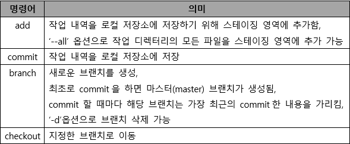
            
            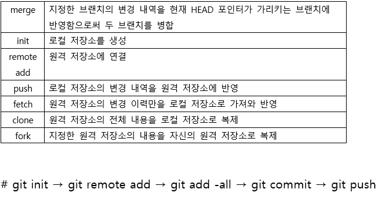
            

---

- 애플리케이션 테스트
    1. 애플리케이션 테스트의 개념
        - 결합 찾기
        - 고객 needs 확인
        - 정상인지 검증
    2. 애플리케이션 테스트의 기본 원리
        - 테스팅은 결함이 존재함을 밝히는 것 = 결함이 없다고 증명할 수 는 없음
        - 완벽한 테스팅은 불가능 : 무한 경로, 무한 입력 값으로 인한 어려움
        - 개발 초기에 테스팅 시작 : 결함 예방
        - 결함 집중 : 파레토방식, 20%모듈에서 80% 결함 발견
        - 살충제 패러독스 : 동일한 테스트 케이스에 의한 반복적 테스트는 새로운 버그를 찾지 못함
        - 테스팅은 정황에 의존적 : 소프트웨어 성격에 맞게 실시
        - 오류-부재의 궤변 : 요구사항을 충족하지 못하면 결함이 없어도 품질이 높다 할 수 없음

---

- 애플리케이션 테스트의 분류
    1. 정적 테스트 : 프로그램 실행 x , 소스코드를 대상으로 분석하는 테스트
        - 워크스루, 인스펙션, 코드검사
    2. 동적 테스트 : 프로그램 실행 o, 오류찾는 테스트
        - 화이트박스 테스트, 블랙박스 테스트
        - 테스트 = 검사
    3. 테스트 기반에 따른 테스트
        - 명세 기반 테스트 : 명세를 빠짐없이 테스트 케이스로 만들어 구현하고 있는지 확인하는 테스트
        - 구조 기반 테스트 : 소프트웨어  내부의 논리 흐름에 따라 테스트진행하는지
        - 경험 기반 테스트 : 테스트의 경험을 기반으로 수행하는 테스트
    4. 시각에 따른 테스트
        - 검증 테스트 : 개발자 시각에서 테스트
            - 단위테스트, 통합테스트,시스템테스트
        - 확인 테스트 : 사용자 시각에서 테스트
            - 인수테스트 (알파테스트, 베타테스트)
    5. 목적에 따른 테스트
    
    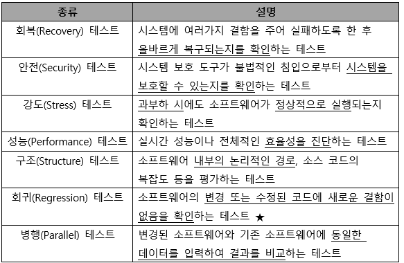
    
    1. 테스트 커버리지 유형
    
    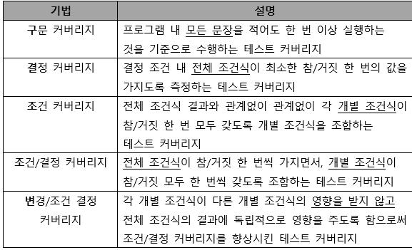
    
    다중 조건 커버리지 : 결정 조건 내 모든 개발 조건식의 모든 가능한 조합을 100% 보장하는 테스트 커버리지
    

---

- 화이트박스 테스트, 블랙박스 테스트
    1. 화이트박스 테스트
        - 모듈 안의 내용을 직접 볼 수 있음
        - 내부의 논리적인 모든 경로를 테스트
        - 소스코드 모든 문장을 한번이상 수행
        - 논리적 경로 점검
        
        ---
        
        - 기초 경로 검사 : 실행 경로의 기초를 정의하는 지침
        - 제어 구조 검사
            - 조건 검사 : 논리적 조건을 테스트하는 기법
            - 루프검사 : 반복 구조에 맞춰 테스트하는 기법
            - 데이터흐름검사 : 프로그램에서 변수의 정의와 변수 사용의 위치에 초점을 맞춤
    2. 블랙박스
        - 모듈 안에서 어떤일이 일어나는지 모름
        - 특정 기능을 알기 위해 각 기능이 완전히 작동되는 것을 입증하는 테스트(= 기능테스트)
        - 소프트웨어 인터페이스에서 실시되는 테스트
        
        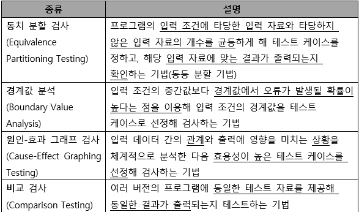
        
        오류예측검사 : 다른 블랙박스 테스트 기법으로 찾아낼 수 없는 오류를 찾아내는 일련의 봉충적 검사기법 (데이터 확인 검사)
        
    
    ---
    
    - 개발 단계에 따른 애플리케이션 테스트
        1. 단위 테스트
            - 코딩 직후 최소 단위인 모듈이나 컴포넌트에 초점을 맞춤
            - 사용자의 요구사항을 기반으로 한 기능성테스트를 최우선으로 수행
            - 명세 기반 테스트, 구조 기반 테스트 중 주로 구조 기반 테스트를 시행
        2. 통합 테스트
            - 단위 테스트가 완료된 모듈들을 결합하여 하나의 시스템으로 완성시키는 과정에서 테스트를 의미
            - 모듈 간 또는 통합된 컴포넌트 간의 상호작용 오류 검사
        3. 시스템 테스트
            - 개발된 소프트웨어가 컴퓨터 시스템에서 완벽하게 수행되는가를 점검
            - 실제 사용 환경과 유사하게 만든 테스트 환경에서 테스트를 수행해야함
            - 기능적 요구사항, 비기능적 요구사항 구분
        4. 인수 테스트
            - 개발한 소프트웨어가 사용자의 요구사항을 충족하는지에 중점을 두는 테스트
            
            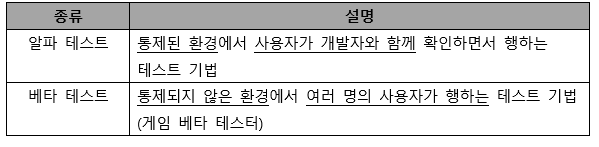
            
    
    ---
    
    - 통합 테스트
        1. 상향식 통합 테스트
            - 하위 모듈 → 상위 모듈 방향 테스트
            - 하나의 주요 제어 모듈과 종속 모듈의 그룹인 클러스터 필요
            - 하위 모듈들을 클러스터로 결합 → 더미 모듈인 드라이버 작성 → 클러스터 단위로 테스트 → 테스트 완료 후 클러스터는 프로그램 구조의 상위로 이동해 결합하고 드라이버는 실제 모듈로 대체됨
        2. 하향식 통합 테스트
            - 상위 모듈 → 하위 모듈 방향 테스트
            - 깊이 우선 통합법, 넓이 우선 통합법 사용
            - 테스트 초기부터 사용자에게 시스템 구조를 보여줄 수 있음
            - 상위 모듈에서는 테스트 케이스 사용하기 힘듬
            - 주요 제어 모듈의 종속 모듈은 스텁(stub)으로 대체 → 깊이 우선 또는 넓이 우선 등의 통합 방식에 따라 하위 모듈인 스텁(stub)들이 한 번에 하나씩 실제 모듈로 교체됨 → 모듈이 통합될때마다 테스트 실시 → 새로운 오류가 발생하지 않음을 보증하기 위해 회귀 테스트 실시
        3. 혼합식 통합 테스트
            - 샌드위치식 통합 테스트 방법
            - 하위 수준에서는 상향식 통합, 상위 수준에는 하향식 통합
    
    ---
    
    - 테스트케이스 | 테스트 시나리오 | 테스트 오라클 | 테스트 하네스
        1. 테스트 케이스
            - 설계된 입력 값, 실행 조건, 기대 결과 등으로 구성된 테스트 항목에 대한 명세서
            - 명세 기반 테스트의 설계 산출물에 해당
            - 미리 설계해두면 테스트 오류 방지 및 테스트 수행 자원의 낭비를 줄일 수 있음
        2. 테스트 시나리오
            - 테스트 케이스를 적용하는 순서에 따라 여러 개의 테스트 케이스들을 묶은 집합
            - 작성시 유의사항
                - 항목별 여러개의 시나리오로 분리해 작성
                - 사용자의 요구사항과 설계 문서 등을 토대로 작성
        3. 테스트 오라클
            - 사전에 정의된 참 값을 대입해 테스트 결과가 올바른지 판단
            - 특징
                - 제한된 검증 : 모든 테스트 케이스에 적용 불가
                - 수학적 기법 : 값을 수학적 기법을 이용해 구할 수 있음
                - 자동화 기능 : 프로그램 실행, 결과 비교, 커버리지 측정 등을 자동화할 수 있음
                
                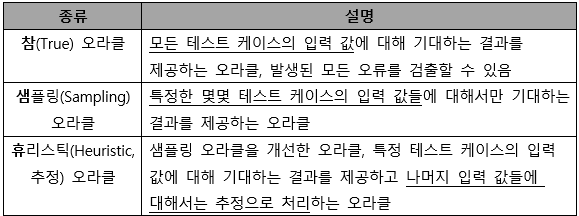
                
                일관성 검사 오라클 : 변경이 있을 때 테스트 케이스 수행 전과 후의 값이 동일한지 확인
                
        4. 테스트 하네스
            
            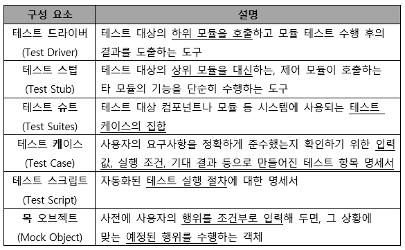
            
    
    ---
    
    - 결함 관리
        1. 결함 상태 추적
            - 결함 분포 : 결함 수 측정
            - 결함 추세 : 테스트 진행 시간에 따른 결함 수
            - 결함 에이징 : 특정 결함 상태로 지속되는 시간 측정
        2. 결함 추적 순서
            - 결함 등록
            - 결함 검토
            - 결함 할당
            - 결함 수정
            - 결함 조치보류
            - 결함 종류
            - 결함 해제
        3. 결함 심각도, 결함 우선순위
            - 결함 심각도 : 치명적 > 주요 > 보통 > 경미 > 단순
            - 결함 우선순위 :  치명적 > 높음 > 보통 > 낮음
    
    ---
    
    - 애플리케이션 성능 분석
        1. 애플리케이션 성능
            - 처리량, 응답시간, 경과 시간, 자원 사용률
        2. 애플리케이션 성능 저하 원인 분석
            - DB에 필요 이상의 많은 데이터를 요청한 경우
            - 커넥션 풀의 크기를 너무 작거나 크게 설정한 경우
            - 미들웨어를 사용한 후 종료하지 않아 연결 누수가 발생한 경우
            - 대용량 파일을 업로드하거나 다운로드할 경우
        3. 소스코드 최적화
            - 클린 코드 작성 원칙 (가독성, 단순성, 의존성 배제, 중복성 최소화, 추상화)
        4. 소스 코드 품질분석 도구의 종류
            - 정적 분석 도구 : pmd, cppcheck, checkstyle, sonarQube, ccm, cobertuna
            - 동적 분석 도구 : Avalanche, Valgrind
    
    ---
    
    - 모듈 연계
        1. EAI
            - 기업 내 각종 애플리케이션 및 플랫폼 간의 정보 전달, 연계, 통합 등 상호 연동이 가능하게 해주는 솔루션
            - point to point : 변경 및 재사용이 어려움
            - hub & spoke : 단일 접점인 허브(hub) 시스템을 통해 데이터를 전송하는 중앙 집중형 방식, 확장 및 유지보수가 용이하지만 허브 장애 발생시 시스템 전체에 영향을 미침
            - 메시지 버스(ESB방식) : 어플리케이션 사이에 미들웨어를 둬 처리하는 방식
            - 하이브리드 : Hub & Spoke와 Message Bus의 혼합 방식, 데이터 병목 현상을 최소화할 수 있음
        2. ESB
            - 애플리케이션 간 연계, 데이터 변환, 웹 서비스 지원 등 표준 기반의 인터페이스를 제공하는 솔루션
            - 애플리케이션 통합 측면에서 EAI 와 유사하지만 애플리케이션 보다는 서비스 중심의 통합을 지향
            - 결합도를 약하게 유지함
            - 관리 및 보안 유지가 쉽고, 높은 수준의 품질 지원이 가능
    
    ---
    
    - 인터페이스 구현 | 인터페이스 보안
        1. 데이터 통신을 이용한 인터페이스 구현
            - 인터페이스 형식을 맞춘 데이터 포맷을 전송하고 수신 측에서 파싱해 해석함
            - 주로 JSON 이나 XML 형식의 데이터 포맷 이용하여 인터페이스 구현
            - JSON : 속성 - 값 쌍으로 이뤄진 데이터 객체를 전달 (텍스트를 사용하는 개방형 표준 포맷)
            - XML : 특수한 목적을 갖는 마크업 언어를 만드는데 사용되는 다목적 마크업언어, 웹 페이지의 기본 형식인 HTML의 문법이 각 웹브라우저에서 상호 호환적이지 못하다는 문제와 SGML의 복잡함을 해결하기 위해 개발됨
        2. 인터페이스 엔티티를 이용한 인터페이스 구현
            - 인터페이스가 필요한 시스템 사이에 별도의 인터페이스 엔티티로 상호 연계하는 방식
            - 일반적으로 인터페이스 테이블을 엔티티로 활용
            - 송, 수신 인터페이스 테이블의 구조는 상황에 따라 서로 다르게 설계할 수도 있음
        3. 인터페이스 보안 기능 적용
            - 네트워크, 애플리케이션, 데이터베이스 영역
            - 스니핑 : 네트워크의 중간에서 남의 패킷 정보를 도청하는 해킹
            - 소프트웨어 개발 보안 (시큐어 코딩) : 소프트웨어 개발 과정에서 지켜야하는 일련의 보안 활동
            
            ex) 입력 데이터 검증 표현, 보안 기능, 시간 및 상태, 에러 처리, 코드 오류, 캡슐화,API오용
            
    
    ---
    
    - 인터페이스 구현 검증 | 인터페이스 오류 확인
        1. 인터페이스 구현 검증 도구
            
            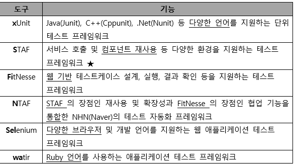
            
        2. 인터페이스 오류 발생 즉시 확인
            - 오류 메시지 알람 표시, 오류 SMS발송, 오류 내역 이메일 발송
        3. 인터페이스 오류 발생 주기적인 확인
            - 인터페이스 오류 로그확인 : 오류를 별도의 로그파일로 생성해 보관함, 자세한 오류 원인 및 내역을 확인할 수 있음
            - 인터페이스 오류 테이블 확인 : 오류사항의 확인이 쉬워 관리가 용이, 오류사항이 구체적이지 않음
            - 인터페이스 감시(APM) 도구 사용 : 스카우터나 제니퍼 등의 인터페이스 감시도구를 사용해 주기적 확인
    
    ---
    
    - 추가 정리, 수제비 및 기출문제
        1. 트리 순회 방법
            - 전위 순회 : root → left → right
            - 중위 순회 : left → root → right
            - 후위 순회 : left → right → root
        
        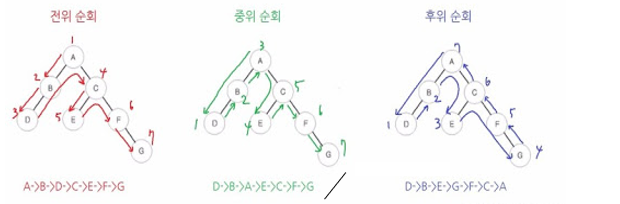
        
        1. 이진트리
            - degree(차수) 가 2 이하인 노드로 구성 → 자식이 둘 이하로 구성된 트리
            
            > [!NOTE]
> 노드의 차수 : 자식의 개수
            
            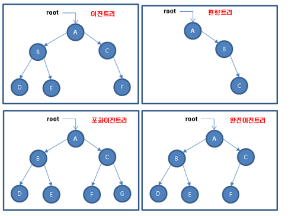
            
        2. 논리 데이터 저장소
            - 개체 : 관리할 대상이 되는 실체
            - 속성 : 관리할 정보의 구체적 항목
            - 관계 : 개체 간의 대응 관계
        3. 물리데이터 저장소 (논리데이터 저장 → 물리데이터 저장)
            - 단위 개체 → 테이블
            - 속성 → 칼럼
            - UID(Unique Identifier) → 기본키
            - 관계 → 외래키
            - 컬럼 유형과 길이 정의
            - 반정규화 수행
        4. 인덱스
            - 분포도 10~15% 이내
                - 인덱스 컬럼 선정
                    - 수정이 빈번하지 않아야함
                    - ORDER BY, GROUP BY, UNION이 빈번한 컬럼
                    - 분포도가 좋은 컬럼은 단독 인덱스로 생성
                    - 인덱스들이 자주 조합되어 사용되는 컬럼은 결합 인덱스로 생성
                - 설계 시 고려사항
                    - 지나치게 많은 인덱스는 오버헤드의 원인
                    - 인덱스만의 추가적인 저장 공간 필요
        5. 뷰
            - 기본 테이블로부터 유도된, 이름을 가진 가상 테이블
            - 가상 테이블 → 물리적으로 구현되어있지 않음 (사용자에게는 보임)
            - 데이터의 논리적 독립성을 제공
            - 정의된 뷰로 다른 뷰를 정의 가능
            - 뷰가 정의된 기본 테이블이나 뷰를 삭제하면 연관된 다른 뷰도 자동 삭제
            
            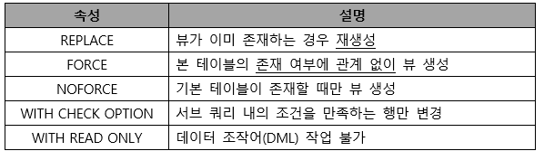
            
            - 장점
                - 논리적 데이터 독립성 제공
                - 접근 제어를 통한 자동 보안 제공
            - 단점
                - 독립적인 인덱스를 가질 수 없음
                - 뷰의 정으리를 ALTER로 변경 불가 → DROP하고 새로 CREATE해야함
                - 뷰로 구성된 내용에 대한 삽입, 삭제, 갱신, 연산에 제약이 따름
        6. 클러스터
            - 인덱스의 단점을 해결한 기법 (분포도가 넓을수록 오히려 유리함)
            - 분포도가 넓은 “테이블”의 클러스터링은 저장 공간의 절약이 가능
            - 대량의 범위를 자주 액세스(조회)하는 경우 적용
            - 인덱스를 사용한 처리 부담이 되는 넓은 분포도에 활용
            
            - 클러스터 테이블 선정
                - 수정이 빈번하지않은 테이블
                - ORDER BY,GROUP BY, UNION이 빈번한 “테이블”
                - 처리 범위가 넓어 문제가 발생하는 경우 단일 테이블 클러스터링
                - 조인이 많아 문제가 발생되는 경우는 다중 테이블 클러스터링
            - 설계 시 고려사항
                - 조회 속도를 향상시켜주지만 입력, 수정, 삭제 시 성능이 저하됨(부하가 증가)
        7. 파티션
            - 레인지 파티셔닝 : 지정한 열의 값을 기준으로 분할 (ex_일별, 월별, 분기별 등)
            - 해시 파티셔닝 : 해시 함수에 따라 데이터 분할
            - 리스트 파티셔닝 : 미리 정해진 그룹핑 기준에 따라 분할
            - 컴포지트 파티셔닝 : 범위분할 이후 해시 함수를 적용
            
            - 파티션의 장점
                - 성능향상, 가용성 향상, 백업 가능, 경합 감소
        8. PL/SQL
            - 선언부 : 실행부에서 참조할 모든 변수, 상수, CURSOR,EXCEPTION 선언
            - 실행부 : BEGIN과 END사이에 기술되는 영역
            - 예외부 : 실행부에서 에러가 발생했을 떄 문장 기술
            
            - 장점
                - 컴파일 불필요, 모듈화 기능, 절차적 언어 사용, 에러 처리
            - PL/SQL 을 활용한 저장형 객체 활용
                - 저장된 프로시저, 저장된 함수, 저장된 패키지, 트리거(Trigger)
            
        9. 단위 모듈 구현의 원리
            - 정보 은닉 : 어렵거나 변경 가능성이 있는 모듈을 타 모듈로부터 은폐
            - 분할과 정복 : 복잡한 문제를 분해, 모듈 단위로 문제 해결
            - 데이터 추상화 : 각 모듈 자료 구조를 액세스하고 수정하는 함수내에 자료 구조의 표현 내역을 은폐
            - 모듈 독립성 : 낮은 결합도와 높은 응집도
        10. 알고리즘 설계 기법
            - 분할과 정복 : 문제를 나눌 수 없을 떄까지 나누고, 각각을 풀면서 다시 병합해 문제의 답을 얻는 알고리즘
            - 동적계획법 : 어떤 문제를 풀기 위해 그 문제를 더 작은 문제의 연장선으로 생각하고, 과거의 해를 활용하는 방식의 알고리즘
            - 탐욕법 : 결정을 해야 할 떄마다 그 순간에 가장 좋다고 생각되는 것을 해답으로 선택하는 알고리즘
            - 백트래킹 : 어떤 노드의 유망성 점검 후, 유망하지 않으면 그 노드의 부모 노드로 되돌아간 후 다른 자손 노드를 검색하는 알고리즘
        11. 시간 복잡도에 따른 알고리즘
            
            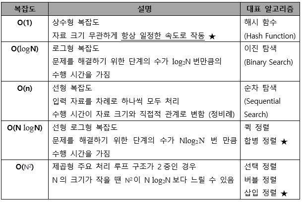
            
        12. SW 품질 측정을 위해 개발자 관점에서 고려해야 할 항목
            - 정확성, 무결성, 사용성 / 간결성x
        
        1. 인터페이스 보안을 위해 네트워크 영역에 적용되는 솔루션
            - IPSEC, SSL, S-HTTP
        
        1. 외계인 코드
            - 아주 오래되거나 참고문서 또는 개발자가 없어 유지보수 작업이 어려운 프로그램
        
        1. IPC
            - 모듈 간 통신 방식을 구현하기 위해 사용되는 대표적인 프로그래밍 인터페이스 집합으로, 복수의 프로세스를 수행하며 이뤄지는 프로세스 간 통신까지 구현 가능
            
            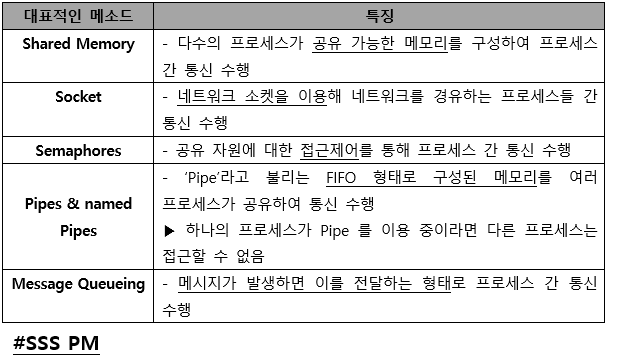
            
        
        1. 정렬 알고리즘
            - 선택 정렬 : 1번째 수와 남은 수 중 가장 작은수와 교체 → 2번째 수와 남은 수 중 가장 작은수와 교체 ….
            - 버블 정렬 : 1번째 와 2번째 비교 후 작은게 앞으로 → 2번째와 3번쨰 비교 후 작은게 앞으로 → …
            - 삽입 정렬 : 1번째와 2번째 비교 작은게 앞으로 → 3번쨰는 1번째,2번째 비교 후 작은것과 교체 → 4번째는 1번째,2번째,3번쨰 비교후 작은것과 교체
        
        1. McCabe의 cyclomatic 수
            
            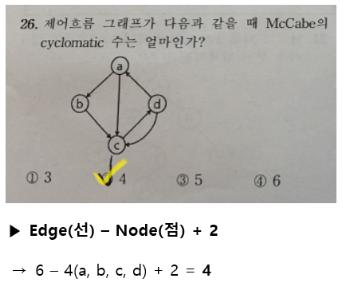
            
        2. 소프트웨어 재공학이 소프트웨어 재개발에 비해 갖는 장점
            - 위험부담 감소, 비용 절감, 시스템 명세의 오류 억제, 개발시간의 감소
        3. 소프트웨어 품질 목표
            - 소프트웨어 운영특성
                - 정확성, 신뢰성, 효율성, 무결성, 사용 용이성
            - 소프트웨어 변경 수용 능력
                - 유지보수성, 유연성, 시험 역량
            - 소프트웨어 적용 능력
                - 이식성 ,재사용성, 상호 운용성
            
        4. 소프트웨어 공학의 기본 원칙
            - 품질 높은 소프트웨어 상품 개발
            - 지속적인 검증 시행
            - 결과에 대한 명확한 기록 유지
        
        1. AJAX
            - JavaScript를 사용한 비동기 통신 기술로 클라이언트와 서버 간에 XML데이터를 주고 받는 기술
        2. 외부 스키마, 내부 스키마, 개념 스키마
            - 외부 스키마 : 사용자 관점에서 보여주는 데이터베이스 구조
            - 내부 스키마 : 저장장치의 입장에서 데이터베이스 전체가 저장되는 방법을 명세
            - 개념 스키마 : 전체 사용자 또는 모든 응용 시스템이 필요한 데이터베이스 구조로 조직 전체의 데이터베이스로 단 하나만 존재함
        
        1. 해싱함수
            
            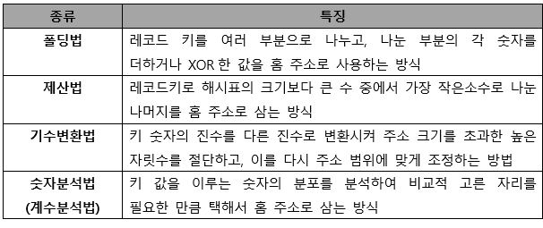
