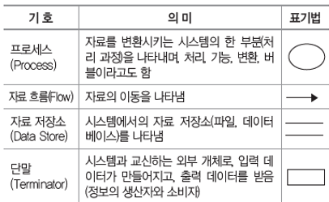
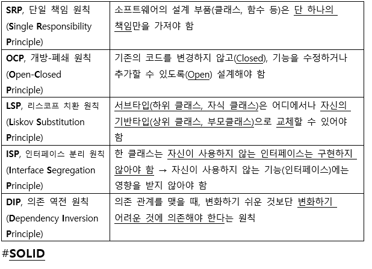

# [필기] 소프트웨어 설계

> [!NOTE]
> 정보처리기사 필기 — 소프트웨어 생명주기, 요구사항, UML, 디자인 패턴 등 소프트웨어 설계 과목 핵심 정리.

## 📌 개념

- 소프트웨어 생명 주기(SLDC)
    - 폭포수 모형
        - 고전적인 방법
        - 선형 순차적 모형
        - 요구사항의 변경 용이하지 않음
        - 요구분석 → 설계 → 구현 → 테스트 → 유지보수 (분설구테유)
    
    - 프로토타입 모형
        - 프로토타입(견본)
        - 요구사항의 변경 용이
    
    - 나선형 모형
        - 위험 분석 기능 추가된 모형
        - 점진적 개발 과정 반복
        - 계획 및 정의 → 위험 분석 → 공학적 개발 → 고객 평가 (계위개고)
    
    - 애자일 모형
        - 변화에 유연하게 대응
        - 고객과의 소통에 중심점을 둠
        - 일정한 주기를 반복하면서 개발 진행
    
    > [!NOTE]
> 애자일 모형 예시)
>     1. XP (eXtreme Programming)
>     2. 스크럼(scrum)
>     3. 칸반(kanban)
>     4. 크리스탈(Crystal)
>     5. 린(LEAN)
>     + 기능 중심 개발
    
    - 스크럼 기법
        - 스프린트 (2~4주 기간으로 진행) // 스프린트 : 반복적인 개발 주기
        - 단계별로 개발 진행
            1. 제품 책임자(PO) : 요구사항이 담긴 백로그(Backlog)를 작설하는 주체
            2. 스크럼 마스터(SM) : 일일 스크럼 회의 주관, 팀원 통제 목표x
            3. 개발팀(DT) : 제품 책임자와 스크럼 마스터를 제외한 모든 팀원
            4. 스크럼 개발 프로세스 : 스프린트 계획 → 스프린트 → 일일 스크럼 → 스크럼 검토 → 스프린트 회고 ( 계스일검회 )
    - XP 기법
        - XP 핵심 가치 : 용기, 단순성, 의사소통, 피드백, 존중 (용단의피존)
        - XP의 기본원리
            - 전체팀, 소규모 릴리즈, 테스트 주도 개발(TDD), 계속적인 통합, 공동소유권, 짝 프로그래밍, 디자인개선/리펙토링 (전소테 계공짝디)

---

- 개발 기술 환경 파악
    - 운영체제
        - 하드웨어가 아닌 소프트웨어
        - 고려사항 : 가용성, 성능, 기술 지원, 구축 비용, 주변 기기 (가성기구주)
    
    - 미들웨어
        - 운영체제와 응용 프로그램 사이에서 추가적인 서비스를 제공하는 소프트웨어
    
    - 데이터베이스 관리 시스템(DBMS)
        - 사용자와 DB사이의 정보를 생성하고 DB를 관리하는 소프트웨어
        - DB 구성, 접근 방법, 유지관리에 모든 책임을 짐
        - Oracle, MySql, SQLite, MongoDB, Redis 등등
        - 고려사항 : 가용성, 성능, 기술지원, 구축 비용, 상호 호환성 (가성기구호)
    
    - 웹 어플리케이션 서버(WAS)
        - 동적인 컨텐츠 처리하기 위한 미들웨어
        
        > [!NOTE]
> - 웹서버 : 정적인 컨텐츠 처리
        
        - 데이터 접근, 세션 관리, 트랜잭션 관리 등을 위한 라이브러리 제공
        - Ex) Tomcat, JEUS, WebLogic, JBoss, Jetty, Resin 등
        - 고려사항 : 가용성, 성능, 기술 지원, 구축 비용 (가성기구)
    
    - 오픈 소스
        - 소스 코드를 무료로 사용할 수 있게 공개한 것
        - 고려사항 : 라이선스의 종류, 사용자 수, 기술의 지속 가능성 (라사지)
        
    
    ---
    
- 요구사항 정의
    - 기능 요구사항 : 기능, 입력, 출력, 저장, 수행
    - 비기능 요구사항 : 성능, 품질, 제약사항, 호환성, 보안
    - 요구사항 개발 프로세스 : 도출/추출 → 분석 → 명세 → 확인/검증 (도분명확 / 추분명검)
    - 요구사항 분석 기법 : 요구사항 분류, 개념 모델링(UML), 요구사항 할당, 요구사항 협상, 정형 분석 (분개할협정)
    - 요구사항 확인 기법 : 요구사항 검토, 프로토타이핑, 모델 검증, 인수테스트 (검프모인)
        - 테스트 : 알파 / 베타 테스트
    
- UML
    - 사물, 관계, 다이어그램
    - 사물 : 구조, 행동, 그룹, 주해
    - 관계 : 연관(—), 집합(◇), 포함(◆),일반화(-▷),의존(--▷),실체화(--▷)
    
- 구조적, 정적 다이어그램
    - 클래스, 객체, 컴포넌트, 배치, 복합체 구조, 패키지
    - 컴포넌트, 배치 다이어그램은 구현 단계에서 사용되는 다이어그램임

> [!NOTE]
> 컴포넌트
> -. 인터페이스 같이 소프트웨어의 재사용성을 높이기 위해 공통된 모듈을 뜻함 (ex_ 콘센트같은 역할 및 기준 제공)

- 행위, 동적 다이어그램
    - 유스케이스, 시퀀스, 커뮤니케이션, 상태, 활동, 상호작용 개요, 타이밍

- 사용자 인터페이스
    - UI 구분
        - CLI : 텍스트형태 (Command Line Interface)
        - GUI : 그래픽 환경
        - NUI : 사용자의 말이나 행동으로 처리(자연어)
        - VUI : 사람의 음성으로 처리
        - OUI : 모든 사물과 사용자간의 상호작용을 위한 인터페이스
    
    - UI 기본 원칙
        - 직관성 : 누구나 쉽게 이해 및 사용
        - 유효성 : 목적을 정확하게 완벽하게
        - 학습성 : 누구나 쉽게 배우고 익힘
        - 유연성 : 요구사항을 최대한 수용
        
- 웹의 3요소
    - 웹 표준, 웹 접근성, 웹 호환성

- UI 설계 도구
    - 와이어프레임 : 레이아웃을 협의하거나 공유하기 위해 사용
    - 스토리보드 : 작업 지침서, 작업 산출물
    - 프로토타입 : 테스트가 가능한 동적인 모형
    - 목업 : 실제 화면과 유사한 정적인 모형
    - 유스케이스 : 사용자 측면 요구사항을 다이어그램 형식으로 묘사
- UI 프로토타입
    - 장점 : 사용자 이해 향상, 개발 시간 단축, 사전오류발견 가능
    - 단점 : 반복적인 개선으로 인해 작업시간 증가 및 자원소모
    - ex_ 페이퍼 프로토타입, 디지털 프로토타입, HTML/CSS
- UI 시나리오 문서 요건
    - 이해성, 완전성, 일관성, 가독성, 수정 용이성, 추적 용이성
- 기타
    - HCI : 사람과 컴퓨터의 상호작용 연구
    - UX : 사용자가 서비스를 이용하면서 느끼고 생각하는 총체적인 경험

---

- 품질 요구사항
    1. 국제 제품 품질 표준
    - ISO/IEC 9126 : 기능성, 신뢰성, 사용성, 효율성, 유지보수성, 이식성
    - ISO/IEC 14598 : 반복성, 재현성, 공정성, 객관성
    - ISO/IEC 9001
    - ISO/IEC 12207 : 기본프로세스, 조직프로세스, 지원프로세스
    - ISO/IEC 15504(SPICE) : 불완전 → 수행 → 관리 → 확립 → 예측 → 최적화
    - CMMI : 조직차원의 성숙도를 평가하는 단계별 표현과 프로세스 영역별 능력도를 평가하는 연속적 표현이 있음

---

- 소프트웨어 아키텍처
    - 기능적 요구상항을 구현하는 방법을 찾는 해결 과정
    1. 모듈화 
        1. 모듈의 크기가 크다 → 모듈 개수가 적다 → 모듈 하나의 개발 비용이 큼
        2. 모듈 크기가 작다 → 모듈 개수가 많다 → 모듈을 통합하는데 비용이 많이듬
    2. 추상화
        1. 전체적이고 포괄적인 개념을 설계한 후 차례로 세분화
        2. 과정 추상화 : 과정 정의x, 전반적인 흐름만 파악
        3. 데이터 추상화 : 데이터의 세부적인 속성이나 용도를 정의하지 않고, 데이터 구조를 대표하는 표현으로 대체
        4. 제어 추상화 : 이벤트 발생의 정확한 절차나 방법을 정의하지 않고, 대표하는 표현으로 대체
    3. 단계적 분해
        1. 추상화 반복 → 세분화
    4. 정보은닉
        1. 정보가 감추어져 다른 모듈이 접근하거나 변경하지 못하도록 하는 기법
        2. 모듈 변경시 영향을 받지않아 수정,시험, 유지보수 용이
        
    
    ---
    
- 아키텍처 패턴
    - 레이어 패턴 : 시스템을 계층으로 구분
    - 클라이언트-서버 패턴 : 서버(1) : 클라이언트(N) 구조 (서로 독립적)
    - 파이프-필터 패턴 : 필터 컴포넌트는 재사용성이 좋고, 추가가 쉬워 확장 용이
    - 모델-뷰-컨트롤러 패턴
        - 모델 : 데이터를 보관
        - 뷰 : 사용자에게 정보 표시
        - 컨트롤러 : 사용자로부터 받은 입력 처리 / 뷰 제어 / UI담당
        - 대화형 어플리케이션에 적합
    - 마스터-슬레이브 패턴
        - 마스터 컴포넌트 → 슬레이브 컴포넌트로 분할 후 다시 돌려받음
        - 병렬 컴퓨팅 시스템, 장애 허용 시스템
    - 브로커 패턴 : 컴포넌트와 사용자를 연결해주는 패턴
    - 피어-투-피어 패턴 : 각 피어는 서비스를 호출하는 클라이언트가 될 수도, 서버가 될 수도 있는 패턴 (ex_ 멀티스레딩 방식 사용)
    - 이벤트- 버스 패턴
        - 이벤트를 생성하는 소스, 이벤트를 수행하는 리스너, 이벤트의 통로인 채널, 채널들을 관리하는 버스
    - 블랙보드 패턴 : 해결책이 명확하지 않은 문제를 처리하는데 유용
    - 인터프리터 패턴 : 특정 언어로 작성된 프로그램 코드를 해석하는 컴포넌트를 설계할 때 사용됨
    

---

- 객체지향
    - 객체 : 독립적으로 식별 가능한 이름을 갖고 있음
    - 객체는 일정한 기억장소를 갖고 있음
    - 객체가 가질 수 있는 조건인 상태는 일반적으로 시간에 따라 변함
- 클래스
    - 하나 이상의 유사한 객체들을 묶어서 하나의 공통된 특성을 표현
    - 객체지향 프로그램에서 데이터를 추상화하는 단위
    - 객체들이 갖는 속성과 연산을 정의하고 있는 틀
- 인스턴스
    - 클래스에 속한 각각의 객체
    - 클래스로부터 새로운 객체를 생성하는 것을 인스턴스화라고 함
- 메서드
    - 클래스로부터 생성된 객체를 사용하는 방법
    - 전통적 시스템의 함수 또는 프로시저에 해당하는 연산
- 메시지
    - 객체에게 지시하기 위한 방법
- 캡슐화
    - 데이터와 데이터를 처리하는 함수를 하나로 묶는 것
    - 인터페이서를 제외한 세부 내용이 은폐(정보은닉)되어 외부접근 차단
    - 정보 은닉 측면과 가장 밀접한 관계가 있음
    - 재사용 용이, 인터페이스 단순
    - 결합▽, 응집도△
- 상속
    - 상위클래스의 모든 속성과 연산을 하위 클래스가 물려받음
    - 소프트웨어의 재사용성
- 다중 상속
    - 한 개의 클래스가 2개 이상의 상위 클래스로부터 속성과 연산을 상속받는 것
- 다형성
    - 객체가 가지고 있는 고유한 방법으로 응답
    
    ex_ “+” 연산자 = 플러스. “문자+문자” = 문자연결
    

---

- 결합도
    - 결합도는 낮을 수록 좋다
    - 두 모듈 사이의 연건관계를 의미
    1. 내용 결합도 : 한 모듈이 다른 모듈의 내부 기능 및 그 내부 자료를 직접 참조하거나 수정할때의 결합도
    2. 공통 결합도 : 공유되는 공통데이터 영역을 여러모듈이 사용할 떄의 결합도)
    3. 외부 결합도 : 어떤 모듈에서 선언한 데이터를 외부의 다른 모듈에 참조할 떄의 결합도 
    4. 제어 결합도 : 어떤 모듈이 다른 모듈 내부의 논리적인 흐름을 제어하기 위해 제어 신호를 이용하여 통신하거나 제어요소를 전달하는 결합도
    5. 스탬프 결합도 : 모듈 간의 인터페이스로 배열이나 레코드 등의 자료 구조가 전달될 때의 결합도
    6. 자료 결합도 : 어떤 모듈이 다른 모듈을 호출하면서 매개 변수(파라미터)나 인수로 데이터를 넘겨주고, 호출 받은 모듈은 받은 데이터에 대한 처리 결과를 다시 돌려주는 결합도
    
    ---
    
- 응집도
    - 모듈의 내부 요소들의 서로 관련되어 있는 정도
    - 응집도는 높을수록 Good = 독립적인 모듈
    
    1. 우연적 응집도 : 모듈 내부의 각 구성 요소들이 서로 관련없는 요소로만 구성된 경우의 응집도
    2. 논리적 응집도 : 유사한 성격을 갖거나 특정 형태로 분류되는 처리 요소들로 하나의 모듈이 형성되는 경우의 응집도
    3. 시간적 응집도 : 특정 시간에 처리되는 몇 개의 기능을 모아 하나의 모듈로 작성할 경우의 응집도
    4. 절차적 응집도 : 모듈이 다수의 관련 기능을 가질 때 모듈 안의 구성 요소들이 그 기능을 순차적으로 수행할 경우의 응집도
    5. 통신적 응집도 : 동일한 입력과 출력을 사용하여 서로 다른 기능을 수행하는 구성 요소들이 모였을 경우의 응집도
    6. 순차적 응집도 : 모듈 내 하나의 활동으로부터 나온 출력 데이터를 그 다음 활동의 입력 데이터로 사요할 경우의 응집도
    7. 기능적 응집도 : 모듈 내부의 모든 기능 요소들이 단일 문제와 연관되어 수행될 경우의 응집도

---

- 공통모듈
    1. 정확성 : 시스템 구현 시 해당 기능이 필요하다는 것을 알 수 있도록 정확히 작성
    2. 명확성 : 해당 기능에 대해 일관되게 이해되고, 한 가지로 해석될 수 있도록 즉. 중의적으로 해석되지 않도록 명확하게 작성
    3. 완전성 : 시스템 구현을 위해 필요한 모든 것을 기술
    4. 일관성 : 공통기능들 간 상호 충돌이 발생하지 않도록 작성
    5. 추적성 : 기능에 대한 요구사항의 출처, 관련 시스템 들의 관계를 파악할 수 있도록 작성
    6. 재사용 규모에 따른 분류 : 함수와 객체, 컴포넌트, 애플리케이션

---

- 코드
    - 식별, 분류, 배열, 간소화, 표준화, 연상, 암호화, 오류검출
    1. 순차코드 (순서) : 일정 기준에 따라서 차례로 일련번호를 부여하는 방법
    2. 블록코드 : 공통성이 있는 것 끼리 블록으로 구분 후 각 블록 내에서 일련번호부여 방법
    3. 10진 코드 (도서 분류식 코드): 0~9까지 분할 후 각각 10진분할
        - ex_ 1000:공학,  1100:소프트웨어 공학
    4. 그룹 분류 코드 : 대분류, 중분류, 소분류로 구분하고, 그안에서 일련번호 부여
    5. 연상 코드 : 명칭이나 약호와 관계있는 숫자나 문자, 기호를 이용하여 코드를 부여하는 방법
    6. 표의 숫자 코드 : 길이, 넓이, 높이 등 물리적 수치를 그대로 코드에 적용
    7. 합성 코드 : 2개 이상의 코드를 조합
    8. 코드 부여 체계
        1. 이름만으로 개체의 용도와 적용 범위를 알 수 있도록 코드를 부여
        2. 각 개체의 유일한 코드 부여
        3. 코드를 부여하기 전 각 단위 시스템의 고유한 코드와 개체를  나타내는 코드가 정의되어야함
        
        ex) PJC-MOD-003: 전체 시스템 단위의 3번째 공통모듈
        

---

- 디자인패턴
    - 서브시스템에 속하는 컴포넌트들과 그 관계를 설계하기 위한 참조 모델
        - cf) 아키텍처 패턴은 전체 시스템의 구조를 설계하기 위한 참조 모델
    1. 생성 패턴
        1. 추상 팩토리 : 서로 연관, 의존하는 객체들을 그룹으로 생성해 추상적으로 표현
        2. 빌더 : 객체의 생성 과정과 표현 방법 분리 → 동일한 객체 생성에도 서로 다른 결과
        3. 팩토리 메소드 : 어떤 클래스가 인스턴스화 될 것인지는 서브클래스가 결정하도록 하는 것
        4. 프로토타입 : 원본 객체를 복제하는 방법
        5. 싱글톤 : 하나의 객체를 여러 프로세스가 동시에 참조할 수 없음
    2. 구조 패턴
        1. 어댑터 : 호환성이 없는 클래스 인터페이스를 이용할 수 있도록 변환해주는 패턴
        2. 브리지 : 구현부에서 추상층을 분리하여, 독립적으로 확장 및 다양성을 가지는 패턴
        3. 컴포지트 : 여러 객체를 가진 복합, 단일 객체를 구분 없이 다룰 때 사용하는 패턴
        4. 데코레이더 : 상속을 사용하지 않고도 객체의 기능을 동적으로 확장해주는 패턴
        5. 퍼싸드 : 서브 클래스들의 기능을 간편하게 사용할 수 있도록 하는 패턴 (ex_ 리모컨)
        6. 플라이웨이트 : 공유해서 사용함으로써 메모리를 절약하는 패턴
        7. 프록시 : 접근이 어려운 객체를 연결해주는 인터페이스 역할을 수행하는 패턴
    3. 행위 패턴
        1. 책임 연쇄 : 한 객체가 처리하지 못하면 다음 객체로 넘어가는 패턴
        2. 커맨드 : 요청에 사용되는 각종 명령어들을 추상, 구체 클래스로 분리하여 단순화함
        3. 인터프리터 : 언어에 문법 표현을 정의하는 패턴
        4. 반복자 : 동일한 인터페이스를 사용하도록 하는 패턴
        5. 중재자 : 서로의 존재를 모르는 상태에서도 협력할 수 있게 하는 패턴
        6. 메멘토 : 요청에 따라 객체를 해당 시점의 상태로 돌릴 수 있는 기능을 제공하는 패턴
        7. 옵서버 : 관찰대상의 변화를 탐지하는 패턴
        8. 상태 : 객체의 상태에 따라 동일한 동작을 다르게 처리해야 할 때 사용하는 패턴
        9. 전략 : 클라이언트에 영향을 받지 않는 독립적인 알고리즘 사용
        10. 템플릿 메소드 : 유사한 서브 클래스를 묶어 공통된 애용을 상위 클래스에 정의하는 패턴
        11. 방문자 : 필요할 때마다 해당 클래스에 방문해서 처리하는 패턴
        
        > [!NOTE]
> 생성 패턴과 구조 패턴에 해당안되면 행위패턴
        
    
    ---
    
- 인터페이스 요구사항 검증
    1. 요구사항 검증
        1. 인터페이스 요구사항 검토 계획 → 검토 및 오류 수정 → 베이스 라인 설정
    2. 요구사항 검증 방법
        1. 동료검토
        2. 워크 스루 : 본 검토회의 전 짧은 검토회의를 통해 결함 발견
        3. 인스펙션 : 요구사항 명세서 작성자를 제외하고 전문가들이 확인하는 방법
    3. 인터페이스 요구사항 검증 주요 항목
        1. 기능성, 완전성, 일관성, 명확성, 검증가능성, 추적 가능성, 변경용이성

---

- 인터페이스
    1. 인터페이스 식별 : 인터페이스 요구사항 명세서와 인터페이스 요구사항 목록을 기반으로 인터페이스 목록을 작성하는 것
    2. 인터페이스 시스템 식별 : 인터페이스별로 송신 시스템과 수신 시스템으로 구분하여 작성
    3. 인터페이스 표준 항목
        - 시스템 공통부 : 시스템 간 연동시 필요한 공통 정보
        
        ex) 인터페이스 ID, 전송 시스템 정보, 서비스 코드 정보, 응답 결과 정보, 장애 정보
        
        - 거래 공통부 : 시스템들이 연동된 후 송, 수신 되는 데이터를 처리할 때 필요한 정보
        

---

- 인터페이스 방법 명세화
    1. 시스템 연계 기술
        - 직접 연계방식
            - DB링크 : 수신시스템에서 DB Link를 생성하고 송신시스템에서 해당 DB링크를 직접 참조하는 방식
            - DB연결 : 수신시스템의 WAS에서 송신스시템 DB로 연결하는 DB커넥션 풀을 생성하고 연계 프로그램에서 해당 DB 커넥션 풀명을 이용
            - API/Open API : 송신시스템의 DB에서 데이터를 읽어와 제공하는 에플리케이션 프로그래밍 인터페이스 프로그램
            - JDBC : 수신시스템의 프로그램에서 JDBC 드라이버를 이용하여 송신시스템 DB와 연결
            - 하이퍼 링크 : 웹 애플리케이션에서 하이퍼링크 이용
            - 연계 솔루션 : EAI서보와 송,수신 시스템에 설치되는 클라이언트를 이용하는 방식
        - 간접 연계방식
            - 소켓 : 서버는 통신을 위한 소켓을 생성하여 포트를 할당하고 클라이언트의 통신 요청 시 클라이언트와 연결하는 네트워크 기술
            - 웹 서비스 : 웹 서비스에서 WSDL, UDDI, SOAP프로토콜을 이용하여 연계하는 서비스
            
            > [!NOTE]
> WSDL : 웹서비스와 관련된 서식이나 프로토콜 등을 표준적인 방법으로 기술하고 게시하기 위한 언어
>             UDDI : 전세계의 비즈니스 업체 목록에 자신의 목록을 등록하기 위한 확장성 생성 언어(XML)기반의 규격
>             SOAP : 웹서비스를 실제로 이용하기 위한 객체간의 통신 규약
            
            - ESB : 개방형 표준인 웹서비스를 이용하며, 메시징과 웹서비스, 데이터 변형, 인텔리전트 라우팅을 결합하여 다양한 상호작용을 지원하는 표준기반의 미들웨어 플랫폼
    
    ---
    
    1. 인터페이스 통신 유형
        1. 단방향 : 시스템의 거래요청만 하고 응답x
        2. 동기 : 거래요청후 응답이 올 때까지 대기
        3. 비동기 : 시스템에서 거래 요청 후 다른 작업을 수행하다 응답이 오면 처리하는 방식
    
    ---
    
    1. 인터페이스 처리 유형
        1. 실시간 방식 : 사용자가 요청한 내용을 바로 처리해야 할 때 사용하는 방식
        2. 지연 처리 방식 : 매건 단위 처리로 비용이 많이 발생할 때 사용하는 방식
        3. 배치 방식 : 대량의 데이터를 처리할 때 사용하는 방식
    
    ---
    
    1. 인터페이스 발생 주기
        1. 매일, 수시, 주 1회 등
    

---

- 미들웨어 솔루션 명세
    - 운영체제(OS)와 해당 운영체제에서 실행되는 응용 프로그램 사이에서 운영체제가 제공하는 서비스 이외에 추가적인 서비스를 제공하는 소프트웨어
    1. DB : 클라이언트에서 원격의 데이터베이스와 연결하기 위한 미들웨어, 2-Tier 아키텍처
    2. RPC : 응용 프로그램의 프로시저를 사용해 원격 프로시저를 로컬 프로시저처럼 호출하는 방식의 미들웨어
    3. MOM : 메시지 기반의 비동기형 메시지를 전달하는 방식의 미들웨어
    4. TP-Monitor
        1. 항공기나 철도 예약 업무 등과 같은 온라인 트랜잭션 업무에서 트랜잭션을 처리 및 감시하는 미들웨어
        2. 사용자 수가 증가해도 빠른 응답속도를 유지해야 하는 업무에 주로 사용됨
    5. Legacyware
        1. 기존 어플리케이션에 새로운 업데이트된 기능을 덧붙이고자 할 때 사용되는 미들웨어
    6. ORB
        1. 객체 지향 미들웨어로 코바 표준 스펙을 구현한 미들웨어
        
        > [!NOTE]
> 코바 : 네트워크에서 분산 프로그램 객체를 생성, 배포, 관리하기 위한 규격을 의미
        
    7. WAS
        - 사용자의 요구에 따라 변하는 동적인 콘텐츠를 처리하기 위한 사용되는 미들웨어
        
        cf) Web 서버 : 정적인 콘텐츠를 처리
        
        - 클라이언트/서버 환경보다는 웹 환경을 구현하기 위한 미들웨어
        - HTTP 세션 처리를 위한 웹 서버 기능뿐만 아니라 미션-크리티컬한 기업 업무까지 JAVA, EJB 컴포넌트 기반으로 구현 가능

---

- 추가 정리, 수제비 및 기출문제
    1. 플랫폼의 유형
        - 싱글 사이드 플랫폼 : 제휴 관계를 통해 소비자와 공급자를 연결하는 형태 (ex_ 아이튠즈, 안드로이드 마켓)
        - 투 사이드 플랫폼 : 두 그룹을 중개하고 모두에게 개방하는 형태(ex_ 소개팅앱)
        - 멀티 사이드 플랫폼 : 다양한 이해관계 그룹을 연결하여 중개하는 형태 (ex_ 인스타, 페이스북)
    2. 플랫폼 성능 특성 분석 기법
        - 사용자 인터뷰, 성능 테스트, 산출물 점검
    3. OSI 7계층
        - 응용(Application) 계층 : 사용자와 네트워크 간 응용 서비스 연결 ( 데이터 생성 / HTTP, FTP, TELNET, SMTP/SNTP, DNS)
        - 표현(Presentation) 계층 : 데이터 형식 설정, 코드변환, 암/복호화 (JPEG, MPEG)
        - 세션(Session) 계층 : 연결 접속(유지), 동기제어, 동기점 (SSH, TLS)
        - 전송(Transport) 계층 : 종단간(End to End) 신뢰성 있고 효율적인 데이터 전송,분할,재조립,흐름제어,오류제어, 혼잡제어 (TCP/UDP, RTCP → 단위 : 세그먼트)
        - 네트워크(Network) 계층 : 단말기 간 데이터 전송을 위한 경로(라우팅) 제공 (IP, ICMP, IGMP, RIP, OSPF → 단위 : 패킷)
        - 데이터(Data) 링크 계층 : 인접시스템 간 물리적 연결을 이용해 데이터 전송, 동기화, 오류제어, 흐름제어, 오류 검출 및 재전송 (HDLC, PPP, LLC, Ethernet → 단위 : 프레임)
        - 물리(Physical) 계층 : 매체 간의 전기적, 기능적, 절차적 기능 정의 (단위 : 비트)
        
        > [!NOTE]
> 아(A)파(P)서(T) 티(T)내(Ne)다(Da) 피(Phy)나다!
        
    4. 린(Lean) - 애자일 방법론 유형 중 하나
        - 낭비제거, 품질 내재화, 지식 창출, 늦은 확정, 빠른 인도, 사람 존중, 전체 최적화
    5. CASE 도구의 분류
        - 상위 CASE : 계획 수립, 요구분석 ,기본설계 단계를 다이어그램으로 표현
        
        (모순 검사, 오류 검증, 자료흐름도 작성 지원)
        
        - 중위 CASE : 상세 설계 작업, 화면 출력 작성 지원
        - 하위 CASE : 시스템 명세서, 소스 코드 생성 지원
    6. UI 컨셉션 세부 수행 활동
        - 정보 구조 설계 → 대표 화면 와이어 프레임 스케치 → 페이퍼 프로토타입을 통한 스토리보드 설계
    7. UI 설계 프로세스
        - 문제 정의 → 사용자 모델 정의 → 작업 분석 → 컴퓨터 오브젝트 및 기능 정의 → 사용자 인터페이스 정의 → 디자인 평가
    8. 소프트웨어 설계 유형
        - 자료 구조 설계, 아키텍처 설계, 인터페이스 설계, 프로시저 설계
    9. 소프트웨어 아키텍쳐 4+1 뷰
        - 유스케이스 뷰, 논리 뷰, 프로세스 뷰, 구현 뷰, 배포 뷰
    10. 럼바우의 객체지향 분석/ 객체 모델링 기법(OMT)
        - 객체 모델링 : 객체 다이어그램
        - 동적 모델링 : 상태도 (상태 다이어그램)
        - 기능 모델링 : 자료 흐름도
    11. 요구사항 관리 프로세스
        - 요구사항 협상 → 요구사항 기준선 → 요구사항 변경관리 → 요구사항 확인 및 검증
    12. 인터페이스 정의서 작성
        - 인터페이스 ID, 최대 처리 횟수, 데이터 크기(평균/최대), 시스템 정보, 데이터 정보
    13. 자료 흐름도
    
    
    
    1. UML확장 모델의 스테레오 타입 객체 표현 기호 : << >>
    2. 자료사전 기호
        - = : 자료의 정의
        - + : 자료의 연결
        - () : 자료의 생략
        - [|] : 자료의 선택
        - {} : 자료의 반복
        - * * : 자료의 설명
    3. 객체지향 기법에서 클래스들 사이의 부분-전체 관계 또는 부분의 관계로 설명되는 연관성을 나타내는 용어는?
        
        ⇒ 집단화
        
        > [!NOTE]
> 1. 일반화 : 공통된 성질들을 상위 객체로 정의, 특수화된 객체는 하위의 부분형 객체로 정의하는 추상화 기법
>         2. 추상화 : 객체의 가장 중요한 것에만 중점을 두어 간략화 시킨것
>         3. 캡슐화 : 실제 구현 내용을 외부에 감춤 (= 정보은닉)
        
    4. HIPO
        - 하향식 소프트웨어 개발을 위한 문서화 도구
        - HIPO 차트 종류 : 가시적 도표, 총체적 도표, 세부적 도표
        - 기능과 자료의 의존 관계를 동시에 표현할 수 있음
    5. 객체지향 분석 방법론
        - Coad와 Yourdon 방법 : E-R 다이어그램을 사용하여 객체의 행위를 모델링하며, 객체 식별, 구조 식별, 주체 정의, 속성 및 관계 정의, 서비스 정의 등의 과정으로 구성되는 것
        - Booch 방법 : 미시적 개발 프로세스와 거시적 개발 프로세스를 모두 사용하는 분석 방법
        - Jacobson 방법 : 유스케이스를 강조하여 사용하는 분석 방법
        - Wirfs-Brocks 방법 : 분석과 설계 간의 구분이 없고, 고객 명세서를 평가해서 설계 작업까지 연속적으로 수행하는 분석 방법
    6. UML의 시퀀스 다이어그램의 구성 항목
        - 생명선, 실행, 메시지
    7. 객체지향 설계 원칙
    
    
    
    1. 디자인 패턴 구성 요소
        - 패턴의 이름과 구분, 문제 및 배경, 솔루션(패턴을 이루는 요소들의 패턴과 관계,협동 과정), 사례, 결과, 샘플코드 (원시코드)
    2. DBC
        - 프로그램 모듈들의 책임을 문서화하는데 초점
        - 각각의 모듈이 가져야 하는 기능만큼만 동작
        - 위의 개념들을 문서화하고 검증하는것 핵심임
    3. CASE 도구
        - 소프트웨어 개발 자동화하기 위한 도구
        - 표준화 된 개발 환경 구축 및 문서 자동화 기능 제공
        - 작업 과정 및 데이터 공유를 통해 작업자간의 커뮤니케이션 증대
        
        > [!NOTE]
> 주요기능
>         -. S/W 라이프 사이클 전 단계의 연결, 그래픽 지원, 다양한 소프트웨어 개발 모형 지원
        

---
