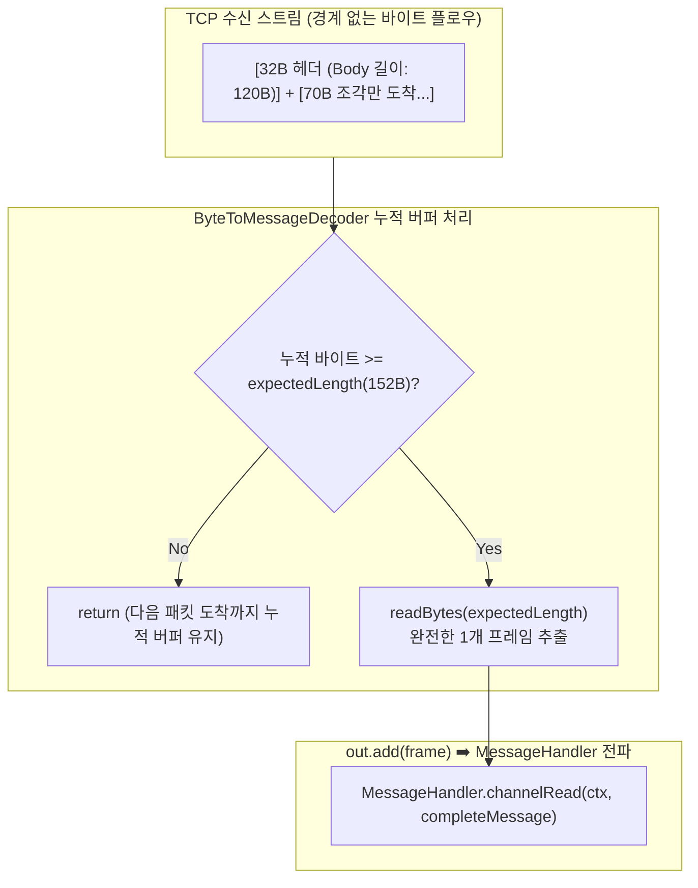

# [Java] 02. TCP 패킷 단편화와 프레임 디코딩

> [!NOTE]
> TCP 스트림 기반 통신에서 반드시 발생하는 **패킷 단편화(Fragmentation)**와 **패킷 뭉침(Sticky Packets)** 문제를 Netty의 `ByteToMessageDecoder`를 활용하여 안전하게 프레임 단위로 슬라이싱 및 재조립하는 원리를 학습합니다. (고성능 네트워크 패킷 처리 패턴)

> [!NOTE] 실행 환경
> `io.netty.handler.codec.ByteToMessageDecoder`, `ChannelHandlerContext` API 형태로 볼 때 **Netty 4.x 계열**로 추정됩니다(정확한 패치 버전 명시 없음). 코드에 `var`/레코드/패턴 매칭 등 JDK 버전을 특정할 문법적 단서가 없어 **JDK 버전은 명시되어 있지 않습니다**.

---

## 1. TCP 스트림 통신의 본질적 문제

TCP는 **스트림 기반(Stream-oriented) 프로토콜**입니다. 즉, UDP처럼 메시지의 경계(Boundary)가 존재하지 않으며, 바이트의 연속된 흐름으로 데이터가 오고 갑니다.

- **패킷 단편화 (Fragmentation)**: 송신 측에서 100바이트를 보냈지만, 네트워크 MTU나 수신 버퍼 상황에 의해 40바이트, 60바이트로 쪼개져 수신되는 현상.
- **패킷 뭉침 (Sticky Packets)**: 송신 측에서 50바이트씩 두 번 보냈지만, 수신 측에서는 하나의 버퍼에 100바이트가 한 번에 합쳐져 읽히는 현상.

따라서 애플리케이션 계층에서 **"어디서부터 어디까지가 하나의 완전한 메시지인가"**를 판별하는 프레이밍(Framing) 기법이 필수적입니다.



---

## 2. 길이 기반 프레이밍 (Length-Field Based Framing)

가장 신뢰성 높은 프레이밍 방식은 고정 헤더 영역에 **"전체 메시지 길이(또는 바디 길이)"**를 명시하는 것입니다.

### 실무 네트워크 프로토콜 헤더 사양 예시:
- **전체 최소 헤더 길이**: 32 바이트
  - `0`: STX (0x02)
  - `1 ~ 7`: 날짜/시간 (BCD 7바이트)
  - `8 ~ 9`: Sequence No (2바이트)
  - `10 ~ 19`: 가맹점 ID / MID (10바이트)
  - `20 ~ 27`: 단말기 ID / DeviceId (8바이트)
  - `28 ~ 29`: 명령어 코드 / Instruction (2바이트)
  - **`30 ~ 31`: 메시지 전체 길이 / ML (Message Length, Big-Endian 2바이트 short)**
  - `32 ~ N`: JSON 데이터 페이로드

---

## 3. 실전 `MessageDecoder` 구현 상세 분석

```java
package com.example.netty.server.decoder;

import io.netty.buffer.ByteBuf;
import io.netty.channel.ChannelHandlerContext;
import io.netty.handler.codec.ByteToMessageDecoder;
import lombok.extern.slf4j.Slf4j;

import java.nio.ByteBuffer;
import java.nio.ByteOrder;
import java.util.List;

@Slf4j
public class MessageDecoder extends ByteToMessageDecoder {

    // 악의적인 거대 패킷 공격(OOM) 방지를 위한 최대 제한 (20KB)
    private static final int MAX_MESSAGE_LENGTH = 20000;
    private static final int HEADER_MIN_LENGTH = 32;

    @Override
    protected void decode(ChannelHandlerContext ctx, ByteBuf in, List<Object> out) throws Exception {

        // 1. 헤더 길이(32바이트)조차 도착하지 않았으면 누적 대기
        if (in.readableBytes() < HEADER_MIN_LENGTH) {
            return;
        }

        short expectedLength = 0;
        try {
            byte[] ML = new byte[2];
            int base = in.readerIndex();

            // 2. readerIndex를 이동시키지 않고 offset 30 위치의 길이 2바이트만 읽어옴
            in.getBytes(base + 30, ML);
            ByteBuffer wrap = ByteBuffer.wrap(ML);
            wrap.order(ByteOrder.BIG_ENDIAN);
            expectedLength = wrap.getShort();

            // 3. 비정상적인 길이 필드 검증 (음수이거나 MAX 초과 시 비정상 연결로 간주하고 버퍼 폐기)
            if (expectedLength <= 0 || expectedLength > MAX_MESSAGE_LENGTH) {
                log.error("[MessageDecoder] Invalid ML: {}, Max: {}", expectedLength, MAX_MESSAGE_LENGTH);
                in.skipBytes(in.readableBytes());
                ctx.close(); // 비정상 소켓 즉시 차단
                return;
            }

        } catch (Exception e) {
            log.error("[MessageDecoder] Header Parsing error: ", e);
            in.skipBytes(in.readableBytes());
            ctx.close();
            return;
        }

        // 4. 누적된 바이트가 전문에 명시된 expectedLength 이상인지 확인
        if (in.readableBytes() >= expectedLength) {
            // 정확히 1개 완전한 프레임만 잘라내어 out 리스트에 추가
            ByteBuf completeMessage = in.readBytes(expectedLength);
            out.add(completeMessage);

            log.info("[MessageDecoder] Frame decoded successfully: {} bytes", expectedLength);
        } else {
            // 아직 바디 뒷부분이 덜 도착했으므로 decode()를 빠져나와 다음 read 이벤트를 기다림
            log.debug("[MessageDecoder] Waiting for remaining bytes (need: {}, current: {})", 
                    expectedLength, in.readableBytes());
        }
    }
}
```

---

## 4. 핵심 기술 포인트 & 디버깅 노하우

### 4.1 `getBytes()` vs `readBytes()`의 차이
- **`getBytes(index, dst)`**:
  - 버퍼의 내부 포인터인 `readerIndex`를 **이동시키지 않고** 데이터를 엿보기(Peek)합니다.
  - 패킷이 완전히 다 도착했는지 확인하기 전까지는 버퍼 포인터를 전진시키면 안 되므로, 헤더 검사 시에는 반드시 `getBytes()`를 써야 합니다.
- **`readBytes(length)`**:
  - `readerIndex`를 `length`만큼 **앞으로 이동시키며** 새로운 `ByteBuf` 조각을 반환합니다.
  - 검증이 완료된 완전한 프레임만 잘라내어 다음 파이프라인 핸들러로 넘길 때 사용합니다.

### 4.2 바이트 오더링 (Endianness)
- 네트워크 전송 표준(Network Byte Order)은 **Big-Endian(빅엔디안: 상위 바이트가 먼저 옴)**입니다.
- x86/ARM CPU(리틀엔디안)와 통신할 때 2바이트 short나 4바이트 int를 변환할 경우, 반드시 `ByteBuffer.order(ByteOrder.BIG_ENDIAN)` 또는 `ByteBuf.readShort()`를 사용하여 아키텍처 독립적인 파싱을 보장해야 합니다.

## 관련 문서

- [(학습/개발 (CS)/네트워크) Netty 파이프라인 예외흐름과 핸들러 배치 패턴](../../개발%20(CS)/네트워크/[CS]%20Netty%20파이프라인%20예외흐름과%20핸들러%20배치%20패턴%20-%20핵심%20개념%20및%20특징%20정리.md) — 동일 프로젝트의 MessageDecoder가 ByteToMessageDecoder(Inbound 전용)로서 파이프라인에서 왜 Outbound에서 skip되는지 설명
- [(학습/프레임워크/Netty) [Java] 01. Netty 아키텍처와 이벤트 루프 스레드 모델 (EventLoop, Boss·Worker, Bootstrap)]([Java]%2001.%20Netty%20아키텍처와%20이벤트%20루프%20스레드%20모델%20(EventLoop,%20Boss·Worker,%20Bootstrap).md) — 같은 ServerBootstrap 파이프라인에 이 MessageDecoder가 등록되는 전체 서버 아키텍처를 다루는 연작
- [(학습/프레임워크/Netty) [Java] 03. 채널 핸들러 라이프사이클과 실전 IoT 소켓 통신 패턴 (Session, BCD, HAProxy)]([Java]%2003.%20채널%20핸들러%20라이프사이클과%20실전%20IoT%20소켓%20통신%20패턴%20(Session,%20BCD,%20HAProxy).md) — 디코더가 생성한 완전한 프레임을 넘겨받는 후속 MessageHandler를 다루는 연작
- [(학습/프레임워크/Netty) [Java] 04. Netty 소켓 파이프라인 SSL-TLS 적용과 mTLS 상호 인증 (SslHandler, KeyStore, SslContext)]([Java]%2004.%20Netty%20소켓%20파이프라인%20SSL-TLS%20적용과%20mTLS%20상호%20인증%20(SslHandler,%20KeyStore,%20SslContext).md) — 이 MessageDecoder 앞단에 SslHandler를 추가해 암호화 계층을 얹는 연작
