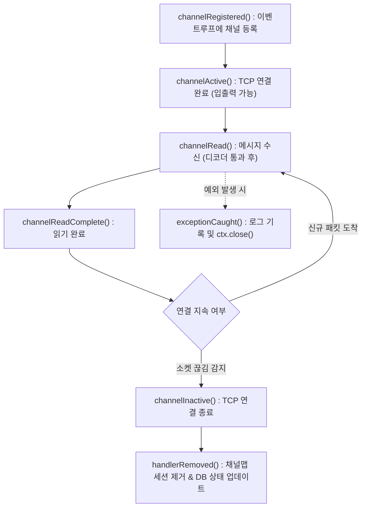

# [Java] 03. 채널 핸들러 라이프사이클과 실전 IoT 소켓 통신 패턴

> [!NOTE]
> Netty의 `ChannelInboundHandlerAdapter` 수명 주기, 다이렉트 버퍼 메모리 누수 방지 기법(`ReferenceCountUtil`), BCD 날짜 포맷 파싱, L4 환경에서의 **HAProxy PROXY Protocol v1/v2 실제 IP 복원 파서 구현 원리**를 정리합니다. (고성능 소켓 통신 서버 아키텍처)

> [!NOTE] 실행 환경
> `ChannelInboundHandlerAdapter`, `ReferenceCountUtil`, `io.netty.util.*` API 형태로 볼 때 **Netty 4.x 계열**로 추정됩니다(정확한 패치 버전 명시 없음). 코드에 `var`/레코드/패턴 매칭 등 JDK 버전을 특정할 문법적 단서가 없어 **JDK 버전은 명시되어 있지 않습니다**.

---

## 1. ChannelInboundHandler 라이프사이클

클라이언트 소켓이 서버에 연결되어 데이터를 주고받고 종료될 때까지 호출되는 콜백 체인입니다.



---

## 2. 실전 `MessageHandler`와 메모리 관리

```java
package com.example.netty.server.handler;

import io.netty.buffer.ByteBuf;
import io.netty.channel.ChannelHandlerContext;
import io.netty.channel.ChannelInboundHandlerAdapter;
import io.netty.util.ReferenceCountUtil;
import lombok.RequiredArgsConstructor;
import lombok.extern.slf4j.Slf4j;

@Slf4j
@RequiredArgsConstructor
public class MessageHandler extends ChannelInboundHandlerAdapter {

    private final AppMapper appMapper;

    @Override
    public void channelRead(ChannelHandlerContext ctx, Object msg) throws Exception {
        try {
            ByteBuf byteBuf = (ByteBuf) msg;
            byte[] bytes = new byte[byteBuf.readableBytes()];
            byteBuf.getBytes(byteBuf.readerIndex(), bytes);

            // 비즈니스 처리 매니저 호출 (Strategy 패턴)
            ProcessManager processManager = TxApplication.context.getBean(ProcessManager.class);
            MessageEncoderDto encodeDto = processManager.doProcess(bytes, ctx);

            if (encodeDto != null) {
                ctx.writeAndFlush(encodeDto);
            }
        } catch (Exception e) {
            exceptionCaught(ctx, e);
        } finally {
            // 중요: 네티의 Direct Buffer 참조 카운트 감소 (메모리 누수 방지 필수)
            ReferenceCountUtil.release(msg);
        }
    }

    @Override
    public void handlerRemoved(ChannelHandlerContext ctx) throws Exception {
        // 클라이언트(커피머신) 전원 꺼짐 또는 비정상 종료 시 세션 맵 정리 및 DB 상태 OFF 업데이트
        for (Map.Entry<String, ChannelInfo> entry : AppConfig.channelMap.entrySet()) {
            if (entry.getValue().getCtx().equals(ctx)) {
                Map<String, Object> param = new HashMap<>();
                param.put("mid", entry.getKey().substring(0, 10));
                param.put("devId", entry.getKey().substring(10, 18));
                param.put("devStatus", "0"); // 0: OFF, 1: ON

                appMapper.updateDevStatus(param);
                AppConfig.channelMap.remove(entry.getKey());
                log.info("Device disconnected and status set to OFF: {}", entry.getKey());
                break;
            }
        }
    }

    @Override
    public void exceptionCaught(ChannelHandlerContext ctx, Throwable cause) throws Exception {
        log.error("[MessageHandler] Socket Exception: {}", cause.getMessage());
        ctx.close(); // 소켓 자원 누수 방지
    }
}
```

### ⚠️ `ReferenceCountUtil.release(msg)`의 중요성
- Netty는 고성능 처리를 위해 JVM 힙이 아닌 **C 라이브러리 레벨의 직접 메모리(Direct Memory / Off-heap)**를 사용합니다.
- Direct Buffer는 JVM 가비지 컬렉터(GC)의 관리 대상이 아니므로, 참조 카운트(Reference Count)가 0이 되어야 네이티브 메모리가 해제됩니다.
- `channelRead()` 마지막에 `finally { ReferenceCountUtil.release(msg); }`를 명시하지 않으면 서버가 가동된 지 며칠 만에 `OutOfMemoryError: Direct buffer memory`가 발생하며 서버가 뻗게 됩니다.

---

## 3. BCD (Binary Coded Decimal) 날짜 처리와 Strategy 패턴

많은 산업용 장비 및 결제 단말기는 날짜 14자리를 문자열("20260905213000")로 보내지 않고, 1바이트에 2개의 10진수 숫자를 압축한 **BCD 7바이트 포맷**을 사용합니다.

```java
// BCD to String 변환 (CommonUtil.java)
public static String bcdToString(byte[] bytes) {
    StringBuilder sb = new StringBuilder();
    for (byte b : bytes) {
        sb.append((b >> 4) & 0x0F); // 상위 4비트
        sb.append(b & 0x0F);        // 하위 4비트
    }
    return sb.toString(); // 예: 20 26 09 05 21 30 00 -> "20260905213000"
}
```

### 커맨드 코드 기반 동적 Bean 라우팅
수십 가지의 장비 제어 커맨드(1A, 1B, 1C...)를 거대한 `if-else`문으로 처리하지 않고, Spring ApplicationContext를 활용한 **전략 패턴(Strategy Pattern)**으로 처리합니다.

```java
// ProcessManager.java
String insStr = getInsToString(bytes); // 28~29 오프셋에서 "1A", "1B" 추출
InsProcess insProcess = (InsProcess) TxApplication.context.getBean(insStr);
return insProcess.doProcess(msg, ctx);
```

---

## 4. L4 / HAProxy 환경에서의 PROXY Protocol v1/v2 파서 구현

서버 앞단에 L4 로드밸런서나 HAProxy가 위치할 경우, `ctx.channel().remoteAddress()`를 조회하면 장비의 실제 IP가 아닌 **로드밸런서의 내부 사설 IP**가 찍히게 됩니다.

프로토콜 맨 앞단에 `ProxyDetector`를 두어 PROXY 프로토콜 헤더를 감지하고 실제 클라이언트 IP를 추출하여 `Channel.attr(REAL_IP)`에 저장한 뒤 패킷을 정리합니다.

```java
private class ProxyDetector extends ByteToMessageDecoder {

    // v2 시그니처 (12바이트 매직 헤더)
    private static final byte[] V2_MAGIC = new byte[]{0x0d, 0x0a, 0x0d, 0x0a, 0x00, 0x0d, 0x0a, 0x0a};
    private static final byte[] V1_PREFIX = "PROXY ".getBytes();

    @Override
    protected void decode(ChannelHandlerContext ctx, ByteBuf in, List<Object> out) throws Exception {
        if (!in.isReadable()) return;

        int readerIndex = in.readerIndex();
        boolean isV2 = checkV2(in, readerIndex);
        boolean isV1 = !isV2 && checkV1(in, readerIndex);

        if (isV1) {
            // PROXY TCP4 123.45.67.89 ... \r\n 라인 파싱
            int lfIndex = findCRLF(in, readerIndex);
            if (lfIndex > 0) {
                int headerLen = lfIndex - readerIndex;
                byte[] headerBytes = new byte[headerLen];
                in.getBytes(readerIndex, headerBytes);
                String header = new String(headerBytes);
                String clientIp = header.trim().split("\\s+")[2];
                
                ctx.channel().attr(NettyServer.REAL_IP).set(clientIp);
                in.skipBytes(headerLen); // 헤더 제거 후 순수 데이터만 통과시킴
            }
        } else if (isV2) {
            // v2 바이너리 헤더 파싱 (16바이트 고정 + IPv4 4바이트 추출)
            int lenFieldOffset = readerIndex + 14;
            int length = ((in.getByte(lenFieldOffset) & 0xFF) << 8) | (in.getByte(lenFieldOffset + 1) & 0xFF);
            int totalHeaderLen = 16 + length;
            
            byte[] addr = new byte[4];
            in.getBytes(readerIndex + 16, addr);
            String clientIp = (addr[0] & 0xFF) + "." + (addr[1] & 0xFF) + "." + (addr[2] & 0xFF) + "." + (addr[3] & 0xFF);
            
            ctx.channel().attr(NettyServer.REAL_IP).set(clientIp);
            in.skipBytes(totalHeaderLen);
        }

        // 프록시 헤더 처리가 끝나면 본 핸들러를 파이프라인에서 제거하여 이후 패킷 오버헤드 방지
        ctx.pipeline().remove(this);
    }
}
```

- 첫 패킷에서 프록시 헤더를 소모한 뒤 `ctx.pipeline().remove(this)`로 파이프라인에서 자기 자신을 동적으로 제거하므로, 이후 지속되는 소켓 통신에서는 제로 오버헤드로 순수 비즈니스 패킷만 처리됩니다.

## 관련 문서

- [(학습/개발 (CS)/네트워크) Netty 파이프라인 예외흐름과 핸들러 배치 패턴](../../개발%20(CS)/네트워크/[CS]%20Netty%20파이프라인%20예외흐름과%20핸들러%20배치%20패턴%20-%20핵심%20개념%20및%20특징%20정리.md) — 동일 프로젝트의 MessageHandler를 대상으로 예외가 Head→Tail로만 흐르는 구조적 한계와 로깅 핸들러 배치 전략을 다룸
- [(학습/프레임워크/Netty) [Java] 01. Netty 아키텍처와 이벤트 루프 스레드 모델 (EventLoop, Boss·Worker, Bootstrap)]([Java]%2001.%20Netty%20아키텍처와%20이벤트%20루프%20스레드%20모델%20(EventLoop,%20Boss·Worker,%20Bootstrap).md) — 같은 ServerBootstrap 파이프라인에 이 MessageHandler가 등록되는 전체 서버 아키텍처를 다루는 연작
- [(학습/프레임워크/Netty) [Java] 02. TCP 패킷 단편화와 프레임 디코딩 (ByteToMessageDecoder & Length-Field)]([Java]%2002.%20TCP%20패킷%20단편화와%20프레임%20디코딩%20(ByteToMessageDecoder%20&%20Length-Field).md) — 이 MessageHandler로 완전한 프레임을 넘겨주는 전단 MessageDecoder를 다루는 연작
- [(학습/프레임워크/Netty) [Java] 04. Netty 소켓 파이프라인 SSL-TLS 적용과 mTLS 상호 인증 (SslHandler, KeyStore, SslContext)]([Java]%2004.%20Netty%20소켓%20파이프라인%20SSL-TLS%20적용과%20mTLS%20상호%20인증%20(SslHandler,%20KeyStore,%20SslContext).md) — 이 MessageHandler에서 SslHandshakeCompletionEvent를 처리하는 TLS 계층을 다루는 연작
