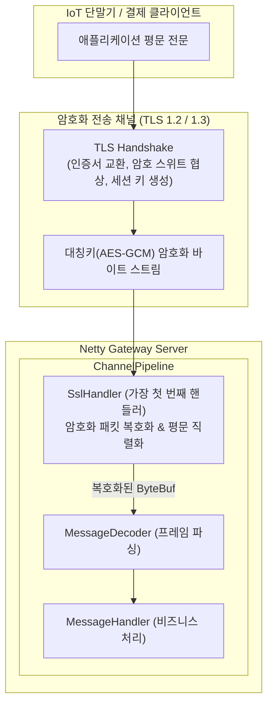

# [Java] 04. Netty 소켓 파이프라인 SSL-TLS 적용과 mTLS 상호 인증

> [!NOTE]
> IoT 디바이스나 금융 단말기와의 TCP 소켓 통신에서 패킷 도청(Eavesdropping) 및 중간자 공격(MITM)을 방어하기 위해 **Netty 파이프라인에 SSL/TLS 암호화 계층을 구축하는 실무 아키텍처**를 다룹니다.
> 서버 인증(One-way TLS)과 양방향 상호 인증(Two-way mTLS), `SslContext` 팩토리 구현, 핸드셰이크 비동기 감지 패턴을 학습합니다.

> [!NOTE] 실행 환경
> `SslContextBuilder`(Netty 4.1부터 제공되는 API)와 `netty-tcnative-boringssl-static` 네이티브 바인딩 언급, TLSv1.2/1.3 지원으로 볼 때 **Netty 4.1.x 계열**로 추정됩니다(정확한 패치 버전 명시 없음). 코드에 `var`/레코드/패턴 매칭 등 JDK 버전을 특정할 문법적 단서가 없어 **JDK 버전은 명시되어 있지 않습니다**.

---

## 1. TCP 소켓 통신에서의 보안 위협과 TLS 아키텍처

평문(Plaintext) TCP 통신은 동일 네트워크 대역에서 패킷 스니핑 툴(`Wireshark`, `tcpdump`)을 사용하면 프로토콜 전문, 단말기 식별자, 결제 정보가 그대로 노출됩니다. 이를 방어하기 위해 전송 계층과 애플리케이션 계층 사이에 **TLS(Transport Layer Security) 계층**을 삽입합니다.



### One-way TLS vs Two-way mTLS (상호 인증)
1. **One-way TLS (단방향 서버 인증)**:
   - 클라이언트가 서버의 공개키 인증서만 검증합니다. (웹 브라우저의 일반 HTTPS와 동일)
   - 구현이 비교적 단순하지만, 비인가 클라이언트가 소켓 연결을 시도하는 것을 원천 차단하기는 어렵습니다.
2. **Two-way mTLS (양방향 상호 인증)**:
   - 서버도 자신의 인증서를 제시하고, **클라이언트 또한 사전 발급된 클라이언트 인증서를 서버에 제시**하여 상호 검증합니다.
   - 단말기 하드웨어 보안 모듈(Secure Element)에 인증서가 탑재된 IoT/스마트 그리드/금융망 환경에서 표준으로 사용됩니다.

---

## 2. `SslContextFactory` 팩토리 패턴 구현

Netty는 JDK 표준 `SSLEngine`을 감싸 비동기 I/O에 최적화된 **`SslContext`** 객체를 제공합니다. `SslContext`는 생성 비용이 크므로 애플리케이션 기동 시 싱글톤 팩토리로 생성하여 재사용합니다.

```java
package com.example.netty.ssl;

import io.netty.handler.ssl.ClientAuth;
import io.netty.handler.ssl.SslContext;
import io.netty.handler.ssl.SslContextBuilder;
import lombok.RequiredArgsConstructor;
import lombok.extern.slf4j.Slf4j;
import org.springframework.stereotype.Component;

import javax.net.ssl.KeyManagerFactory;
import javax.net.ssl.TrustManagerFactory;
import java.io.InputStream;
import java.nio.file.Files;
import java.nio.file.Paths;
import java.security.KeyStore;

@Slf4j
@Component
@RequiredArgsConstructor
public class SslContextFactory {

    private final SslProperties sslProperties;

    /**
     * Netty 서버용 SslContext 생성 (One-way 또는 mTLS)
     */
    public SslContext createServerSslContext() {
        try {
            // 1. 서버 개인키 및 인증서 체인을 포함한 KeyManagerFactory 로드
            KeyManagerFactory kmf = loadKeyManagerFactory();

            SslContextBuilder builder = SslContextBuilder.forServer(kmf)
                    .protocols("TLSv1.2", "TLSv1.3");

            // 2. mTLS(상호 인증) 활성화 여부에 따른 분기
            if (sslProperties.isMtlsEnabled()) {
                TrustManagerFactory tmf = loadTrustManagerFactory();
                builder.trustManager(tmf)
                       .clientAuth(ClientAuth.REQUIRE); // 클라이언트 인증서 필수 요구
                log.info("[SslContextFactory] Two-way mTLS configured successfully.");
            } else {
                builder.clientAuth(ClientAuth.NONE);
                log.info("[SslContextFactory] One-way TLS configured successfully.");
            }

            return builder.build();
        } catch (Exception e) {
            log.error("[SslContextFactory] SslContext initialization failed: ", e);
            throw new IllegalStateException("Failed to initialize Netty SslContext", e);
        }
    }

    private KeyManagerFactory loadKeyManagerFactory() throws Exception {
        KeyStore keyStore = KeyStore.getInstance(sslProperties.getKeyStoreType()); // PKCS12 권장
        try (InputStream in = Files.newInputStream(Paths.get(sslProperties.getKeyStorePath()))) {
            keyStore.load(in, sslProperties.getKeyStorePassword().toCharArray());
        }

        KeyManagerFactory kmf = KeyManagerFactory.getInstance(KeyManagerFactory.getDefaultAlgorithm());
        kmf.init(keyStore, sslProperties.getKeyPassword().toCharArray());
        return kmf;
    }

    private TrustManagerFactory loadTrustManagerFactory() throws Exception {
        KeyStore trustStore = KeyStore.getInstance(sslProperties.getTrustStoreType());
        try (InputStream in = Files.newInputStream(Paths.get(sslProperties.getTrustStorePath()))) {
            trustStore.load(in, sslProperties.getTrustStorePassword().toCharArray());
        }

        TrustManagerFactory tmf = TrustManagerFactory.getInstance(TrustManagerFactory.getDefaultAlgorithm());
        tmf.init(trustStore);
        return tmf;
    }
}
```

---

## 3. `ChannelPipeline` 내 `SslHandler` 등록 및 순서 규칙

Netty의 파이프라인에서 **`SslHandler`는 반드시 첫 번째(First) 또는 프로토콜 프록시 감지 핸들러 바로 다음**에 등록되어야 합니다.

```java
public class SocketChannelInitializer extends ChannelInitializer<SocketChannel> {

    private final SslContext sslContext;
    private final boolean sslEnabled;

    @Override
    protected void initChannel(SocketChannel ch) throws Exception {
        ChannelPipeline pipeline = ch.pipeline();

        // 1. SSL이 활성화된 경우 파이프라인 최선두에 SslHandler 등록
        if (sslEnabled) {
            // SslHandler는 ByteBufAllocator를 필요로 함
            pipeline.addFirst("ssl", sslContext.newHandler(ch.alloc()));
        }

        // 2. 복호화된 평문 바이트를 프레임 단위로 슬라이싱하는 디코더
        pipeline.addLast("decoder", new MessageDecoder());
        // 3. 아웃바운드 패킷을 바이너리로 인코딩 (SslHandler가 최종 암호화하여 송신)
        pipeline.addLast("encoder", new MessageEncoder());
        // 4. 순수 비즈니스 로직 핸들러
        pipeline.addLast("handler", new MessageHandler());
    }
}
```

> [!IMPORTANT]
> **핸들러 등록 순서의 절대 원칙:**
> 인바운드 데이터는 등록된 순서대로(`SslHandler -> MessageDecoder -> MessageHandler`) 흐릅니다.
> 만약 `MessageDecoder`가 `SslHandler`보다 먼저 오면, 암호화된 바이너리 쓰레기값을 파싱하려다 프레임 에러를 내며 소켓이 닫히게 됩니다.

---

## 4. 비동기 핸드셰이크 완료 감지 (`SslHandshakeCompletionEvent`)

TLS 핸드셰이크는 TCP 연결 수립(`channelActive`) 직후 백그라운드에서 별도로 진행됩니다. 핸드셰이크가 아직 완료되지 않은 상태에서 클라이언트가 평문 데이터를 전송하거나 서버가 메시지를 쓰면 에러가 발생합니다.

Netty는 핸드셰이크 완료 여부를 **사용자 정의 이벤트(`userEventTriggered`)**로 통지합니다.

```java
@Slf4j
public class MessageHandler extends ChannelInboundHandlerAdapter {

    @Override
    public void userEventTriggered(ChannelHandlerContext ctx, Object evt) throws Exception {
        if (evt instanceof SslHandshakeCompletionEvent) {
            SslHandshakeCompletionEvent handshakeEvent = (SslHandshakeCompletionEvent) evt;
            if (handshakeEvent.isSuccess()) {
                log.info("[MessageHandler] TLS Handshake SUCCESS. Remote: {}", ctx.channel().remoteAddress());
                // 핸드셰이크 성공 후 장비에 헬로 패킷 전송 가능
            } else {
                log.error("[MessageHandler] TLS Handshake FAILED: {}", handshakeEvent.cause().getMessage());
                ctx.close(); // 인증서 불일치 또는 암호 스위트 불일치 시 즉시 차단
            }
        }
        super.userEventTriggered(ctx, evt);
    }
}
```

---

## 5. 실무 성능 최적화 가이드

1. **OpenSSL 기반 네이티브 바인딩 (Netty-tcnative)**:
   - JDK 기본 SSL 엔진은 순수 자바 연산으로 동작하여 초당 암복호화 처리량에 한계가 있습니다.
   - 대규모 트래픽 환경에서는 OpenSSL / BoringSSL을 네이티브 JNI로 호출하는 `netty-tcnative-boringssl-static` 종속성을 추가하면 CPU 사용률을 30~50% 절감하고 처리량을 대폭 끌어올릴 수 있습니다.
2. **세션 캐싱 (Session Resumption)**:
   - 빈번하게 재접속하는 IoT 장비 환경에서는 TLS Session ID 또는 Session Ticket을 활성화하여 1-RTT(또는 0-RTT)로 빠른 핸드셰이크를 수행하도록 설정합니다.

## 관련 문서

- [(학습/개발 실무/네트워크·보안) [Netty_TLS] Netty 파이프라인 SSL-TLS 적용](../../개발%20실무/네트워크·보안/[Netty_TLS]%20Netty%20파이프라인%20SSL-TLS%20적용%20-%20One-way%20TLS%20서버%20인증%20구성%20정리.md) — 동일 주제(One-way TLS vs mTLS)를 keytool 발급 절차와 SAN 검증 관점에서 보완하는 실무 노트
- [(학습/프레임워크/Netty) [Java] 01. Netty 아키텍처와 이벤트 루프 스레드 모델 (EventLoop, Boss·Worker, Bootstrap)]([Java]%2001.%20Netty%20아키텍처와%20이벤트%20루프%20스레드%20모델%20(EventLoop,%20Boss·Worker,%20Bootstrap).md) — 이 SslHandler가 추가되는 대상인 ServerBootstrap 전체 파이프라인 구성을 다루는 연작
- [(학습/프레임워크/Netty) [Java] 02. TCP 패킷 단편화와 프레임 디코딩 (ByteToMessageDecoder & Length-Field)]([Java]%2002.%20TCP%20패킷%20단편화와%20프레임%20디코딩%20(ByteToMessageDecoder%20&%20Length-Field).md) — SslHandler 바로 뒤에서 복호화된 평문을 프레임으로 슬라이싱하는 MessageDecoder를 다루는 연작
- [(학습/프레임워크/Netty) [Java] 03. 채널 핸들러 라이프사이클과 실전 IoT 소켓 통신 패턴 (Session, BCD, HAProxy)]([Java]%2003.%20채널%20핸들러%20라이프사이클과%20실전%20IoT%20소켓%20통신%20패턴%20(Session,%20BCD,%20HAProxy).md) — SslHandshakeCompletionEvent를 처리하는 MessageHandler의 세션/라이프사이클 관리를 다루는 연작
