# Spring 및 HTTP

> [!NOTE]
> 스프링 부트 기반으로 컨트롤러/디스패처, HTTP 요청 방식(GET/POST/PUT/DELETE), 쿼리스트링·주소변수 매핑, Content-Type, 템플릿 엔진(mustache/jsp), 리다이렉트, 시큐리티(CSRF)·유효성 검사·세션까지 실습 흐름으로 정리한다.

## 📌 개념

### chapter1

- yml 이해하기 ( ex_ 설계도, 환경설정)

→ static폴더 → application.yml

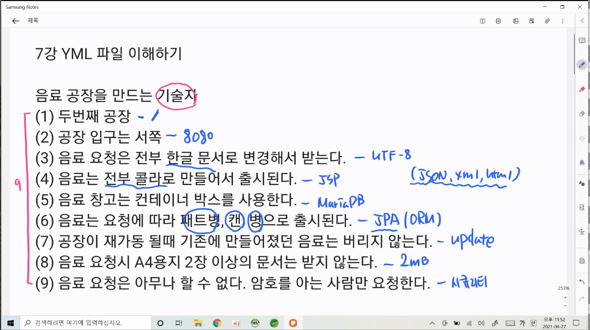

- 컨트롤러란? (controller)
    - 로그인 요청 → login.java
    - 회원가입 요청 → join.java
    - 게시글 쓰기 요청 → write.java
1. 요청을 할 때 마다 java파일이 필요
2. 요청을 3개하면 java파일 3개 필요
3. java파일 생성을 줄이기위해 [Frontconrtoller.java](http://Frontconrtoller.java) 사용
4. 너무 많은 요청이 한곳으로 모이는 것을 방지하기위해 도메인 별로 나누어줌

> [!NOTE]
> 도메인 : 범주를 지정해주는 것 (ex_ 여자 / 남자)

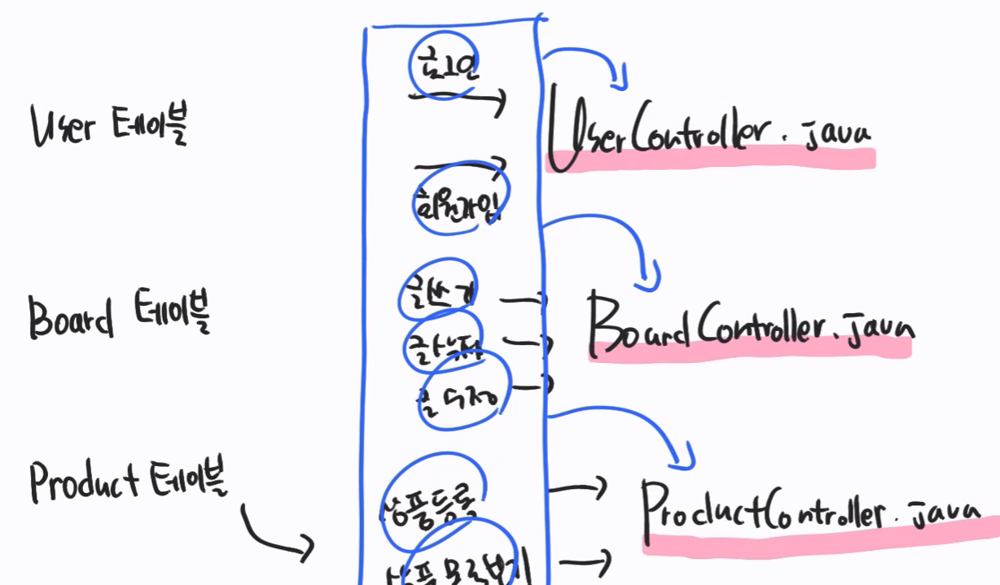

1. 해당 controller로 구분해주는 일은 Dispatcher가 수행

---

- http 4가지 요청 방식
    - 클라이언트가 웹서버에 요청
    - 웹서버는 DB에 SELECT, INSERT, UPDATE, DELETE 요청을 해서 응답
    - 클라이언트는 앤드포인트를 주어서 어떤 정보를 원하는지 알려주어야함
    
    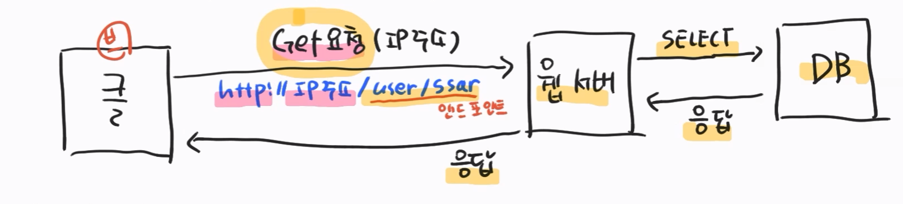
    
    1. GET(동사) - 데이터 요청
    2. POST(동사) - 데이터 전송
    3. PUT(동사) - 데이터 갱신
    4. DELETE(동사) - 데이터삭제
    
    > [!NOTE]
    > POST, PUT ⇒ http Body(데이터)가 필요함


---

- http 쿼리 스트링, 주소 변수 매핑
    1. 구체적인 데이터 요청시에 쿼리스트링이나 주소변수 매핑이 필요함
    2. 스프링부트에서는 주소변수매핑을 주로 사용한다. 훨씬 편리함
    
    고객 —>get(데이터받기)요청 02 -2222 요청 ?type= 양념 —>치킨집(02-2222 / 양념,후라이드)
    
    치킨집 ———→  get 02-2222요청 /양념 ——> 고객
    
    > [!NOTE]
    > 구체적인 데이터 요청 시
    > 1. 쿼리스트링 ⇒ `?type=양념`
    > 2. 주소변수 매핑 ⇒ `/양념`
    

---

- http body 데이터 전송하기
    - http header의 Content-Type 이해
    
    > [!NOTE]
    > Client가 데이터를 줄 때 Content-Type이 있어야 받는 쪽이 어떤 데이터인지 알 수 있다
    > 1. POST, PUT 요청 시 → Content-Type이 필요
    
    - 스프링부트는 기본적으로 x-www-form-urlencoded타입을 파싱(분석)해준다
    - x-www-form-urlencoded ⇒ key = value (데이터형태 - x -form)
    - text/plain ⇒ 안녕 (데이터형태 - text)
    - application/json ⇒ {”username” : “cos”} (데이터형태 - json)

---

- http 요청을 file로 응답하기
    1. .txt 파일 응답하기 (기본경로는 resoureces/static)
    2. 스프링부트가 지원하는 .mustache 파일 응답하기
    3. 스프링부트가 버린 .jsp 파일 응답하기
    
    .jsp와 ,mustache 파일은 템플릿 엔진을 가지고 있다.
    
    템플릿 엔진이란 html 파일에 java코드를 쓸 수 있는 친구들이다.
    
    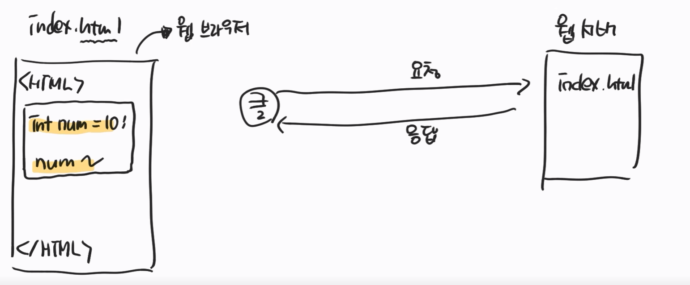
    
    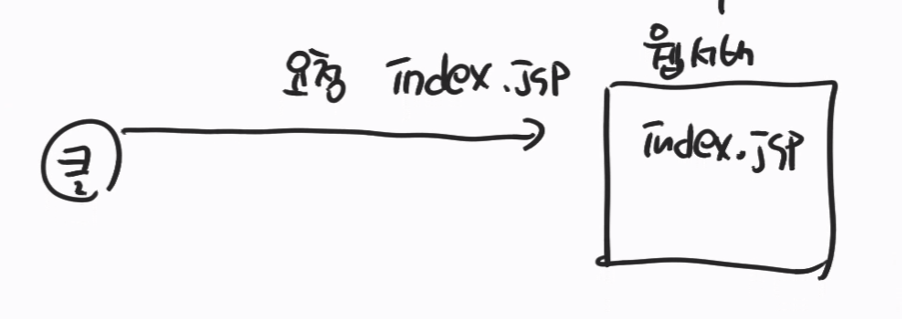
    
    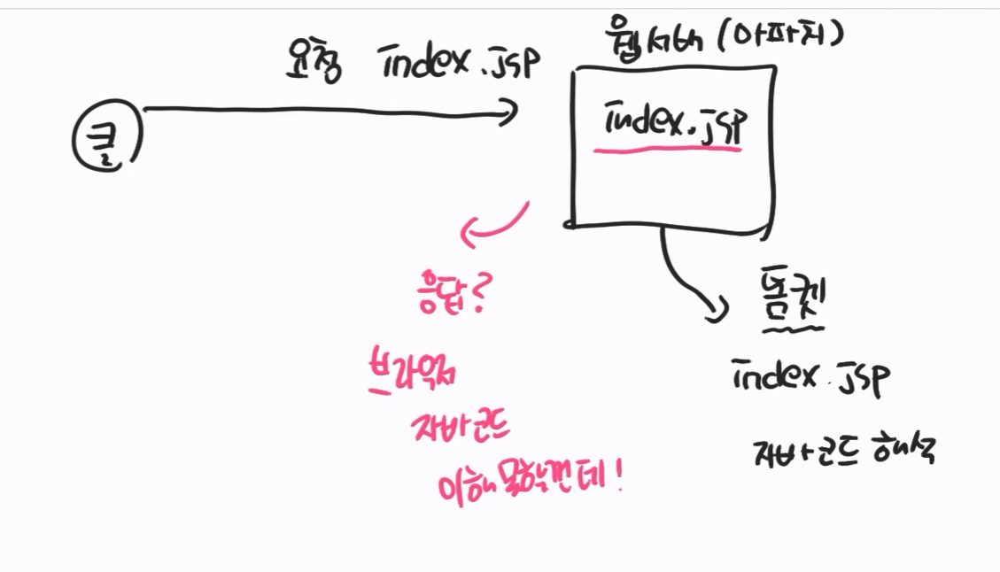
    
    > [!NOTE]
    > - 웹 서버 - 아파치
    > - WAS 서버 - 톰캣 (애플리케이션 서버) // 자바 코드를 해석 → index.html 파일로 생성
    > - 아파치, 톰캣 → 자바 해석 모듈
    
    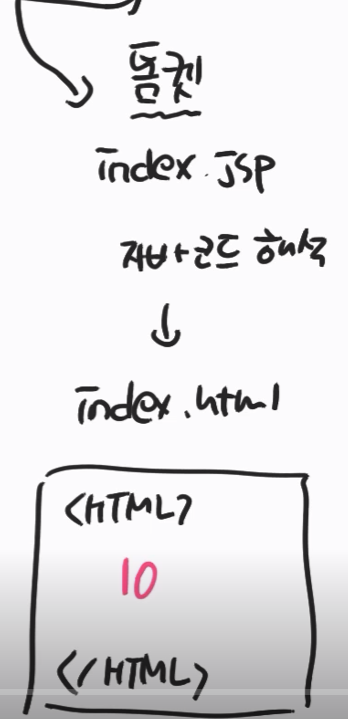
    
    > [!NOTE]
    > - 자바 코드가 없어지고 결과값만 출력함
    > - 이것을 응답 결과물로 줌

    ---
    
- mustache : src/main/resources/static 디폴트 경로
- jsp : src/main/폴더설정/c.jsp

> [!NOTE]
> 설정 필요
> 1. src/main/resources/templetes
> 2. application.yml로 변환
> 3. spring.mvc.view.prefix : 폴더경로/
> 4. sufiix : .jsp

- 폴더이름만 작성을 해도 성공적으로 응답을함

> [!NOTE]
> maven repository (라이브러리 추가 사이트)
> 1. 필요한 라이브러리 ctrl+c
> 2. pom.xml의 <dependencies> 아래에 추가
> 3. ctrl + shift + f 로 열 맞추기
> **주의) 여러개의 라이브러리 추가할경우 충돌날 수 있음 (ex_ mustache 와 jsp 충돌 가능)

---

- jsp 파일에 java 코드 사용해보기
    - java 코드 사용
    - model 사용

템플릿 엔진 넣을시

- java 코드 사용가능 (동적인 파일 응답 가능) // src/main/java/web/~.java

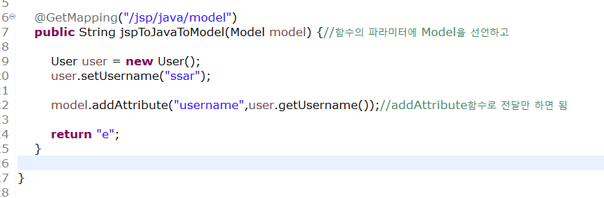

- e.jsp (src/view/webapp/WEB-INF/views/e.jsp)

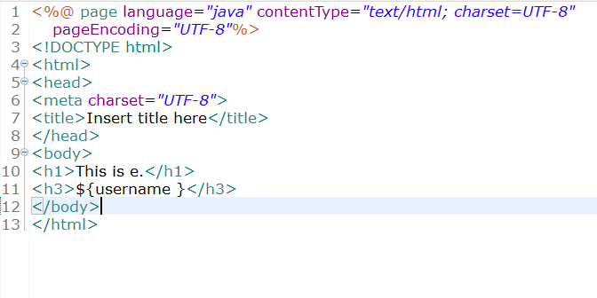

---

- http 요청 재 분배하기 - redirection
    - http 상태코드 300번대
    - 다른 주소로 요청을 분배한다

> [!NOTE]
> - 원하는 경로로 유도하는 것 = redirect

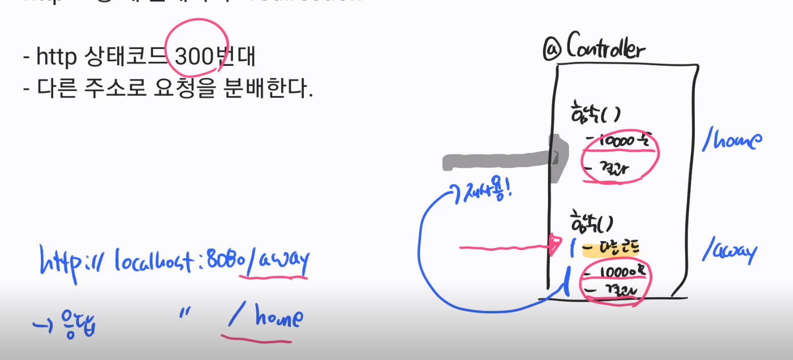

요청 : /away ⇒ 응답 : /home 으로옴 (결국 /home의 코드를 재사용한 것)

이때의 http 상태코드 ⇒ 300번대

> [!NOTE]
> http 상태코드
> 1. 200번 : Ok (성공)
> 2. 300번 : 요청한 URL가 바뀌어서 새롭개 URL이 요청된것 (== redirect)

---

---

## chapter3

- 경로 차단 가능 (security)

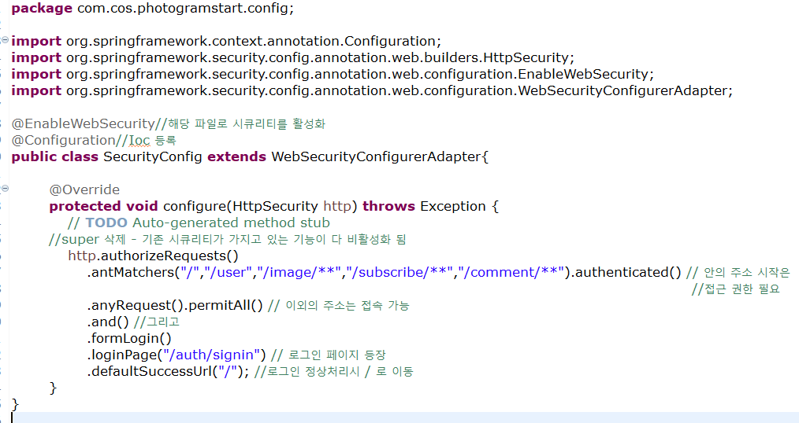

---

- 데이터를 inset하기 위해서는 post 사용 (데이터베이스에 저장)

---

- 회원가입 진행시 원하는 URL로 가지 않는 경우 ⇒ Security 에서 막음 (CSRF 토큰검사)

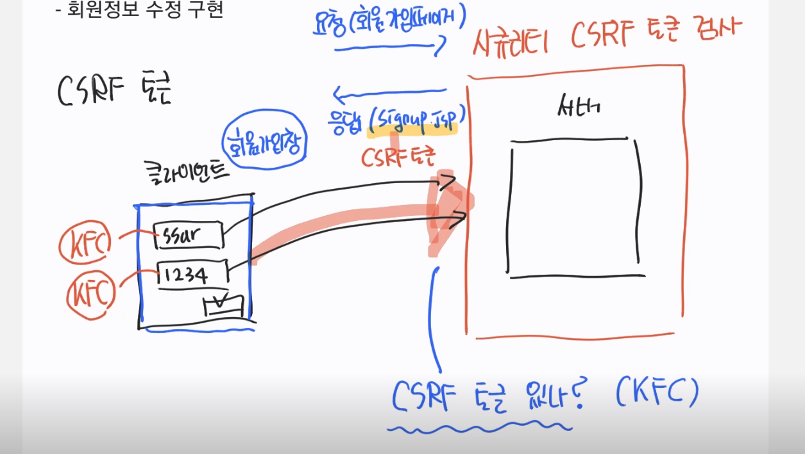

회원가입페이지 요청 → 페이지 응답(csrf 값을 넣음) → 작성 (csrf 포함) → csrf 검사 → 응답완료

> [!NOTE]
> 원하는 URL로 가지 않았던 이유 : csrf 검사에서 막혔던 것

---

- Dto : 받을 데이터 공간을 만들어주는 변수 클래스 (변수 선언)
- log.info(user.toString) : user라는 객체의 결과를 String으로 로그기록
- Ioc 컨트롤 등록?

---

- 서버 → JPA → DB에 입력
- 서버에서 수정한 작업은 applicatiom.yml → jpa (create → update로 해줘야 적용됨)
- 전처리 vs 후처리
    - 전처리 : DB에 들어가기전에 거르는 것
        - 유효성 검사
    - 후처리 : DB에 들어간 후 거르는 것
        - exception handler 이용
    - AOP : 관점 지향 프로그래밍, 부분적으로 나누어서 모듈화하는 기법

---

- 유효성 검사(ValidationCheck)
    
    ```java
    public String signup(@Valid SignupDto signupDto, BindingResult bindingResult) { // key = value(x-www-form-urlencoded)	
    
    if(bindingResult.hasErrors()) {
    		Map<String, String>errorMap = new HashMap<>();
    
    		for(FieldError error : bindingResult.getFieldErrors()) { // bindingResult=>클래스
    			errorMap.put(error.getField(),error.getDefaultMessage());
    			System.out.println("==========================");
    			System.out.println(error.getDefaultMessage());
    			System.out.println("==========================-");
    
    		} // error검사
    
    	}
    
    ```
    
- 오류페이지 생성 ( @contoller → file을 return)
    - @Resonsebody → data를 응답함
    - /auth/signin ⇒ 파일을 return ( 데이터를 return할경우 문자열 그대로 출력됨)
    - @ControllerAdvice ⇒ 모든 exception을 다 받음

---

- 로그인 → POST문 ⇒ 원래 검색 및 찾는역할은 SELECT이지만 로그인은 개인적인 정보이기에 POST이용
- Secutity 페이지
    - get방식 : authenticated 권한이 필요하기 때문에 URL을 통해 로그인안하고 접속할경우 불러옴
    - POST방식 : 권한이 설정되고 로그인이 되야하는 경우 → POST가 실행되서 로그인 이후 페이지 등장

---

- 시큐리티 설정파일
    - /auth/signin → POST형식 일경우
        - @Service ⇒ Ioc에 등록됨
        - POST를 받을 수 있게 javascript → action을 취해줘야함
        
        > [!NOTE]
        > `<form class="login__input" action="/auth/signin" method="POST">`
        

---

- JPA method names
    
    → 직접 정의하기
    

---

- Session 확인하기
    - (POST방식) → 사용자가 요청 → /auth/signin → 서버로 요청
        - Security가 서버보다 사용자 요청을 먼저 받음
        - POST방식 → (내가만든)principalDetailService가 받음
            - username이 있을 경우 : 세션 저장 → SecurityContextholder→ Authentication객체에 저장 (너무 거쳐가는 과정이 많음)
                - @Authentication 할경우 바로 Authntication에 바로 접근 가능
            - username이 없을 경우 : 요청 거절

---

- 시큐리티 태크라이브러리
    - ${principal.user.gender} ⇒ 세션안의 담겨있는 user정보의 gender값을 의미함
    - update → jsp 파일 수정
    - <input type="text" name="gender" value="${principal.user.gender}" />

---

- api → 데이터를 주고 받음 (파일 x)
- dto : data transfer object

- 영속화 ( data 값 update시 영속화를 이용해 DB에 저장

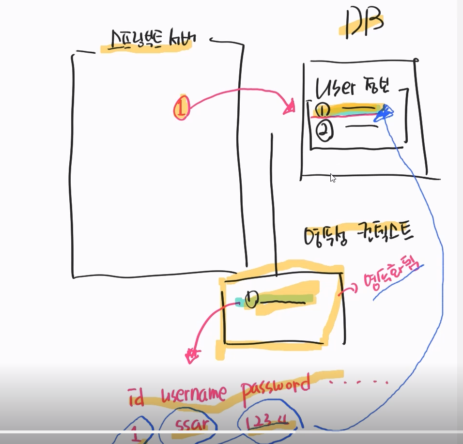

---

- name, password → 서버 → DB

프론트앤드에서 작업

1. 프론트앤드에서 한번 거르고
2. 유효성검사로 한번 더 거름
