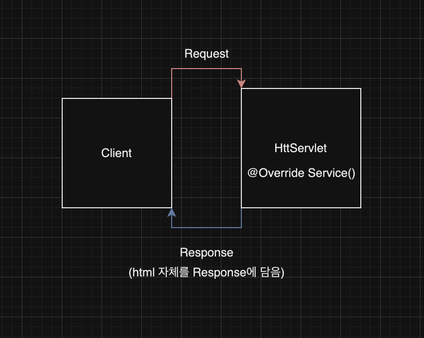
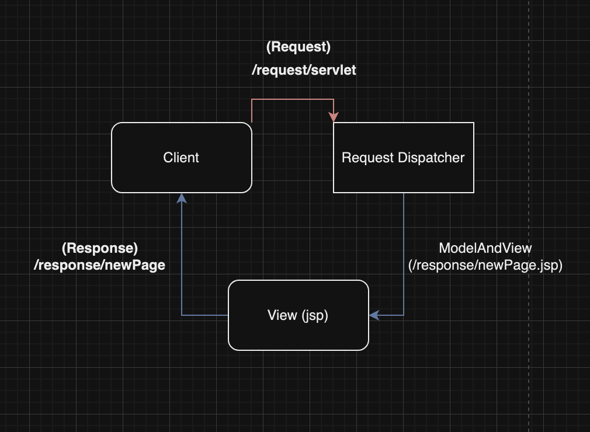
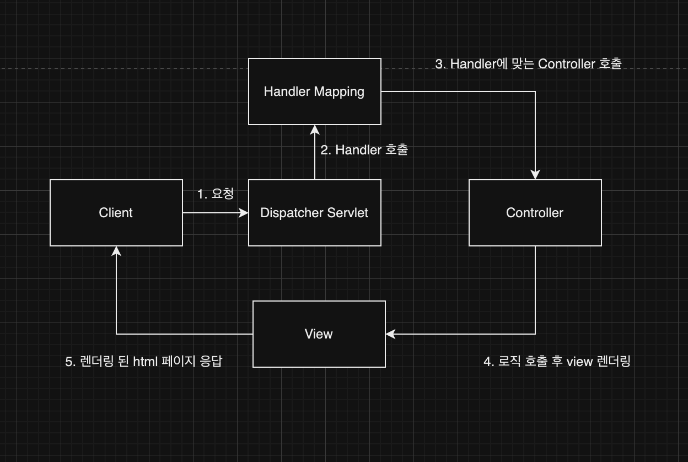
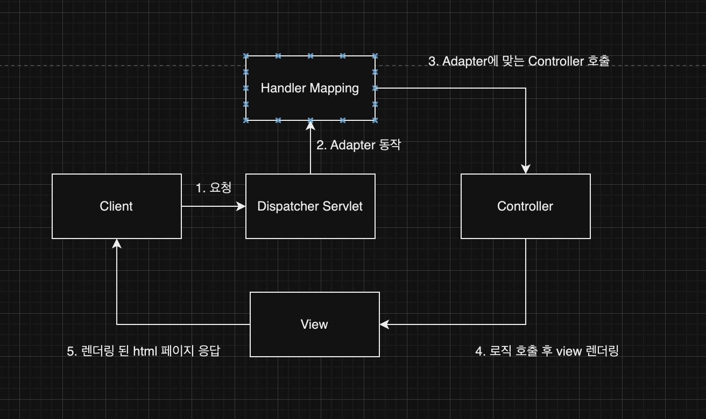
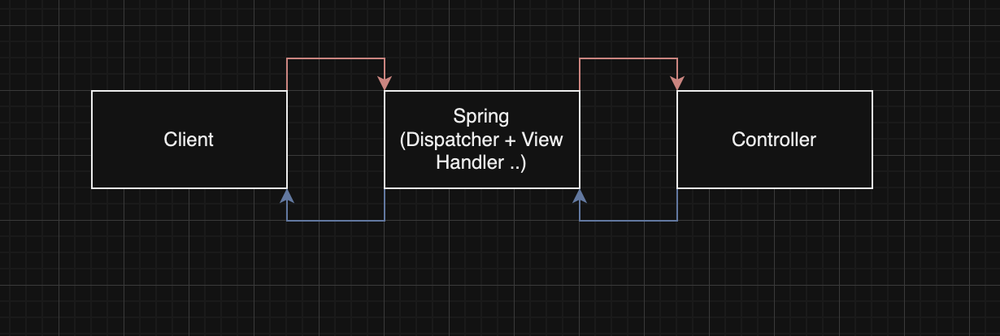

# Spring 구현 프로젝트

> [!NOTE]
> 순수 Servlet부터 FrontController + Adapter 패턴을 거쳐 Spring MVC(Dispatcher Servlet)에 이르는 과정을 단계별로 직접 구현하며 Spring의 내부 동작 원리를 이해하는 미니 프로젝트

> [!NOTE]
> 원문을 AI가 검토·보강함(사실 확인 권장) — 코드 블록 내 Notion 서식 잔여 기호(`**`)를 제거함.

> [!NOTE] 실행 환경
> 버전 명시 없음 — `HttpServletRequest`/`Response`, `@Controller`/`@RequestMapping` 등 범용 Servlet·Spring API만 사용되어 jakarta/javax 네임스페이스를 포함해 특정 버전은 확정하기 어렵다.

## 🧱 기술 스택
- Servlet, JSP (View)
- FrontController + Adapter 패턴
- Spring MVC (`@Controller`, `@RequestMapping`, `DispatcherServlet`)

## ⚙️ 구현

### SPRING 프레임워크 제작

- 요구사항
    1. 회원 저장
    2. 회원 목록 조회

- 특징
    - Spring 처리 로직 이해
    - Spring에서 Servlet을 사용하는 구간
    - Spring에서 Adapter의 역할


#### 구현 이미지


### 1. 순수 Servlet 요청 처리 방법
- Response html 직접 작성



- HttpServlet을 이용하여, Service를 오버로딩하여 요청에 대한 처리 응답을 작성한다
- HttpServletRequest를 통해 요청을 받고, HttpServletResponse를 이용해서 응답을 실행

```java
@WebServlet(name="memberSaveSerlvet", urlPatterns = "/servlet/members/save")
public class MemberSaveServlet extends HttpServlet {
    private MemberRepository memberRepository = MemberRepository.getInstance();

    @Override
    protected void service(HttpServletRequest req, HttpServletResponse response) throws ServletException, IOException {
        String username = req.getParameter("username");
        int age = Integer.parseInt(req.getParameter("age"));

        Member member = new Member(username,age);
        memberRepository.save(member);

        response.setContentType("text/html");
        response.setCharacterEncoding("utf-8");
        PrintWriter w = response.getWriter();
        w.write("<html>\n" +
                "<head>\n" +
                " <meta charset=\"UTF-8\">\n" + "</head>\n" +
                "<body>\n" +
                "성공\n" +
                "<ul>\n" +
                "    <li>id="+member.getId()+"</li>\n" +
                "    <li>username="+member.getUsername()+"</li>\n" +
                " <li>age="+member.getAge()+"</li>\n" + "</ul>\n" +
                "<a href=\"/index.html\">메인</a>\n" + "</body>\n" +
                "</html>");

    }
}
```

### 2. Servlet View Render 방법
- jsp 이용 (+ RequestDispatcher)



- RequestDispatcher를 이용하여, 요구한 요청에 맞는 페이지를 리다이렉트해준다.
    - response.sendRedirect()를 이용할경우, 리다이렉트 이후 해당 url에 대해 브라우저가 재요청하기에 2번의 요청이 생길 수 있기에 RequestDispatcher를 이용하여 한번의 요청으로 처리할 수 있도록 구현

```java
@WebServlet(name ="mvcMemberFormServlet", urlPatterns = "/servlet-mvc/members/new-form")
public class MvcMemberFormServlet extends HttpServlet {
    @Override
    protected void service(HttpServletRequest request, HttpServletResponse response) throws ServletException, IOException {
        String viewPath = "/WEB-INF/views/new-form.jsp";
        RequestDispatcher dispatcher = request.getRequestDispatcher(viewPath);
        dispatcher.forward(request, response);

    }
}
```

### 3. Dispatcher Servlet이용
- Handler Mapping을 통해, 원하는 Controller 호출



#### 버전 1
- UrlPattern을 이용해서, 요청 Url 필터링
- HaspMap에 저장되어있는, Controller를 request요청 URL를 맵핑하여 호출 진행

```java
@WebServlet(name="frontControllerServletV1", urlPatterns = "/front-controller/v1/*")
public class FrontControllerServletV1 extends HttpServlet {
    private Map<String, ControllerV1> controllerMap = new HashMap<>();

    public FrontControllerServletV1(){
        controllerMap.put("/front-controller/v1/members/new-form", new MemberFormControllerV1());
        controllerMap.put("/front-controller/v1/members/save", new MemberSaveControllerV1());
        controllerMap.put("/front-controller/v1/members", new MemberListControllerV1());
    }
    
    @Override
    protected void service(HttpServletRequest req, HttpServletResponse resp) throws ServletException, IOException {
        String requestURI = req.getRequestURI();
        
        //요청에 따른 해당 Controller 맵핑
        ControllerV1 controllerV1 = controllerMap.get(requestURI);
        if (controllerV1 == null){
            resp.setStatus(HttpServletResponse.SC_NOT_FOUND);
            return;
        }

				// 해당 Controller 로직 호출
        controllerV1.process(req,resp);
    }
}
```

#### 버전2
- View 렌더링 따로 분리 ( requestDispatcher 기능 분리 )

```java
@WebServlet(name="frontControllerServletV2", urlPatterns = "/front-controller/v2/*")
public class FrontControllerServletV2 extends HttpServlet {
    private Map<String, ControllerV2> controllerMap = new HashMap<>();

    public FrontControllerServletV2(){
        controllerMap.put("/front-controller/v2/members/new-form", new MemberFormControllerV2());
        controllerMap.put("/front-controller/v2/members/save", new MemberSaveControllerV2());
        controllerMap.put("/front-controller/v2/members", new MemberListControllerV2());
    }

    @Override
    protected void service(HttpServletRequest req, HttpServletResponse resp) throws ServletException, IOException {
        String requestURI = req.getRequestURI();
        ControllerV2 controller = controllerMap.get(requestURI);

        if (controller == null){
            resp.setStatus(HttpServletResponse.SC_NOT_FOUND);
            return;
        }
        
        // view Page 렌더링 분리
        // controller.process 리턴값 = view 페이지 경로
        MyView view = controller.process(req,resp);
        view.render(req,resp);

    }
}
```

#### 버전3
- HttpServletRequest 의존성 분리 (requestParameter → Model 로서 전달)
- View 중복되는 경로 및 확장자(jsp) 분리 (viewResolver())

```java
//.. 위와 공통
    @Override
    protected void service(HttpServletRequest req, HttpServletResponse resp) throws ServletException, IOException {

        String requestURI = req.getRequestURI();

        ControllerV3 controller = controllerMap.get(requestURI);
        if(controller == null){
            resp.setStatus(HttpServletResponse.SC_NOT_FOUND);
            return;
        }

        Map<String, String> paramMap = createParamMap(req);
        // ModelView ( Object(requestParam) + view페이지 경로 )
        ModelView mv = controller.process(paramMap);

        String viewName = mv.getViewName();
        
        
        MyView view = viewResolver(viewName);
        view.render(mv.getModel(), req, resp);
    }

    private Map<String, String> createParamMap(HttpServletRequest request){
        Map<String, String> paramMap = new HashMap<>();

        Enumeration<String> em = request.getParameterNames();
        while(em.hasMoreElements()){
            String paramName = em.nextElement();
            paramMap.put(paramName, request.getParameter(paramName));
        }
        // HttpServletRequest 의존성 분리
        return paramMap;
    }

    // 중복된 경로 분리
    private MyView viewResolver(String viewName){
        return new MyView("/WEB-INF/views/" + viewName + ".jsp");
    }
}
```

#### 버전4
- Dispatcher Servlet의 model 선언 후 사용 (ModelAndView에서 Model과 View 분리)

```java
@WebServlet(name="frontControllerServletV4", urlPatterns = "/front-controller/v4/*")
public class FrontControllerServletV4 extends HttpServlet {

    private Map<String, ControllerV4> controllerMap = new HashMap<>();
    private Map<String, Object> model = new HashMap<>();

    public FrontControllerServletV4(){
        controllerMap.put("/front-controller/v4/members/new-form", new MemberFormControllerV4());
        controllerMap.put("/front-controller/v4/members/save", new MemberSaveControllerV4());
        controllerMap.put("/front-controller/v4/members", new MemberListControllerV4());
    }

    @Override
    protected void service(HttpServletRequest req, HttpServletResponse resp) throws ServletException, IOException {

        String requestURI = req.getRequestURI();

        ControllerV4 controller = controllerMap.get(requestURI);
        if(controller == null){
            resp.setStatus(HttpServletResponse.SC_NOT_FOUND);
            return;
        }

        Map<String, String> paramMap = createParamMap(req);
        String viewName = controller.process(paramMap, model);
        
        //View + Model 분리
        MyView view = viewResolver(viewName);
        view.render(model, req, resp);
    }

    private Map<String, String> createParamMap(HttpServletRequest request){
        Map<String, String> paramMap = new HashMap<>();

        Enumeration<String> em = request.getParameterNames();
        while(em.hasMoreElements()){
            String paramName = em.nextElement();
            paramMap.put(paramName, request.getParameter(paramName));
        }
        return paramMap;
    }

    private MyView viewResolver(String viewName){
        return new MyView("/WEB-INF/views/" + viewName + ".jsp");
    }
}
```

#### 버전5
- 서로다른 컨트롤러에서 해당하는 adapter가 있을시, 해당 adapter로 인지하고 맵핑되는 Controller를 호출
    - Spring의 Dispatcher Servlet 또한 해당 방식으로 동작
- 인터페이스 활용
    - Adapater의 handle() / support() 메서드는 인터페이스에 있으므로 캐스팅을 통해서 구현체를 호출 할 수 있다 (따라서, 인터페이스가 없다면 효율적으로 구현할 수 없다)



```java
@WebServlet(name="frontControllerServletV5", urlPatterns = "/front-controller/v5/*")
public class FrontControllerServletV5 extends HttpServlet {
    private final Map<String, Object> handlerMappingMap = new HashMap<>();
    private final List<MyHandlerAdapter> handlerAdapters = new ArrayList<>();

    public FrontControllerServletV5(){
        initHandlerMappingMap();
        initHandlerAdapters();
    }
    
    //Controller 호출 맵핑작업
    private void initHandlerMappingMap(){
        handlerMappingMap.put("/front-controller/v5/v3/members/new-form", new MemberFormControllerV3());
        handlerMappingMap.put("/front-controller/v5/v3/members/save", new MemberSaveControllerV3());
        handlerMappingMap.put("/front-controller/v5/v3/members", new MemberListControllerV3());

        handlerMappingMap.put("/front-controller/v5/v4/members/new-form", new MemberFormControllerV4());
        handlerMappingMap.put("/front-controller/v5/v4/members/save", new MemberSaveControllerV4());
        handlerMappingMap.put("/front-controller/v5/v4/members", new MemberListControllerV4());
    }
    
    //Handler Adapeter 종류
    private void initHandlerAdapters(){
        handlerAdapters.add(new ControllerV3HandlerAdapter());
        handlerAdapters.add(new ControllerV4HandlerAdapter());
    }

    @Override
    protected void service(HttpServletRequest req, HttpServletResponse resp) throws ServletException, IOException {
        
        //request에 맞는 Controller 핸들러
        Object handler = getHandler(req);

        if (handler == null){
            resp.setStatus(HttpServletResponse.SC_NOT_FOUND);
            return;
        }
        
        //해당 Handler가 Adapter에 있는지 확인
        MyHandlerAdapter adapter = getHandlerAdapter(handler);
        
        //Adapter에 존재한다면 해당 Controller 호출
        ModelView mv = adapter.handle(req,resp,handler);

        MyView view = viewResolver(mv.getViewName());
        view.render(mv.getModel(), req, resp);
    }

    private Object getHandler(HttpServletRequest request){
        String requestURI = request.getRequestURI();
        return handlerMappingMap.get(requestURI);
    }

    private MyHandlerAdapter getHandlerAdapter(Object handler){
        for (MyHandlerAdapter adapter : handlerAdapters){
            if(adapter.supports(handler)){
                return adapter;
            }
        }
    throw new IllegalArgumentException("handler adapter를 찾을 수 없습니다");
    }

    private MyView viewResolver(String viewName){
        return new MyView("/WEB-INF/views/" + viewName + ".jsp");
    }
}
```

### 4. Spring 이용
- 어노테이션을 이용한 Controller호출



- 어노테이션
    - @Controller : spring이 빈에 등록하여 Controller로서 인식
    - @RequestMapping : request Url을 맵핑하여 호출할 수 있도록 인식
    - @Configuration : spring 설정을 통해 ViewResolver를 jsp로 설정
        - ModelAndView만 반환하면 자동으로 해당 jsp 응답

```java
@Controller
public class SpringMemberFormControllerV1 {
    //싱글톤으로 호출 
    private MemberRepository memberRepository = MemberRepository.getInstance();
    
    @RequestMapping("/save")
    public ModelAndView save(HttpServletRequest request, HttpServletResponse response){
        String username = request.getParameter("username");
        int age = Integer.parseInt(request.getParameter("age"));

        Member member =new Member(username, age);
        memberRepository.save(member);

        ModelAndView mv = new ModelAndView("save-result");
        //model Object를 이용하여 응답
        mv.addObject("member",member);
        return mv;
    }
}
```

- JSP관련 @Configuration을 적용할 경우, jsp 파일명을 이용하여 전달 가능하다. (Model 객체를 이용해서 값 전달 가능)

```java
@Controller
@RequestMapping("/springmvc/v3/members")
public class SpringMemberControllerV3 {

    @GetMapping("/new-form")
    public String newForm(){
        return "new-form";
    }
    
    @GetMapping
    public String members(Model model){
        List<Member> members = memberRepository.findAll();

        model.addAttribute("members", members);

        return "members";
    }
 }
 
 
 @Configuration
public class WebConfig implements WebMvcConfigurer {
    @Override
    public void configureViewResolvers(ViewResolverRegistry registry) {
        registry.jsp("/WEB-INF/views/",".jsp");
    }
}

```

### 참고
- GitSource: [sweetpark/Project_DispatcherServlet](https://github.com/sweetpark/Project_DispatcherServlet)
- 블로그
    - Servlet + JSP MVC 적용 — [MVC 패턴 (Servlet + JSP)](https://gradualprecision.tistory.com/76)
    - FrontController 도입 — [Spring 예제#1 (+Servlet, JSP, FrontController)](https://gradualprecision.tistory.com/77)
    - FrontController + Adapter 패턴 적용 — [Spring 예제#2 (Adapter Handler, FrontController)](https://gradualprecision.tistory.com/78)

## 관련 문서

- [(Spring) Spring 프레임워크 제작 - 핵심 개념 및 특징 정리](../Spring%20프레임워크%20제작/[Spring]%20Spring%20프레임워크%20제작%20-%20핵심%20개념%20및%20특징%20정리.md) — 같은 Servlet→FrontController+Adapter 진행 과정을 다루는 축약된 초기 버전 노트
