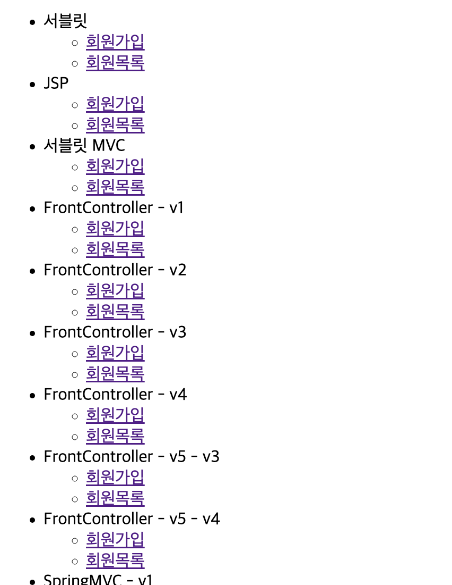

# Spring 프레임워크 제작

> [!NOTE]
> Servlet + JSP 기반의 간단한 MVC 프레임워크를 직접 제작해보는 미니 프로젝트
> Spring 기초(김영한) 강의 실습 프로젝트에서 이관.

## 🧱 기술 스택
- Servlet
- JSP (View)

## ⚙️ 구현
- 요구사항
    1. 회원 저장
    2. 회원 목록 조회
- 특징
    - Spring 처리 로직 이해
    - Spring에서 Servlet을 사용하는 구간
    - Spring에서 Adapter의 역할

### 구현 이미지

### 참고
- GitSource: [sweetpark/Servlet_Ex](https://github.com/sweetpark/Servlet_Ex)
- 블로그
    - Servlet + JSP MVC 적용 — [MVC 패턴 (Servlet + JSP)](https://gradualprecision.tistory.com/76)
    - FrontController 도입 — [Spring 예제#1 (+Servlet, JSP, FrontController)](https://gradualprecision.tistory.com/77)
    - FrontController + Adapter 패턴 적용 — [Spring 예제#2 (Adapter Handler, FrontController)](https://gradualprecision.tistory.com/78)
