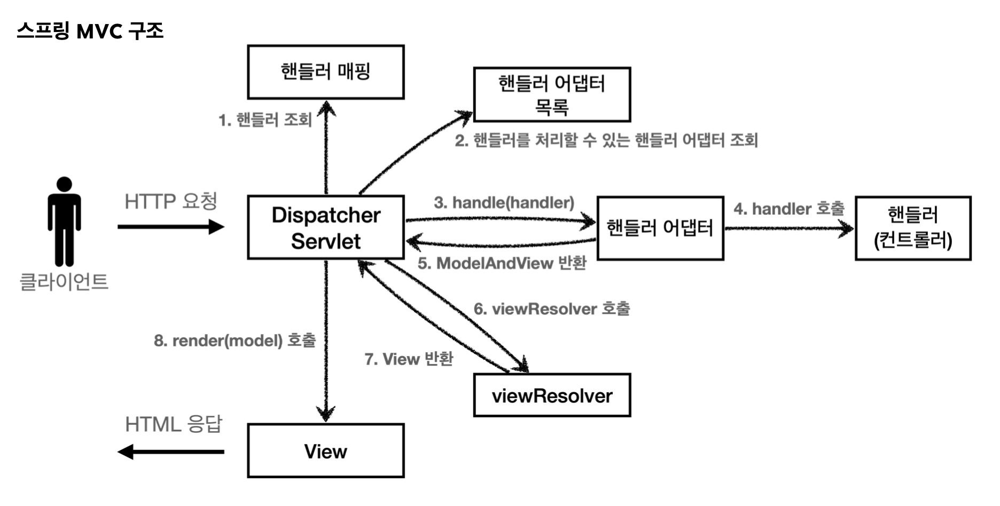

# JPA

> [!NOTE]
> JPA 연관관계 매핑(`@ManyToOne`/`@OneToMany`)과 Mapping 테이블 처리 기준 정리.
> Onz(칵테일 플랫폼) 프로젝트에서 이관.

## ⚙️ 구현

### 연관관계 매핑

- `@ManyToOne`
    - 상대 테이블에서 여러개와 연결될수있음 (N:1 중에 "1" 인 테이블)
    - `@JoinColumn`으로 받음

```java
@ManyToOne
@JoinColumn(name = "cocktail_id", nullable = false)
private Cocktail cocktail; // 단일
```

- `@OneToMany`
    - 상대테이블에서 여러개를 가져옴 (N:1 중에 "N"인 테이블)
        - 해당 테이블과의 연결에서 ingredient가 여러개 일수있음

```java
@OneToMany(mappedBy = "cocktail")
private List<MappingIngredient> ingredients = new ArrayList<>(); // 여러개
```

- JPA는 객체지향적으로 코드화
    - Mapping 테이블의 경우, JPA가 M:N관계라면 자동으로 만들어줌 (수동으로 지정도 가능)
    - 수동으로 만들 때, Mapping테이블에서 id값을 받으려고 "Integer [상대방id];" 를 하면 안됨
        - 객체로 받아야함

```java
Long id; // (x)
Cocktail cocktail // (o)
```

> [!NOTE]
> 하지만, DB에 적재할때는 id값만 적재됨 (JPA가 처리하는 과정에서 객체를 받는 것뿐이지 실제론 id만 저장되고 조회하기 위해서 JPA가 직접 참조테이블에서 쿼리를 날려 값을 가져옴)

### Mapping 테이블 처리 기준

- entity를 직접 만들지 않아도 JPA에서 자동으로 만들어서 사용됨
- 만들더라도, Repository를 만들지 않아도 됨
- 하지만, 아래 상황에서 비교하여 필요할 때는 만들어줘야함

| 상황 | 필요 여부 |
| --- | --- |
| `Mapping` 테이블을 직접 조회할 필요 없음 | ❌ 필요 없음 (`@Query` 사용) |
| 특정 `Mapping` 데이터를 추가/삭제해야 함 | ✅ 필요함 (`deleteByCocktailId()` 등 사용) |
| 특정 `Mapping` 리스트를 직접 가져와야 함 | ✅ 필요함 (`findByTasteId()` 등 사용) |
| 비즈니스 로직에서 직접 매핑을 컨트롤해야 함 | ✅ 필요함 (매핑 추가/삭제 API |

### 1:N 맵핑

- JPA를 이용한 애플리케이션에서는 id 값이 아닌 객체로 이용

```java
@Entity(name="taste_detail")
public class TasteDetail {
    @Id
    @GeneratedValue(strategy = GenerationType.IDENTITY)
    private Long id;
    @ManyToOne
    @JoinColumn
    private TasteCategory tasteCategory;
    @Column(name="taste_detail")
    private String tasteDetail

}

//DB 실제
//id값으로 들어감 (JPA가 내부적으로 객체로 반환하게 함)
```


