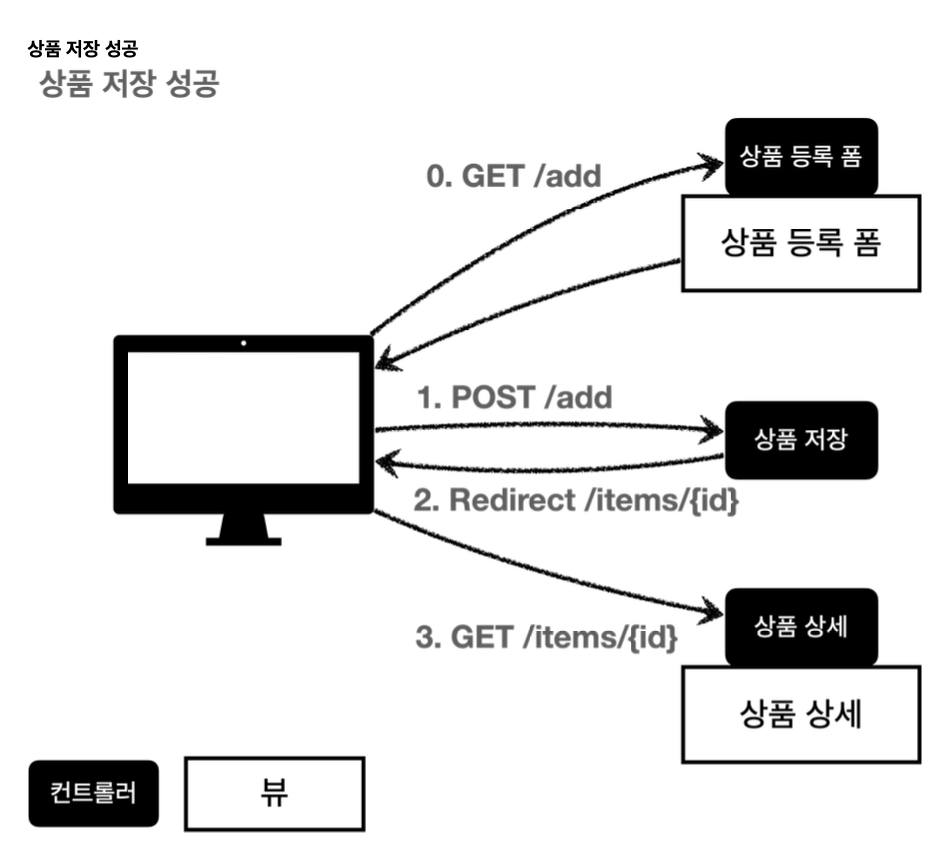
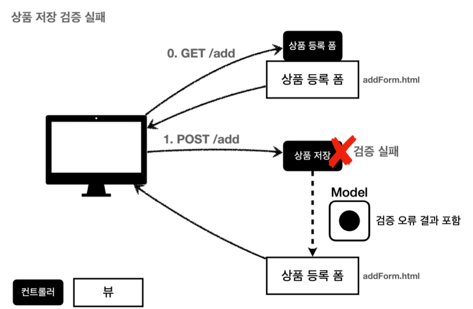
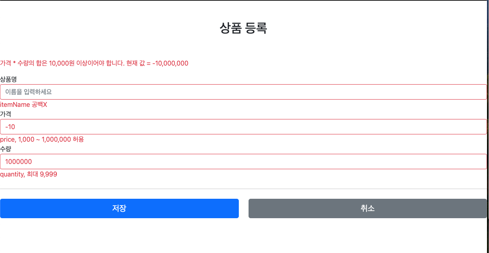
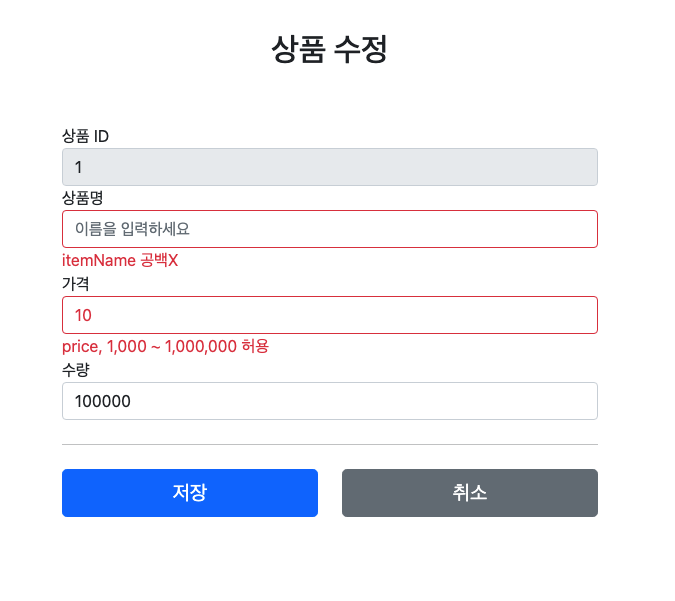

# 검증

> [!NOTE]
> 상품 등록/수정 검증 구현 — @Validated, Bean Validation, Validator 구분
> Spring 기초(김영한) 강의 실습 프로젝트에서 이관.

## 🧱 기술 스택
- Spring Validation (`@Validated`)
- Bean Validation
- Thymeleaf

## ⚙️ 구현
- 요구사항
    - 상품등록
        - 타입 검증
            - 가격, 수량 → 문자 입력시 오류
        - 필드 검증
            - 상품명 : 필수, 공백 x
            - 가격 : 1000원 이상, 1백만원 이하
            - 수량 : 최대 9999
        - 특정 필드의 범위를 넘어서는 검증
            - 가격 * 수량의 합은 10,000원 이상
    - 상품 수정
        - 필드 검증
            - ID 필수값
            - 수량의 경우 무제한
        - 나머지 조건은 동일

### 도메인 설계

### 구현 이미지

### 참고
- GitSource: [sweetpark/SpringThymeleaf](https://github.com/sweetpark/SpringThymeleaf)
- 블로그: [gradualprecision.tistory.com/89](https://gradualprecision.tistory.com/89), [/90](https://gradualprecision.tistory.com/90)
