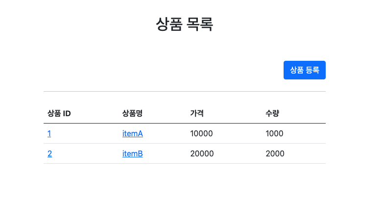
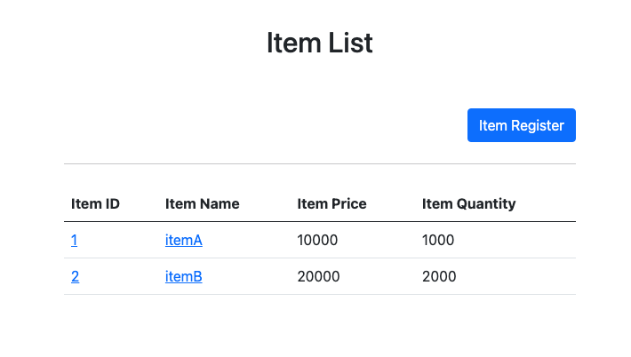

# 메시지, 국제화

> [!NOTE]
> 메시지 Bean 적용 및 국제화(i18n) — `.properties` 파일 기반 message/international 처리

> [!NOTE]
> 원문을 AI가 검토·보강함(사실 확인 권장).

## 🧱 기술 스택
- Spring MessageSource (메시지 Bean)
- Java 국제화(i18n) — `messages.properties` / `messages_en.properties` 등 로케일별 프로퍼티 파일
- Thymeleaf (`#{...}` 메시지 표현식)

## ⚙️ 구현
- 메시지 Bean 적용
- message, international 적용 방법
- `.properties` file 작성

메시지 Bean으로 UI 텍스트를 코드에서 분리해두면, 문구 변경이나 다국어 지원이 필요할 때 소스 코드를 건드리지 않고 로케일별 프로퍼티 파일만 교체·추가하면 되므로 유지보수와 국제화 대응이 쉬워진다.

### 구현 이미지

### 참고
- GitSource: [sweetpark/SpringThymeleaf (MessageInternational)](https://github.com/sweetpark/SpringThymeleaf/tree/MessageInternational)
- 블로그: [gradualprecision.tistory.com/88](https://gradualprecision.tistory.com/88)

## 관련 문서

- [(학습/프레임워크/Spring Framework) 메시지, 국제화](../../메시지,%20국제화.md) — MessageSource/LocaleResolver 이론을 정리한 기초 노트
