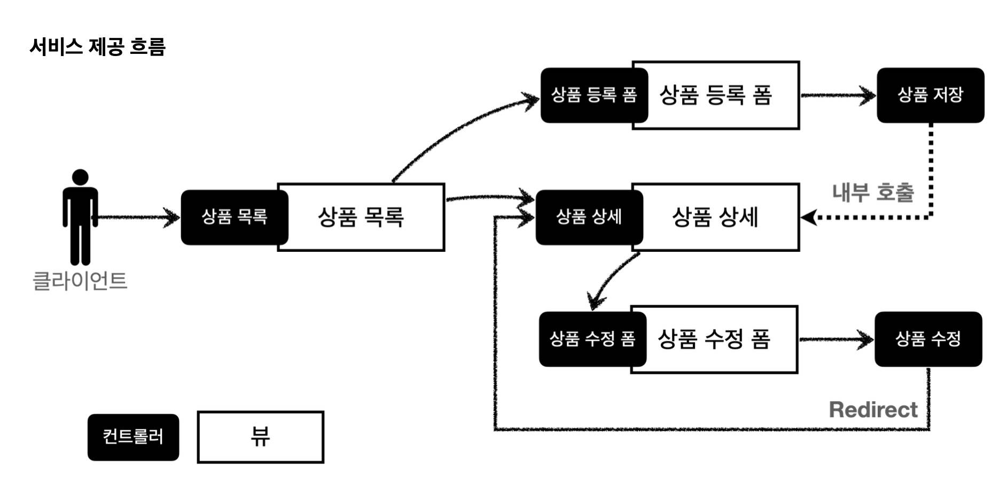
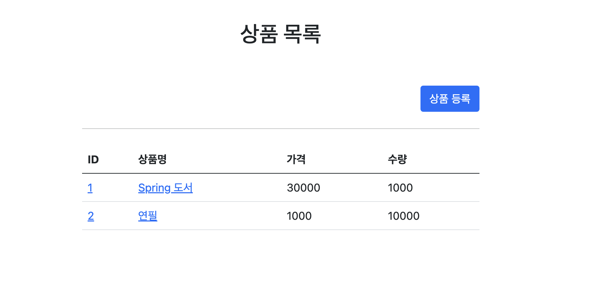
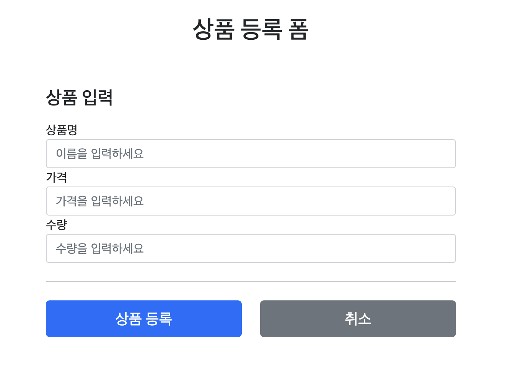
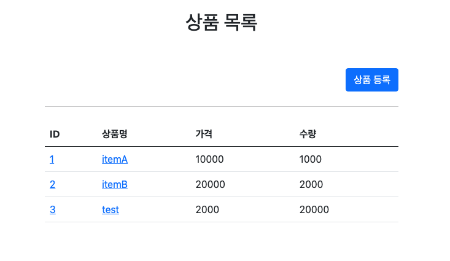
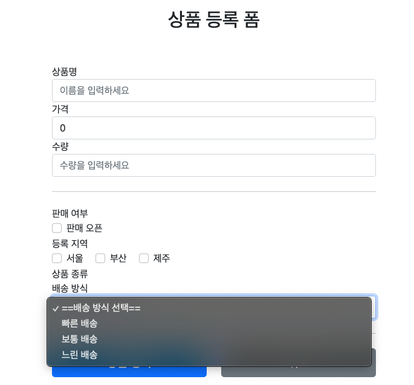
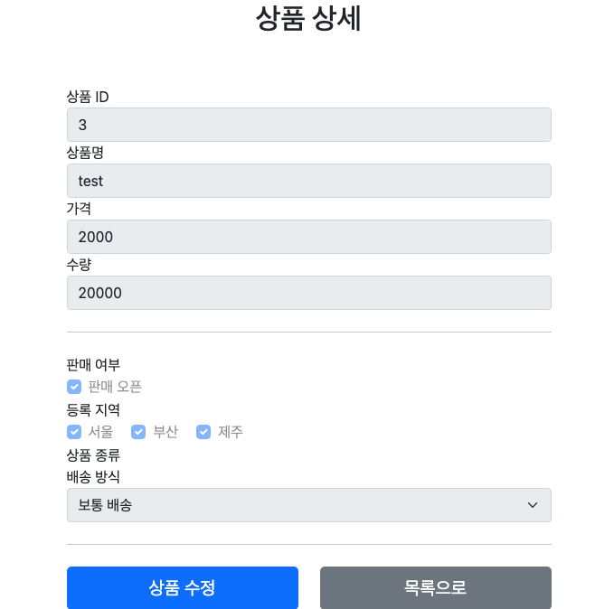

# 상품 등록 및 조회/ 수정

> [!NOTE]
> Request Method(`@RequestParam`, `@ModelAttribute`)와 PRG 패턴을 이용한 상품 등록/조회/수정 미니 프로젝트
> Spring 기초(김영한) 강의 실습 프로젝트에서 이관.

> [!NOTE] 실행 환경
> 버전 명시 없음 — `@RequestParam`/`@ModelAttribute`/`@PathVariable`, Thymeleaf 등 Spring MVC 표준 API만 사용되어 특정 버전은 확정하기 어렵다.

## 🧱 기술 스택
- Spring MVC (`@RequestParam`, `@ModelAttribute`, `@PathVariable`)
- Thymeleaf 템플릿 엔진
- PRG(Post-Redirect-Get) 패턴

## ⚙️ 구현

### 상품 등록 및 조회
- Request Method 사용 (@RequestParam, @ModelAttribute)
- Post - Redirect - Get 방식 사용 (Post 중복처리 방지)
- thymeleaf 템플릿엔진 사용
- @PathVariable을 통한 URL 데이터 정보 활용

상품등록 도메인

#### 구현 이미지

#### 참고
- GitSource: [sweetpark/ShopItemRegister](https://github.com/sweetpark/ShopItemRegister)
- 블로그: Spring Http 요청 처리 — [gradualprecision.tistory.com/84](https://gradualprecision.tistory.com/84)

### 상품 등록 및 수정
- radio 버튼
- select
- 단일 / 다중 선택
- PRG (Post - Redirect - Get)
- thymeleaf

#### 구현 이미지

#### 참고
- GitSource: [sweetpark/SpringThymeleaf (ThymeleafUI)](https://github.com/sweetpark/SpringThymeleaf/tree/ThymeleafUI)

## 관련 문서

- [(Spring) 검증 - 핵심 개념 및 특징 정리](../검증/[Spring]%20검증%20-%20핵심%20개념%20및%20특징%20정리.md) — 이 프로젝트의 상품 등록/수정 폼에 타입·필드·범위 검증을 추가한 후속 미니 프로젝트
