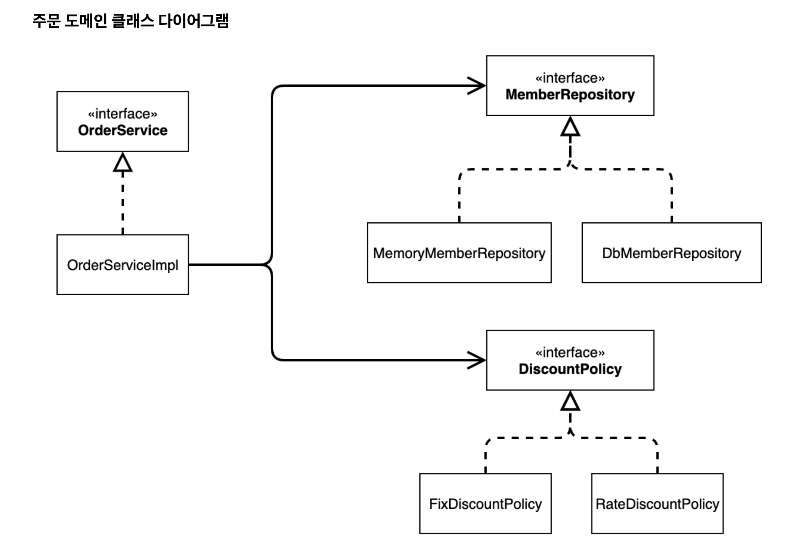
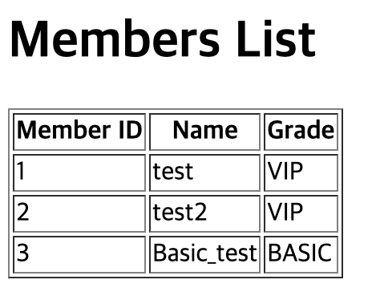
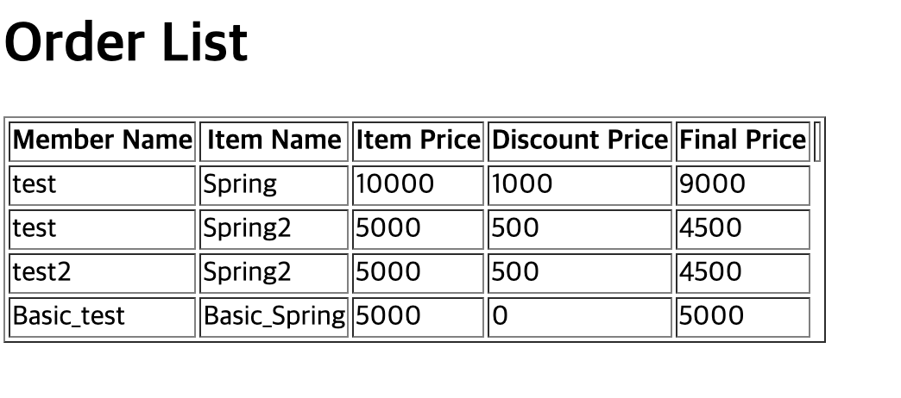

# 회원 등급별 상품 할인 적용

> [!NOTE]
> AppConfig 기반 수동/자동 Bean 등록과 OCP·DIP, 싱글톤을 활용한 회원 등급별 상품 할인 미니 프로젝트
> Spring 기초(김영한) 강의 실습 프로젝트에서 이관.

## 🧱 기술 스택
- Spring `@ComponentScan`, 수동/자동 Bean 등록
- OCP(개방-폐쇄 원칙), DIP(의존관계 역전 원칙)
- Spring 싱글톤 컨테이너

## ⚙️ 구현
- 요구사항
    - 회원 저장
    - 회원 목록 조회
    - 상품 주문
    - 주문된 상품 조회 및 최종 가격확인
- 주문 도메인 클래스 다이어그램

### 구현 이미지
- 멤버 조회

- 주문 조회

### 참고
- GitSource: [sweetpark/SpringBasic](https://github.com/sweetpark/SpringBasic)
- 블로그
    - component Scan — [gradualprecision.tistory.com/58](https://gradualprecision.tistory.com/58)
    - SOLID 규칙 — [gradualprecision.tistory.com/54](https://gradualprecision.tistory.com/54)
    - Spring 컨테이너 — [gradualprecision.tistory.com/55](https://gradualprecision.tistory.com/55)
    - 의존관계 자동주입(@Autowired) — [gradualprecision.tistory.com/59](https://gradualprecision.tistory.com/59)
