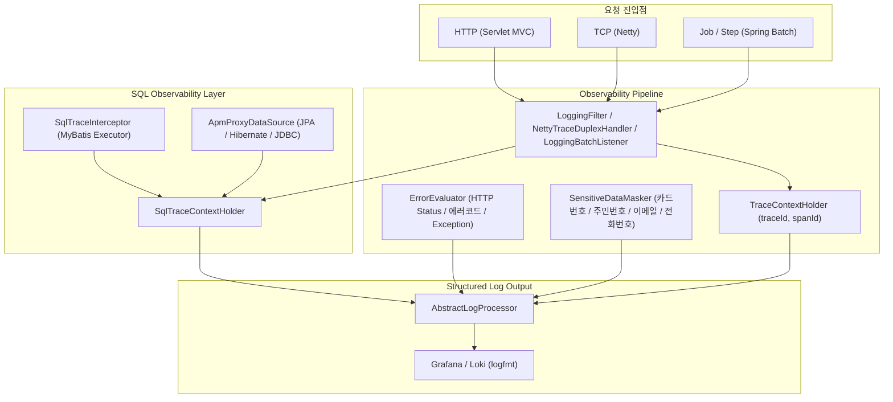
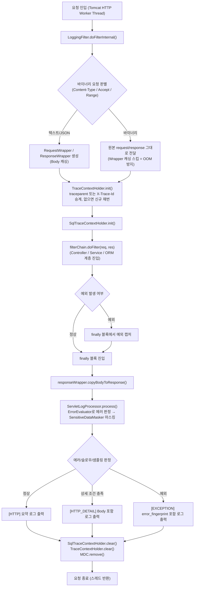
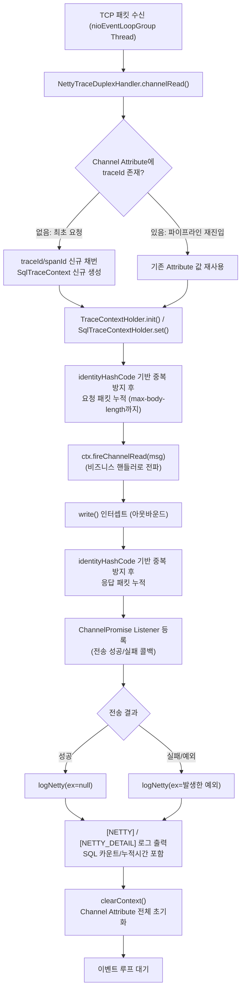
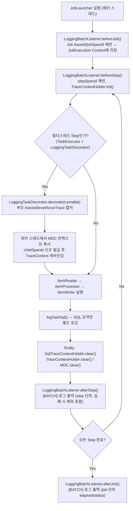
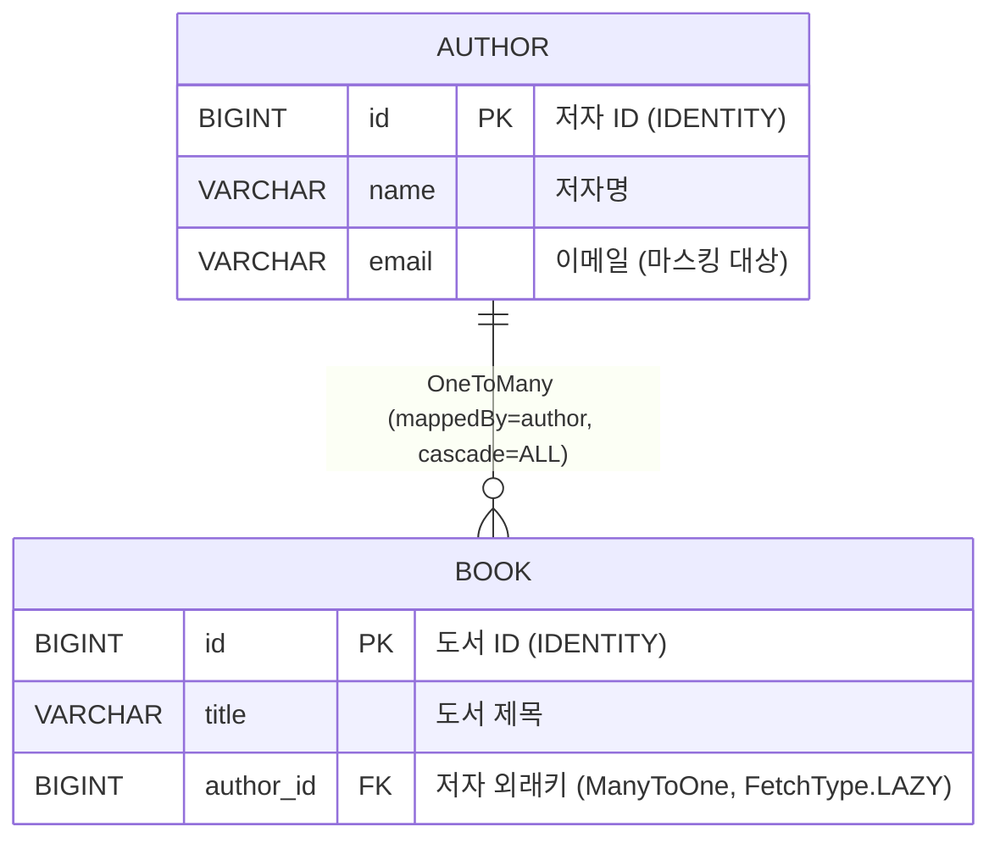
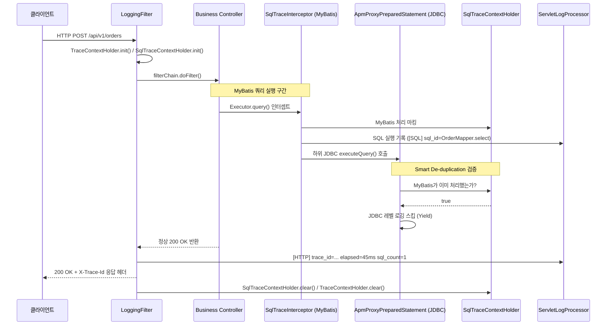
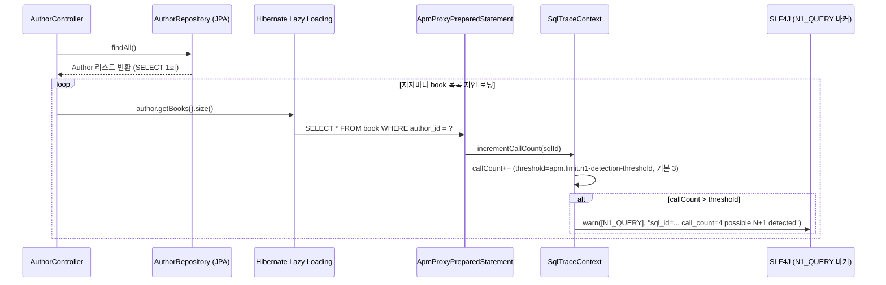
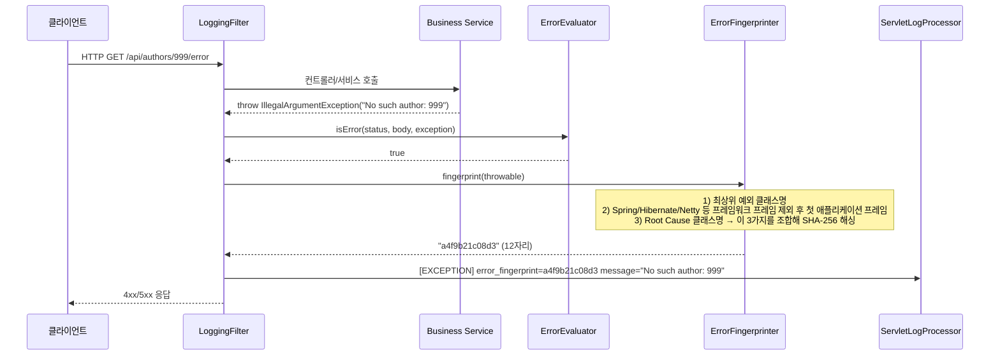

# mini-apm-spring-boot-starter - 상세 분석 및 기술 가이드

> **Lightweight Non-Invasive Observability & APM Starter for Spring Boot**
> 무거운 APM 에이전트(바이트코드 위빙/별도 프로세스) 설치 없이, 의존성 한 줄과 `@AutoConfiguration`만으로 **SQL 실행 시간 측정, 완성형 SQL 로깅, N+1 쿼리 감지, SHA-256 기반 에러 핑거프린팅, 민감정보 마스킹, 비동기 로깅, Grafana/Loki 연동**까지 확보할 수 있는 오픈소스 APM 스타터.

직접 설계·구현하고 Apache 2.0 라이선스로 공개한 라이브러리다. Servlet(Spring MVC) / Netty(TCP) / Spring Batch 세 가지 런타임을 모두 지원하고, MyBatis와 JPA(Hibernate) SQL 추적을 동시에 처리하며, CI(GitHub Actions)와 JitPack 배포, SpotBugs 정적 분석, 85% 이상의 테스트 커버리지 게이트를 갖추고 있다. 아래는 **Flowchart(스레드 분리) → ERD → Call Flow → 설정/운영 가이드** 순서로, 실제 GitHub 저장소의 소스 코드와 문서를 기준으로 검증하며 정리한 상세 분석이다.

---

## 1. 프로젝트 개요

### 왜 만들었는가

기존 상용/오픈소스 APM은 대체로 무겁다. 별도 에이전트를 JVM에 붙이거나, 전체 트래픽의 요청/응답 바디를 통째로 수집하다가 오히려 서비스 안정성을 해치는 경우도 있다. 이 프로젝트의 출발점은 다음 네 가지 목적을 "최소한의 데이터로" 만족시키는 것이었다.

1. 요청이 오기 전에 이상 징후를 먼저 감지하고 싶다 (Error Rate, 응답시간, SQL 시간 등 지표 기반)
2. 어디가 느린지 정확히 알고 싶다 (요청 단위 Trace + 레이어별 소요시간)
3. 장애가 발생했을 때 요청이 어디를 타고 갔는지 흐름을 추적하고 싶다 (traceId/spanId)
4. 로그를 뒤지지 않아도 에러 내용을 바로 확인하고 싶다 (예외 클래스/메시지/SQL 요약을 에러 발생 시점에만 상세히)

핵심 전략은 한 문장으로 요약된다.

> **"모든 데이터를 항상 수집하는 것이 아니라, 목적을 만족하는 최소 데이터만 항상 수집하고, 문제 상황(에러/슬로우)에서만 상세 데이터를 조건부로 수집한다."**

이 전략이 이후 소개할 계층형 로그 레벨(`PROD`/`TRACE`), 캡처 모드(`ALWAYS`/`ERROR`/`SLOW`/`SAMPLE`/`OFF`), OOM 방지 리미트 설계의 근간이 된다.

### 핵심 특징

- **Non-Invasive**: 비즈니스 로직에 애노테이션이나 수동 로깅 코드를 추가할 필요 없이 100% 자동 계측
- **멀티 런타임 지원**: Spring Web(Servlet/MVC), Netty TCP, Spring Batch
- **듀얼 ORM 완전 지원**: MyBatis(`SqlTraceInterceptor`) + JPA/Hibernate/JDBC(`ApmProxyDataSource`)를 동시에 지원하며, 같은 트랜잭션에서 둘 다 활성화돼도 **Smart De-duplication**으로 중복 로깅을 방지
- **N+1 쿼리 감지**: 같은 요청/트랜잭션 내에서 동일 SQL ID가 임계치(기본 3회)를 넘게 반복되면 즉시 `[N1_QUERY]` 경고 발행
- **SHA-256 에러 핑거프린팅**: 프레임워크 스택을 걷어내고 애플리케이션 핵심 스택만 해싱해 12자리 지문 생성 → Grafana Loki에서 동일 원인 에러를 `error_fingerprint`로 집계
- **민감정보 자동 마스킹**: 카드번호, 주민등록번호, 이메일, 전화번호를 정규식으로 마스킹
- **OOM 방지 리미트**: SQL 개수, 상세 로그 개수, 바디 길이, 스택 깊이에 상한을 둬 트래픽 급증 시에도 메모리 사용량을 예측 가능한 범위로 유지
- **Grafana Loki / logfmt 최적화**: 모든 로그를 SLF4J Marker + `key=value` logfmt로 출력해 Loki 라벨 추출과 LogQL 성능을 극대화

---

## 2. 설계 철학 — 왜 이렇게 설계했는가

단순히 "동작하는 로깅 코드"가 아니라, 각 계층의 제약을 이해하고 그에 맞는 기술을 배치한 결과물이라는 점이 이 프로젝트의 핵심이다.

### 2.1 왜 HTTP 로깅은 `HandlerInterceptor`가 아니라 `Servlet Filter`인가

가장 설계 의도가 잘 드러나는 지점이다.

- **풀어야 했던 문제**: Request Body / Response Body를 로깅하려면 Controller 진입 전/후를 모두 제어해야 하고, Body는 재사용 가능해야 한다.
- **`HandlerInterceptor`의 한계**: `HttpServletRequest`의 Body는 `InputStream`이라 단 한 번만 읽을 수 있다. Interceptor에서 미리 읽어버리면 Controller에서는 더 이상 읽을 수 없다. 이건 구현 실수가 아니라 **Servlet 스펙 자체의 제약**이다.
- **선택**: `Servlet Filter` + `RequestWrapper`/`ResponseWrapper`. 실제로 `LoggingFilter`는 `OncePerRequestFilter`를 상속하며, 요청이 바이너리(멀티파트 업로드, `Range` 헤더, `application/octet-stream`)가 아닐 때만 Wrapper로 감싸 Body를 캐싱하고, 캐싱된 데이터를 Controller와 로깅 시점 양쪽에서 안전하게 재사용한다.

### 2.2 왜 SQL 로깅은 Filter/AOP가 아니라 MyBatis `Interceptor`와 JDBC `DataSource Proxy`인가

- **풀어야 했던 문제**: `?`로 바인딩된 PreparedStatement가 아니라, 실제 파라미터가 채워진 완성형 SQL과 정확한 실행 시간이 필요했다.
- **Filter/AOP가 부적합한 이유**: HTTP 계층에서는 SQL 실행 시점에 개입할 수 없고, `BoundSql`이나 파라미터 매핑 정보에 접근할 방법이 없다.
- **선택**: MyBatis 사용 시엔 `Executor` 실행 시점에 개입하는 `SqlTraceInterceptor`가, MyBatis가 없거나 순수 JPA/Hibernate 환경에서는 `DataSource`를 감싸는 `ApmProxyDataSource`/`ApmProxyPreparedStatement`가 SQL을 가로챈다. **SQL 로깅은 HTTP 계층 문제가 아니라 Persistence 계층 문제였기 때문에, 계층에 맞는 기술을 선택했다.**

### 2.3 왜 Content-Type을 검사하는가 (OOM 방지)

파일 업로드처럼 대용량 바이너리 데이터를 무분별하게 캐싱하면 Wrapper가 그대로 Heap을 점유해 GC 압박, 심하면 서비스 다운으로 이어질 수 있다. 그래서 `LoggingFilter`는 `Accept: application/octet-stream`, `Content-Type: multipart/form-data`, `Range` 헤더가 있는 요청을 바이너리로 판단해 애초에 Wrapper 캐싱 자체를 건너뛴다. 응답도 `Content-Disposition: attachment`나 텍스트 계열이 아닌 `Content-Type`이면 바디를 읽지 않는다. **"로그는 관측 수단이지, 시스템을 위험하게 만드는 요소가 되어서는 안 된다"**는 원칙이 코드 레벨까지 관통한다.

### 2.4 왜 계층형 로그 레벨(`PROD` / `TRACE`)인가

- **`PROD`**: 운영 지표용 최소 정보(응답시간, 상태 코드, traceId)와 에러/슬로우 로그만 상시 수집
- **`TRACE`**: 여기에 SQL 파라미터, Request/Response Body 전문까지 강제로 상세 기록

모니터링(항상 켜져 있어야 함)과 디버깅(필요할 때만 켜면 됨)은 목적이 다르기 때문에 로그 전략도 분리했다. 장애 대응 중에는 `apm.trace.level=TRACE`로 전환하거나, 특정 요청 헤더(`X-Debug-Trace: true`)로 해당 요청만 강제 상세 로깅할 수 있다.

### 2.5 왜 설정 기반(Properties) 제어인가

로그 레벨을 바꾸기 위해 매번 재배포해야 한다면 장애 대응 속도가 크게 떨어진다. `apm.trace.level`, `apm.slow.query.ms` 같은 값을 `application.yml` 설정만으로 즉시 바꿀 수 있게 하여, "디버깅 모드 ON → 원인 분석 → OFF" 흐름이 배포 없이 가능하도록 설계했다. Starter 구조상 라이브러리를 추가하는 것만으로 동작해야 하므로, 소비 프로젝트의 코드 개입을 최소화하는 방향과도 맞아떨어진다.

---

## 3. 전체 아키텍처

### 3.1 컴포넌트 다이어그램



`io.github.sweetpark.apm.core` 패키지에 트레이스 컨텍스트(`TraceContextHolder`), SQL 컨텍스트(`SqlTraceContextHolder`, `SqlTraceContext`), 에러 평가/핑거프린팅(`ErrorEvaluator`, `DefaultErrorEvaluator`, `ErrorFingerprinter`), 마스킹(`SensitiveDataMasker`) 등 런타임 공통 로직이 모여 있고, `support.servlet` / `support.netty` / `support.batch` 패키지가 각 런타임 전용 어댑터 역할을 한다.

### 3.2 Servlet Runtime — HTTP Worker Thread (Tomcat)



`SqlTraceContextHolder.clear()`와 `TraceContextHolder.clear()`가 `try-finally`의 `finally`에 위치해, 어떤 Unchecked Exception이 발생해도 Tomcat 스레드 풀 재사용 시 ThreadLocal 오염을 방지한다.

### 3.3 Netty TCP Runtime — EventLoop Thread



비차단 I/O 특성을 지키기 위해 무거운 동기 파싱을 배제하고, `ByteBuf`는 지정된 최대 길이까지만 UTF-8 문자열로 변환한다(`safeToString`). `identityHashCode`로 같은 메시지 객체가 파이프라인을 여러 번 통과해도 중복 누적되지 않도록 방지한 점이 특징이다.

### 3.4 Spring Batch Runtime — TaskDecorator Thread



`ThreadPoolTaskExecutor`를 사용하는 병렬 청크 Step 환경에서는 자식 워커 스레드로 `ThreadLocal` 컨텍스트가 전파되지 않는 문제를, `TaskDecorator` 구현체인 `LoggingTaskDecorator`로 해결한다. 부모의 `traceId`는 그대로 복사하되, `spanId`는 자식 스레드마다 새로 발급해 어떤 워커 스레드가 어떤 SQL/로그를 남겼는지 구분할 수 있게 했다.

---

## 4. SQL 추적 — MyBatis와 JPA 동시 지원 (Smart De-duplication)

같은 애플리케이션에서 MyBatis와 Spring Data JPA(Hibernate)를 함께 쓰는 경우가 드물지 않다. 이때 두 인터셉터가 동시에 활성화되면 같은 SQL이 두 번 로깅될 수 있는데, 다음과 같은 순서로 중복을 제거한다.

1. `SqlTraceInterceptor`(MyBatis)가 SQL을 가로채면 `SqlTraceContextHolder`에 "이 트랜잭션은 MyBatis가 처리 중"이라고 마킹한다.
2. 더 하위 계층인 `ApmProxyPreparedStatement`(JDBC 프록시)는 실행 직전 이 마킹 여부를 확인해서, MyBatis가 이미 처리했다면 로깅을 건너뛴다(Yield).
3. MyBatis가 없거나 해당 statement를 처리하지 않은 순수 JPA/Hibernate 쿼리라면, `ApmProxyPreparedStatement`가 파라미터 캡처·SQL 포맷팅·실행시간 측정·N+1 감지를 모두 직접 수행한다.

| 항목 | MyBatis 모드 | JPA 모드 |
| :--- | :--- | :--- |
| 개입 지점 | MyBatis `Executor` (`update`, `query`) | JDBC `DataSource` 프록시 (`PreparedStatement`) |
| SQL 추출 | `MappedStatement` & `BoundSql` | 인터셉트된 SQL 문자열 & 파라미터 인덱스 맵 |
| N+1 감지 | Mapper ID 기준 카운트 | SQL 시그니처 기준 카운트 |
| 슬로우 SQL | `[SLOW_SQL]` 마커 | `[SLOW_SQL]` 마커 |

---

## 5. 도메인 모델 (ERD) — 검증용 샘플 앱 기준

mini-apm 자체는 별도 RDB 테이블을 만들지 않고 구조화된 `logfmt` 로그를 Loki로 보낸다. 대신 저장소에 포함된 `examples/sample-app`이 실제 동작을 눈으로 확인할 수 있는 최소 도메인을 제공한다.



| 테이블 | 컬럼 | 비고 |
| :--- | :--- | :--- |
| `author` | `id`, `name`, `email` | `email`은 `SensitiveDataMasker` 마스킹 대상 |
| `book` | `id`, `title`, `author_id` | `author`는 `@JsonIgnore`로 순환 참조 차단 |

`AuthorController`는 mini-apm의 각 기능을 한 엔드포인트씩 시연하도록 설계돼 있다.

| 엔드포인트 | 시연하는 기능 |
| :--- | :--- |
| `GET /api/authors` | 단건 조회, 정상 `[HTTP]` + `[SQL]` 로그 |
| `GET /api/authors/n-plus-one` | `findAll()` 후 루프에서 `author.getBooks()` 지연 로딩 → **N+1 쿼리 감지** |
| `GET /api/authors/slow` | `Thread.sleep(1200)`으로 `apm.slow.api-ms` 초과 → 슬로우 API 로그 |
| `GET /api/authors/{id}/error` | 존재하지 않는 ID 조회 시 예외 발생 → **에러 핑거프린팅** |
| `POST /api/authors` | 요청 바디의 이메일/전화번호가 `[HTTP_DETAIL]` 로그에서 마스킹되는지 확인 |

---

## 6. Call Flow — 시나리오별 시퀀스 다이어그램

### 6.1 정상 HTTP 트랜잭션과 듀얼 ORM Smart De-duplication



### 6.2 N+1 쿼리 감지 시나리오



### 6.3 예외 발생 및 SHA-256 에러 핑거프린팅



---

## 7. 설정 가이드

### 7.1 전체 프로퍼티 레퍼런스 (`application.yml`)

```yaml
apm:
  enabled: true
  trace:
    level: PROD                       # PROD(요약 중심) | TRACE(상세 강제)
    header-name: X-Trace-Id           # 클라이언트 전파용 헤더 (W3C traceparent도 자동 인식)
    interface-header-name: X-Interface-Id
  slow:
    api-ms: 1000                      # API 응답 지연 임계치(ms)
    query:
      ms: 300                         # 단일 SQL 슬로우 기준(ms)
      total-ms: 1000                  # 요청당 SQL 누적시간 기준(ms)
  capture:
    body: ERROR                       # ALWAYS | ERROR | SLOW | SAMPLE | OFF
    sql: SLOW                         # ALWAYS | ERROR | SLOW | SAMPLE | OFF
    sample-rate: 0.01                 # SAMPLE 모드 샘플링 비율(1%)
  security:
    masking-enabled: true
    mask-body: true
    mask-sql-param: true
  limit:
    max-sql-count: 100                # 요청당 최대 SQL 추적 개수 (OOM 방지)
    max-sql-detail-count: 10          # 상세(쿼리문/파라미터)를 남길 최대 SQL 개수
    max-sql-length: 2000
    max-sql-param-length: 1000
    max-body-length: 2000
    n1-detection-threshold: 3
    max-stack-depth: 5
  error:
    http-status-threshold: 400
    error-code-keys: [resCode, res_cd, code, errorCode, status]
    error-codes: ["9999", "ERROR", "FAIL", "ERR"]
    app-package-prefixes: [com.example]   # 핑거프린팅 시 우선 탐색할 애플리케이션 패키지
```

| 캡처 모드 | 의미 |
| :--- | :--- |
| `ALWAYS` | 모든 요청/쿼리 상세 기록 |
| `ERROR` | 오류 발생 시에만 상세 기록 |
| `SLOW` | 임계치 초과 시 상세 기록 |
| `SAMPLE` | 샘플링 비율에 따라 일부만 기록 |
| `OFF` | 기록 안 함 |

### 7.2 런타임별 권장 설정 조합

서블릿 기반 API 서버 / Netty 기반 TCP 서버 / 배치 서버 세 런타임에 이 스타터를 적용해보면서 정리한 튜닝 값이다. 트래픽 패턴이 서로 다르기 때문에 기본값을 그대로 쓰기보다 아래 방향으로 조정하는 것을 권장한다.

**서블릿(일반 웹 API 서버)** — 요청 단위 처리, 응답 시간이 중요, 에러 추적 + 일부 샘플링 분석 필요
```yaml
apm:
  trace.level: PROD
  capture:
    sample-rate: 0.05     # 5%는 상세 분석용으로 남긴다
    body: ERROR
    sql: SLOW
  slow.api-ms: 500
```
정상 트래픽은 요약만, 5%는 상세 분석용, 0.5초 이상 API는 자동 감지, 에러 발생 시에만 바디까지 확보한다는 의도다.

**Netty(TCP/바이너리 프로토콜 서버)** — Fragmentation 발생 가능, 바이너리 페이로드로 인한 로그 폭증 위험
```yaml
apm:
  trace.level: PROD
  capture.body: SAMPLE
  limit.max-body-length: 1000
```
파이프라인에는 `NettyTraceDuplexHandler`를 디코더 이후·비즈니스 핸들러 이후 두 지점에 배치하는 걸 권장한다. 앞쪽(디코더 이후)은 DTO 형태로 변환된 깨끗한 로그를, 뒤쪽(비즈니스 핸들러 이후)은 비즈니스 예외까지 확실히 포착하는 역할을 담당한다.

**Spring Batch(대량 처리/스케줄러)** — 한 Step에서 수천~수만 건 SQL 발생, 메모리 보호가 최우선
```yaml
apm:
  capture.sql: ERROR         # 정상 SQL은 요약만, 에러 SQL만 상세
  limit:
    max-sql-count: 200
    max-sql-detail-count: 20
  slow.query.total-ms: 3000
```
10,000건의 SQL이 발생해도 설정된 개수만 상세 로깅하고 나머지는 `omitted` 처리해 메모리 점유를 최소화한다. 멀티스레드 청크 Step에서는 `LoggingTaskDecorator`를 `TaskExecutor`에 반드시 등록해야 자식 스레드까지 `traceId`가 정확히 전파된다.

```java
ThreadPoolTaskExecutor executor = new ThreadPoolTaskExecutor();
executor.setCorePoolSize(4);
executor.setMaxPoolSize(8);
executor.setTaskDecorator(new LoggingTaskDecorator());
executor.initialize();
```

> **적용 팁**: 장애 대응 중에는 `apm.trace.level=TRACE`로 바꾸면 샘플링을 무시하고 모든 요청을 강제 상세 기록한다. Spring Cloud Config 등으로 동적 반영이 가능하면 재배포 없이 즉시 전환할 수 있다. 특정 요청 하나만 재현하고 싶다면 `X-Debug-Trace: true` 헤더를 붙이면 된다.

---

## 8. OOM 방지 설계 — "요약은 항상, 상세는 조건부"

로깅 라이브러리가 오히려 서비스 장애의 원인이 되는 걸 막기 위해 처음부터 다음 원칙을 세우고 설계했다.

### 8.1 실제로 마주쳤던 위험 패턴

대용량 트래픽·큰 파일 업로드·배치 대량 처리 환경에서 공통 로깅 계층을 붙일 때 실제로 부딪혔던 세 가지 위험 패턴이 있다.

1. Request Body를 `readAllBytes()`류 방식으로 통째로 메모리에 적재하는 Wrapper — 대용량 업로드 시 그대로 힙 폭증
2. 응답 바디를 JSON 트리로 통째로 DOM 파싱하며 길이 제한 없이 로깅하는 처리기 — 수십 MB 응답을 그대로 파싱
3. 배치 Chunk 단위 SQL 로그를 스레드 로컬 컨텍스트에 계속 누적시키는 구조 — Job이 끝날 때까지 해제되지 않고 쌓임

해결 방향은 세 가지 모두 동일하다. **"전체를 한 번에 메모리에 올리는 방식"에서 "스트리밍/지연 평가 + 개수·길이 상한"으로 바꾸는 것.** 대용량 트래픽 및 배치 환경에 이 프레임워크를 적용할 때 이 리스크를 사전에 차단하는 것이 설계의 최우선 목표였고, 기존 비즈니스 코드는 한 줄도 건드리지 않고 라이브러리 단에서 투명하게 적용되도록 만들었다.

### 8.2 핵심 원칙

| 상황 | Body | SQL 텍스트 |
| :--- | :--- | :--- |
| 정상 | 샘플링 | ID만 |
| Slow | 제한된 크기 | Top N / 상세 개수 제한 |
| Error | 제한된 크기 | Top N / 상세 개수 제한 |
| Debug(TRACE) | 제한된 크기 | 전체 가능 |

- **바디 캡처**: 무조건 전체 저장 금지, 제한된 버퍼 방식 사용(`apm.limit.max-body-length`, 초과 시 truncate 표시)
- **SQL 저장**: 요약 통계(`sqlCount`, `totalElapsed`)는 항상 유지하고, 상세 쿼리문/파라미터는 `max-sql-detail-count`까지만 유지. `SqlTraceContext`는 개수 초과 시 정상 SQL부터 우선 제거(`removeOldestNormal()`)하고 에러 SQL은 보존한다.
- **N+1/슬로우 감지**: 모든 SQL을 리스트에 무한정 누적하는 대신, 호출 횟수 카운터(`callCounts` 맵)만으로 N+1을 판정해 메모리 오버헤드를 최소화한다.

### 8.3 보호 장치 요약

| 보호 장치 | 목적 |
| :--- | :--- |
| `apm.limit.max-sql-count` | 요청/Step당 SQL 폭증 방지 |
| `apm.limit.max-sql-detail-count` | 상세 로그(쿼리문/파라미터) 개수 제한 |
| `apm.limit.max-body-length` | 대용량 Payload 제한 |
| `apm.capture.sample-rate` | 정상 트래픽 로그량 제어 |
| `apm.limit.max-stack-depth` | 과도한 StackTrace로 인한 디스크 폭증 방지 |
| Content-Type 검사 | 바이너리 데이터 캐싱 원천 차단 |

---

## 9. 민감정보 마스킹 & 에러 핑거프린팅

### 9.1 `SensitiveDataMasker`

정규식 기반으로 빠르게 치환한다.

| 대상 | 예시 |
| :--- | :--- |
| 신용카드 번호 | `1234-5678-1234-5678` → `1234-****-****-5678` |
| 주민등록번호 | `900101-1234567` → `900101-1******` |
| 이메일 | `user@example.com` → `u***@example.com` |
| 전화번호 | `010-1234-5678` → `010-****-5678` |

`apm.security.mask-body`, `apm.security.mask-sql-param` 옵션으로 Body와 SQL 바인딩 파라미터 각각에 독립적으로 적용 여부를 제어할 수 있다.

### 9.2 `ErrorFingerprinter` 동작 방식

1. 최상위 예외 클래스명
2. `java.`, `org.springframework.`, `org.hibernate.`, `org.mybatis.`, `io.netty.` 등 프레임워크/JDK 패키지를 제외한 **첫 번째 애플리케이션 코드 스택 프레임** (`apm.error.app-package-prefixes`로 우선순위 지정 가능)
3. Root Cause 예외 클래스명 (최대 5단계까지 `cause` 체인 추적)

이 세 값을 조합한 문자열을 SHA-256으로 해싱하고, 앞 6바이트(12자리 hex)만 잘라 `error_fingerprint`로 사용한다. 같은 근본 원인의 예외는 스택 트레이스의 세부 라인 번호가 달라도 동일한 지문을 갖게 되어, Grafana Loki에서 `error_fingerprint`로 그룹핑하면 "지금 가장 많이 터지는 에러"를 실시간으로 랭킹화할 수 있다.

원하는 비즈니스 에러 판정 로직이 있다면 `ErrorEvaluator` 빈을 직접 등록해 기본 구현(`DefaultErrorEvaluator`)을 대체할 수 있다.

```java
@Bean
public ErrorEvaluator customErrorEvaluator() {
    return new ErrorEvaluator() {
        @Override
        public boolean isError(int httpStatus, String responseBody, Exception ex) {
            if (ex != null) return true;
            if (httpStatus >= 500) return true;
            return responseBody != null && responseBody.contains("\"result\":\"FATAL\"");
        }

        @Override
        public String extractErrorCode(int httpStatus, String responseBody, Exception ex) {
            return ex != null ? ex.getClass().getSimpleName() : "HTTP_" + httpStatus;
        }
    };
}
```

---

## 10. Grafana Loki 대시보드 & LogQL

저장소에는 바로 임포트 가능한 대시보드 템플릿(`grafana/mini-apm-dashboard.json`)이 포함돼 있고, `docker-compose up -d`로 Loki + Promtail + Grafana 스택을 1분 안에 로컬에서 띄워볼 수 있다.

### 10.1 대시보드 구성 원칙

운영자가 장애를 확인할 때 가장 빠른 흐름을 기준으로 패널 순서를 잡았다.

```
1) 전체 상태 → 2) 트래픽 → 3) 에러 → 4) 응답속도 → 5) 서비스별 상세 → 6) DB 성능 → 7) Batch 상태
```

아래는 서블릿 기반 API 서비스(`api`), Netty 기반 TCP 서비스(`tx`), 배치 서비스(`batch`) 세 종류가 공존하는 환경을 가정한 예시 쿼리다. 실제 적용 시에는 `app` 라벨 값을 자신의 서비스명으로 바꾸면 된다.

**전체 서비스 에러 로그**
```logql
{app=~"api|tx|batch"} |= "ApmLog" |~ "\[EXCEPTION\]"
```

**서비스별 초당 요청 수(RPS)**
```logql
sum by (app) (rate({app=~"api|tx|batch"} |= "ApmLog" |~ "\[HTTP\]" [1m]))
```

**p95/p99 응답시간**
```logql
quantile_over_time(0.95, {app=~".+"} |= "ApmLog" |~ "\[HTTP\]" | unwrap elapsed [1m])
```

**슬로우 쿼리 발생 빈도**
```logql
sum(count_over_time({app=~"api|tx|batch"} |~ "\[SLOW_SQL\]|\[TOTAL_SQL_SLOW\]" [5m]))
```

**가장 느린 SQL TOP 10**
```logql
topk(10, avg by (sql_id) (avg_over_time({app=~"api|tx|batch"} |= "[SQL]" | pattern `sql_id=<sql_id> elapsed=<elapsed>ms` | unwrap elapsed [1h])))
```

**에러 핑거프린트 실시간 랭킹**
```logql
topk(10, sum(count_over_time({app=~".+"} |= "ApmLog" |~ "\[EXCEPTION\]" | logfmt | __error__="" [10m])) by (error_fingerprint, error_type))
```

**Batch Job 성공/실패 비율**
```logql
sum by (status) (count_over_time({app="batch"} |= "[BATCH]" |= "step_name=JOB" | pattern `status=<status>` [1d]))
```

### 10.2 Trace ID 기반 흐름 추적

특정 요청의 전체 흐름(HTTP 요약 → SQL → 예외)을 한 번에 보고 싶다면 `trace_id`로 필터링하면 된다.

```logql
{app="api"} |= "trace_id=550e8400-e29b-41d4-a716-446655440000"
```

Grafana의 Derived Fields 기능으로 `trace_id` 필드에 Internal Link를 걸어두면, 로그 안의 ID를 클릭하는 순간 같은 `trace_id`로 필터링된 화면으로 바로 이동할 수 있어 트러블슈팅 속도가 크게 빨라진다.

### 10.3 Slack Alert 연동 시 유의점

Loki 기반 Alert Rule로 에러 로그 건수를 감지해 Slack에 전달하는 구조를 실제로 운영해보면서 정리한 요령이다.

- Alert condition은 Loki 쿼리 자체(A)가 아니라, 그 결과에 대한 **Threshold 조건(C, `IS ABOVE 0`)**으로 잡아야 정상적으로 Firing된다.
- `app` 라벨이 없는 상태에서 타이틀 템플릿에 라벨 값을 넣으면 빈 값(`[] 에러 감지`)이 그대로 노출될 수 있다 — 라벨 존재 여부를 먼저 확인하고, 없다면 고정 문자열로 단순화하는 편이 안전하다.
- Repeat interval 기본값(4h)은 운영 알림 용도로는 너무 길다. 장애 지속 여부를 계속 확인하려면 10분 내외로 줄이는 걸 권장한다.
- Loki 기반 Alert는 집계 수치(건수)만 반환하고 로그 원문은 포함하지 못한다. Slack 메시지에는 "에러 N건 발생" 수준만 담기고, 실제 원문 확인은 대시보드 링크를 눌러 Grafana에서 봐야 한다. 원문까지 Slack에 바로 보내려면 별도로 Loki API를 호출해 로그를 추출하는 스크립트가 필요하다.
- 서비스별로 알림을 분리하고 싶다면 쿼리에 `sum by (app)(...)`를 추가하면 되는데, 이때 Loki 라벨에 실제로 `app` 키가 존재하는지 먼저 확인해야 한다.

---

## 11. 사용한 라이브러리 및 프레임워크

| 모듈 | 역할 | 사용처 |
| :--- | :--- | :---: |
| `org.springframework.boot:spring-boot-autoconfigure` | `@AutoConfiguration` 기반 자동 설정의 핵심 | 전체 `*AutoConfiguration` 클래스 |
| `org.springframework.boot:spring-boot-starter-web` (compileOnly) | 서블릿/HTTP 필터 인프라 | `LoggingFilter`, `RequestWrapper`, `ResponseWrapper` |
| `org.mybatis.spring.boot:mybatis-spring-boot-starter` (compileOnly) | `MappedStatement`/파라미터 바인딩 인터셉트 | `SqlTraceInterceptor` |
| `org.springframework.boot:spring-boot-starter-data-jpa` / `-jdbc` (compileOnly) | JPA/Hibernate·JDBC DataSource 프록시 | `ApmDataSourceBeanPostProcessor`, `ApmProxyDataSource` |
| `io.netty:netty-all` (compileOnly) | Netty 채널 파이프라인 패킷 트레이싱 | `NettyTraceDuplexHandler` |
| `org.springframework.batch:spring-batch-core` (compileOnly) | 배치 Job/Step 리스너, 스레드 컨텍스트 전파 | `LoggingBatchListener`, `LoggingTaskDecorator` |
| `org.slf4j:slf4j-api` / `ch.qos.logback:logback-classic` (compileOnly) | Marker 기반 logfmt 구조화 로그 | `AbstractLogProcessor`, `MetricMarkerFilter` |
| `com.fasterxml.jackson.core:jackson-databind` (compileOnly) | Body JSON 파싱/필드 추출 | 에러 코드 판별, 로그 직렬화 |
| Docker Compose (Loki + Promtail + Grafana) | 로컬 관측성 수집 및 대시보드 시각화 | 루트 `docker-compose.yml`, `docker/` |
| `com.diffplug.spotless` | Google Java Format 자동 적용 | 루트 `build.gradle` |
| `com.github.spotbugs` | 정적 분석(버그 패턴 검출) | CI 파이프라인 |
| `jacoco` | 테스트 커버리지 측정 및 게이트(85%+) | CI 파이프라인 |

의도적으로 프레임워크 의존성 대부분을 `compileOnly`로 선언해, 소비 프로젝트가 실제로 사용 중인 버전(Spring Boot 3.x, Netty, MyBatis, Spring Batch 등)을 그대로 존중하고 라이브러리 자체는 얇게 유지한다.

---

## 12. 회고

이 프로젝트를 만들면서 남은 가장 큰 배움은, **"관측 가능성(Observability)은 데이터를 더 많이 모으는 문제가 아니라, 무엇을 상시 수집하고 무엇을 조건부로 수집할지 설계하는 문제"**라는 점이었다. Filter냐 Interceptor냐, MyBatis Interceptor냐 JDBC Proxy냐 같은 선택들은 전부 "이 계층에서 실제로 무엇에 접근할 수 있고 무엇에 접근할 수 없는가"라는 제약에서 출발했고, OOM 방지 설계는 결국 "로그가 관측 대상 시스템보다 먼저 죽으면 안 된다"는 단순한 원칙으로 귀결됐다.

앞으로의 방향으로는 `trace_id` 기반 `HTTP → SQL → Netty → Batch` 전체 흐름을 한 화면에서 추적하는 통합 Trace 대시보드, 그리고 리플렉션 기반으로 `SqlSessionFactory`를 수동 등록한 프로젝트에서도 AutoConfiguration이 매끄럽게 동작하도록 개선하는 작업을 고려하고 있다.

---

## 관련 링크

- GitHub: [https://github.com/sweetpark/mini-apm-spring-boot-starter](https://github.com/sweetpark/mini-apm-spring-boot-starter)
- JitPack: [https://jitpack.io/#sweetpark/mini-apm-spring-boot-starter](https://jitpack.io/#sweetpark/mini-apm-spring-boot-starter)
- 아키텍처 문서: `docs/ARCHITECTURE.md`
- 사용/설정 가이드: `docs/USAGE_GUIDE.md`
- 샘플 앱: `examples/sample-app/README.md`

## 관련 문서

- [(오픈소스) 엔터프라이즈 코드의 오픈소스 마이그레이션 전략 (Playbook)]([오픈소스]%20엔터프라이즈%20코드의%20오픈소스%20마이그레이션%20전략%20(Playbook).md) — 이 프로젝트가 적용 대상으로 명시된, 100% 커버리지·Spotless·SpotBugs·CI 기반 오픈소스 전환 6단계 표준 플레이북
- [(Security) 제로 디펜던시 개인정보 마스킹과 오류 핑거프린팅(SHA-256) 모니터링 설계](../../개발%20실무/네트워크·보안/[Security]%20제로%20디펜던시%20개인정보%20마스킹과%20오류%20핑거프린팅(SHA-256)%20모니터링%20설계.md) — 이 프로젝트의 SensitiveDataMasker(정규식 마스킹)·ErrorFingerprinter(SHA-256 해시) 구현을 상세히 분석한 자매 노트
- [(APM) 분산 추적(Distributed Tracing)과 비동기 스레드 컨텍스트 전파 아키텍처 (TraceContext, Netty, Spring Batch)](../../개발%20(CS)/인프라/모니터링·네트워크/[APM]%20분산%20추적(Distributed%20Tracing)과%20비동기%20스레드%20컨텍스트%20전파%20아키텍처%20(TraceContext,%20Netty,%20Spring%20Batch).md) — 이 프로젝트의 TraceContextHolder 기반 Tomcat/Netty/Spring Batch 전 구간 트레이스 전파 설계를 상세히 분석한 자매 노트
- 라이선스: Apache License 2.0
