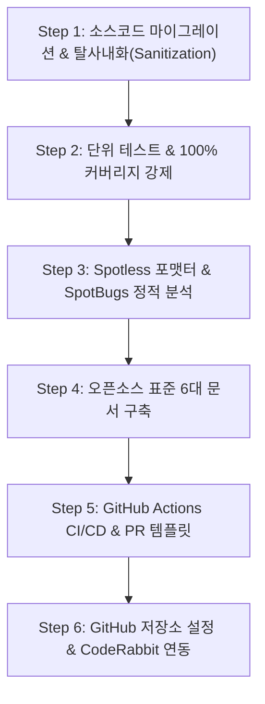

# 📘 엔터프라이즈 코드의 오픈소스 마이그레이션 전략 (Playbook)

> **적용 대상**: `mybatis-sql-tuner-ai`, `mini-apm-spring-boot-starter`, `ha-excel-job-engine` 등 `sweetpark` 오픈소스 프로젝트 전반.
> **목적**: 내부/레거시 저장소에 있던 코드를 안전하게 외부로 분리(sanitize)하고, 최상급 품질 게이트(100% 테스트 커버리지, Spotless, SpotBugs, CI, CodeRabbit)와 표준 문서를 갖춘 지속 가능한 퍼블릭 오픈소스 프로젝트로 전환하는 절차를 정리한 6단계 표준 플레이북이다.

---

## 📋 표준 마이그레이션 체크리스트 (6단계)



---

## 🛠️ Step 1. 소스코드 마이그레이션 및 탈사내화(Sanitization)

1. **패키지 네임스페이스 통일**
   - 내부 도메인 패키지(예: `com.company.*`)를 공식 오픈소스 도메인 패키지로 일괄 리팩토링한다.
   - 예: `io.github.sweetpark.miniapm`, `io.github.sweetpark.haexcel`
2. **기밀 정보 및 내부 전용 설정 전수 격리**
   - 내부 고정 IP, 내부 전용 도메인, 개발계 계정 정보를 `grep`으로 전수 검색해 제거한다.
   - 설정 기본값을 `localhost` 및 오픈 규격으로 바꾸고, Spring `@ConfigurationProperties` 또는 환경변수로 오버라이드 가능하도록 구조화한다.
3. **Lombok 의존성 최소화 및 SLF4J 표준화**
   - 상위 JDK(17 ~ 25+) 빌드 호환성을 보장하기 위해 불필요한 Lombok 애노테이션을 걷어내고, `LoggerFactory.getLogger(ClassName.class)` 형태의 표준 로거를 채택한다.

---

## 🧪 Step 2. 단위 테스트 & 100% 라인 커버리지 강제

`build.gradle`에 JaCoCo 플러그인을 선언하고, 빌드 시점에 커버리지 기준 미달 시 즉시 실패하도록 강제한다.

```groovy
plugins {
    id 'jacoco'
}

jacoco {
    toolVersion = "0.8.12"
}

jacocoTestCoverageVerification {
    dependsOn test
    violationRules {
        rule {
            element = 'CLASS'
            limit {
                counter = 'LINE'
                value = 'COVEREDRATIO'
                minimum = 1.00 // 100% 라인 커버리지 강제
            }
        }
    }
}
check.dependsOn jacocoTestCoverageVerification
```

바이트코드 조작 기반 모킹 라이브러리는 최신 JDK에서 종종 깨지므로, 표준 자바의 `Proxy.newProxyInstance(...)`를 활용한 네이티브 다이내믹 프록시 기반 테스트를 작성해 JDK 버전 종속성에서 벗어난다.

---

## 🎨 Step 3. Spotless 코드 포맷팅 & SpotBugs 정적 분석

루트 `build.gradle`에서 두 플러그인을 서브프로젝트 전역에 바인딩한다.

```groovy
plugins {
    id 'com.diffplug.spotless' version '6.25.0' apply false
    id 'com.github.spotbugs' version '6.0.26' apply false
}

subprojects {
    apply plugin: 'com.diffplug.spotless'
    apply plugin: 'com.github.spotbugs'

    spotless {
        java {
            eclipse()
            trimTrailingWhitespace()
            endWithNewline()
        }
    }

    spotbugs {
        toolVersion = '4.9.2'
        ignoreFailures = true
        effort = 'default'
        reportLevel = 'medium'
    }

    tasks.withType(com.github.spotbugs.snom.SpotBugsTask).configureEach {
        reports {
            html { required = true }
            xml { required = true }
        }
    }
}
```

> SpotBugs를 실제 빌드 게이트로 쓰고 싶다면 `ignoreFailures = false`로 바꾸고, 확인된 false positive만 좁게 걸러내는 `excludeFilter` XML을 별도로 구성한다.

포맷 자동 적용: `./gradlew spotlessApply`

---

## 📚 Step 4. 오픈소스 표준 6대 문서 구축

오픈소스 생태계의 신뢰도와 사용자 경험을 극대화하기 위해 프로젝트 루트와 `docs/`에 다음 6대 문서를 표준 구비한다.

| # | 문서 | 경로 | 필수 내용 |
| :---: | :--- | :--- | :--- |
| 1 | **LICENSE** | `/LICENSE` | Apache License 2.0 전문 |
| 2 | **CODE_OF_CONDUCT.md** | `/CODE_OF_CONDUCT.md` | Contributor Covenant 2.1 행동 강령 |
| 3 | **CONTRIBUTING.md** | `/CONTRIBUTING.md` | 포크/브랜치 전략, PR 생성 규칙, 100% 커버리지 빌드 규칙 |
| 4 | **ARCHITECTURE.md** | `/docs/ARCHITECTURE.md` | Mermaid 다이어그램 기반 모듈/데이터 흐름 설계 |
| 5 | **CONVENTIONS.md** | `/docs/CONVENTIONS.md` | Java 코딩 스타일, Conventional Commits 규격 |
| 6 | **README.md** | `/README.md` | 공식 배지 7종, 기능 개요, 호환성 매트릭스, 빌드/실행 가이드 |

---

## 🤖 Step 5. GitHub Actions CI/CD & PR 템플릿

1. **CI 워크플로 (`.github/workflows/ci.yml`)**
   - `on: [push, pull_request]`
   - JDK 17 세팅 후 `./gradlew check` 실행
   - JaCoCo 커버리지 표를 `$GITHUB_STEP_SUMMARY`에 자동 게시
2. **릴리즈 워크플로 (`.github/workflows/release.yml`)**
   - `on: push: tags: ['v*']`
   - Maven Central 배포 또는 GitHub Release 생성
3. **PR 템플릿 (`.github/PULL_REQUEST_TEMPLATE.md`)**
   - 요약, 변경 사항, 테스트/100% 커버리지 체크리스트 포함

---

## ⚙️ Step 6. GitHub 저장소 설정 & CodeRabbit 연동

1. **저장소 공개 전환**
   - 저장소 `Settings` → 하단 Danger Zone → **`Make public`**
2. **머지 시 브랜치 자동 삭제**
   - `Settings` → `General` → `Pull Requests` 섹션에서 ✅ **`Automatically delete head branches`** 체크
3. **`main` 브랜치 보호 규칙**
   - `Settings` → `Branches` → `Add branch protection rule` (Branch: `main`)
   - ✅ `Require a pull request before merging` (승인 1건 이상)
   - ✅ `Require status checks to pass before merging` (상태 체크: `Test & 100% Coverage Verification`)
   - ✅ `Require conversation resolution before merging`
4. **CodeRabbit AI 연동**
   - [CodeRabbit.ai](https://coderabbit.ai/)에서 저장소를 추가/설치
   - `Chill` 리뷰 프로필 선택
